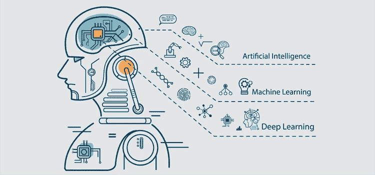
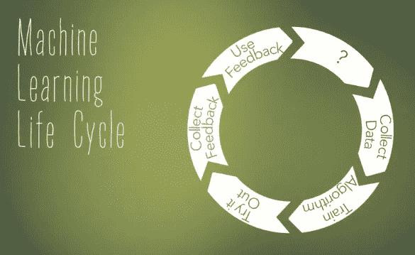
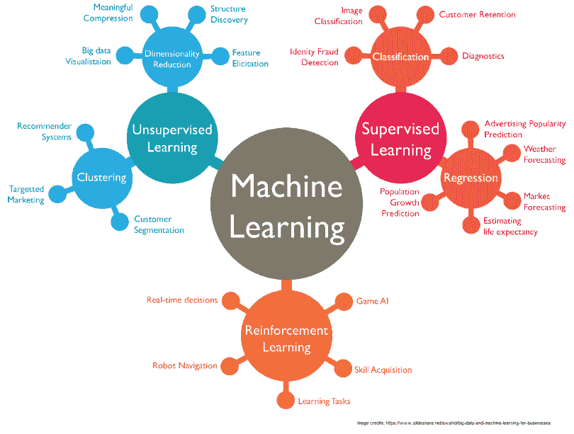

# 面向初学者的机器学习

> 原文：<https://medium.com/analytics-vidhya/machine-learning-for-beginners-d44df6bfe410?source=collection_archive---------4----------------------->

## 概念性的理解

我是曼哈顿下城熨斗学校的数据科学学生。我尽可能多地学习与我的研究领域相关的话题。但是当我最初在网上搜索博客主题时，我遇到了一些困难。我一直在寻找关于数据科学在特定行业/领域中的应用的文章，但我不断看到讨论 ***机器学习*** 如何改变该领域的文章。到目前为止，我还没有对机器学习及其在数据科学中的地位有一个合适的介绍。

这给我留下了一个难题，当我甚至不理解机器学习这样的核心概念在数据科学本身中的应用时，我应该如何理解数据科学在行业/领域中的作用？

因此，如果你是数据科学或计算机科学的新手，请允许我向你展示我从机器学习的研究中学到了什么。

# 什么是机器学习？

阿瑟·塞缪尔

## 起源

机器学习是一个源于对人工智能探索的概念。“*机器学习”*这个术语是由计算机游戏和人工智能领域的先驱亚瑟·塞缪尔在 1959 年创造的。亚瑟·塞缪尔编写了“第一个计算机学习程序”。

> “这个程序是跳棋游戏，**IBM 计算机** **在游戏**中玩得越多**就越能改进**，研究哪些走法构成了获胜策略，并将这些走法整合到它的程序中。”

## 机器学习与人工智能

最终，当研究人员、科学家和程序员使用机器学习时，他们正在创建能够在获得新数据集时“独立适应”的模型/算法

考虑到机器学习是人工智能领域的一个子集，有时很难区分*机器学习*和*人工智能*的区别。以下是一些帮助我更好地理解这两个领域的定义。

> ***人工智能*** :“计算机科学的一个领域，强调创造像人类一样工作和反应的智能机器。”
> 
> ***机器学习*** :“一种自动建立分析模型的数据分析方法。它是人工智能的一个分支，基于这样一种想法，即系统可以从数据中学习，识别模式，并在最少的人工干预下做出决策。”

人工智能可以理解为模仿和重复通常由人类完成的功能和任务的更广泛的科学。

机器学习就是我们创造 ***的教学算法*** 让机器在做任务的时候“学习”的方法。随着每一次试验和每一组新的数据提供给机器的算法，机器在实现期望的最终结果方面变得更加有效。

亚瑟·塞缪尔的跳棋机器学习程序每玩一次跳棋都会变得更好。这就是机器学习。机器通过每次新的试验和输入系统的数据进行学习。

# 机器学习生命周期

1.  问问题。
2.  为机器学习模型收集数据。
3.  训练算法。
4.  试试看。
5.  从试用中收集反馈。
6.  利用反馈改进算法。

来源:[机器学习，它是什么，为什么重要](https://bit.ly/2LZFGPK)

## 机器学习类别

**监督学习:** 给定一段我们想要预测或理解的数据，我们可以使用过去的输入和输出数据来预测在给定我们新的输入数据的情况下新的输出会是什么。

> “例如，您可以使用监督 ML 技术来帮助服务企业预测下个月将注册该服务的新用户数量。”

**无监督学习:**
在没有给定特征或变量的情况下，对*数据点进行分组和关联的方法。因此，基于共同的特征，数据的聚类根据共性被分组在一起。*

> “例如，您可以使用无监督学习技术来帮助零售商细分具有相似特征的产品，而不必事先指定要使用哪些特征。”

**强化学习"**是关于在特定情况下采取适当的行动以获得最大回报。它被各种软件和机器用来寻找在特定情况下它应该采取的最佳行为或路径。”

> “强化学习与监督学习的不同之处在于，在监督学习中，训练数据带有答案，因此模型是用正确的答案本身来训练的，而在强化学习中，没有答案，而是由强化代理来决定如何执行给定的任务。**在没有训练数据集的情况下，它必然会从自己的经验中学习。**

来源:[走向机器学习](https://towardsml.com/2018/02/17/machine-learning-an-overview-and-the-essential-algorithms/)

## **一些数据科学的机器学习方法:**

实际使用机器学习是有具体方法的。机器学习是一个如此庞大的话题，以至于一个博客不能简单地公正地对待它。但对于有抱负的数据科学家来说，知道一些关键机器学习模型/算法的名称很重要。我在下面列出了几个例子:

在**监督学习**下，我们有:

*   线性回归
*   逻辑回归
*   支持向量机
*   决策树和随机森林
*   k-最近邻
*   神经网络

在**无监督学习**下，我们有:

*   聚类:k 均值
*   可视化和降维:主成分分析(PCA)，t 分布随机邻居嵌入(t-SNE)
*   关联规则学习:先验

# 机器学习的已知应用

下面重点介绍了一些你可能已经听说过的机器学习的著名应用。这些是机器学习在日常生活中的一些应用方式。这些清晰的例子说明了为什么机器学习是数据科学家和数据工程师的必备技能。

**谷歌汽车/自动驾驶汽车**:

*   流量识别和适应
*   了解会出现什么类型的障碍
*   预测环境中汽车和人的运动

**网飞/亚马逊推荐:**

信不信由你，你每看一个新节目都在向网飞反馈数据。这给了公司一个很好的机会来迎合你的节目，这些节目可能会让你对你正在观看的电视节目和电影产生兴趣。所以，下次你在网飞寻找新的表演电影时，请留意“因为你看了' *x 电影*'”。

你的亚马逊购物历史也是如此。亚马逊知道你可能倾向于哪些产品，以及你最近在看哪些产品。有很多次，我会查找我最终可能想要购买的商品，只是为了在当天晚些时候在手机上收到亚马逊的通知，根据我的搜索历史给我一些推荐

来源:[分析 Vidhya](https://www.analyticsvidhya.com/blog/2018/07/hands-on-sentiment-analysis-dataset-python/)

**推特情绪分析:**

我们发布的每条推文中的语言都可以被分析。企业正在使用语言解释算法分析 twitter 上的客户评论。

这里有一个演示！

**语音识别:**

我不会撒谎，有时当我问我的谷歌 Home Mini 当天天气如何时，我会加入英语口音或改变语气，看看谷歌是否能理解我。确实如此。

这是机器学习的神奇之处之一。只要在互联网上的某个地方有一些关于方言、口音或语言的数据，我们的机器算法就可以学习理解和识别差异！

来源:[戈梅迪奇](https://gomedici.com/early-detection-can-reduce-30-40-of-credit-card-fraud-loss-an-interview-with-canh-tran-ceo-co-founder-of-rippleshot)

**银行欺诈检测:**

不久前，我不得不取消我的信用卡，因为我的信息被盗。我经常在网上购物，所以这里或那里的额外交易不会引起我的注意。我收到了大通银行的短信，提醒我有类似欺诈的活动。我看了看我的账户，发现我在墨西哥的账户上被扣了 0.01 美元。考虑到只有 1 美分，这似乎没什么大不了的。但是较小的交易通常是对信用卡信息的测试。

机器学习算法发现的某些异常情况，如地理位置和交易金额，在普通人的雷达上不会出现，从而使像我这样的人免受盗窃和欺诈。

# 需要记住的一些术语:

> ***人工智能*** :“计算机科学的一个领域，强调创造像人类一样工作和反应的智能机器。”
> 
> ***机器学习*** :“一种自动建立分析模型的数据分析方法。它是人工智能的一个分支，基于这样一种想法，即系统可以从数据中学习，识别模式，并在最少的人工干预下做出决策。”

**监督学习:**给定一段我们想要预测或理解的数据，我们可以使用过去的输入和输出数据来预测在给定新输入数据的情况下新的输出会是什么。

**无监督学习:**在没有给定特征或变量的情况下，对数据点进行分组和关联的方法。因此，基于共同的特征，数据的聚类根据共性被分组在一起。

> **ML 算法/模型:**“表示问题上下文中数据的数学表达式。目的是从**数据**到**洞察力。**

如果你对我的学习有什么想法，请分享！

## **来源:**

 [## 什么是人工智能(AI)？-来自 Techopedia 的定义

### 人工智能 AI 定义-人工智能(AI)是计算机科学的一个领域，强调…

www.techopedia.com](https://www.techopedia.com/definition/190/artificial-intelligence-ai)  [## 机器学习简史——每个管理者都应该阅读

### 问机器人是否会梦到电子羊是件好事，但是科学事实已经发展到了…

www.forbes.com](https://www.forbes.com/sites/bernardmarr/2016/02/19/a-short-history-of-machine-learning-every-manager-should-read/#25ae489415e7)  [## 每个数据科学家都应该知道的 10 种机器学习方法

### 快速启动您的数据科学技能

towardsdatascience.com](https://towardsdatascience.com/10-machine-learning-methods-that-every-data-scientist-should-know-3cc96e0eeee9)  [## -Imgur | 2019 年 LIBRO NUEVO |机器学习人工智能、机器学习、数据…

### 2019 年 5 月 22 日——0 票 79079 浏览量的帖子。

www.pinterest.it](https://www.pinterest.it/pin/823173638115509146/)  [## 强化学习-极客论坛

### 强化学习是机器学习的一个领域。加固。它是关于采取适当的行动来最大化…

www.geeksforgeeks.org](https://www.geeksforgeeks.org/what-is-reinforcement-learning/)  [## 机器学习导论

### 什么是机器学习？机器学习是教会计算机从数据中学习的科学。在亚瑟·塞缪尔的…

towardsml.com](https://towardsml.com/2018/02/17/machine-learning-an-overview-and-the-essential-algorithms/)  [## 机器学习:它是什么，为什么重要

### 由于新的计算技术，今天的机器学习不同于过去的机器学习。它诞生了…

www.sas.com](https://www.sas.com/en_us/insights/analytics/machine-learning.html#machine-learning-importance)