# 面向初学者的机器学习-隔离版(带示例)

> 原文：<https://medium.com/analytics-vidhya/machine-learning-for-beginners-quarantine-edition-with-examples-15e9b2b29058?source=collection_archive---------21----------------------->

隔离真的会让我们心烦意乱，尤其是有这么多空闲时间，又没有什么可期待的。但是，什么是提升技能和进入新的专业领域的更好时机呢？

从在 youtube 上播放你最喜欢的歌曲，导航到最好的酒店，到在 Instagram 上推荐关于“你可能认识的人”的建议，再到约会应用，机器学习如今在任何地方都很突出。这可能是它需求量极高的原因。只有随着机器学习技术的出现，预测未来才成为可能。

首先，让我们从理解机器学习的整个概念被分成的几大类开始。这些类别是

*   监督学习
*   无监督学习
*   强化学习

现在，让我们首先关注几个有监督的机器学习算法！

什么是监督学习？

当一个模型有足够的输入和输出来训练自己，以便对新数据进行必要的预测时，它被称为监督学习。另一方面，在无监督学习的情况下，算法仅被给定输出数据，并且算法必须相应地做出预测。

**但是什么是机器学习算法，我们为什么需要它们？**

机器学习算法基本上是可以从数据中学习并根据经验进行改进的程序，无需任何人工干预。学习任务可以包括学习将输入映射到输出的函数，或者学习未标记数据中的隐藏结构，或者甚至是给定数据到特定类别的分类。

在深入研究不同的算法之前，让我们首先了解训练任何机器学习模型的基本流程。现在让我向您介绍一下这个过程。

# **涉及步骤:**

1.  **导入必要的库、方法和包。**

python 为我们提供了一组预先编写好的库，而不是一遍又一遍地编写相同的算法代码。对于导入执行算法的方法最重要的库是 scikit-learn 库。除此之外，还有像 numpy(数字 python)和 pandas 这样的库，它们的主要作用是以更方便、快捷和简单的方式处理大型数据集和执行复杂的计算。

**2。从各自的文件中读取数据。**

每当我们需要创建一个模型时，我们都需要一个数据集。不幸的是，这些数据并不总是相同的格式。我们可以有表格、图片、视频等。由于这一点，有必要将所有这些转换成一种特定的格式，这种格式可以由一个叫做熊猫图书馆的特殊图书馆读取。一旦这些数据集达到要求的格式，这些数据必须首先加载到数据框中，以便执行 pandas 库的必要功能。

**3。清理数据:**

清理数据的目的是尝试并确保数据集中的每个值本质上都是数值，并且数据集中没有空的、不准确的或未定义的值。这背后的原因是我们用来实现算法的库(scikit learn)只识别数值。

**4。标准化数据值:**

为了从模型中获得准确的结果，并使该过程更快、更有效，总是建议对数据进行缩放，以使它们都落在给定的有界范围内。

**5。将数据分成训练和测试数据集**

为了确保我们能够在训练模型后对其进行评估，我们有必要确保出于同样的目的对数据集进行划分。

分割数据集背后的一个非常重要的动机是，如果我们最终使用整个数据集，模型将完全根据数据集训练自己，它将无法对新数据做出正确的预测。这就是所谓的过拟合，这是不可取的。

另一方面，如果我们使用较少的数据，由于缺乏足够的值，预测的结果会不准确。

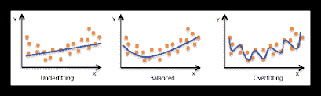

我们必须按照正确的比例划分测试和训练测试，以实现理想的模型。这是使用 sklearn 库中的 train_test_split 方法完成的。

**6。使用从 scikit 学习库中导入的方法应用算法。**

机器学习算法要么通过使用每个算法背后的数学和逻辑使用自己的训练算法来实现，要么通过从 scikit learn 和 TensorFlow 等优秀的库导入正确的模型来实现。

**7。评估你的算法。**

通过使用测试集测试我们的模型，我们可以了解我们算法的正确性。评估模型通常通过绘制图表和比较结果来完成，或者通过推导算法的准确度、精确度和混淆矩阵来完成。混淆矩阵基本上是机器学习分类的性能度量。

太好了！既然我们已经理解了最大似然算法的工作原理，我们现在准备研究一些流行的监督学习算法。

我们将在这里讨论的三种算法是:-

1.  线性回归
2.  逻辑回归
3.  k 近邻算法

# **线性回归**

线性回归使用以最准确的方式拟合所有数据点的直线来寻找因变量和一个或多个自变量之间的线性关系。当自变量只有一个时，线性回归称为单变量线性回归，当自变量多于一个时，线性回归称为多变量线性回归。

通常，线性回归模型通过简单地计算输入要素的加权和以及称为截距项的常数来进行预测。

这条线是基于两个概念起草的。一种是最小二乘法，它绘制回归量，使不同数据点到直线的距离平方和最小。第二个是梯度，这是一种优化技术，用于调整线性方程的系数和偏差。

系数本质上表示输入变量对确定最佳拟合线的贡献。另一方面，偏差是我们对线性方程 y = mx 所做预测的偏差。

借助下面给出的例子，让我们更好地理解这个概念。下面给出了一个多变量线性回归的例子。

在这里，我们试图根据鱼的各种特征，如身高、体重等来预测鱼的种类。

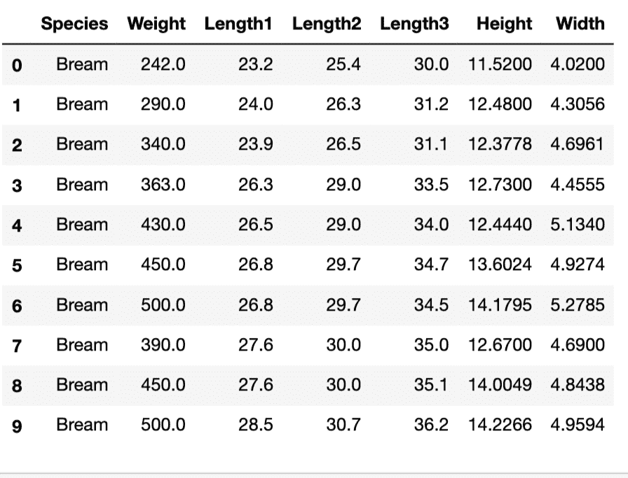

上面是我们将要处理的整个数据集的前 10 行的快照。

要预测的变量是“物种”列。我们使用 scikit 学习库来应用我们的线性回归算法。这样做，我们就理解了因变量 ie 的依赖性。，所有自变量的“物种”栏。首先，我们必须确保每一列都有数值，而不是字符串值。这个过程称为数据清理。

除第一列和所有行之外的所有列的值都被赋给变量 x。所有行中的第一列将被赋给 y。我们以下列方式将特定的列赋给变量:-

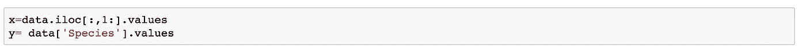

然后，整个数据集被分成测试数据集和训练数据集。我们使用从 scikit 学习库导入的方法 train_test_split 方法，并在 test_size 属性中给出所需的分数。

然后我们应用从 scikit 学习库中导入的线性回归算法。该算法以如下方式应用

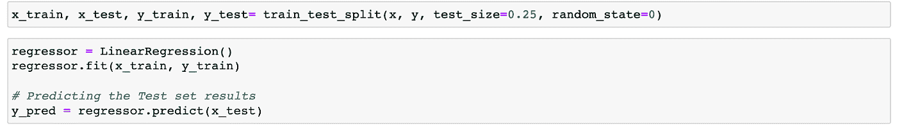

一旦我们应用该算法，我们得到一组等于自变量数量的系数，以及一条描述单个变量相关性的线的截距。在这种情况下，值如下

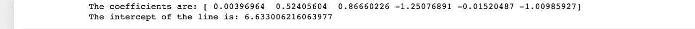

借助生成的系数和截距，可以画一条线，这就是我们的回归线。我们的模型的评估可以通过以下方式绘制条形图来完成

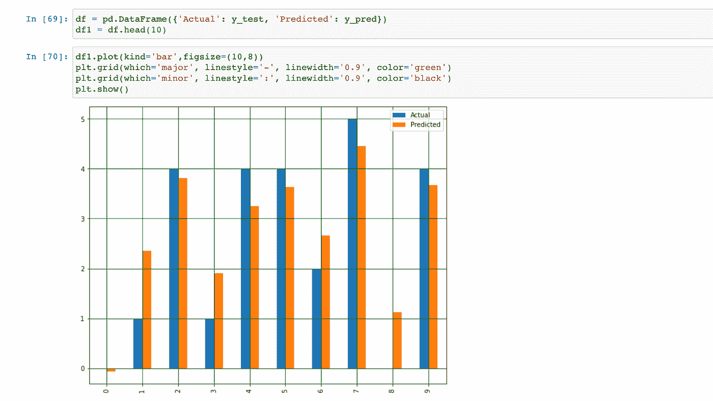

# **逻辑回归**

逻辑回归基本上可以看作是线性回归的特例。在线性回归中，目标变量本质上是连续的，它使用一个概率对数作为因变量。然而，逻辑回归利用逻辑函数预测二元事件发生的概率。这个逻辑函数称为 sigmoid 函数。

激活函数是通过操纵值来产生期望输出的函数。乙状结肠活化也称为逻辑活化。它的主要工作是将输出值挤压在 0 和 1 的范围内。

为了更好地理解这个概念，让我们举个例子。让我们考虑下面的数据集，它给出了性别、婚姻状况、收入等信息。各种各样的顾客。利用给定的数据，我们必须预测特定客户是否会买房。

下面是我们接下来几分钟要讨论的数据集的前 10 行。

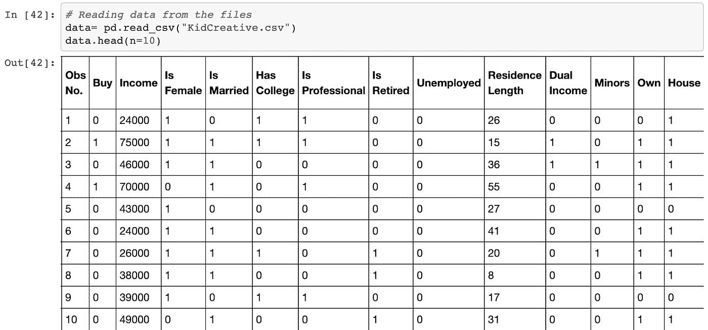

为了清理数据，我们首先删除“Obs 编号”列，因为它在决定特定客户是否会购买房子时不起任何作用。然后，我们像往常一样，寻找空值的存在，然后分别删除它们(数据清理)。因为整个数据集都有数值，所以不需要对数据集中的数据类型进行任何更改。

然后，我们将相应的列分配给变量。

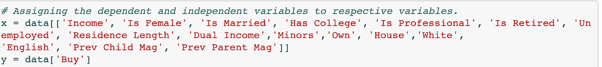

接下来，我们将数据分为训练集和测试集。为了能够使用数据的特定部分来评估我们训练的模型，这种方法是必要的。这里我们使用了 sklearn.model_selection 模块中的一个名为 train_test_split 的方法，这个模块为我们执行了这个功能。

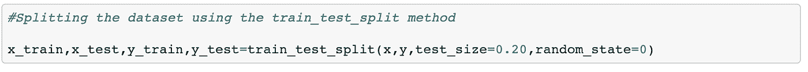

然后，我们应用从 scikit 学习库中导入的逻辑回归算法，如下所示:

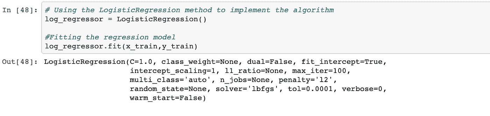

最后，我们通过检查模型的准确度、精确度和召回率来对模型进行评估。

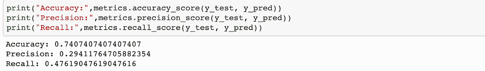

这里，我们打印 ROC 曲线，以便理解和评估算法。逻辑回归中的 ROC 曲线用于确定预测新观察是“失败”(0)还是“成功”(1)的最佳临界值。

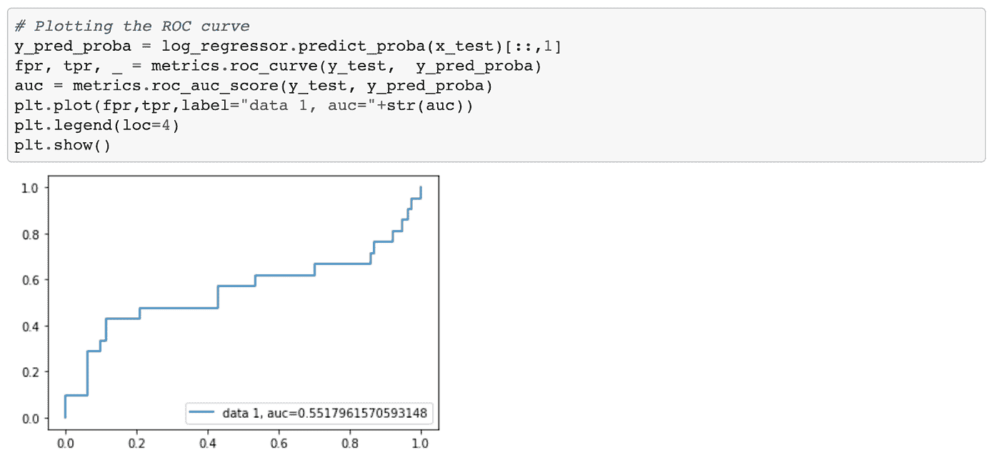

# **KNN 算法**

KNN 代表 K 近邻。它属于监督机器学习算法，可用于分类和回归。在真实世界的数据集上实现起来简单而容易。在 KNN，K 是最近邻居的数量。邻居数量是核心决定因素。如果类的数量是 2，k 通常是奇数。当 K=1 时，该算法称为最近邻算法。

和前面的算法一样，我们可以通过一个例子来更好地理解这个算法。考虑下面给出的数据集:-

数据集的前 10 行如下

然后，我们将这些列分配给每个变量:-

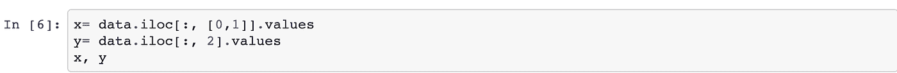

然后，必须将数据分成训练数据集和测试数据集，然后必须将所有值调整到合适的范围内，就像我们对之前的算法所做的那样。在该数据集中，不需要进行特定的清理，因为所有的值本身都是数值。数据的分割和缩放按如下方式完成

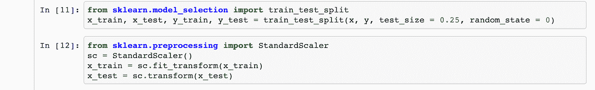

然后，使用 scikit 学习库中所需的方法，按如下方式应用该算法:-

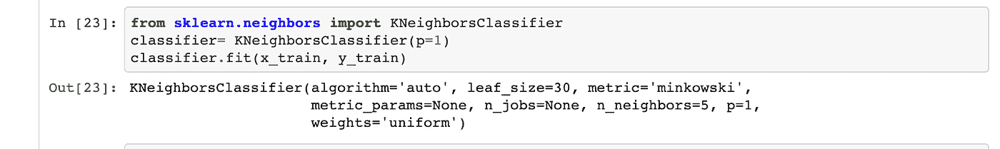

然后将测试和训练集绘制在地图上并进行比较。我们得到了下面两个图表

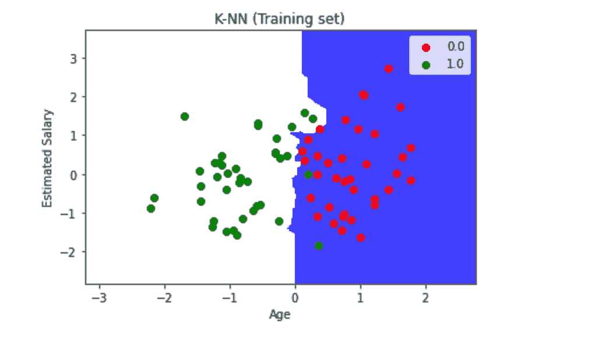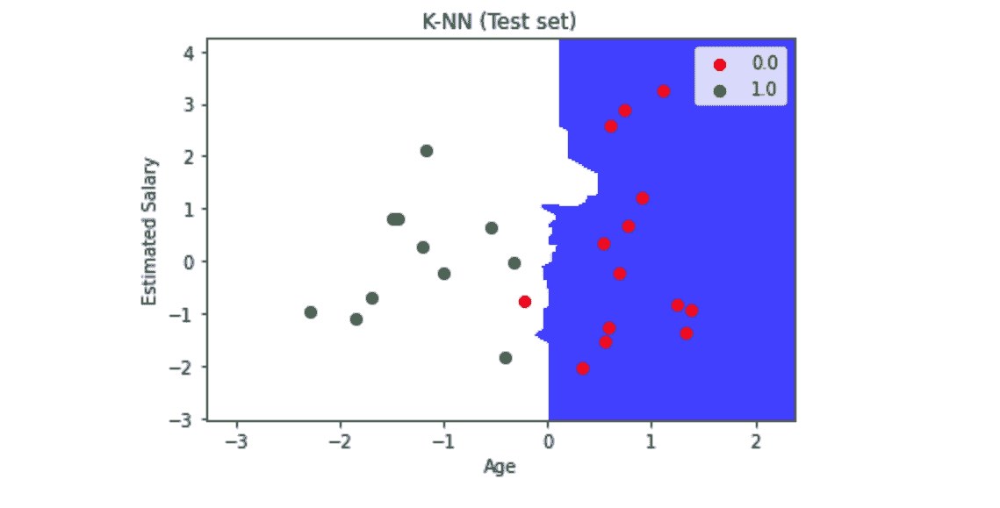

图表看起来几乎相似，这是一个很好的迹象。模型的准确性也可以公式化。我们看到精度非常高，因此我们得到的 k 值是正确的。我们用下面的方法打印出精确度:-

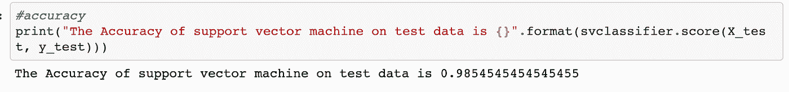

# **结论**

这样，我们就完成了机器学习的基础知识。可以在与上述示例中使用的数据集相似或不同的多个数据集上实现相同的过程。还有各种各样的其他算法属于机器学习，我希望这篇文章能作为一个强大的基础来启动你在同一领域的旅程！