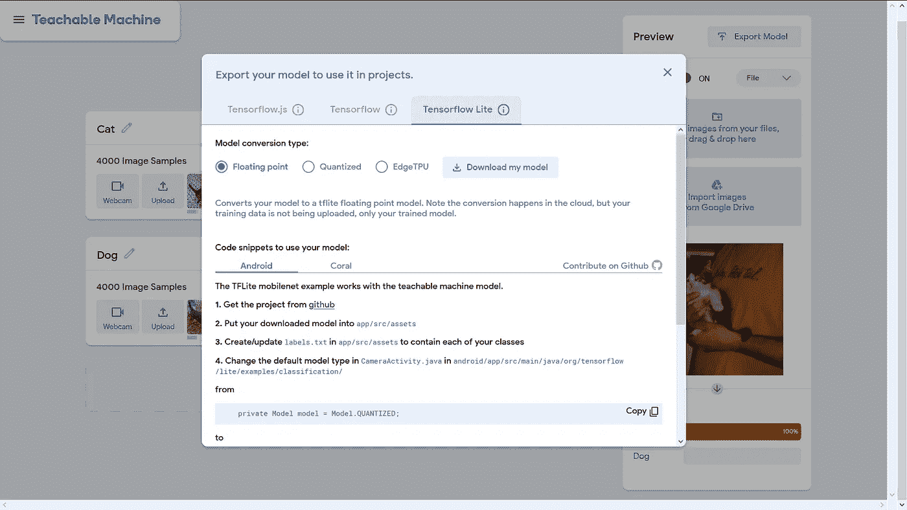

# 颤振中的机器学习

> 原文：<https://medium.com/analytics-vidhya/machine-learning-for-flutter-developers-db15c23e3a60?source=collection_archive---------0----------------------->

扑+ Tflite 是一个完整的爱情故事

人们总是听到别人谈论机器学习，但对这意味着什么只有一个模糊的概念。他们经常发现实现机器学习模型很难，但别担心，可教机器会帮你搞定。

> **可教机器**是谷歌基于网络的工具，旨在让人工智能对每个人来说都更容易。你可以用可教的机器来识别图像、声音或姿势。

所以在这篇文章中，我将分享你如何使用可教机器创建你的机器学习模型，并集成到 Flutter 中。

**让我们快速浏览一下我们今天要构建的内容**

Flutter 在犬猫图像分类中的应用

首先进入 [***可教机***](https://teachablemachine.withgoogle.com/train)*并打开图像项目。为了开始训练模型，我们需要创建两个类，即“狗”和“猫”，并上传模型学习的训练图像。你可以从[这里](https://www.kaggle.com/tongpython/cat-and-dog)下载数据集*

**

*可教机器学习图像项目的快照*

*将`Class 1`名称更改为`Cat`并点击上传，上传猫的训练图像。*

**

*点击上传并从你的文件夹中选择图片。*

*现在对`Class 2`做同样的操作，将`Class 2`改为`Dog`，上传狗的训练图像。上传训练图像后，点击列车模型开始训练。*

**

*模特开始训练*

*如果你上传了更多的训练图像，这将需要时间，所以坐下来，等待模型得到训练。*

*我在等我的模特接受训练。*

*训练完模型后，单击导出模型并下载 Tensorflow Lite 浮点模型。*

**

*导出 Tensorflow Lite 浮点模型*

## *现在是时候整合。颤振中的 tflite 模式*

*创建一个新的 Flutter 项目，并将`tflite` 和`image_picker`作为依赖项添加到您的`pubspec.yaml`文件中。*

**

*pubspec.yaml*

*在`android/app/build.gradle`中，在`android`块中添加以下设置。*

**

*android/app/build.gradle*

*创建一个`assets`文件夹，将你的`labels.txt`文件和`model_unquant.tflite`文件放在`assets`文件夹中。在`pubspec.yaml`中，做以下更改来指定应该包含在应用程序中的文件*

**

*pubspec.yaml*

*`main.dart`中包括`import 'package:tflite/tflite.dart';` & `import ‘package:image_picker/image_picker.dart’;`*

*`image_picker`插件将用于从图像库中拾取图像，并用相机拍摄新照片。*

*导入库之后，是时候加载您的。在`main.dart .`中的 tflite 模型我们将使用一个`bool` 变量`_loading`来显示`CircularProgressIndicator`同时加载模型。*

*现在，每当按下`FloatingActionButton`时，我们将使用`image_picker`插件从图库中选取一幅图像。我们选取的图像将作为参数传递给`classifyImage`。我们将使用`Tflite.runModelOnImage`对狗和猫的图像进行分类。*

*`Tflite.runModelOnImage`返回 `Future<List>`*

**

*Tflite.runModelOnImage 的输出*

*现在是时候在屏幕上显示我们挑选的图像和分类结果了。*

*是时候运行 Flutter 应用程序了。在终端中运行`flutter run`命令运行您的应用程序。*

*页（page 的缩写）让我们希望没有错误*

*查看 [GitHub 库](https://github.com/AyushBherwani1998/flutter_teachable_ml/blob/master/lib/main.dart)获取上述应用程序的源代码。*

*嗨，读者们，我是一名移动应用程序开发人员，喜欢探索 Flutter widgets 的深海。如果你喜欢这篇文章，并发现这很有帮助，不要忘了欣赏 a 50 claps :p*

*如果您有任何问题或建议，欢迎在下面发表评论，或者您可以通过*

* [## 阿尤什·贝尔瓦尼

### Ayush Bherwani 的最新推文(@ayushbherwani)。主办方@ flutterbootcamp | Lead @ DSC _ PU | Founder @ wiz _ a _ thon…

twitter.com](https://twitter.com/ayushbherwani)  [## Ayush Bherwani - PARUL 工程学院。和技术。印度古吉拉特邦 VAGHODIA 037 - Vadodara，LIMDA

### 查看 Ayush Bherwani 在世界上最大的职业社区 LinkedIn 上的个人资料。Ayush 有 3 个工作列在他们的…

www.linkedin.com](https://www.linkedin.com/in/ayush-bherwani-9529b3158/) 

查看我最近的文章

 [## 开发移动 DApps 第 1 部分

### 开发移动 DApps 第 1 部分，我们将涵盖区块链和术语的基础知识。

medium.com](/coinmonks/developing-mobile-dapps-part-1-9374812814ef)  [## 飘动中的通知徽章

### 这是我第一篇关于媒介的文章，是关于颤动的。如果你正在读这篇文章，这可能意味着你一定已经…

medium.com](/@ayushbherwani/notification-badge-in-flutter-c776a6194936)*