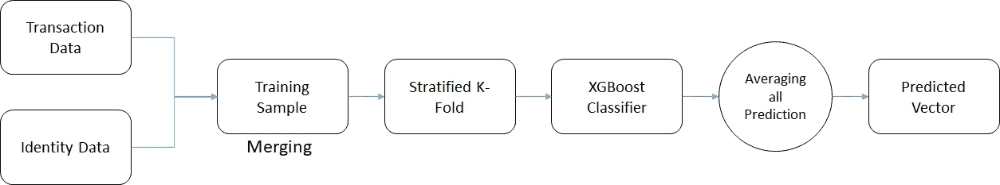

# 基于 XGBoost 分类器的欺诈检测机器学习

> 原文：<https://medium.com/analytics-vidhya/machine-learning-for-fraud-detection-using-xgboost-classifier-75670e3c6a85?source=collection_archive---------2----------------------->


杰斐逊·桑托斯在 Upsplash 上拍摄的照片

# 介绍

想象你站在超市的收银台前，身后排着长队，收银员悄悄地宣布你的卡被拒绝了。此时此刻，你可能不会考虑决定你命运的数据科学。

尽管你确定你有足够的资金支付所有费用，但这张卡仍然不接受付款。之后，你站到一边，让收银员为另一位顾客服务，你收到了银行的通知或信息，“如果你真的想花 500 英镑买切达奶酪，请按 1”。

这一刻对每个遇到这种命运的人来说都很尴尬。如果我们能提供一个好的欺诈防范系统，每年为消费者或客户节省数百万美元，那就太好了。来自 IEEE 计算智能学会(也称为 IEEE-CIS)的研究人员希望改善这种情况，同时提升消费者体验。系统的性能越好，我们可以预防的资金就越多。

IEEE-CIS 工作于各种人工智能和机器学习领域，包括深度神经网络、模糊系统、进化计算和群体智能。今天，他们与全球领先的支付服务公司 [Vesta Corporation](https://trustvesta.com/) 合作，寻求欺诈防范行业的最佳解决方案，现在邀请您加入这项挑战。

请参考竞争网站的链接:IEEE-CIS 欺诈检测

[](https://www.kaggle.com/c/ieee-fraud-detection/overview) [## IEEE-CIS 欺诈检测

### 你能从客户交易中发现欺诈吗？

www.kaggle.com](https://www.kaggle.com/c/ieee-fraud-detection/overview) 

本文的主要目标是使用竞争对手提供的数据集，提供欺诈检测的基准模型和方法。我希望这篇文章能够帮助那些在机器学习竞赛中努力入门的人，或者那些想了解什么样的 AI 或机器学习可以应用到现实世界的项目中的人。我们作为一个由 3 名成员组成的团队开始了这场比赛，我们希望分享帮助我们成为 6381 个团队中前 3%的方法。

事不宜迟，我们开始吧！

# 这场比赛的目的

在这场比赛中，我们在一个大规模数据集上建立了一个机器学习模型，这个数据集源于 Vesta 的现实世界电子商务交易，包含了从设备类型到产品功能的广泛功能。我们也有机会根据数据创建新的功能来改进我们的结果。

如果我们成功发明了一种真正好的方法，我们将提高全球数百万人的欺诈交易警报的有效性，帮助成千上万的企业减少欺诈损失，增加利润。再者，我们会拯救和我们遇到同样命运的人，让他们脸上露出笑容。

# 环境设置

语言:Python 3.5.5

主库:

1.  Numpy
2.  熊猫
3.  sci kit-学习
4.  海生的
5.  Matplotlib
6.  CatBoost

# 数据探索

数据集可以在 Kaggle 网站[这里](https://www.kaggle.com/c/ieee-fraud-detection/data)找到并下载。

数据分为两个文件`identity`和`transaction`，由`TransactionID`连接。请注意，并非所有事务都有相同的身份数据。

## 分类特征—交易

*   `ProductCD`
*   `card1` - `card6`
*   `addr1`，`addr2`
*   `P_emaildomain`
*   `R_emaildomain`
*   `M1` - `M9`

## 分类特征——同一性

*   `DeviceType`
*   `DeviceInfo`
*   `id_12` - `id_38`

`TransactionDT`特性是给定参考日期时间的时间增量(不是实际的时间戳)。

## 列描述

**交易表**

*   **TransactionDT** :给定参考日期时间的时间增量(不是实际的时间戳)
*   **交易金额**:交易支付金额，美元
*   **ProductCD** :产品代码，每笔交易的产品
*   **card1 — card6** :支付卡信息，如卡种、卡类、发卡行、国家等。
*   **地址**:地址
*   **距离**:距离
*   **P_ and (R__) emaildomain** :购买者和接收者电子邮件域
*   **C1-C14** :计数，比如找到多少个地址与支付卡关联等。实际意义被掩盖了。
*   **D1-D15** :时间差，如前一笔交易的间隔天数等。
*   **M1-M9** :匹配，如名片上的姓名、地址等。
*   **vxxxx**:Vesta 设计了丰富的功能，包括排名、计数和其他实体关系。

**分类特征**
product CD
card 1—card 6
addr 1，addr 2
P*email domain R*email domain
M1—M9

## **身份表**

此表中的变量是身份信息—与交易相关的网络连接信息(IP、ISP、代理等)和数字签名(UA/browser/os/version 等)。它们由 Vesta 的欺诈保护系统和数字安全合作伙伴收集。
(字段名被屏蔽，出于隐私保护和合同协议的考虑，将不提供成对字典)

分类特征:
设备类型
设备信息
id *12 — id* 38

*鸣谢:所有信息均由 Kaggle 竞赛网站提供。*

# 方法学



用于欺诈检测的机器学习框架

1.  首先，我们首先根据事务文件和身份文件的唯一 ID 合并它们的训练数据。
2.  一旦我们获得了训练样本，我们就将这些数据平均分成 5 个数据样本块。我还想提一下，分层 K-Fold 与普通 K-Fold 分裂有点不同，它只能用于二进制分类问题，如我们的情况(0 和 1 值)。分层 K-Fold 将数据分成多个 Fold，在每个组块的两个类中包含大致相同数量的样本。
3.  准备好所有数据后，是时候创建一个模型/分类器来概括这些数据并做出预测了。
4.  最后，通过将它们平均来集合预测，以产生最终预测。

# **XGBoost 参数**

```
clf = xgb.XGBClassifier(
        n_estimators=500,
        max_depth=9,
        learning_rate=0.05,
        subsample=0.9,
        colsample_bytree=0.9,
        missing=-999,
        random_state=2019,
        tree_method='auto',
        n_jobs = -1,

    )
```

*   分层 K 倍= 5 个数据块

# **代码**

导入库

```
import osimport numpy as np
import pandas as pd
from sklearn import preprocessing
import xgboost as xgb
from catboost import CatBoostClassifier
```

加载数据

```
%%time
train_transaction = pd.read_csv('train_transaction.csv', index_col='TransactionID')
test_transaction = pd.read_csv('test_transaction.csv', index_col='TransactionID')train_identity = pd.read_csv('train_identity.csv', index_col='TransactionID')
test_identity = pd.read_csv('test_identity.csv', index_col='TransactionID')sample_submission = pd.read_csv('sample_submission.csv', index_col='TransactionID')train = train_transaction.merge(train_identity, how='left', left_index=True, right_index=True)
test = test_transaction.merge(test_identity, how='left', left_index=True, right_index=True)print(train.shape)
print(test.shape)y_train = train['isFraud'].copy()
del train_transaction, train_identity, test_transaction, test_identity# Drop target, fill in NaNs
X_train = train.drop('isFraud', axis=1)
X_test = test.copy()del train, test# Label Encoding
for f in X_train.columns:
    if X_train[f].dtype=='object' or X_test[f].dtype=='object': 
        lbl = preprocessing.LabelEncoder()
        lbl.fit(list(X_train[f].values) + list(X_test[f].values))
        X_train[f] = lbl.transform(list(X_train[f].values))
        X_test[f] = lbl.transform(list(X_test[f].values))
```

减少内存使用

```
%%time
# From kernel [https://www.kaggle.com/gemartin/load-data-reduce-memory-usage](https://www.kaggle.com/gemartin/load-data-reduce-memory-usage)
# WARNING! THIS CAN DAMAGE THE DATA 
def reduce_mem_usage(df):
    """ iterate through all the columns of a dataframe and modify the data type
        to reduce memory usage.        
    """
    start_mem = df.memory_usage().sum() / 1024**2
    print('Memory usage of dataframe is {:.2f} MB'.format(start_mem))

    for col in df.columns:
        col_type = df[col].dtype

        if col_type != object:
            c_min = df[col].min()
            c_max = df[col].max()
            if str(col_type)[:3] == 'int':
                if c_min > np.iinfo(np.int8).min and c_max < np.iinfo(np.int8).max:
                    df[col] = df[col].astype(np.int8)
                elif c_min > np.iinfo(np.int16).min and c_max < np.iinfo(np.int16).max:
                    df[col] = df[col].astype(np.int16)
                elif c_min > np.iinfo(np.int32).min and c_max < np.iinfo(np.int32).max:
                    df[col] = df[col].astype(np.int32)
                elif c_min > np.iinfo(np.int64).min and c_max < np.iinfo(np.int64).max:
                    df[col] = df[col].astype(np.int64)  
            else:
                if c_min > np.finfo(np.float16).min and c_max < np.finfo(np.float16).max:
                    df[col] = df[col].astype(np.float16)
                elif c_min > np.finfo(np.float32).min and c_max < np.finfo(np.float32).max:
                    df[col] = df[col].astype(np.float32)
                else:
                    df[col] = df[col].astype(np.float64)
        else:
            df[col] = df[col].astype('category')end_mem = df.memory_usage().sum() / 1024**2
    print('Memory usage after optimization is: {:.2f} MB'.format(end_mem))
    print('Decreased by {:.1f}%'.format(100 * (start_mem - end_mem) / start_mem))

    return df
X_train = reduce_mem_usage(X_train)
X_test = reduce_mem_usage(X_test)
```

清除数据中表示的任何空值

```
#data cleaning
def clean_inf_nan(df):
    return df.replace([np.inf, -np.inf], np.nan)# Cleaning infinite values to NaN
X_train = clean_inf_nan(X_train)
X_test = clean_inf_nan(X_test) # replace all nan,inf,-inf to nan so it will be easy to replace
for i in X_train.columns:
    X_train[i].fillna(X_train[i].median(),inplace=True) # fill with median because mean may be affect by outliers.
#X.isna().sum().sum()
for i in X_test.columns:
    X_test[i].fillna(X_test[i].median(),inplace=True)
```

主模型

```
#%%time
from sklearn.model_selection import StratifiedKFold
from sklearn.metrics import roc_auc_scoreEPOCHS = 5kf = StratifiedKFold(n_splits = EPOCHS, shuffle = True)y_preds = np.zeros(sample_submission.shape[0])
y_oof = np.zeros(X_train.shape[0])for tr_idx, val_idx in kf.split(X_train, y_train):

    clf = xgb.XGBClassifier(
        n_estimators=500,
        max_depth=9,
        learning_rate=0.05,
        subsample=0.9,
        colsample_bytree=0.9,
        missing=-999,
        random_state=2019,
        tree_method='auto',
        n_jobs = -1,

    )

    X_tr, X_vl = X_train.iloc[tr_idx, :], X_train.iloc[val_idx, :]
    y_tr, y_vl = y_train.iloc[tr_idx], y_train.iloc[val_idx]

    clf.fit(X_tr, y_tr)

    y_pred_train = clf.predict_proba(X_vl)[:,1]
    y_oof[val_idx] = y_pred_train

    print('ROC AUC {}'.format(roc_auc_score(y_vl, y_pred_train)))

    y_preds+= clf.predict_proba(X_test)[:,1] / EPOCHS
```

# **评估指标**

为了定义我们的模型有多好，我们需要使用最合适的评估指标。幸运是，Scikit-Learn 提供了许多有用的指标供我们使用。然而，我们将使用与 Kaggle 竞赛网站中显示的相同的指标，称为 ROC AUC SCORE。

[ROC AUC 得分](https://scikit-learn.org/stable/modules/generated/sklearn.metrics.roc_auc_score.html):根据预测得分计算受试者工作特征曲线下面积(ROC AUC)。越高越好。

# **训练的每个折叠/组块的结果**

ROC AUC:0.9645106433450377
ROC AUC:0.9623382759183995
ROC AUC:0.96282828 2124302243
ROC AUC:0.962020565 684446

# **私人排行榜得分和排名**

ROC AUC: 0.929200

排名:6381 支队伍中的 153 支

成绩:银牌

团队成员总数:3

# **结论**

总之，机器学习和深度学习在解决现实世界的问题方面显示出了有希望的结果。欺诈检测系统是机器学习可以应用的一个很好的例子。虽然它不能解决我们现在面临的所有问题，但我相信每一项发明都是新一代技术进步的垫脚石。希望在不久的将来，我们能够实现一个更强大的系统，防止任何不好的事情发生。

干杯！！！

如果你想了解我的文章和:D 项目的最新进展，请在媒体上关注我

# **联系人**

[领英](https://www.linkedin.com/in/rom-uddamvathanak-3099a7153/)