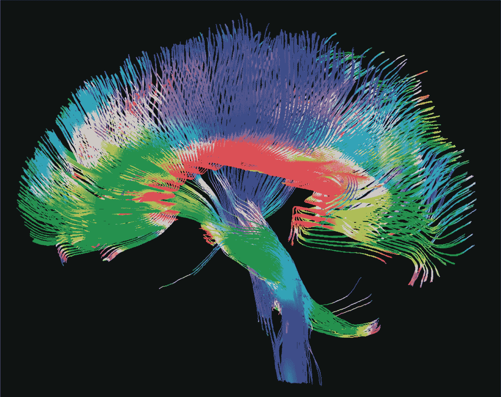
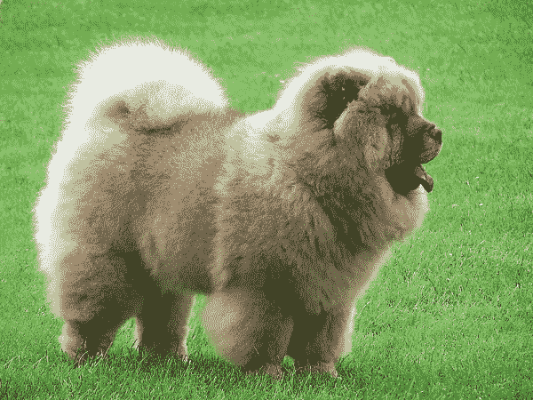
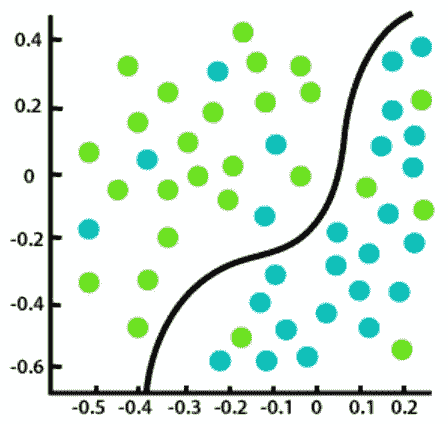
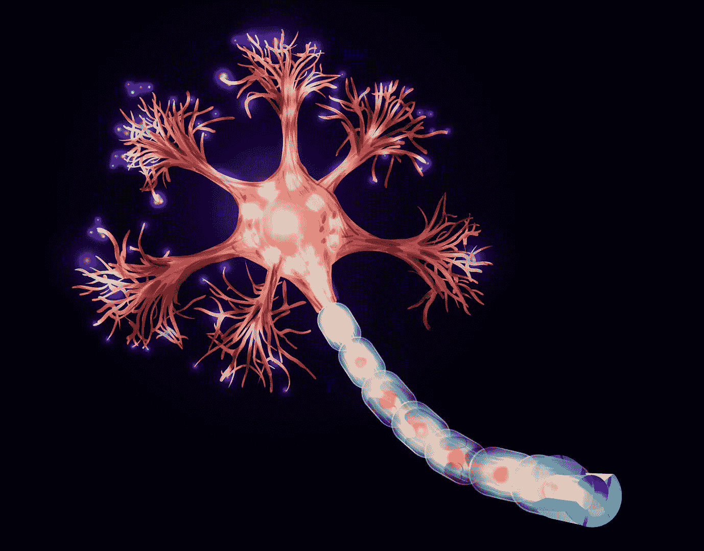
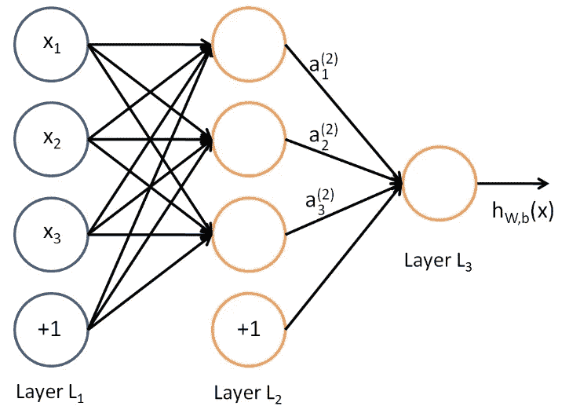

# 祖母的机器学习

> 原文：<https://medium.com/analytics-vidhya/machine-learning-for-grandmothers-2868dec54f80?source=collection_archive---------23----------------------->

菲尔普斯实验室

目前，有一个时尚的主题，机器学习，以至于对你能做什么有很大的期望。这门学科是人工智能和边界数据科学的一部分，广泛应用于我们日常使用的应用程序中，如网飞、脸书，以发现趋势并适应你的口味。

这个话题很有趣，因为它推动了技术的发展，数据已经成为几家公司非常受欢迎的资产，因为它可以根据客户的实际需求调整他们的产品，此外，在医学研究中，可以使用不同算法的机器学习来训练能够检测乳腺癌的系统。

此外，由于它提供了许多可能性，如自动汽车操纵，以及在农业中实施，产生了更高的生产率，因此引起了人们的极大兴趣。在机器学习中，你会在不同的领域激起好奇心，从一门纯粹的计算科学变成一门掺杂了其他学科概念的科学。

要理解为什么机器学习的概念不同于通常的编程。你必须定义什么是编程。这是基于算法的设计。这就像在准备 Ajiaco santafereñ时，你应该用大蒜、香菜、胡椒和盐在锅里炒鸡肉。然后你必须加入玉米棒和土豆。加入水，让水沸腾一段时间。如果按照配方中的步骤操作，就能达到预期的目标。所以程序所做的就是按照食谱的步骤来做，只有这个食谱才能被机器理解。

但是，什么是机器学习，它是编程计算机使用一个例子或数据过去的经验来优化一个性能标准[1]。那么，与上面解释的相比，机器学习意味着一种算法，在这种算法中，你不再被明确地告知要遵循什么步骤。相反，是程序本身最终调整了这些步骤并给出了答案。这种反应更多地基于过去的经验或通过其他方式获得的一组数据，因此程序开发出准确的反应。

但这意味着，从广义上来说，机器学习涉及一组数据，这些数据为她提供了一个答案。但要理解这一点，你必须定义三种类型的学习，监督学习，无监督学习和强化学习。

要开始监督学习，必须有人监督。也就是说，有人指示程序去做，在几次尝试响应后，程序得到了预期的响应。这样做是因为领导程序的人告诉程序它应该如何工作。这就是为什么这种学习被称为监督学习。然后作为程序，可以称为黑盒，给出经验和数据，有了这些，这个模块就可以辨别。

这可以和现实生活相比较。所有的祖母在她们的一生中都是母亲，她们都在童年时经历了抚养孩子的过程，而向孩子传授世界的一种方式就是通过动物。每当一个孩子在街上、电视上看到一只猫，如果他们去了乡下，他就会受到教育。这样做了很多次，尽管给孩子看的是波斯猫、布娃娃猫或暹罗猫，孩子也能理解猫就是猫。对孩子来说，这些都是猫。

另一方面，如果母亲教孩子，现在另一种动物，狗。同样的过程，每次她在街上或电视上或任何地方看到一只小狗，她都指出那是一只狗。然后，孩子知道狗是狗，猫是猫，因为他见过它们很多次，他的头脑能够概括，所以他在街上看到一只他以前没有见过的狗，也就是说，他只知道他周围的狗，但如果他看到一只更高级的狗，不像“松狮犬”那样常见，孩子就明白这是一只狗，只要他看到它，他就会说这是一只狗。

这和机器学习有关。这个过程和对孩子的描述很相似，只是机器有自己的语言。那么这个过程会是怎样的呢？首先，向导会像算法中的妈妈一样，通过这个“妈妈”已经命名的一大组图像告诉狗有狗和猫。这一过程被称为标记图像，但这些算法需要大量的数据，向算法提供的数据越多，输出就越准确。

那么这些神奇的算法是什么呢，在监督学习中有两种类型的算法:分类算法和回归算法，它们都是通过输入大型数据集来实现目标的。

分类算法，他们的目标是分类，最好的例子是，它是用类比的方式完成的。它试图对其所属的数据集进行分类。例如，你有猫和狗作为数据集。除了描述一种新的动物，无论是猫、狗还是陌生人，算法都应该将狗分组在一起，并用一支笔将猫分组，这支笔在数据科学中是一种数学函数，它可以尽可能地将这些动物分组。

另一种类型的算法是回归算法。他所做的是寻找两个变量之间的相关性。这就像当试图预测天气时，人们知道波哥大的天气寒冷，而卡塔赫纳的天气炎热，但这是因为许多人都有这种热感觉。然后是一个从未到过卡塔赫纳的波哥大人。虽然他从未去过卡塔赫纳，但他随身带着新鲜潮湿的衣服，放在手提箱里。这是因为他读过，或在电视上看过，或朋友告诉他，卡塔赫纳是热的。这是因为许多人在他之前经历过这种经历，他们可以告诉他这很热。所以回归是一种基于事实和事实的预测形式。

波哥大寒冷的一天

卡塔赫纳炎热的一天

把算法留给“妈妈”，在机器学习中还有另一种类型的学习，这就是所谓的无监督学习。但是这与前一个相比具有优势，因为它不需要大量的输入数据集。这个算法更像是一个考古学家去埃及，突然发现古迹墙上刻了很多涂鸦。他不认识这些潦草的文字，但是稍加注意，他就能以某种方式理解这些潦草文字之间的某种类型的分离。

如果你不是古埃及方面的专家，你可以尝试在无监督学习的情况下做算法做的事情。你会如何理解这幅图像？你可能看到的是几何符号，其他的就像人和其他动物的轮廓。所以，尽管你不懂埃及语，你也能把符号分为三类，几何图形，人的轮廓和动物的轮廓。

它还必须包括强化学习。在这种情况下，我们可以回到黑猩猩的情况，如果它们完成某些任务，就会得到奖励。Washo 就是这种情况，它通过刺激、美味的食物学会了用人类的手语交流。这只有通过奖励才能实现，因为据说黑猩猩有学习和使用手势的天生本能，瓦肖会自己发现这些迹象[2]。

但这也是基于一个封闭的系统，就像一个人的情况一样，他通常通过试错来学习。比如宝宝学走路，摔倒了，撞到自己，直到找到走路的平衡点。母亲没有向婴儿指出她必须在脚底的这么多中心保持一定的重心，也没有指出她应该如何行走。这个婴儿在有能力自己走路之前经历了许多跌倒和许多擦伤。然后，机器增强学习使用它的失败和它的成就来提高它的性能。这就是为什么这种类型的学习，强化学习往往更强大，因为除了基于经验和奖励，它还基于积累的失败，并通过失败来改善自己

但是在机器学习中，有一些非常奇怪的结构可以完成更精确的任务。这些是神经网络。这些来自感知机的概念，由弗兰克·罗森布拉特在 20 世纪 40 年代早期提出。感知器基本上是一个人工神经元，是推理的基本单位。我们大脑中的神经元由称为树突的输入通道和称为轴突的输出通道组成。树突从它们所在的区域收集信息，并将其引入神经元的身体，神经元通过突触做出反应，向大脑发送响应。这个概念是神经网络的本质。

但一个神经元本身并不能实现什么，当它与更多的神经元交流时，奇迹就会发生，这就是神经网络，因此轴突将信息从一个神经元传递到其他神经元的树突。但是当学习发生时，这与神经元本身有关。当神经元突触时，就像灯泡被点亮一样，为了学习某项任务，神经元将信息从神经网络中的一个点传递到另一个点，在这些神经网络中，为每个神经元设定一些权重，并测试出口，如果输出的行为不符合预期，神经元会改变这些权重。重量的概念就像光源的强度，光就是神经元的突触。这可以在神经网络中看到，就好像几个灯泡，每个灯泡是一个神经元，以不同的强度打开。有些灯可以很亮，而另一些则相反，光线很暗。这对于结果的目的来说是尽可能接近的。

如今，机器学习已经成为一种非常强大的工具，因为除了将心理学和生物学的概念结合到功能中，它还应用于各种各样的应用中。由于能够获得巨大处理速度的处理器的发展，它正在发展，从而提高了这些算法接近期望响应的机会，并且它是一个不断发展的领域。

参考

[1] Alpaydin，E. [机器学习简介](http://www.cmpe.boun.edu.tr/~ethem/i2ml3e/)，第 3 版。麻省理工学院出版社，2014 年

[2] [纳坦伦茨](https://thehumanevolutionblog.com/author/nathanlents/)，科科，瓦肖，坎齐:三只拥有人类词汇的猿[https://thehumanevolutionblog . com/2015/07/28/科科-瓦肖-和-坎齐-三只拥有人类词汇的猿/](https://thehumanevolutionblog.com/2015/07/28/koko-washoe-and-kanzi-three-apes-with-human-vocabulary/)

[3][https://www . Java point . com/regression-vs-class ification-in-machine-learning](https://www.javatpoint.com/regression-vs-classification-in-machine-learning)

[4][http://ligdigonzalez . com/difer encia-entre-aprendizaje-supervi sado-y-no-supervi sado/](http://ligdigonzalez.com/diferencia-entre-aprendizaje-supervisado-y-no-supervisado/)

[5][https://www . im novation-hub . com/es/transformacion-digital/aprendizaje-reforzado-cuando-las-maqui nas-aprenden-SOLAS/](https://www.imnovation-hub.com/es/transformacion-digital/aprendizaje-reforzado-cuando-las-maquinas-aprenden-solas/)

[6][https://www.hindawi.com/journals/jhe/2019/4253641/](https://www.hindawi.com/journals/jhe/2019/4253641/)