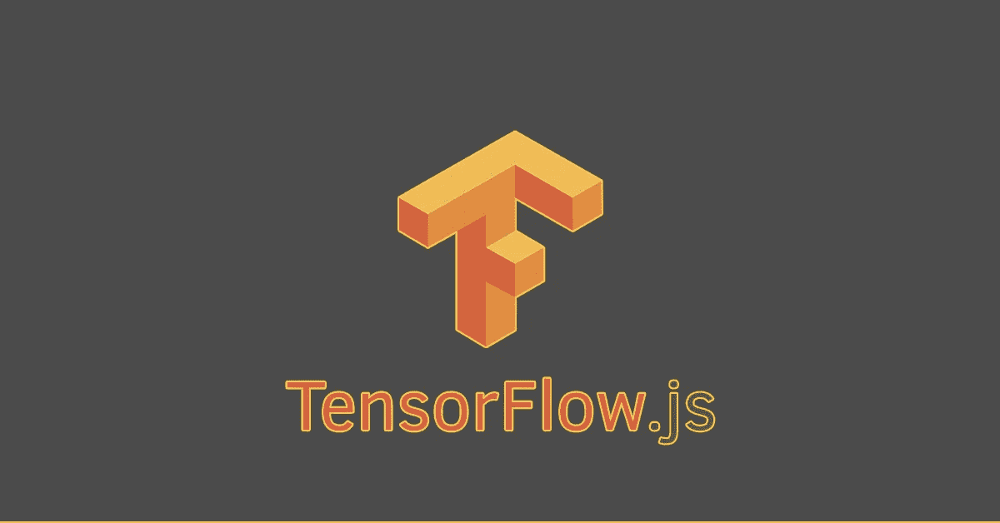

# 面向 JavaScript 开发人员的机器学习 TensorFlow.js

> 原文：<https://medium.com/analytics-vidhya/machine-learning-for-javascript-developers-tensorflow-js-fd322dc9cfb0?source=collection_archive---------11----------------------->

机器学习(ML)是人工智能(AI)的一个分支，它赋予机器在没有显式编程或人类干预的情况下学习和改进的能力，它使用数据进行自我学习。

TensorFlow 是一个免费的开源软件库，用于数据流和一系列任务的差异化编程。它是一个符号数学库，也用于机器学习应用，如神经网络。简单来说， *TensorFlow 是 Google 做的一个机器学习库，用来设计、构建和训练机器学习模型。*



TensorFlow.js

谷歌在 2015 年推出了 TensorFlow，并与 Python 一起使用，尽管它有 Java、C 和 Go 版本的 API。它部分是在原生 C++中实现的，这有助于 TensorFlow 获得良好的性能优势，但不能在 web 浏览器中运行，因为*浏览器不能运行原生代码*。这使 TensorFlow.js 付诸行动，TensorFlow.js 也是 TensorFlow 生态系统的一部分，但与 TensorFlow 不同，但它带来了几乎相同的功能，稳定的*tensor flow . js 1.0 版本于 2019 年推出*。

TensorFlow.js 是 JavaScript 的机器学习库，**它使机器学习功能在 web 浏览器和 Node.js 上可用，用于服务器端**和后端开发。如果你是一名 Javascript 开发人员，想要尝试机器学习，TensorFlow.js 是一个不错的选择。

TensorFlow.js 主要使用基于人工神经网络的模型，但它也是一个通用库，可以用于许多高性能的机器学习操作。

你可能认为 TensorFlow.js 会很慢，因为 JavaScript 不能像本机代码一样快，是的，这是事实，但 **TensorFlow.js 比你想象的** **快，因为** **它优化了后端，在 web 浏览器中使用 GPU，并在 node.js 中使用 TensorFlow 的本机绑定**。它使深度学习在 web 浏览器和 node.js 中成为可能。

# TensorFlow 和 TensorFlow.js 之间的相似性

*   TensorFlow 和 TensorFlow.js 都是 Google 开发的。
*   TensorFlow 和 TensorFlow.js 都是开源的。
*   TensorFlow 和 TensorFlow.js 都是机器学习库。
*   TensorFlow 和 TensorFlow.js 都有类似的 API，但不完全相同。

# 为什么要用 TensorFlow.js？

使用 TensorFlow 似乎更好，因为 Python 传统上用于机器学习。但是有理由在 JavaScript 环境中使用机器学习。

*   它有助于为 web 应用程序添加机器学习功能。
*   开发浏览器时，您可以访问设备功能，如摄像头和位置。
*   可以将 python 制作的 TensorFlow 机器学习模型导入 TensorFlow.js
*   如果你是一名 JavaScript 开发人员，并且对学习机器学习感兴趣，那么没有必要学习 Python。

# 如何在网页浏览器中安装运行 TensorFlow.js？

在基于浏览器的项目中获取 TensorFlow.js 有两种主要方法:

*   使用**脚本标签**。

您可以将下面的脚本标记添加到 HTML 文件中。

```
<script src="https://cdn.jsdelivr.net/npm/@tensorflow/tfjs@1.0.0/dist/tf.min.js"></script>
```

*   使用 **npm** 。

您也可以使用 npm 或 yarn 安装。

```
yarn add @tensorflow/tfjs**or**npm install @tensorflow/tfjs
```

# 如何在 node.js 环境下安装运行 TensorFlow.js 进行后端？

要在 node.js 上为后端环境安装 TensorFlow.js，您可以使用 npm 或 yarn。

*   使用本机 C++绑定安装 TensorFlow.js。

```
yarn add @tensorflow/tfjs-node**or**npm install @tensorflow/tfjs-node
```

*   如果您的系统具有支持 CUDA 的 NVIDIA GPU，请使用 GPU 包以获得更高的性能。(仅适用于 Linux)

```
yarn add @tensorflow/tfjs-node-gpu**or**npm install @tensorflow/tfjs-node-gpu
```

*   安装纯 JavaScript 版本。

```
yarn add @tensorflow/tfjs**or**npm install @tensorflow/tfjs
```

> [您也可以点击此链接访问 TensorFlow.js 官方网站，上面有设置 TensorFlow.js 的说明](https://www.tensorflow.org/js/tutorials/setup)

我试图简单地解释 TensorFlow.js 的一切。对于 JavaScript 开发者来说，不学 Python 就进入机器学习是一个非常好的选择。希望对你有用。

> 阅读是好的，但阅读并付诸实施更好！

非常欢迎对这篇文章提出建议和批评。