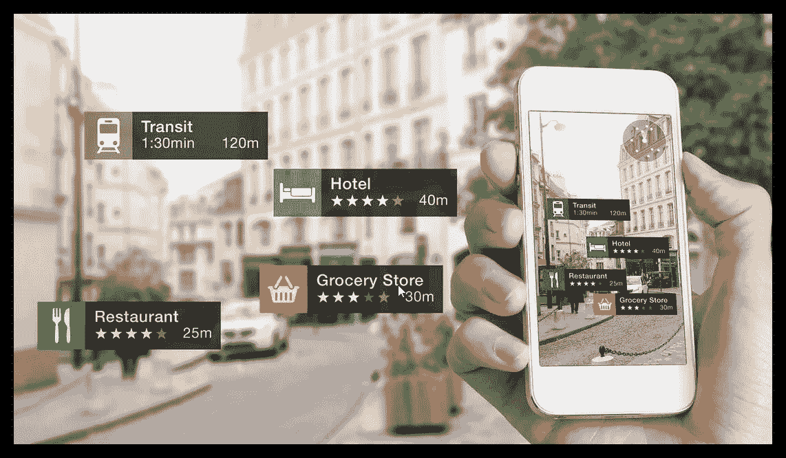
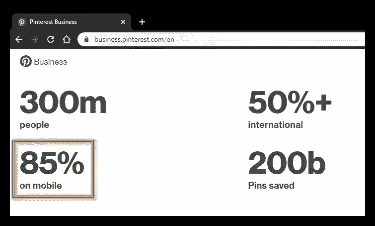
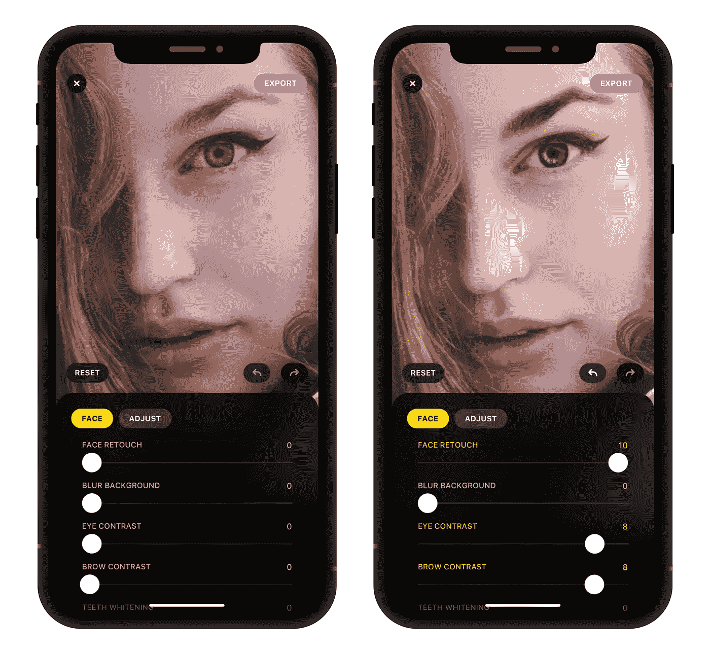
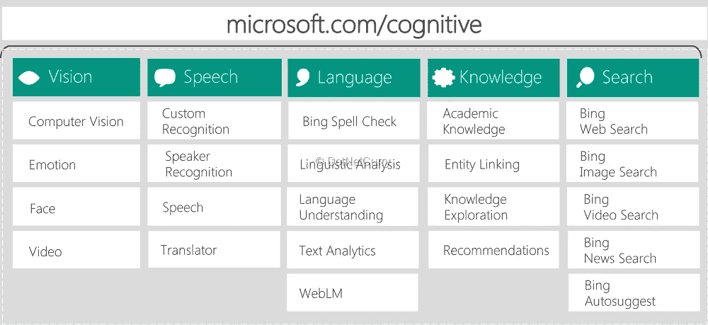
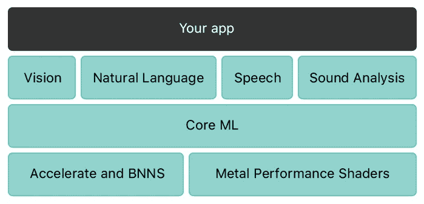
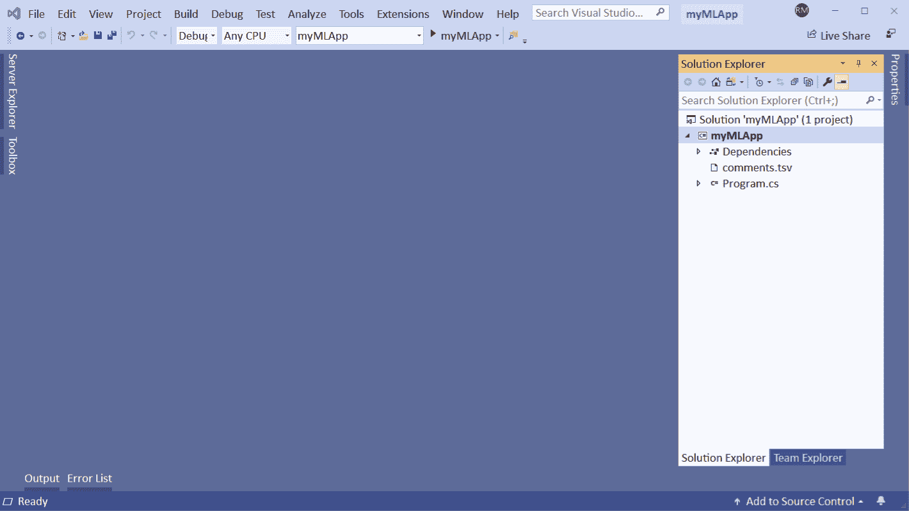

# 面向移动应用的机器学习

> 原文：<https://medium.com/analytics-vidhya/machine-learning-for-mobile-apps-e2ad14d72221?source=collection_archive---------35----------------------->

来源—[https://blog.vsoftconsulting.com/](https://blog.vsoftconsulting.com/)

> 这个世界上几乎每个人大部分时间都在使用的设备是什么？

是的。它的**【手机】**。像笔记本电脑/平板电脑等其他电子设备一样，移动端的参与率也在与日俱增。

显示用户参与度相关指标的 Pinterest 业务

# 为什么 ML/AI 在移动应用中创造潜力？

## 相机和照片

最好的例子是**【相机】**在手机上不断添加新功能。2019 年推出的[“人工智能相机手机”](https://analyticsindiamag.com/top-ai-based-phone-cameras-launched-in-2019/)描绘了同样的场景。“相机”仍然是买家的首选，并成为新推出的手机的主要卖点。许多应用程序也是基于相机和照片发布的，如“[Lensa](https://techcrunch.com/2018/12/13/prismas-new-ai-powered-app-lensa-helps-the-selfie-camera-lie/)”——Prisma 的新人工智能应用程序。AI 摄影会根据主体自行调整颜色和 photoshop 元素。

## 空间和记忆

此外，我们已经度过了大多数人担心空间和内存来安装新应用程序和在手机上存储东西的日子。我真的很喜欢这篇文章的第一行 : *“今天，我们在一部智能手机上的计算能力超过了美国国家航空航天局(NASA)将一个人送上月球的整个太空计划。”*

# 用户的期望非常高

想象一下不同之处。一个**电子邮件应用**，只支持基本的电子邮件操作。而另一个电子邮件应用程序，例如 **Gmail** ，做着同样的工作，但有所不同，比如自动将收到的邮件分为 ***主邮件、社交邮件和促销邮件*** 。试想，哪一个会有**撞上**？现在，让我们看看在这背后运行的不同的 ML 算法/模式:

*   垃圾邮件还是非垃圾邮件—二进制分类算法，
*   个人、晋升、社交——K 均值聚类算法，
*   邮件内容建议—文本分析
*   此外，我们还看到写邮件时的自动建议，账单过期的提醒，承诺回复但我们没有回复的邮件的提醒，而且列表还在不断增加。

# 未来的移动人工智能——“人工智能边缘”

人工智能将在移动设备本身上，即如果计算数据的 ML 模型库在你的应用程序本身上，那么它对隐私、安全和延迟更有意义。此外，它可以在没有互联网的情况下离线工作。尽管如此，它也有一些缺点，如密集的内存消耗和手机电池有时计算的结果。

# 预建人工智能—微软认知服务

有很多预置的 AI 服务用于**视觉、文本、**等。像[微软的认知](https://azure.microsoft.com/en-in/services/cognitive-services/)。您可以在任何应用程序模型中通过 REST API 直接使用这些服务。相应的数据将被发送到云端，进行计算，并将结果传回手机。

【https://www.dotnetcurry.com/】从— [*到*](https://www.dotnetcurry.com/images/xamarin/cognitive/cognitive-services-overview.png)

# ML 框架

让我们看看一些用于将人工智能(机器学习功能)融入移动应用程序的框架。

## 核心 ML

“Core ML”是著名的 Mac 设备 ML 框架。与 IOS 的其他框架相比，Core ML 处于最佳状态；因为在苹果设备上运行预先训练好的模型非常简单。它建立在以前构建的 ML 框架 Accelerate 和 BNNS 之上。核心 ML 是这两者之上的抽象。

*出自:*[*https://developer.apple.com/documentation/coreml*](https://developer.apple.com/documentation/coreml)

## ML。网

“ML。NET”是一个开源的、跨平台的机器学习框架。如果你已经是一个. Net 开发者，用 Auto ML 创建你自己的模型将会非常容易。从我自己的经历来讲。您可以在 web 应用程序中部署模型，并在任何需要的地方使用它。

*来自:*[*https://dot net . Microsoft . com/apps/machine learning-ai/ml-dot net*](https://dotnet.microsoft.com/apps/machinelearning-ai/ml-dotnet)

# 轮到你了

编程语言会有所不同。但是原则是一样的。如果一个人在人工智能的基础方面足够强大，并且有能力解决用户的实际问题，他/她就可以创建一个令人惊叹的人工智能移动应用程序。

谢谢你一直看完我的博客！

更多参考，

*   也可以看看我在[媒体](/analytics-vidhya/artificial-intelligence-boon-or-bane-in-lay-mans-language-98228805b8c)上关于人工智能的博客。
*   [在这里](https://clevertap.com/blog/page/2/)，你可以找到更多关于应用分析的博客。

不久后再见:)