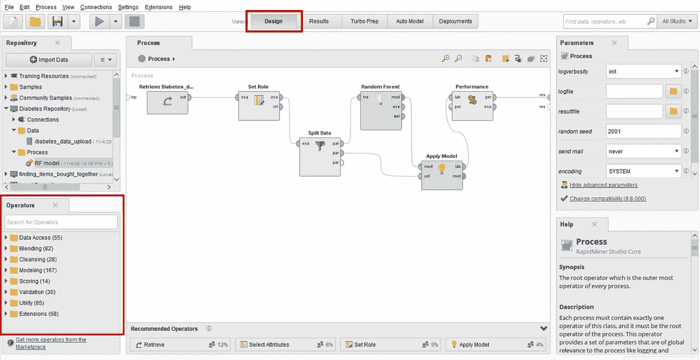

# 面向程序员和非程序员的机器学习

> 原文：<https://medium.com/analytics-vidhya/machine-learning-for-programmers-and-non-programmers-f8568d357750?source=collection_archive---------9----------------------->

## 使用 Python 编程语言或 RapidMiner 应用程序创建机器学习模型


机器学习的目的是让计算机在没有人类干预的情况下自动学习。可以使用 Python 或 R 编程语言中的特定库来构建机器学习模型。它也可以使用带有图形界面的应用程序和拖放技术来构建，例如 [Orange](https://orange.biolab.si/#Orange-Features) 和 [RapidMiner](https://rapidminer.com/) 。最近，数据分析和机器学习库使得程序员分析和建立机器学习模型变得容易。此外，具有图形界面的数据科学应用程序使用户能够分析数据并构建机器学习模型，而无需编写代码。这些应用程序对非程序员和研究人员很有帮助。

在本文中，我们将使用两种不同的方法来创建一个机器学习模型: **Python** 编程语言和 **RapidMiner** 应用程序。

我们将使用“ [*”早期糖尿病风险预测数据集*](https://archive.ics.uci.edu/ml/datasets/Early+stage+diabetes+risk+prediction+dataset.) ”。该数据集包含 520 人的数据。有 16 列人口统计和健康数据。第 17 列是类(正或负)。

我们将建立一个**随机森林**机器学习模型，在早期预测糖尿病。以下是我们将要遵循的步骤:

1.  加载数据集
2.  确立目标
3.  将数据分为训练和测试
4.  训练模型
5.  评估模型

模型的 Python 文件和 RapidMiner 文件可以在我的 [GitHub 资源库](https://github.com/nadaalay/Early_Stage_Diabetes_Prediction)中找到。

现在，让我们开始使用 Python 构建模型。

# **使用 Python 的预测模型**

## **1。**T21【加载数据集】

首先，让我们导入我们将要使用的所有库。

```
# import libraries
import numpy as np
import pandas as pd
from sklearn.preprocessing import LabelEncoder
from sklearn.model_selection import train_test_split
from sklearn.ensemble import RandomForestClassifier
from sklearn.metrics import confusion_matrix, classification_report
```

现在，我们将读取数据:

```
# Read dataset file
df = pd.read_csv('diabetes_data_upload.csv')
df.head()
```

这是数据标题的快照。


由于值不是数字，我们应该在创建模型之前对数据进行编码。我们将把非数字标签转换成数字标签。

```
# Apply label encoding
for c in df.columns:
	if df[c].dtype == 'object':
		le = LabelEncoder()
		df[c] = le.fit_transform(list(df[c].values))
```

## **2。**设定目标**设定目标**

我们将使用`class`列作为模型的*目标*，所有其他列作为*特征*。

```
# Initialize target and features
label = df['class']
features = df.drop( ['class'], axis = 1)
```

## **3。** **将数据拆分成训练和测试**

我们将数据集分成两组，80%用于模型训练，20%用于模型测试。

```
# Split data into training and testing
X_train, X_test, y_train, y_test = train_test_split(features, label, test_size = 0.2)
```

## **4。** **训练模型**

让我们创建随机森林模型，训练并测试它:

```
# Create Random Forest classification model
clf = RandomForestClassifier(criterion = 'gini', max_depth = 10)# Train the model
clf.fit(X_train, y_train)# Test the model
prediction = clf.predict(X_test)
```

## **5。** **评估模型**

我们已经完成了模特训练。现在让我们评估模型并打印分类报告和混淆矩阵。

```
# Print classification report
class_report = classification_report(y_test, prediction)
print('Classification Report')
print(class_report)
print()# Print confusion matrix report
conf_matrix = confusion_matrix(y_test, prediction)
print('Confusion Matrix')
print(conf_matrix)
```

下图显示了分类报告和混淆矩阵。


我们已经完成了使用 Python 构建预测模型，让我们开始使用 RapidMiner 构建模型。

# **使用 RapidMiner 的预测模型**

在 RapidMiner 中，为了构建工作流流程，我们将操作符从**操作符**选项卡拖放到**设计**视图中的**流程**画布，并将操作符连接在一起。



工作流流程代表预测模型。


## **1。** **加载数据集**

要加载数据，首先点击**存储库**选项卡中的**导入数据**按钮，然后选择数据集文件，将数据集存储在存储库中。之后，将 **Retrieve** process 拖到画布上，然后从 **Parameters** 选项卡中选择数据集的存储库位置。


## 2.**设定目标**

将**设置角色**流程拖到画布上，并将**检索**流程的输出连接到**设置角色**流程的输入。然后，从**参数**页签中更改目标列的角色，将**属性 _ 名称**设置为'*类*'，将**目标 _ 角色**设置为'*标签*'。


## **3。** **将数据拆分成训练和测试**

将**拆分数据**流程拖到画布上，并将**设置角色**流程的输出连接到**拆分数据**流程的输入。然后配置**分区参数**产生两个分区，分别为***0.8*和 *0.2* 。这将数据集分成两组，80%用于训练，20%用于测试。**

********

## ****4。**火车**模型****

**首先，将**随机森林**进程拖到画布上。然后，为了训练模型，将**分割数据**过程的第一个输出( *par* ) (80%)连接到**随机森林**过程的输入，并根据需要更改模型的**参数**。**

****

**为了测试模型，拖放**应用模型**进程，并将**随机森林**进程(模型( *mod* ))的第一个输出连接到**应用模型**进程(模型( *mod* ))的第一个输入。之后，将**分割数据**进程的第二个输出( *par* ) (20%)连接到**应用模型**进程的第二个输入(未标记数据( *unl* ))。**

****

## **5.**评估模型****

**将**性能**流程拖到画布上，并将**应用模型**流程的第一个输出(标记为数据(*实验室*))连接到**性能**流程的输入。然后，将**性能**过程的第一个输出(性能(*根据*))连接到结果( *res* )。**

****

**最后，运行流程，您可以在**结果**视图中看到性能结果。**

****

**如你所见，我们可以使用**和**两种不同的方法创建一个**机器学习模型**。第一种方法是**文本接口**，这些是使用书面命令的编程语言，它们易于共享并且可以灵活地重复使用。另一种方法是**图形界面**，这些是使用菜单和小工具的专门应用程序。很容易看到流程，尽管共享或重用它可能会比较困难。总的来说，这些应用程序使**非程序员**和**研究人员**能够轻松完成数据科学任务。**

## ****结论****

**本文解释了如何用 Python 和 RapidMiner 创建机器学习模型。Python 提供了一些功能和库，使得 python 成为数据科学家和开发人员的首选之一。RapidMiner 是一个易于使用的可视化应用程序，用于不需要编程的数据科学任务。**

**感谢阅读:)**