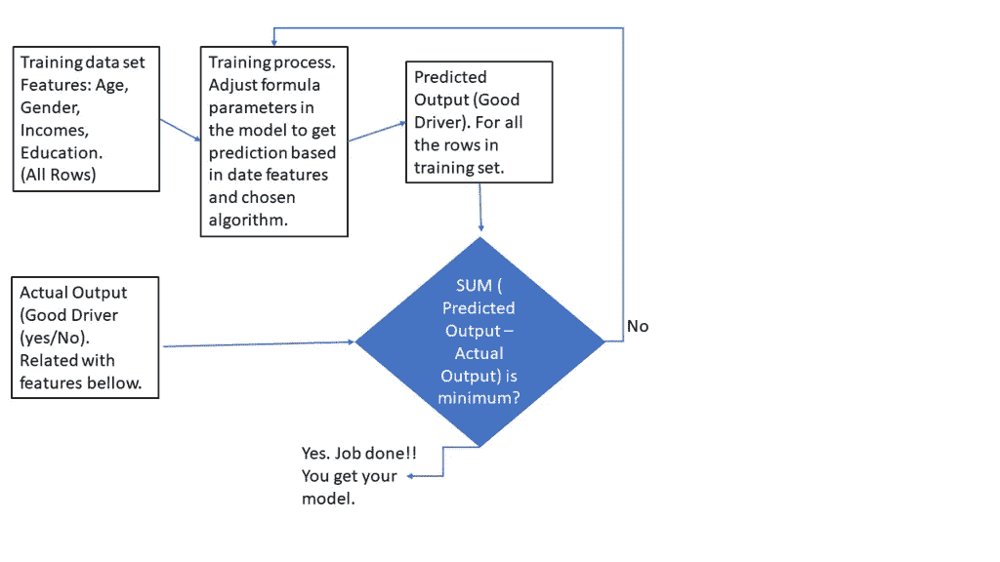
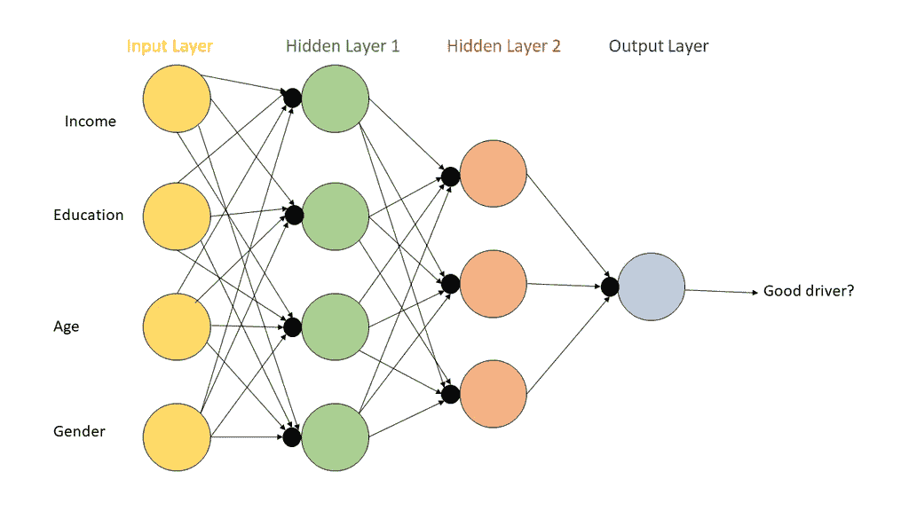
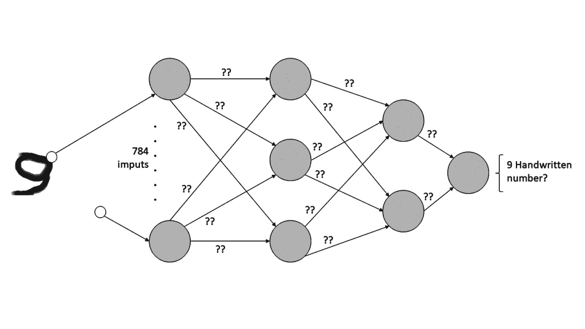
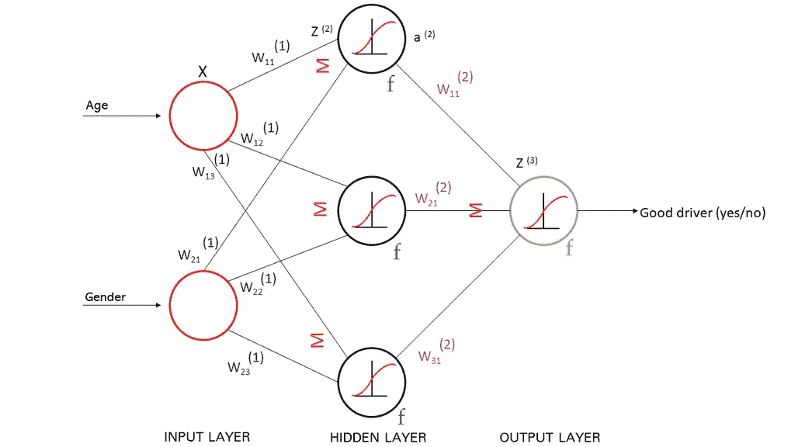

# 程序员如何理解机器学习范式

> 原文：<https://medium.com/analytics-vidhya/machine-learning-for-programmers-f840e463886e?source=collection_archive---------18----------------------->

今年夏天我读了很多关于这个主题的书，我想为开发者写一篇文章，谈谈我在读这些书之前的第一个问题:**机器学习到底是什么？**

在这篇文章中，我将忽略每本机器学习书籍中的一些概念(有监督的、无监督的、数据精炼、测试数据、聚类、过拟合、欠拟合)，专注于真正的机器学习以及如何向传统程序员解释它。在本文中，你会注意到我不是数据科学专家，我更喜欢简单而不是准确。所以，如果你发现错误，如果你愿意，给我发一些反馈。还没做过什么动手项目。理论大到可以占用我所有的时间。

当程序员需要评估一个条件时，我们必须有明确的规则:

*   如果客户信用小于客户债务，警告用户这是一个有风险的商业操作。
*   如果物品可用性低于物品需求，我必须打开可用物品信息面板。
*   如果过账日期为空，我必须在单据过账时提出错误。

我们知道明确的规则，并在代码中应用它们。

但是我们可能会有一个问题，当规则不是很清楚或者这些规则不容易编码的时候。

让我们考虑一个经典的人工智能问题:MNIST，一个手写数字图像数据库，被用作人工智能的“Hello World”。在这种情况下我们假设从一个数字图像文件中找出数字值:

这张图是数字“9”。这对人类来说非常容易，但是想象一下你自己拍摄一张手写的数字照片并在你的程序中编码:

> 如果图像有一个带的圆，下面有一条曲线，则数字等于 9

但你不能这样做:有些事情对人类来说很容易，对机器来说很难，它不知道图像中的圆是什么，如果它知道，它可能会期待一个完美的圆，而不是手写的圆。

其他时候，政策不是很明确，或者我们不想做预先的假设，我们希望对结果进行根本原因分析。让我们举个例子:一个为汽车保险检测安全驾驶员的程序。我们可以假设年轻男性是稍微粗心的驾驶员，并给出这样的指示:“如果顾客是年轻男性，那么对潜在的不安全驾驶员提出警告”。

但是，如果我们不确定这些标准，或者我们想采用更多的参数来进行预测，会发生什么呢？

那么我们可以用机器学习来解决这个问题。我们没有给机器任何明确的规则，我们给机器一组数据，通过一个称为训练的过程，机器得到一个模型，用新的输入值预测输出。

注意:我们将在非常广泛的意义上使用预测这个词。对一个人来说，预测是:明年我会卖出多少？这个人会是一个糟糕的司机吗？他的汽车保险对我来说是一项糟糕的业务吗？对人类来说，预测只关乎未来。但是对于机器来说，预测可以回答这样一个问题:这个图像是手写数字 9 吗？这是一只狗的照片吗？

机器学习的开始是给机器输入数据。“驱动程序保证”模型的输入可以是具有过去保证的先前历史的 CSV 文件，其具有下一列:

*   年龄
*   性别，男性或女性
*   人种
*   年收入
*   教育水平
*   好司机(是/否):如果司机给保险公司带来了许多问题和费用，我们已经检查了此字段。

目标是建立一个系统，预测新输入中的列“好的驱动程序”。因此，我们有两种列:

*   特性，也称为独立列。这些栏是系统的输入(年龄、教育、收入、种族和性别)。
*   标签，它是系统的输出，也称为依赖列。在我们的例子中，标签是预测模型的目标，即“好司机”列。我们添加实际和准确的输出值，使机器能够学习，将实际输出值与模型预测值进行比较。

还有很多关于数据的东西，这是主要的也是更困难的一步。创建机器学习模型并不容易。需要大量的业务知识和扎实的数据科学背景。这不是我的情况，所以我建议使用现有的模型或者使用 ML 工具。

数据总是需要大量的转换，如删除不相关的列，将所有列转换为数值，以及规范化值的范围。

以图像为例，在应用数学算法之前，我们必须将图像转换为像素数组。这些数组被称为张量。张量是一种多维数据结构，允许在复杂结构中进行计算。爱因斯坦在他著名的广义相对论的重力计算中使用了张量。

我们有 MNIST 数据库，里面有很多手写数字的例子。它们是 28x28 像素的图片。因此，我们将其转换为一个 28x28=784 元素的数组，以存储从 0 到 255 的整数值(每个像素的颜色)的所有像素。

输出将是一个有 10 个二进制元素的数组(从 0 到 9 的每个可能的输出数字一个元素)，所以 9=[0，0，0，0，0，0，0，0，1]，8=[0，0，0，0，0，0，1，0]等等。在训练步骤中，我们将搜索一个符合输出的数学模型，因此我们必须只输入数字，这样我们就可以应用算法。

结论是:你可以在机器学习中使用的所有数据都必须转换成数字！

然后，我们必须将数据集交给具有两列类别的机器:特征(年龄、性别、教育水平)和标签(好司机)，以及已知的数据。现在我们必须使用算法进行 n 次迭代:

*   我们给机器带标签的历史(实际输出)数据用于训练。
*   机器应用算法找到一个公式来概括和预测其他新值的标签，其输出仍然未知。

机器是如何得到这个公式来进行预测的？首先我们要选择一个算法。对于一个简单的问题，我们可以使用线性回归(对于非常简单的情况，只有一个输入)，我们有这个公式输出(预测)=偏差+特征*权重。机器必须找到“偏差”和“重量”的值。在机器学习中，添加到模型中的常数称为“偏差”。而公式中的乘积因子叫做“权重”或“斜率”。

对于更复杂的问题，我们使用另一种算法:人工神经网络。我们有很多可用的算法——决策树、逻辑回归等。

我们有训练数据和算法，机器试图拟合公式，找到公式的偏差和因子(权重)(在线性回归中)或神经网络的权重和偏差。

下一个问题是:机器如何找到这些值？为了回答这个问题，我们将引入成本或损失的概念。使用我们的预测模型，损失是在训练迭代结束时实际输出值和估计输出值之间的差异。更准确地说，是所有这些差异的总和。

如果您正在训练预测模型以获得销售预算，并且您有 2018 年的实际销售额=30.000，而您的预测模型计算出 10.000，则损失(或成本)=(预测-实际)= -20.000。并且我们使用预测的训练样本的所有损失的总和来获得损失值。

因此，机器学习的核心和神奇之处在于，对所有训练数据行进行迭代，设置公式值(偏差和斜率或权重)，当这些值使 RMSE(损失或成本)最小时，停止搜索。

迭代怎么知道损失的最小值？搜索最小值可能是一个无限尝试和错误的任务:为了避免无休止的迭代，我们可以设置最大迭代次数或使用一些数学工具(我们将在下一节讨论它们)。

如上所示的线性回归是你可以在机器学习中使用的最简单的算法。线性回归不能实现深度学习。对于复杂的学习，我们使用另一种模拟人类神经网络的算法，称为人工神经网络。

如果我们想识别一幅图像或进行更复杂的预测，我们必须使用神经网络:

如果我们正在识别一幅图像:

抱歉又是数学。我们有这些要素:

*   圆圈是节点，它们模拟神经元。
*   节点从一层到下一层是互连的。
*   第一层称为输入层，接收要素训练行的所有值。
*   输入层将值传递到下一层，但在此之前，会将其值乘以系数 Wxx，称为权重。这就像是一种线性回归，是一种斜率。
*   下一层称为隐藏层，在每个节点中接收输入值*权重的总和。
*   神经网络与其他 ML 算法的主要区别在于节点内部的符号，同样用“f”字母表示:激活函数。激活函数是在将数据传输到下一层之前节点内部的第二次转换。我们可以选择任何激活函数(通常在一组现有的函数中)，比较常见的有 Sigmoid、REL、双曲正切等。在训练模型之前，我们设置这个函数。
*   模型训练过程的目标是获得最小化 RMSE(成本、损失、预测和实际之间的差异)的权重值，正如我们对线性回归所做的那样。

注意:我做了很多简化，我只是想对 ML 做一个软的介绍。只有一个重要的概念:如果我们用一大组训练数据来训练迭代，我们是在测试大量的权重值。我们必须考虑到我们有不同的权重要计算，每个节点连接一个，对于复杂的系统，如果没有一些优化工具，这可能是一种疯狂。有一些数学工具可以加速权重值的搜索，如反向传播或梯度下降。

有很多人利用他们的数学库用 Python 或 JavaScript 做 ML 模型。向勇士队致敬，但我不会走他们的路。

这些语言有像 Scikit 或 TensorFlow 这样的 ML 库，做了很多工作:算法实现，数据精炼实用程序，RMSE 计算语句:如果你有商业和数据科学知识(不小的成就)，代码训练模型可能很容易或几乎很容易。

再往前一步，大公司，微软或 IBM 在他们的云平台中有 ML 训练器。

除了 RMSE 公式，所有的图片都是由阿尔巴·阿尔马拉兹·安吉亚诺完成的，他是这所科技高中去年的学生。非常感谢，没有图片解释所有这些概念对我来说几乎是不可能的。

*最初发表于*[*【https://community.dynamics.com】*](https://community.dynamics.com/nav/b/conceptsindailynavisionwork/posts/machine-learning-for-programmers)*。*