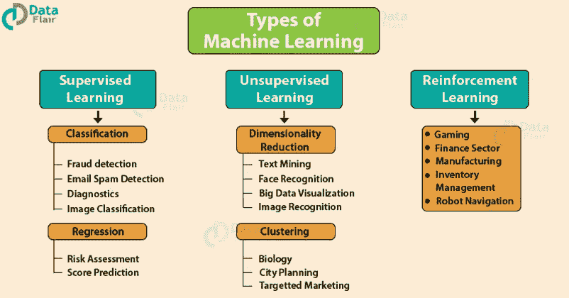

# 机器学习:第一步

> 原文：<https://medium.com/analytics-vidhya/machine-learning-for-starters-first-step-df19d6d59f54?source=collection_archive---------17----------------------->

# 介绍

在对机器学习进行分类之前，我们应该简单了解一下什么是机器学习。

> 因此，根据定义，**机器学习**是一个科学(包括使用统计学)研究领域，它赋予计算机学习的能力，而不需要显式编程。

好吧，这个定义可能没有给出一个清晰的图像。当我第一次开始机器学习时，我阅读了定义，但不能真正理解是什么/谁赋予了计算机这种学习能力。我的意思是，我们在编程语言中有*循环*和*控制流语句*，那么我们为什么需要像机器学习这样的另一个领域来解决我们的问题。所以，基本上我先研究了一下*传统编程*和*机器学习*的区别以及为什么需要。

> 两者的区别！

> **常规编程**告诉计算机如何处理给定的指令集，我们称之为**输入**。它基本上使最笨的计算机用同样的指令集一次又一次地犯同样的错误，也就是说，除非程序被修改，否则我们将永远得到同样的输出。同时，程序的时间和空间复杂度会随着**控制语句** (-if，-else 语句)数量的增加而增加。

然而，在机器学习中，输出是不断变化的，直到我们得到最佳可能的优化解决方案(输出)。*我来解释一下这个*。*机器学习*使用各种*统计技术。* **比如**，你们都在学校里解决过涉及线性方程组(y=mx+c)的问题。回想一下， **x** 是**输入**， **m** 是直线的**斜率， **c** 是**常数值**，最后， **y** 是我们想要的(或最佳的)**输出。**我们已经有了 **x** (输入或独立变量)，我们需要找到斜率(m)的值来得到我们的输出。对于不同的 m 值，我们可以获得不同的 y 值。因此，我们需要找出线(m)斜率的最佳可能值，以获得 y 的最佳可能值。这是通过重复放置不同的 x 和 y 值并在图上绘制这些值来完成的，直到我们获得最佳拟合线(通过连接不同的点)。这种寻找斜率(m)最佳值的重复过程就是机器学习的全部。所以，回到我们对机器学习的定义；这条*拟合的线*就是我们所说的 ***计算机无需显式编程就能学习的能力*** 。所以，我希望现在机器学习的定义已经很清楚了，M.L .和传统编程有什么不同。 ***伟大的*** ！:)**

m 的不同值给出不同的线(最终不同的输出)。因此，我们找出并选择最佳路线。

> 机器学习的类型

> 机器学习算法可以分为 3 大类:

**监督学习**

**无监督学习**

**强化学习**

参考:data-flairlearning.com

**监督学习**是一种学习，其中我们*使用被很好标记的数据来教导或训练*机器，这意味着一些数据已经被标记了正确的答案。之后，为机器提供一组新的示例(数据)，以便监督学习算法分析训练数据(训练示例集)并从标记数据中产生正确的结果。

例如，假设给你一个装满不同种类水果的篮子。现在，第一步是用不同的水果逐一训练机器，就像这样:

*   如果物体的形状是圆形的，顶部的凹陷是红色的，那么它将被标记为-**苹果**。
*   如果物体的形状是黄绿色的长弯曲圆柱体，那么它将被标记为-**香蕉**。

现在，假设在训练完数据后，您给了一个新的单独的水果，比如篮子里的香蕉，并要求识别它。因为机器已经从以前的数据中学到了东西。它将首先根据水果的形状和颜色对其进行分类，并确认水果名称为香蕉，然后将其放入香蕉类别。因此，机器从训练数据(装有水果的篮子)中学习东西，然后将知识应用于测试数据(新水果)。

**监督学习**分为两类算法:

*   **分类**:一个分类问题是当输出变量是一个类别时，比如“红”或“蓝”或“病”和“没病”。
*   **回归**:回归问题是当输出变量是一个实值时，比如“美元”或者“重量”。

无监督学习是使用既未被分类也未被标记的信息来训练机器，并允许算法在没有指导的情况下对该信息进行操作。在这里，机器的任务是根据相似性、模式和差异对未分类的信息进行分组，而无需任何事先的数据训练。

与监督学习不同，没有老师，这意味着不会对机器进行任何培训。因此，机器只能靠自己去发现未标记数据中的隐藏结构。
**例如**，假设给定一个图像，其中有从未见过的狗和猫。

因此，机器不知道狗和猫的特征，所以我们不能将其归类为狗和猫。但是它可以根据它们的相似性、模式和差异对它们进行分类，也就是说，我们可以很容易地将上面的图片分为两部分。第一部分可能包含所有有**狗**的图片，第二部分可能包含所有有**猫**的图片。这里你以前没有学到任何东西，意味着没有训练数据或例子。

**无监督学习**分为两类算法:

*   **聚类**:聚类问题是你想要发现数据中的内在分组，比如按照购买行为对客户进行分组。
*   关联:关联规则学习问题是你想要发现描述大部分数据的规则，比如购买 X 的人也倾向于购买 y。

强化学习使用*奖励*和*惩罚*的系统来训练算法。它使代理能够在一个交互式环境中，通过使用来自其自身行为和经验的反馈进行反复试验来学习。

让我们以吃豆人游戏为例，更好地理解强化学习的概念。*这里* **，**代理人(PacMan)的目标是吃掉格子里的食物，同时避开途中的鬼魂。在这种情况下，网格世界是代理的交互环境。代理因吃食物而获得*奖励*，如果被鬼魂杀死(输掉游戏)则获得*惩罚*。状态是代理在网格世界中的位置，总的累积奖励是代理赢得游戏。

强化学习模型预测了两个元素之间的相互作用— *环境*和*学习代理*。学习代理利用两种机制，即*探索*和*利用*。当学习代理根据试错法行动时，它被称为探索，当它根据从环境中获得的知识行动时，它被称为利用。为了平衡这两者，最好的整体策略可能需要短期的牺牲。因此，代理应该收集足够的信息，以便在未来做出最佳的整体决策。环境奖励行动者的正确行动，这是强化信号，而惩罚行动不正确。利用获得的回报，代理提高其环境知识以选择下一个行动。