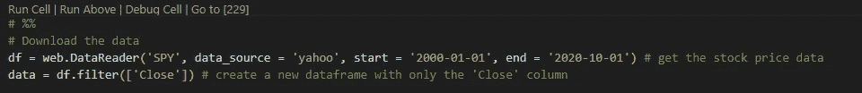

# 赢算法交易的机器学习？很可能没用。

> 原文：<https://medium.com/analytics-vidhya/machine-learning-for-winning-algorithm-trading-it-probably-doesnt-work-c0b11f801d34?source=collection_archive---------10----------------------->

至少对于我在这篇文章中使用的 LSTM。

大多数机器学习算法都只是一种回归模型。也就是说，当机器学习算法试图预测未来时，它们会预测一个趋势，同时假设任何与趋势的偏离都会逆转。当应用平方误差族中的损失函数时，情况尤其如此。

为了对此有一个直观的理解，让我们看一个例子。假设信号周围有随机噪声。灰线或黄线将受到损失函数的严重惩罚，因为数据和预测之间的平方差将很高。只有中间的橙色线被认为是更好的“适合”。就预测均值而言，这不一定是坏的，但它能产生有意义的完整交易信号吗？

在这篇文章中，我将使用 LSTM 模型来预测标准普尔 500 指数的 ETF SPY 的未来价格。我还将尝试评估该预测是否能产生可交易的盈利信号。

# 密码

在这一节中，我将解释我所使用的数据和代码。我使用 python 和 VS 代码来实现我的分析。我非常详细地解释了一切。如果你不想麻烦编码，请随意跳过这一部分。

[Github 在此。](https://github.com/xieyutongcn/LSTM_DONT_WORK)

以下是我使用的库:

首先，下载每日数据，并保留每天的收盘价:

因为我试图预测指数，我会包括至少 1 个完整的经济周期。SPY 于 1990 年首次推出，这让它经历了 2 次(网络泡沫和 08 年金融危机)。2000 年是网络泡沫的开始。如果你想自己试试这个，其实可以从《间谍》开始。

该数据有 5221 行，这意味着有 5221 个交易日，1 列是收盘价。

其次，我将数据分为训练集和测试集。

在选择训练集时，我使用整个样本的前 80%。这条线

> training _ data _ len = math . ceil(len(dataset)* 0.8)

告诉我们不小于数据长度 80%的最小整数(总共 5221 行)。0.8x 5221 = 4176.8。不小于 4，176.8 的最小整数是 4，177，因此该表达式给出了定型数据的长度-4，177。所以从第 4178 次观察到最后，5221 次将是我们的测试集。

我有一个名为 *pstep，*的变量，它代表我们希望预测多少天后的价格。

当在训练数据集中构造 x 和 y 变量时，该步骤还涉及一个循环。代码的基本原理如下:对于某一天的每个收盘价，我想使用前 60 天的收盘价来预测它。如果数据是按历史顺序组织的，并且 pstep = 0，则前 60 个观察值应该预测第 61 个观察值，第 2 到 61 个观察值应该预测第 62 个观察值，依此类推。索引 I 应该从 60 到训练数据的末尾。每列应该有 60 行，每个单元格有 1 个值，即收盘价。

然后，我们需要重塑数据，因为 LSTM 期望数据是三维的——样本数乘以时间步长数乘以特征数。时间步长的数量是 60，特征的数量是 1。样本的数量基本上就是我们可以做多少次重复来做预测。

然后我需要建立模型，编译模型，估计参数(拟合模型)。我挑选的神经元数量微不足道。10 或 100 个神经元的结果在性质上是相同的。我真的太适合这里了。如果我过度拟合，那么结果将是非常具体的样本。

# 结果可视化

所以我在这张图上画出了预测值和实现值的时间序列。我使用 pstep=15，这意味着我使用之前的 60 天来预测 15 天后的价格。

我相信这在大多数 LSTM 的文章中都可以看到。如果放大验证期间，您会看到模型在某些期间高估，而在其他期间低估。由于均方误差损失函数，这使得模型“平均”预测未来罚款。

在下图中，我绘制了 15 天后的实际价格和 15 天后的预测价格以及当前收盘价。我正在看第一个 100 obs。

如果绿线和橙线都在蓝线之上，那么预测值和未来值都在当前价格之上。相应地，我们可以在当前价格买入股票，持有 15 天并获得利润。如果绿线在蓝线之上，而橙线在蓝线之下，那么如果我们按照橙线交易，我们就会亏钱；反之亦然。如果你检查图表，大多数时候我们都会错。

# 裁决

感谢您的阅读！我希望我们都理解模型预测，以及什么是更好地预测回报。