# 为您的平板搜索提供机器学习

> 原文：<https://medium.com/analytics-vidhya/machine-learning-for-your-flat-hunt-part-1-e054e506a4b2?source=collection_archive---------11----------------------->

## 第 1 部分—数据可视化、预处理和基本预测模型

你曾经找过公寓吗？你愿意加入一些机器学习，让一个过程变得更有趣吗？


布兰登·格里戈斯在 [Unsplash](https://unsplash.com?utm_source=medium&utm_medium=referral) 上的照片

今天我将告诉你如何应用机器学习来寻找一个最优的公寓。

首先，我想澄清一下这个时刻，解释一下“*一个最优平*是什么意思。这是一套具有不同特征的公寓，如“面积”、“区域”、“阳台数量”等。对于这套房子的这些特点，我们希望有一个具体的价格。看起来像一个带几个参数并返回一个数字的函数。或者是一个提供魔法的黑盒子。

但是……有一个很大的“但是”，有时你可能会因为一系列的原因，比如良好的地理位置，而面对一套定价过高的公寓。此外，在市中心还有一些更有声望的地区，在城外也有一些地区。或者…有时人们想卖掉他们的公寓，因为他们搬到了地球的另一个地方。换句话说，有许多因素会影响价格。听起来耳熟吗？

# 让开一点

在我继续之前，让我说一点抒情的题外话。

我在叶卡捷琳堡(欧洲和亚洲之间的城市，2018 年举办足球世界锦标赛的城市之一)生活了 5 年。我爱上了这些混凝土丛林。我讨厌那个城市的俄罗斯冬天和公共交通。这是一个不断发展的城市，每个月都有成千上万的公寓出售。

是的，这是一个过度拥挤、污染严重的城市。同时，这也是一个分析房地产市场的好地方。我从网上收到了很多公寓广告。我会进一步利用这些信息。

此外，我试图在叶卡捷琳堡的地图上可视化不同的报价。

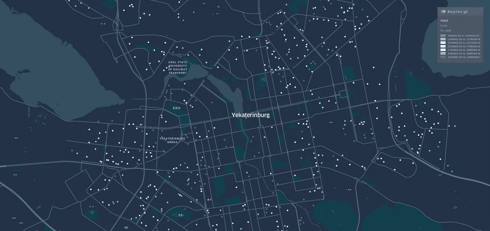

Kepler.gl 上的叶卡捷琳堡公寓。这些点指的是它们的地理位置

2019 年 7 月，叶卡捷琳堡出售了 2000 多套一居室公寓。它们的价格不同，从不到 100 万卢布到将近 1400 万卢布不等。

地图上点的颜色代表价格，接近蓝色的价格越低，接近红色的价格越高。你可以把它比作冷色和暖色，暖色的价格越高。请记住，颜色越红，东西的价值越高。同样的想法也适用于蓝色，但方向是最低价格。

现在你已经有了一个*总体的*概观，分析的时间就要到了。

# 目标

我住在叶卡捷琳堡的时候想要什么？我寻找一套足够好的公寓，或者如果我们从 ML 的角度来说，我想建立一个模型，它会给我一个购买建议。
一方面，如果一套公寓定价过高，模型应该通过显示该公寓的预期价格来建议等待价格下降。
另一方面，根据市场状况，如果价格足够好，也许我应该考虑这个提议。

当然，没有什么是理想的，我准备接受计算中的错误。通常，对于这种任务使用预测的平均误差，我准备好了 *10%* 的误差。例如，如果你有 200-300 万俄罗斯卢布，你可以忽略 20-30 万的错误，你可以负担得起。在我看来。

# 准备的

正如我之前提到的，有很多公寓，让我们仔细看看。

```
import pandas as pd
df = pd.read_csv(‘flats.csv’)
df.shape
```

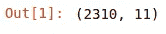

一个月 2310 套公寓，我们可以从中提取一些有用的东西。一般的数据概述呢？

```
df.describe()
```

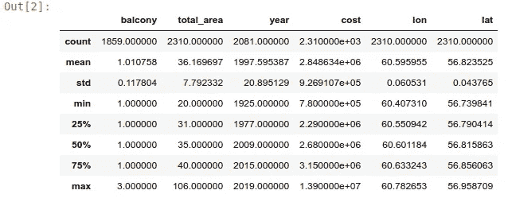

没有什么特别的东西——经度、纬度、公寓价格(标签“成本”)等等。是的，当时我用的是“成本”而不是“价格”，我希望这不会导致误解，请把它们看作是一样的。

# 清洁

每个记录都有相同的含义吗？他们中的一些被描绘成像隔间一样的公寓，你可以在那里工作，但是你不会喜欢住在那里。它们是狭小拥挤的房间，不是真正的公寓。让我们移除它们。

```
df = df[df.total_area >= 20]
```

房价预测源于经济学及相关领域最古老的问题。没有任何与术语“ML”相关的东西，人们试图根据平方米/英尺来猜测价格。因此，我们查看这些列/标签，并尝试获得它们的分布。

```
numerical_fields = ['total_area','cost']
for col in numerical_fields:
    mask = ~np.isnan(df[col])
    sns.distplot(df[col][mask],  color="r",label=col)
    plot.show()
```

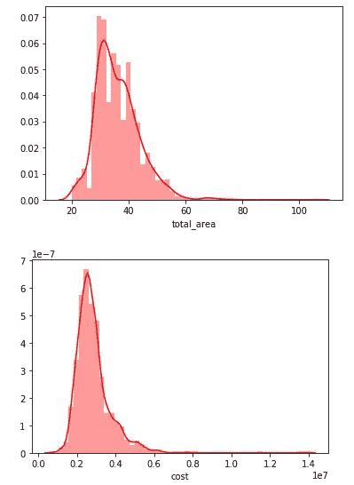

总面积和成本的分布

嗯…没有什么特别的，看起来像正态分布。也许我们需要更深入？

```
sns.pairplot(df[numerical_fields])
```

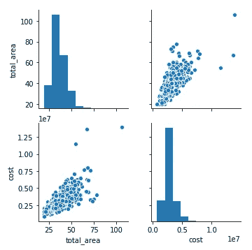

哎呀…出问题了。清除这些领域中的异常值，并尝试再次分析我们的数据。

```
#Remove outliers
df = df[abs(df.total_area - df.total_area.mean()) <= (3 * df.total_area.std())]
df = df[abs(df.cost - df.cost.mean()) <= (3 * df.cost.std())]#Redraw our data
sns.pairplot(df[numerical_fields])
```

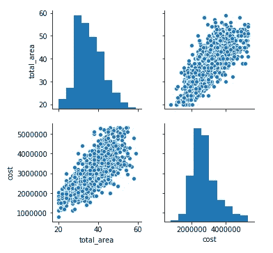

离群值已经消失

嗯，现在看起来更好，分布似乎很好。

# 转换

标签“年”指的是建造的年份，应该转换成更具信息性的东西。让它成为建筑的年龄，换句话说，一个特定的房子有多老。

```
df['age'] = 2019 -df['year']
```

让我们看看结果。

```
df.head()
```

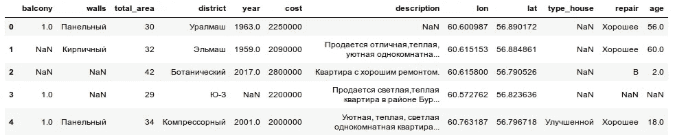

有各种类型的数据、分类数据、Nan 值数据、文本描述数据和一些地理信息(经度和纬度)。让我们把最后的放在一边，因为在那个舞台上它们毫无用处。我们以后会还给他们的。

```
df.drop(columns=["lon","lat","description"],inplace=True)
```

# 分类数据

通常，对于分类数据，人们使用不同种类的编码或类似于 [CatBoost](https://github.com/catboost/catboost) 的东西，这提供了一个像处理数值变量一样处理它们的机会。
但是，我们能不能用一些更符合逻辑、更直观的东西呢？现在是时候让我们的数据更容易理解而不失去它们的意义了。

# 地区

嗯，有 20 多个可能的地区，我们能在模型中增加 20 多个额外的变量吗？当然，我们可以，但是…我们应该吗？我们是人，我们可以比较东西，不是吗？

首先——不是每个地区都等同于另一个地区。在市中心，每平方米的价格较高，离市中心越远，价格越低。听起来符合逻辑吗？我们能用这个吗？

是的，毫无疑问，我们可以用特定的系数匹配任何区域，越远的区域，公寓越便宜。在匹配城市并使用另一个 web 服务后，地图发生了变化并具有类似的视图

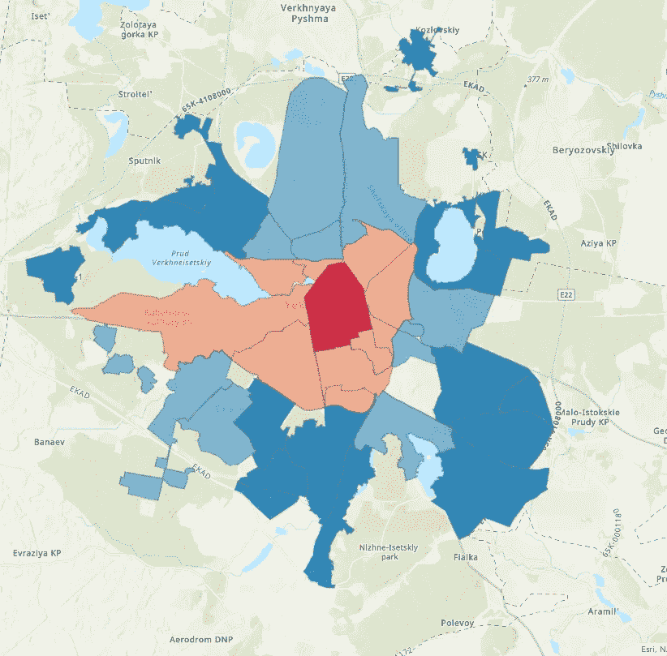

用区域系数着色。制作于 [ArcGIS Online](https://www.arcgis.com/home/index.html)

我使用了与 flat 可视化相同的想法。最“有声望”和“最昂贵”的地区是红色，最不显眼的是蓝色。色温，你记得吗？

此外，我们应该对我们的数据框架进行一些操作。

```
district_map =  {'alpha': 2, 
                 'beta': 4,
                 ...
                 'delta':3,
                 ...
                 'epsilon': 1}df.district = df.district.str.lower()
df.replace({"district": district_map}, inplace=True)
```

同样的方法将用于描述单位的内部质量。有时它需要一些修理，有时公寓很好，可以居住。在其他情况下，你应该花额外的钱让它看起来更好(换水龙头，粉刷墙壁)。也可以使用系数。

```
repair = {'A': 1,
          'B': 0.6,
          'C': 0.7,
          'D': 0.8}
df.repair.fillna('D', inplace=True)
df.replace({"repair": repair}, inplace=True)
```

对了，关于墙。当然，这也会影响到房价。现代的材料比旧的好，砖比混凝土好。木墙是一个颇具争议的时刻，也许它对乡村来说是一个不错的选择，但对城市生活来说就不那么好了。

我们使用和以前一样的方法，并对我们什么都不知道的行提出建议。是的，有时人们不提供关于他们公寓的所有信息。但是，根据历史，我们可以试着猜测墙的材料。在特定时期(例如赫鲁晓夫领导时期)——我们知道典型的建筑材料。

```
walls_map = {'brick': 1.0,
             ...
             'concrete': 0.8,
             'block': 0.8,
             ...
             'monolith': 0.9,
             'wood': 0.4}
mask = df[df['walls'].isna()][df.year >= 2010].index
df.loc[mask, 'walls'] = 'monolith'
mask = df[df['walls'].isna()][df.year >= 2000].index
df.loc[mask, 'walls'] = 'concrete'
mask = df[df['walls'].isna()][df.year >= 1990].index
df.loc[mask, 'walls'] = 'block'
mask = df[df['walls'].isna()].index
df.loc[mask, 'walls'] = 'block'df.replace({"walls": walls_map}, inplace=True)
df.drop(columns=['year'],inplace=True)
```

还有，还有关于阳台的信息。依我拙见——阳台确实是个有用的东西，所以我忍不住要考虑它。

不幸的是，有一些空值。如果一个广告的作者已经检查了关于它的信息，我们将会有更真实的信息。

嗯，如果没有信息，这将意味着“没有阳台”。

```
df.balcony.fillna(0,inplace=True)
```

之后，我们删除包含建筑年份信息的列(我们有一个很好的替代方法)。此外，我们删除了关于建筑类型的信息列，因为它有许多 NaN 值，我没有找到任何机会来填补这些空白。我们删除了所有有 NaN 的行。

```
df.drop(columns=['type_house'],inplace=True)
df = df.astype(np.float64)
df.dropna(inplace=True)
```

# 检查

所以…我们使用了一种不标准的方法，将分类值替换为数字表示。现在我们完成了数据的转换。

一部分数据被删除了，但总的来说，这是一个相当好的数据集。让我们看看发生了什么。

```
def show_correlation(df):
    sns.set(style="whitegrid")
    corr = df.corr() * 100# Select upper triangle of correlation matrix
    mask = np.zeros_like(corr, dtype=np.bool)
    mask[np.triu_indices_from(mask)] = True# Set up the matplotlib figure
    f, ax = plt.subplots(figsize=(15, 11))# Generate a custom diverging colormap
    cmap = sns.diverging_palette(220, 10)# Draw the heatmap with the mask and correct aspect ratio
    sns.heatmap(corr, mask=mask, cmap=cmap, center=0,
                linewidths=1, cbar_kws={"shrink": .7}, annot=True,
                fmt=".2f")
    plot.show()
    # df[columns] = scale(df[columns])
    return df
df1 = show_correlation(df.drop(columns=['cost']))
```

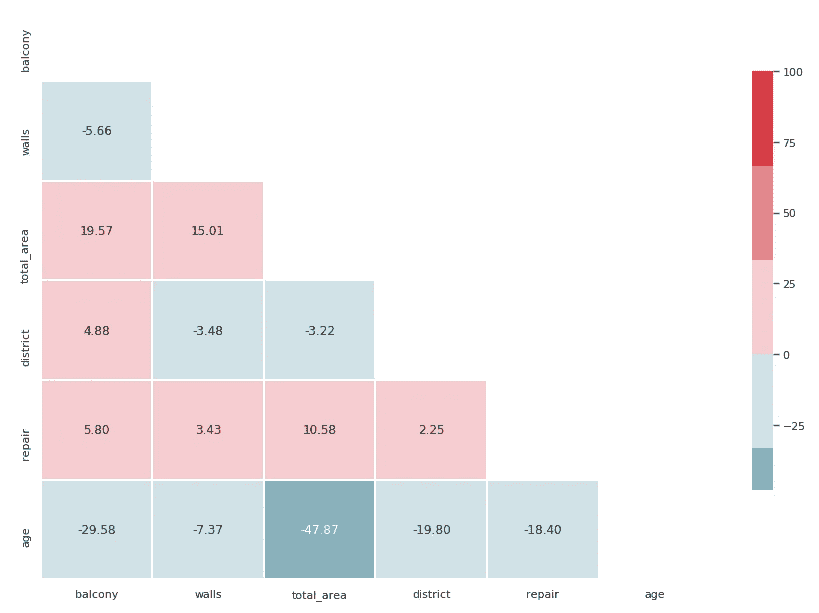

独立变量之间的相关性

嗯……变得非常有趣。

**正相关**

*总面积——阳台*。为什么不呢？如果我们的公寓大，就会有一个阳台。

**负相关**

*总面积—年龄*。越新的公寓，居住面积越大。听起来合乎逻辑，新房子比旧房子更宽敞。

*年龄—阳台*。越老的公寓阳台越少。看起来像是另一个变量的相关性。也许这是一个三角形*年龄-阳台面积*其中一个变量对另一个变量有隐含的影响。暂时搁置一下。

*年龄—地区*。旧公寓很可能会被安置在更有声望的地区。会不会和市中心附近价格比较高有关？

此外，我们可以看到因变量和自变量之间的相关性

```
plt.figure(figsize=(6,6))
corr = df.corr()*100.0
sns.heatmap(corr[['cost']],
            cmap= sns.diverging_palette(220, 10),
            center=0,
            linewidths=1, cbar_kws={"shrink": .7}, annot=True,
            fmt=".2f")
```

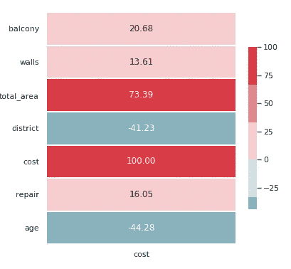

与因变量的相关性

开始了…

公寓面积和价格之间有很强的相关性。如果你想有一个更大的住处，那就需要更多的钱。

“年龄/成本”和“地区/成本”之间存在负相关。新房子里的一套公寓，比旧房子便宜。乡下的公寓更便宜。

无论如何，这看起来很清楚，可以理解，所以我决定继续下去。

# 模型

对于与预测公寓价格相关的任务，通常使用线性回归。根据前一阶段的显著相关性，我们也可以尝试使用它。它是一台适用于多种任务的重型机器。

为下一步行动准备数据

```
from sklearn.model_selection import train_test_split 
y = df.cost
X = df.drop(columns=['cost'])
X_train, X_test, y_train, y_test = train_test_split(X, y, test_size=0.2, random_state=42)
```

此外，我们还创建了一些简单的函数来预测和评估结果。让我们第一次尝试预测价格！

```
def predict(X, y_test, model):
    y = model.predict(X)
    score = round((r2_score(y_test, y) * 100), 2)
    print(f'Score on {model.__class__.__name__} is {score}')
    return scoredef train_model(X, y, regressor):
    model = regressor.fit(X, y)
    return modelfrom sklearn.linear_model import LinearRegression
regressor = LinearRegression()
model = train_model(X_train, y_train, regressor)
predict(X_test, y_test, model)
```

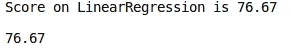

预测的结果

嗯……76.67%的准确率。这个数字大不大？按照我的观点，还不错。此外，这是一个很好的起点。当然不是很理想，有改进的潜力。

同时——我们试图只预测一部分数据。对其他数据应用同样的策略怎么样？是的，交叉验证的时间到了。

```
def do_cross_validation(X, y, model):
    from sklearn.model_selection import KFold, cross_val_score
    regressor_name = model.__class__.__name__
    fold = KFold(n_splits=10, shuffle=True, random_state=0)
    scores_on_this_split = cross_val_score(estimator=model, X=X,
                                           y=y, cv=fold, scoring='r2')
    scores_on_this_split = np.round(scores_on_this_split * 100, 2)mean_accuracy = scores_on_this_split.mean()
    print(f'Crossvaladaion accuracy on {model.__class__.__name__} is {mean_accuracy}')
    return mean_accuracy
do_cross_validation(X, y, model)
```

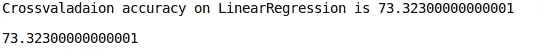

交叉验证的结果

现在我们取另一个结果。73 小于 76。但是，在我们有更好的候选人之前，它也是一个很好的候选人。此外，这意味着线性回归在我们的数据集上非常稳定。

最后一步的时间到了。我们将考察线性回归的最佳特征— *可解释性*。

与更复杂的模型相反，这一系列模型有更好的理解能力。只有一些带系数的数字，你可以把你的数字放入方程，做一些简单的数学运算，得到一个结果。

让我们试着解释我们的模型

```
def estimate_model(model):

    sns.set(style="white", context="talk")
    f, ax = plot.subplots(1, 1, figsize=(10, 10), sharex=True)
    sns.barplot(x=model.coef_, y=X.columns, palette="vlag", ax=ax)
    for i, v in enumerate(model.coef_.astype(int)):
        ax.text(v + 3, i + .25, str(v), color='black')ax.set_title(f"Coefficients")
estimate_model(regressor)
```

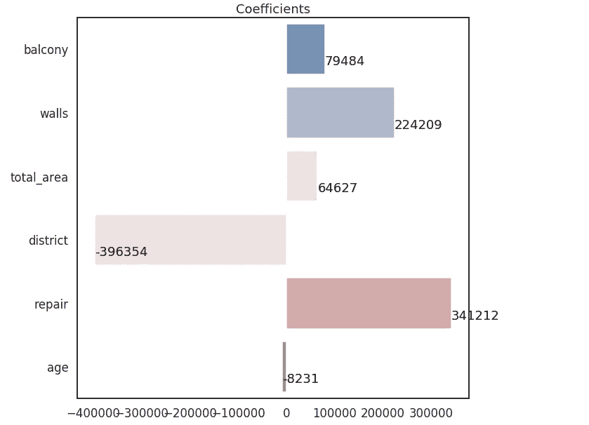

我们模型的系数。

这幅画看起来很合乎逻辑。*阳台* / *墙面* / *区域* / *维修*为**平抑价格做出**积极贡献。

**负贡献**越大，越平坦。也适用于年龄。公寓越旧，价格就越低。

所以，这是一次迷人的旅行。
我们从零开始，基于人类的角度，采用不典型的方法进行数据转换(用数字代替虚拟变量)，检查变量以及它们之间的关系。之后，我们构建简单的模型，使用交叉验证来测试它。正如蛋糕上的樱桃——看看模型的内部，是什么让我们对自己的方式充满信心。

但是。这不是我们旅程的终点，只是一次休息。我们将来会尝试改变我们的模型，也许(只是也许)它会提高预测的准确性。

**感谢阅读**