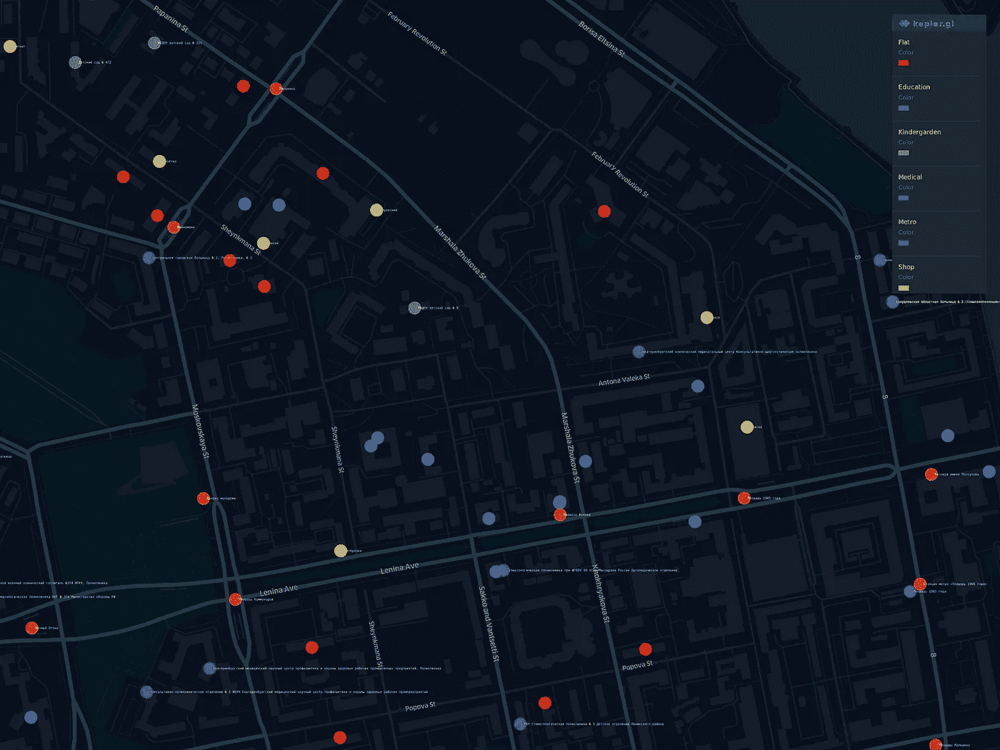
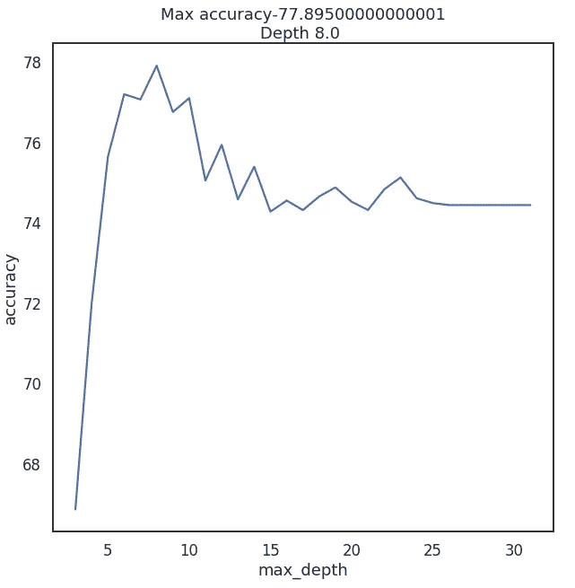

# 为您的平板搜索提供机器学习

> 原文：<https://medium.com/analytics-vidhya/machine-learning-for-your-flat-hunt-part-2-320d98e5e874?source=collection_archive---------22----------------------->

## 第 2 部分:更多的数据，新的希望和更好的模型

你有没有想过最近的地铁对你公寓价格的影响？你身边的几家幼儿园呢？你准备好投入地理空间数据的世界了吗？


这个世界提供了如此多的信息…

# 这是怎么回事？

在[上一部分](/@vee.sot/machine-learning-for-your-flat-hunt-part-1-e054e506a4b2)中，我们有一些数据，并试图在叶卡捷琳堡的房地产市场上找到一个足够好的报价。

我们已经达到了交叉验证准确率接近 73%的程度。然而，每个硬币都有两面。73%的准确率是 27%的误差。我们怎样才能减少这种情况？下一步是什么？

# 空间数据将会有所帮助。

从环境中获取更多数据呢？我们可以使用地理环境和一些空间数据。

很少有人一辈子都呆在家里。有时他们去商店，把孩子从托儿所带走。他们的孩子长大了，去上学，上大学等等。或者…有时他们需要医疗帮助，他们正在寻找医院。一个非常重要的事情是公共交通，至少地铁。换句话说，那里附近有很多东西，对定价有影响。让我给你看一份清单。

*   公共交通站
*   商店
*   幼儿园
*   医院/医疗机构
*   教育机构
*   麦德龙

从[不同的来源](https://bst.digital/)获得信息后，我做了一个可视化。
地图上有一些点是叶卡捷琳堡最负盛名(也是最昂贵)的地区。



*   **R** ed 点—平面
*   **O** 范围—停止
*   你好——商店
*   **G** 绿色——幼儿园
*   **B** lue —教育
*   **I** ndigo —医疗
*   **V** iolet — Metro

是的，彩虹在这里。

现在，我们有了一个以地理数据为界的数据集，其中包含一些新信息

```
df.head(10)
```

```
df.describe()
```

# 一个很好的旧模型

做与上一部分相同的动作

```
y = df.cost
X = df.drop(columns=['cost'])
X_train, X_test, y_train, y_test = train_test_split(X, y, test_size=0.2,random_state=42)
```

然后，我们再次训练我们的模型，交叉手指，并尝试再次预测公寓的价格。

```
from sklearn.linear_model import LinearRegression
regressor = LinearRegression()
model =   regressor.fit(X_train, y_train)
do_cross_validation(X_test, y_test, model)
```


嗯……看起来比之前 73%准确率的结果要好。试着解释一下怎么样？我们以前的模型有足够好的能力来解释统一价格。

```
estimate_model(regressor)
```


哎呀…我们的新模型与旧功能配合得很好，但新功能的行为似乎很奇怪。

例如，教育或医疗机构数量的增加会导致公寓价格的下降。因此，公寓附近的停车站数量是相同的情况，它应该对公寓价格有额外的贡献。

新模型更好，但它不符合现实生活。

# 有东西坏了

让我们想想发生了什么。在 ML 来到我们的生活之前，线性回归就已经被发明了。这种方法的关键特征是**线性度**。

如果你的数据符合“X 越大，Y 也越大”的观点，线性回归就是一个好工具。但是地理数据比我们预期的更复杂。例如:

*   当你的公寓附近有一个公共汽车站时，这是很好的，但是如果公共汽车站的数量在 5 个左右，这将导致一条嘈杂的街道。
*   如果有一所大学，它应该对价格有很好的影响，同时，如果你不是一个非常善于交际的人，你家附近的一群学生会不太高兴。
*   你家附近的地铁很好，但是如果你住的地方离最近的地铁站步行一个小时，那就没什么意义了。

如你所见，这取决于许多因素和观点。我们的地理数据的性质不是线性的，我们无法推断它们的影响。

同时，为什么具有奇异系数的模型比前一个模型效果更好？

```
plot.figure(figsize=(10,10))
corr = df.corr()*100.0
sns.heatmap(corr[['cost']],
            cmap= sns.diverging_palette(220, 10),
            center=0,
            linewidths=1, cbar_kws={"shrink": .7}, annot=True,
            fmt=".2f")
```


与楼价的相关性

看起来很有趣。我们在前面的部分已经看到了类似的图片。
到最近地铁的距离和价格之间存在负相关关系。而且这个因素对精度的影响比一些老的更大。

同时，我们的模型工作混乱，看不到聚合数据和目标变量之间的依赖关系。这种简单性有其自身的局限性。

# 国王死了，国王万岁！

如果线性回归不适合我们的情况，还有什么更好的呢？如果我们的模型能“更聪明”就好了…

幸运的是，我们有一个更好的方法，因为它更灵活，并且有一个内置的机制“*做如果这样做，否则做那个*”。**决策树**出现。

```
from sklearn.tree import DecisionTreeRegressor
```

决策树可以有不同的深度，通常，当深度为 3 或更大时，它工作得很好。最大深度参数对结果影响最大。让我们做一些代码来检查深度从 3 到 32

```
data = [] 
for x in range(3,32):
    regressor = DecisionTreeRegressor(max_depth=x,random_state=42)
    model =   regressor.fit(X_train, y_train)
    accuracy = do_cross_validation(X, y, model)
    data.append({'max_depth':x,'accuracy':accuracy})data = pd.DataFrame(data)
ax = sns.lineplot(x="max_depth", y="accuracy", data=data)
max_result = data.loc[data['accuracy'].idxmax()]
ax.set_title(f'Max accuracy-{max_result.accuracy}\nDepth {max_result.max_depth} ')
```



“更多”并不意味着“最好”

嗯……对于一棵树的 *max_depth* 等于 8 的情况，精度在 77 以上。

如果我们不考虑这种方法的局限性，这将是一个很好的成就。让我们看看它如何与 *max_depht=2* 一起工作

```
from IPython.core.display import Image, SVG
from sklearn.tree import  export_graphviz
from graphviz import Source
2_level_regressor = DecisionTreeRegressor(max_depth=2, random_state=42)
model = 2_level_regressor.fit(X_train, y_train)
graph = Source(export_graphviz(model, out_file=None
   , feature_names=X.columns
   , filled = True))
SVG(graph.pipe(format='svg'))
```


在这张图上，我们可以看到只有 4 种预测变量。当您使用*决策树回归器时，*的工作方式与*线性回归*不同。只是不同而已。它不使用因子(系数)的贡献，而*决策树回归器*使用“可能性”。一套公寓的价格将与预测的最相似的公寓价格相同。

我们可以用那棵树来预测我们的价格。

```
y = two_level_regressor.predict(X_test)
errors = pd.DataFrame(data=y,columns=['errors'])
f, ax = plot.subplots(figsize=(12, 12))
sns.countplot(x="errors", data=errors)
```


你的每一个预测都会与这些值中的一个相匹配。当我们使用 *max_depth=8* 时，我们预计 2000 多套公寓不会有超过 256 种不同的变体。也许这对于分类问题是好的，但是对于我们的情况来说不够灵活。

# 群体的智慧

如果你试图预测世界杯决赛的比分，很有可能你会弄错。同时，如果你询问所有裁判对冠军的看法，你会有更好的机会猜测。如果你问独立专家、培训师、法官，然后用答案变魔术——你的机会会大大增加。看起来像是总统选举。

几棵“原始”树的组合比它们中的每一棵能提供更多。而 *RandomForestRegressor* 是我们将要使用的工具

首先，让我们考虑模型中的基本参数— *max_depth* 、 *max_features* 和一个*数量的树*。

## 树的数量

依照[随机森林中有多少棵树？](https://www.researchgate.net/publication/230766603_How_Many_Trees_in_a_Random_Forest)“最好的选择会是 128 棵树。进一步增加树的数量不会导致精度的显著提高，但是会增加训练的时间。

## 最大特征数量

现在我们的模型有 12 个特征。一半是与地势平坦有关的老建筑，另一半与地理环境有关。所以我决定给他们每个人一个机会。假设一棵树有 6 个特征。

## 树的最大深度

对于这个参数，我们可以分析一条学习曲线。

```
from sklearn.ensemble import RandomForestRegressor
data = []
for x in range(1,32):
    regressor = RandomForestRegressor(random_state=42, max_depth=x,
                                      n_estimators=128,max_features=6)
    model =   regressor.fit(X_train, y_train)
    accuracy = do_cross_validation(X, y, model)
    data.append({'max_depth':x,'accuracy':accuracy})
data = pd.DataFrame(data)
f, ax = plot.subplots(figsize=(10, 10))
sns.lineplot(x="max_depth", y="accuracy", data=data)
max_result = data.loc[data['accuracy'].idxmax()]ax.set_title(f'Max accuracy-{max_result.accuracy}\nDepth {max_result.max_depth} ')
```


86%的准确率是惊人的

哇……超过 86%的准确率，而一个设计树上只有 77%。它看起来很神奇，不是吗？

# 结论

嗯……现在我们在预测方面有了比以前更好的结果，86%接近终点线。检查的最后一步——让我们看看特征的重要性。地理数据对我们的模型有什么好处吗？

```
feat_importances = pd.Series(model.feature_importances_, index=X.columns)
feat_importances.nlargest(5).plot(kind='barh')
```


五大最重要的功能

一些旧的特征仍然对结果有影响。同时，离最近的地铁和幼儿园的距离也受到了影响。这听起来很合理。

毫无疑问，地理数据帮助我们改进了模型。

# 附言

我们的旅程还没有结束。86%的准确率对于真实数据来说是一个惊人的结果。与此同时，在我们预期的 14%和 10%的平均误差之间有一个小的差距。在我们故事的下一章，我们将努力克服这个障碍，或者至少减少这个错误。

[这里的](https://github.com/VeeSot/flats/blob/master/part2.ipynb)是 IPython 笔记本