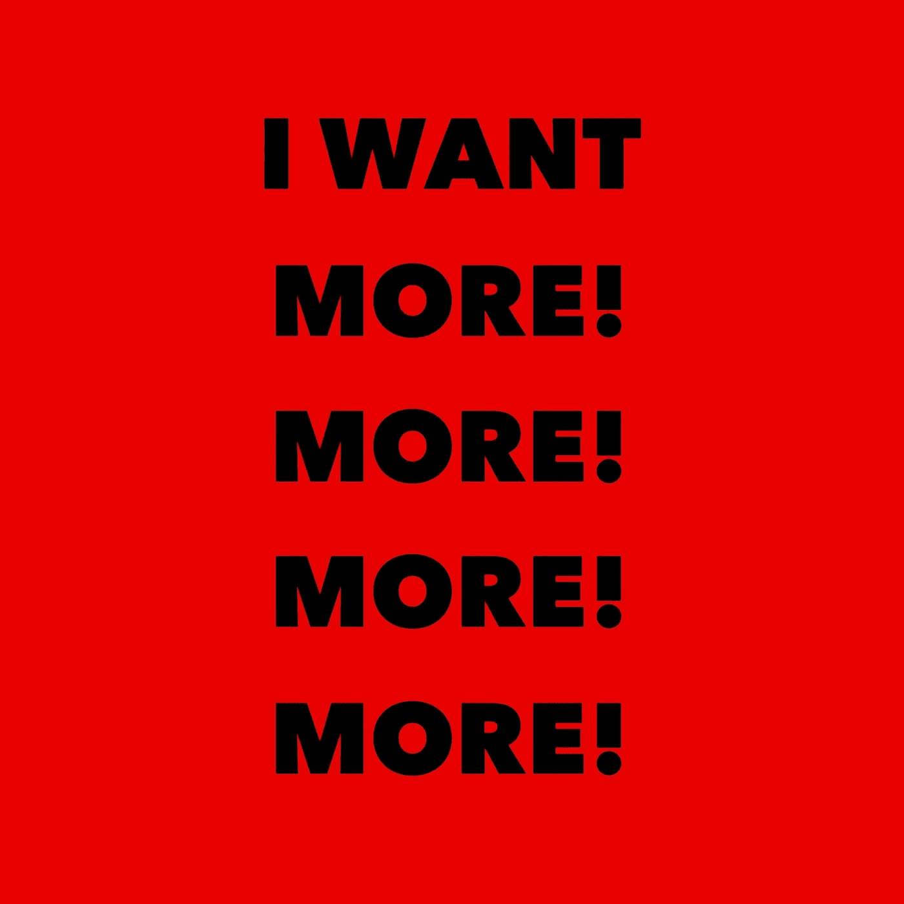
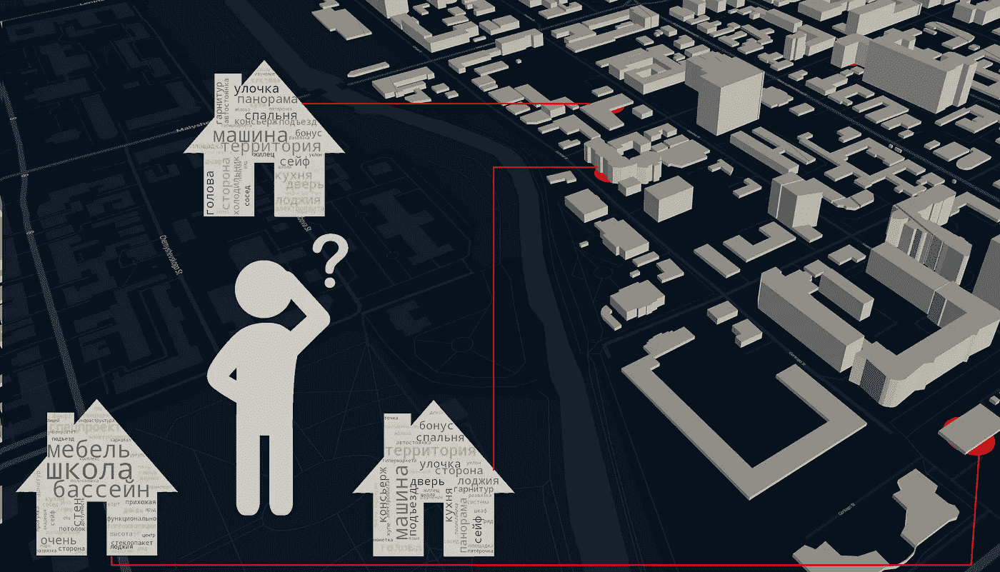
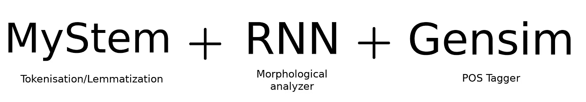
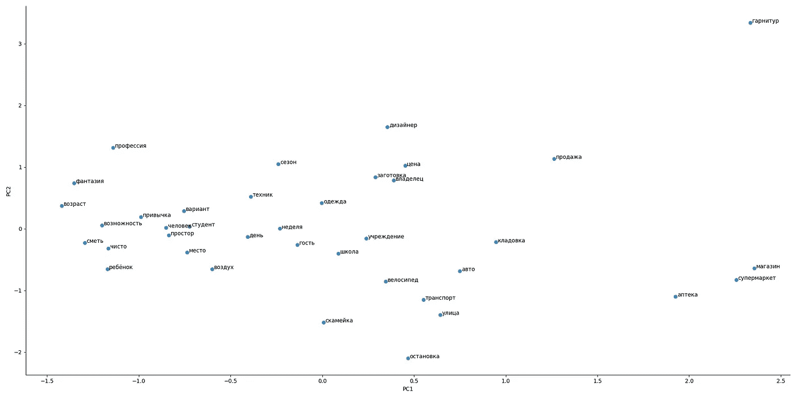
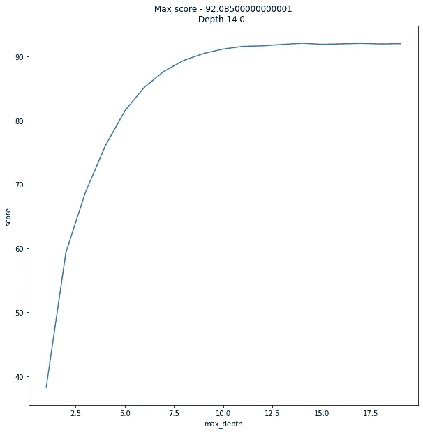
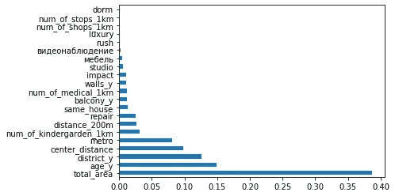
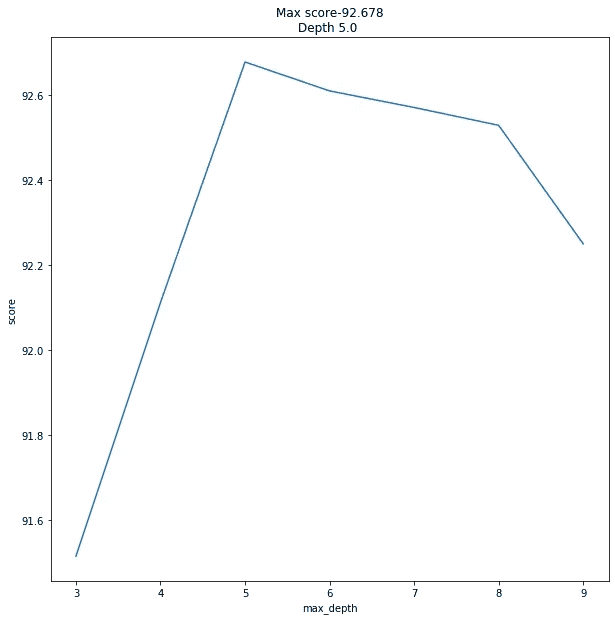

# 为你的平板搜索机器学习。

> 原文：<https://medium.com/analytics-vidhya/machine-learning-for-your-flat-hunt-part-3-the-final-push-1f19f0e171fd?source=collection_archive---------11----------------------->

## 第三部分:最后一推。

由[波士顿环球报](https://www.bostonglobe.com/metro/2019/08/30/soul-crushing-demoralizing-tortured-odyssey-find-apartment-boston/8qIfX2eU69nbnopwszemNK/story.html)的[杜根·阿内特](https://www3.bostonglobe.com/staff/arnett/?p1=Article_Byline&arc404=true)拍摄

你还在找新公寓吗？准备好做最后一次尝试了吗？如果是这样——跟我来，我会告诉你如何到达终点。

# 简短介绍和参考资料

这是本课程的第三部分，旨在解释如何在房地产市场上找到最佳公寓。简单地说，主旨是——在叶卡捷琳堡的公寓中找到最好的报价，我以前就住在那里。但我认为同样的想法可以考虑在另一个城市的背景下。

如果你没有读过前面的部分，读一读它们[第一部分](/analytics-vidhya/machine-learning-for-your-flat-hunt-part-1-e054e506a4b2)和[第二部分](/analytics-vidhya/machine-learning-for-your-flat-hunt-part-2-320d98e5e874)会是个好主意。另外，你可以在那里找到 Ipython 笔记本。

这一部分必须比前几部短得多，但问题在于细节。

# 结果

作为所有操作的结果，我们得到了一个 ML 模型(*随机森林*)，它工作得非常好。没有我们预期的那么好(分数在 87%以上)，但是对于真实数据来说，已经足够好了。老实说，关于结果的想法对我有一种奇怪的影响。我想要更多的分数，期望的结果和真实的预测之间的差距小于 3%。

乐观与贪婪交织在一起，冲昏了我的头脑

众所周知，如果你想改善某件事，可能会有相反的方法。通常，这看起来像是在以下两者之间进行选择:

*   进化与革命
*   数量与质量
*   粗放与集约

由于缺乏中途换马的意愿，我决定使用 RF(随机森林)并添加一些新功能。

这似乎是一个想法，“我们只是需要更多的功能”，使分数更好。至少我是这么想的。

# Per aspera ad astra(历尽艰辛到达星星)

让我们试着想想相关的特征，这些特征会影响公寓的价格。有公寓特征，如阳台或房屋年龄，还有地理相关特征，如到最近的地铁/公交车站的距离。对于 RF，同样的方法下一步会是什么？

## 想法一。到中心的距离。

我们可以重用经度和纬度(平面坐标)。根据这一信息，我们可以计算出到市中心的距离。同样的想法也适用于地区，公寓离市中心越远，价格就应该越便宜。你猜怎么着……它成功了！不怎么样(+ **1%** 的分数)，但是聊胜于无。只有一个问题，同样的想法对非常远的地区没有意义。如果你住在城市之外，你会知道还有其他的价格规则。
如果我们推断这种方法，就不容易解释。

## 想法二。靠近地铁。

地铁对价格有重大影响。尤其是当它位于*步行距离*的区域时。但是“*步行距离*的含义不清楚。每个人可以用不同的方式解释这个参数。我可以手动设置限制，但分数的增加不会同时超过 **0.2%**
，这与之前的想法不一致。附近没有地铁。

## 想法三。市场的理性与均衡。

市场的均衡是需求和供给的结合。当然，市场可能被夸大了。但总的来说，这个想法很管用。至少对于一个正在建造的房子来说。

换句话说，竞争者越多，人们买你房子的可能性就越小。这就产生了一个假设——“如果我周围有其他公寓，我需要降低价格来吸引更多的买家”。
这听起来是一个非常合乎逻辑的结论，不是吗？

所以我计算了他们附近相似的公寓，在同一栋房子里，半径 200 米内。这些措施是为销售日期制定的。你希望得到哪个结果？交叉验证只有 **0.1%** 。悲伤却真实。

# 反思

> 放弃是……有时后退一步是前进两步。—一个有智慧的人。

好吧，正面攻击没用。让我们把这当作一种情况。

假设你是一个想在远离喧嚣城市的河边买套房子的人。你有三种不同的广告，彼此相似，价格相同(或多或少)。描述扁平化的正式指标不能提供任何关于环境的信息，它们只是屏幕上的指标。但是有一件重要的事情。

对公寓的描述是一个极好的机会。

一个简单的描述**可以提供你需要的一切。它能告诉你一个关于公寓的故事，关于邻居的故事，以及与特定居住地相关的惊人机遇。有时一个描述**比无聊的数字更有意义。****

但在现实生活中与我们的预期略有不同。让我告诉你什么可行/不可行，为什么。

## 什么不起作用，为什么？

**期望**——“哇！我可以试着对文本进行分类，找出“好”和“坏”的降半音。我将使用通常用于情感分析的相同方法”。
**真人**——“不，你不会这么做的。人们对他们的公寓没有什么不好的评价。可能存在掩盖真实情况或撒谎的情况”

**期望**——“好的。然后我可以试着找到模式，找到公寓的目标受众。例如，可能是老年人或学生”。
**现实**——“不，你不会这么做的。有时一个广告提到不同的年龄和社会群体，这只是营销”

## 什么可能有效，为什么。

**部分关键词** —有词指出在具体的事物或时刻与扁平有关。例如，当它是一个工作室时，价格会更低。一般来说，动词是没用的，但是名词和副词可以给出更多的语境。
**信息的替代来源**——使用描述来填充空值或 NaN 值更正确。有时描述比广告的形式特征包含更多的信息。我怀疑这是基于人类的懒惰，以填补不必要的领域，如“阳台”。将一切都放在描述中似乎是一个更好的主意

## 获取信息

我跳过了对典型的记号化/词汇化/词干化过程的描述。此外，我相信有作者能够比我更好地描述它。

尽管我认为应该提到用于提取特征的工具集。简而言之，它看起来像。

分隔->按词性匹配

在对广告文本进行预处理后，我得到了一组这样的俄语单词。

原文放置[https://pastebin.com/Pxh8zVe3](https://pastebin.com/Pxh8zVe3)

我尝试使用 Word2Vec 中的方法，但没有专门针对公寓和广告的字典，所以总体情况看起来很奇怪

单词之间的距离与期望不符

因此，我尽可能保持简单，并决定为数据集创建几个新列

# 少说话，多行动。

是时候动手干点实事了。找出新的特性。几个重要因素被对价格的影响分开了。

## 积极影响

*   家具——有时人们可以留下床、洗衣机等等。
*   豪华公寓——有豪华设施的公寓，比如按摩浴缸，或者是独一无二的内部装修
*   视频控制——它让人们感到安全，通常它认为这是一种优势

## 负面影响

*   宿舍——是的，有时是宿舍里的一套公寓。不太受欢迎，但比普通公寓便宜很多
*   匆忙——当人们急于卖掉他们的公寓时，通常他们准备降价。
*   工作室——正如我之前说过的——它们比他们的公寓——类似物更便宜。

让我们收集一些普遍的东西

## 总体影响

它只是消极和积极特征的结合。最初，对于每个平面，它等于 0。例如，具有视频控制的工作室仍将具有等于 0 的一般影响(1[正]–1[负]=0)

好的，我们有一个数据，新的特征和旧的目标，预测的平均误差为 10%。像以前一样做一些典型的操作

# 旧方法(功能的大量增长)

我们将在旧想法的基础上制作一个新模型

结果有点…出乎意料。

92%是压倒性的结果

我的意思是，说我很震惊是一种保守的说法。但是为什么效果这么好呢？让我们看一看。

我们模型所有特征重要性

重要性并没有给出关于特征贡献的信息，它只是显示了活动模型如何使用一个或另一个特征。但是对于目前的情况来说，它看起来信息量很大。一些新功能比以前的更重要，其他的几乎没用。

# 新方法(数据密集型工作)

嗯……越过了终点线，结果达到了。还能更好吗？
简短回答—“*是的，可能是*”

首先，我们可以减少树的深度。这也将减少训练和预测的时间。
其次，我们可以稍微增加一点预测得分。

对于这两个时刻，我们都将使用 **XGBoost** 。有时人们更喜欢使用其他助推器，如 **LightGBM** 或 **CatBoost** ，但我的拙见是——当你有大量数据时，第一个已经足够好了，如果你有分类变量，第二个会更好。另外，XGBoost 似乎更快了

结果比上一个好。当然是随机森林和 XGBoost 的不大区别。每一个都可以作为解决我们预测问题的好工具。由你来决定。

# 结论。

结果达到了吗？肯定是的。

该解决方案在那里可用，任何人都可以免费使用。
作为原型，它把[放在了](https://sotnikov.io/flaty/prediction)那里。

如果你对用这种方法评估公寓感兴趣，请不要犹豫，与我联系。

**感谢您的阅读。**