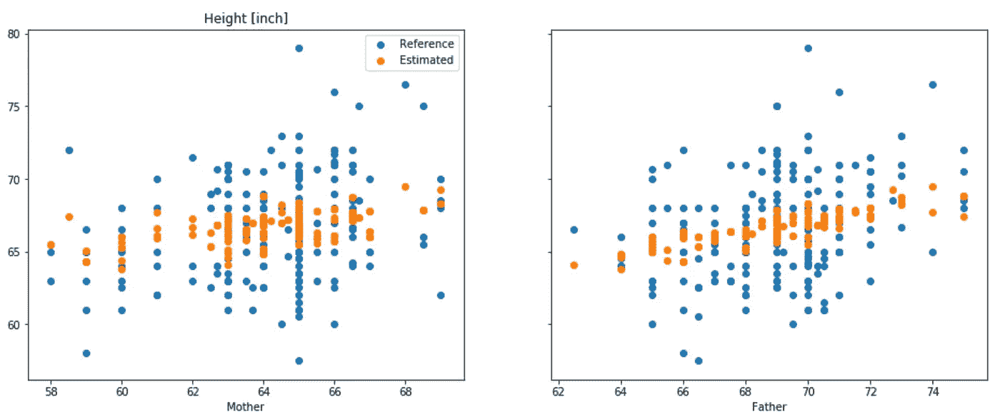
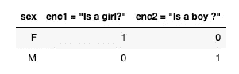
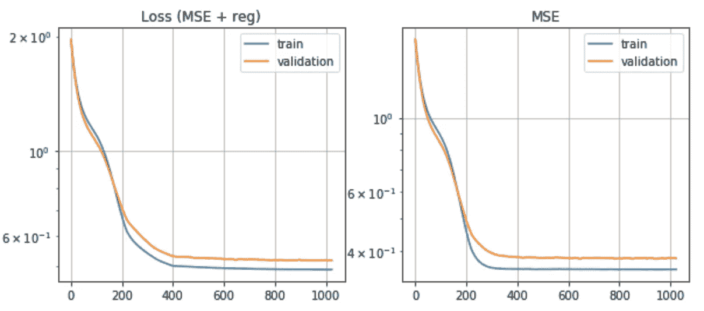
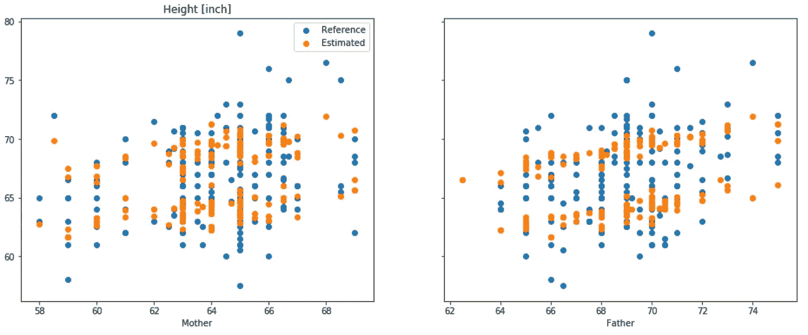
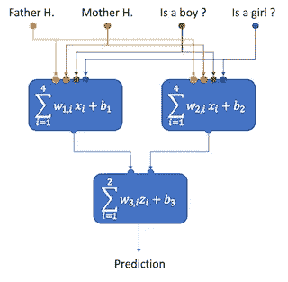
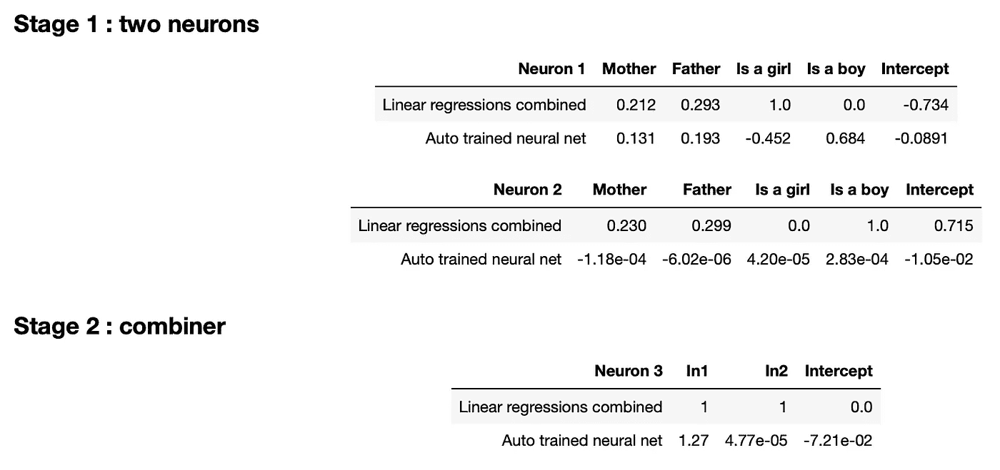

# 从特征工程到机器学习中的特征学习

> 原文：<https://medium.com/analytics-vidhya/machine-learning-from-feature-engineering-to-feature-learning-1d81fbf2dc23?source=collection_archive---------6----------------------->

机器学习包括从数据获取到可视化的许多方面。在本文中，我们将通过一个基于 Galton 数据集的简单例子来解释其中的两个例子，即**特征学习**和**特征工程**。

高尔顿是线性回归的创始人之一。他在 1886 年发表了一篇题为“[回归世袭身份的平庸](http://galton.org/essays/1880-1889/galton-1886-jaigi-regression-stature.pdf)”的论文。他接着质疑为什么父母身高和孩子身高之间似乎没有什么联系。用他自己的话说:

> “从这些实验中似乎可以看出，后代在大小上并不倾向于与他们的父母种子相似，而是总是比他们更平庸——如果父母很大，那么比父母更小；比父母大，如果父母很小的话。”

高尔顿遗产的一部分是人类身高与父母身高的[数据集，我们将在本文中使用该数据集使用 Python 通过线性回归来预测儿童身高。](https://dataverse.harvard.edu/dataset.xhtml?persistentId=doi:10.7910/DVN/T0HSJ1)

我们将进行三个实验:

*   使用 [Scikit Learn](https://scikit-learn.org) 对父母身高进行初始线性回归
*   使用一些简单的特征引擎来说明孩子的性别
*   使用 [Keras](https://keras.io) 中的两层系统让神经网络学习该特性

你会在这个笔记本里找到这篇文章的**完整代码****:**[**HTML**](https://tonio73.github.io/data-science/linear/LinearRegressionFeatureEngineering-Keras.html)**/**[**Jupyter**](https://nbviewer.jupyter.org/urls/tonio73.github.io/data-science/linear/LinearRegressionFeatureEngineering-Keras.ipynb)

# 双亲的线性回归

第一步，让我们执行线性回归“开箱即用”,将父母的身高作为输入，将孩子的身高作为预测变量。

预期之后与神经网络的比较，数据在回归之前被标准化:对于每个特征，均值被移除并且方差被缩放为等于 1。

使用 [SKLearn 的](https://scikit-learn.org)回归的 Python 代码摘录:

```
trainX_scaled = scalerX.transform(df_train[['Mother', 'Father']])
trainY_scaled = scalerY.transform(df_train[['Height']])model1 = linear_model.LinearRegression()model1.fit(trainX_scaled, trainY_scaled)
b1 = model1.intercept_
w1 = model1.coef_.reshape(-1)
```

结果:截距 b1 = 0.0，权重 w1 = (0.184，0.217)



测试集的初始回归预测

双变量回归绘制了一个最佳计划，该计划似乎不太符合要预测的标签:蓝色的参考点分布在橙色的预测周围。

关于线性回归的更多解释，请参见二元函数逼近笔记本: [HTML](https://tonio73.github.io/data-science/linear/LinearRegressionBivariate.html) / [Jupyter](https://nbviewer.jupyter.org/urls/tonio73.github.io/data-science/linear/LinearRegressionBivariate.ipynb)

# 考虑性别因素的线性回归模型

我们可能有这样的直觉，模型没有考虑到一个主要信息:性别分布依赖于孩子的性别。

因此，让我们做一些**功能工程**并创建两个模型:

*   基于训练数据集的女孩的模型，将预测女孩的身高
*   男孩的相似模型

```
trainX_girls_scaled = scalerX.transform(df_train[['Mother', 'Father']][girls_train])
trainY_girls_scaled = scalerY.transform(df_train[['Height']][girls_train])model2_girl = linear_model.LinearRegression()
model2_girl.fit(trainX_girls_scaled, trainY_girls_scaled) trainX_boys_scaled = scalerX.transform(df_train[['Mother', 'Father']][boys_train])
trainY_boys_scaled = scalerY.transform(df_train[['Height']][boys_train])model2_boy   = linear_model.LinearRegression()
model2_boy.fit(trainX_boys_scaled, trainY_boys_scaled)
```

然后，根据要预测身高的儿童的性别，将这些模型应用于测试数据集。

结果:

*   试衣女生，截距= -0.773，权重= 0.207，0.283
*   试衣男孩，截距= 0.710，体重= 0.209，0.268
*   测试数据集的均方误差= 5.123

截距不再为 0，因为归一化是在混合女孩和男孩的完整数据集上执行的。

均方差减少了 60%，证实了我们对模型组合的直觉。

# 使用神经网络的特征学习

机器有足够的智能来猜测这个结果吗？那就是学习结合父母身高和孩子性别的特征？

我们现在切换到神经网络，因此切换到基于梯度的优化或“机器学习”。

我们将使用 [Keras](https://keras.io/) 。它为 [TensorFlow](https://www.tensorflow.org/) 和其他机器学习框架提供了一个标准且简化的编程接口。

在我们的网络中，使用了两层:

*   初始层由两个神经元组成，每个神经元将四个特征作为输入:母亲和父亲的身高，使用“一键编码”进行性别编码
*   第二层是结合前面神经元的两个输出，以提供最终的预测

```
model = keras.models.Sequential([
    keras.layers.Dense(2, activation=’linear’, 
        input_shape=[4],
        kernel_regularizer=keras.regularizers.l2(0.0001)),
    keras.layers.Dense(1, activation=’linear’, 
        input_shape=[4],
        kernel_regularizer=keras.regularizers.l2(0.0001))
])
model.compile(optimizer=’adam’,
    loss=keras.losses.mean_squared_error,
    metrics=[‘mse’])
```

一位热码方案用于对两位(两个值)的性别进行编码，如下表所示。在性别和预测之间获得线性关系需要一些特征工程。



一次性性别编码

所有神经元都表现为线性回归的预测函数:它们对输入进行加权求和，并添加一个截距。

因此，系数的数量为:

*   第一层为 2 * 4 +2
*   第二层的 2 + 1

与先前实验的另一个不同之处是，在最小化成本函数(均方误差)时迭代地识别系数，最小化是基于该函数的梯度的计算。



梯度下降损失函数和均方误差

有关 Keras 梯度下降的更多解释，请参见 Keras 二元函数近似笔记本: [HTML](https://tonio73.github.io/data-science/linear/LinearRegressionBivariate-Keras.html) / [Jupyter](https://nbviewer.jupyter.org/urls/tonio73.github.io/data-science/linear/LinearRegressionBivariate-Keras.ipynb)

该实验的均方误差为 5.167，与基于独立回归的模型对女孩和男孩的均方误差非常接近。



使用 2 层神经网络测量和预测的身高作为每个父母身高的函数

**机器已经能够学习这个特性了！**

是不是意味着机器已经有意检测到了性别和身高的关系？

与我们预期的不完全一样，我们将在下一节展示。

# 两种“性别化”模式的比较

使用两个替代线性回归模型的预测也可以实现为具有两层的神经网络:

*   第一层有两个神经元，每个线性回归模型一个。只有一个模型将“激活”，即基于性别产生非空输出(一个热编码)
*   第二层是层 1 的两个输出的简单加法器

使用这种拓扑，我们现在可以使用测试样本的第一个子样本作为示例(以及一个示例优化运行)来比较这两个解决方案。



组合回归模型与两层神经网络的系数比较

从上表可以看出，两个网络的系数在大小和符号上有很大不同。对于自动训练的网络，神经元 2 的系数非常低，它作为对神经元 1 的校正。

理论上说，对于线性回归，在这种情况下，回归最优是唯一的。显然，在神经网络的情况下，有几个最佳值。

# 结论

从一个简单的实验开始，我们采取了几个工程步骤来改进它:

*   特征工程对一次性编码和两个线性回归模型的组合
*   使用神经网络和梯度下降优化的特征学习来学习性别和身高之间的关系

如果你喜欢这篇文章，请访问我的 Github 知识库，那里有更多关于“[逐步学习数据科学](https://tonio73.github.io/data-science/)”的笔记本。

并在项目上加一颗星，提高知名度。