# 机器学习和启发式方法来推荐报价

> 原文：<https://medium.com/analytics-vidhya/machine-learning-heuristic-approaches-to-recommend-offers-3f963543e12e?source=collection_archive---------9----------------------->


献给所有咖啡爱好者和数据分析爱好者！(由 https://time.com/提供)

# **简介**

作为一个咖啡爱好者，我总是觉得在下次购买咖啡时查看星巴克手机应用程序的优惠和折扣很有趣。当我看到一个围绕模拟数据集构建的顶点项目时，这非常有趣，模拟数据集包含交易、人口统计信息和模仿星巴克奖励移动应用程序上的客户行为的优惠。我决定接受挑战，用我的方式分析提供的数据集。

# 项目概述

把顾客吸引到咖啡店是一门艺术，需要大量的研究和营销技巧。当我们寻找清晨的那杯咖啡时，脑海中会浮现出许多品牌名称。在我看来，星巴克无疑在这场竞赛中处于领先地位。当我们想以更低的价格购买任何高质量的产品时，像折扣和买一送一(bogo)这样的优惠是一笔财富。当然，像星巴克这样的公司必须分析客户与他们的奖励应用程序的交互，才能继续推荐如此棒的优惠，并将这些巨大的咖啡粉丝吸引回他们的商店。

该项目旨在分析包含交易、人口统计信息和优惠的模拟数据集，模拟星巴克奖励移动应用程序上的客户行为。在查询数据集以获得洞察力之前，我们希望组合这些数据集中的信息，然后对其应用数据分析和模型构建技术。

这个项目的数据包含在三个 JSON 文件中，

1.  **portfolio.json** —包含报价 id 和关于每个报价的元数据(持续时间、类型等)。)

```
***Columns***:
 **id** (string) — offer id
 **offer_type** (string) — type of offer i.e. BOGO, discount, informational
 **difficulty** (int) — minimum required spend to complete an offer
 **reward** (int) — reward given for completing an offer
 **duration** (int) — time for offer to be open, in days
 **channels** (list of strings)
***Rows***: 10
```

2. **profile.json** —每个客户的人口统计数据

```
***Columns***:
 **age** (int) — age of the customer
 **became_member_on** (int) — date when customer created an app account
 **gender** (string) — gender of the customer (note some entries contain ‘O’ for other rather than M or F)
 **id** (string) — customer id
 **income** (float) — customer’s income
***Rows***: 17,000
```

3. **transcript.json** —记录交易、收到的报价、查看的报价和完成的报价

```
***Columns***:
 **event** (string) — record description (ie transaction, offer received, offer viewed, etc.)
 **person** (string) — customer id
 **time** (int) — time in hours since start of test. The data begins at time t=0
 **value** (dictionary of strings) — either an offer id or transaction amount depending on the record
***Rows***: 306,534
```

# 问题描述

我们可以使用两种方法来分析提供的数据集。

1.  一种机器学习方法，使用受之前发出的优惠影响的客户记录来建立预测模型。部署此模型以预测不在培训数据中的新客户记录的报价。
2.  基于年龄、性别和收入的第一个交易数据集子集的启发式方法。搜索并确定对该特定客户群有影响的优惠，最后挑选两个主要优惠重新发送给该客户群中的每个人。这就像是基于多数人投票的优惠推荐，影响了这个群体中的许多客户。

> 注意:使用该应用程序的人可能会在没有收到报价或看到报价的情况下通过该应用程序进行购买。通过查看已完成的报价，并确保客户在完成报价之前查看了报价，可以发现有影响力的报价。抄本数据集中的“事件”和“时间”列可用于为每个客户找到这种有影响力的报价。

当使用机器学习建模方法时，数据的质量在训练模型时确实很重要。因此，我们不能总是期望建立一个可以精确预测新纪录的稳健模型。在这个项目中，我们将看到，我们为每个报价建立的随机森林模型具有较差的召回率和高于平均水平的准确性。这可以归因于我们需要更多的历史数据来建立更好的模型。然而，如果我们的构建模型表现不佳，我们确实有我们的启发式方法可以派上用场。

在真实情况下，随着用户交互数据库每天都在增长和发展，历史模型往往会在挑战新建立的模型时失败，这些新建立的模型随后被冠以新的冠军挑战者模型。

# 韵律学

对于上面指定的两种方法中的每一种，我们都需要查看一些评估指标来评估方法的质量。

对于模型构建方法，总是有一些很好的模型评估指标，一旦我们的模型准备好了，我们就可以查看这些指标。这些在下面

1.  混淆矩阵——混淆矩阵为分类模型的模型评估提供了一个很好的起点。本质上，我们查看预测和观察类的比例，并构建一个矩阵，显示真阳性、真阴性、假阳性和假阴性。由此我们可以计算模型的精确度和召回率。拥有一个高召回率的精确模型总是更好。理解混淆矩阵是一个更大的话题。我在这里要说的是，我们可以信任我们的分类模型，如果它具有高精度和更好的召回率，我们就可以高度信任地推荐要约。
2.  曲线下面积(AOC) —这个指标也适合作为我们分类器的性能指标。简而言之，AUC-ROC 曲线是一种性能度量，它告诉我们，我们的模型在区分我们使用该模型探索的不同类别或类别方面有多好。AUC 越高，模型越好。
3.  F1 得分—这可以解释为精确度和召回率的加权平均值。传统或平衡的 F 分数(F1 分数)是精确度和召回率的调和平均值，其中 F1 分数在 1 时达到最佳值，在 0 时达到最差值。

对于我们的第二种方法，我们将使用提议投票作为我们的模型度量。在这种方法中，我们将简单地计算基于特定人口统计条件选择的客户资料样本中每个报价的受影响客户数量。

然后，我们将使用这些计数作为投票，并返回前 2 个优惠作为我们选择的优惠，我们希望向此样本中的所有客户推荐。由于这是一种启发式方法，因此没有基于具体模型的性能指标可以解释这种方法的质量。受影响客户的数量是我们将使用的指标。在糟糕的情况下，可能会有很多顾客，但只有很少的有影响力的投票。在这种情况下，我们将仍然局限于从这个列表中选择最高的投票，即使它可能没有很大的影响力。在任何情况下，这将是我们的启发式方法的模型度量。影响力越大的投票，模型对我们的报价推荐的表现就越好。

# 数据探索和可视化

作为第一步，我们需要将数据集加载到我们可以分析的表单中。python pandas 库帮助我们处理 JSON 文件中的数据。

```
import pandas as pd
import json# read in the json files into pandas dataframes
portfolio = pd.read_json(‘data/portfolio.json’, orient=’records’, lines=True)profile = pd.read_json(‘data/profile.json’, orient=’records’, lines=True)transcript = pd.read_json(‘data/transcript.json’, orient=’records’, lines=True)
```

## 探索投资组合数据框架

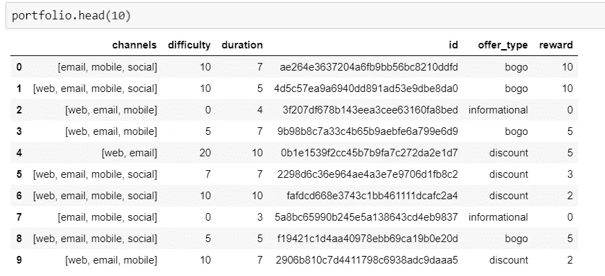

图 1:投资组合数据

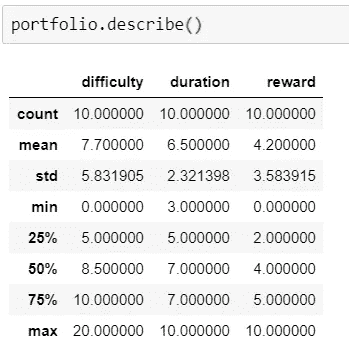

图 2:投资组合——连续变量的描述

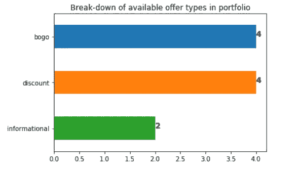

图 3:产品组合—产品类型和数量

# 探索抄本数据框架

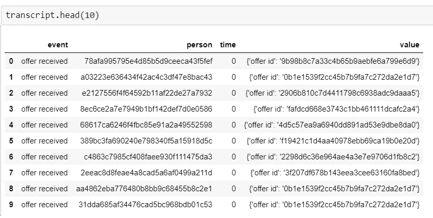

图 4:抄本数据 10 个标题行

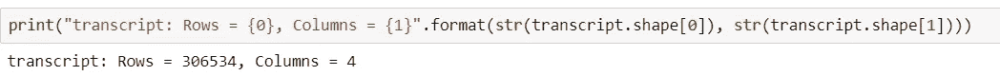

图 4:抄本数据行和列

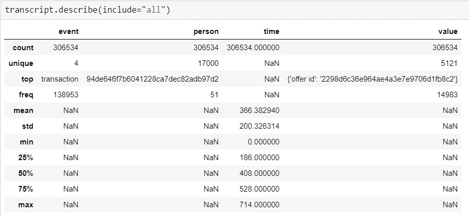

图 5:抄本——所有变量的描述

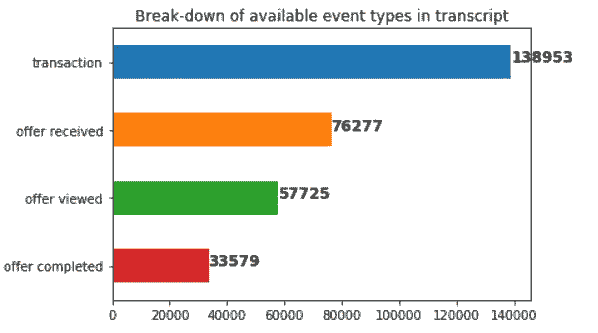

图 6:抄本—事件类型和计数

# 探索概要数据框架


图 7:10 个标题行的概要数据

请注意，在上图中，年龄(118)、性别(无)和收入(NaN)出现在几个单元格中。在使用这些数据进行分析之前，我们需要删除这些无效值。

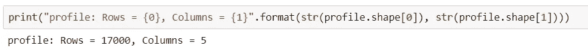

图 8:概要数据行和列

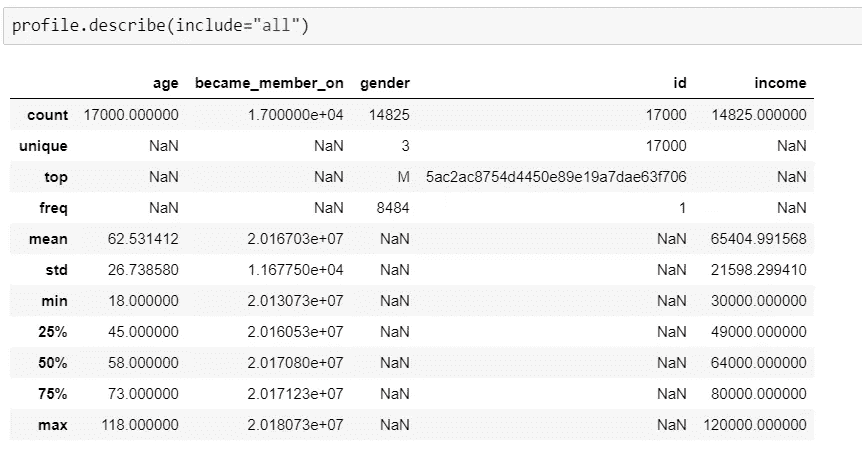

图 9:剖面——所有变量的描述

请注意，性别和收入列的有效行数都是 14825。这小于数据集 17000 中的实际行数。年龄栏也不排除无效年龄，如 118 岁。就整数列而言，这是一个有效的数字。因此，我们需要确保在分析之前删除所有无效的行(即逐例删除)。

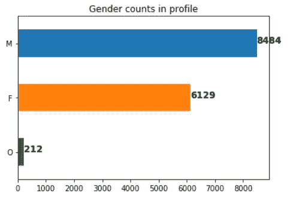

图 9:概况—性别计数

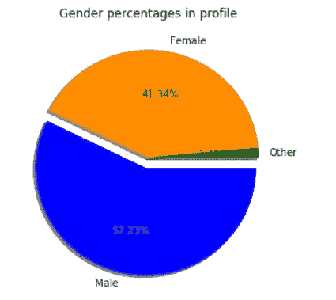

图 9:概况——性别百分比

# 数据准备和清理

```
profile_cleaned = profile.dropna(subset=[‘gender’])
```

上述语句将删除性别列中包含“None”值的所有行。这实际上将配置文件数据中的行数增加到了 14825。它还处理收入列和年龄列中有 118 年的行中的 NaN 值。我们现在已经清理了配置文件数据。

## 检查是否有根本没有交易的客户，并从简档数据集中删除他们的条目

```
transactions = transcript.loc[transcript.event == "transaction"]
```

我们可以通过只选择事件类型为“transaction”的行来创建一个 transactions 数据帧。

然后，我们使用下面的语句从交易数据帧中检索唯一的客户 id。

```
transacted_customers = transactions.person.unique()
```

当我们检查 transacted _ customers 中的行数时，我们看到它有 16578 行，而唯一客户的原始配置文件数据集中只有 17000 行。

所以有 17000 — 16578 = 422，客户根本没有做过任何交易。我们可以使用这些客户记录作为部署模型的测试集。

然后，我们可以将一个名为 has _ transacted 的列追加到配置文件数据中，并使用它来过滤已经进行事务处理和没有进行事务处理的用户。为此，lambda 函数将派上用场。

```
def has_customer_trasacted(cusId, transacted_customers):
    return cusId in transacted_customersprofile["has_transacted"] = profile.apply(lambda x: has_customer_trasacted(x.id, transacted_customers),axis=1)profile_of_transacted_users = profile[profile["has_transacted"]]profile_of_no_transaction_users = profile[profile["has_transacted"] == False]
```

# 分析数据集

## 阅读每个客户事件，并找到他们有影响力的报价

通过查看已完成的报价，并确保客户在根据副本数据帧中的关键 offer_id 完成报价之前查看了报价，可以发现影响报价。

*注意:这里一个棘手的部分是，在抄本数据帧的“值”列中，字典关键字是“报价 id ”,即中间有一个空格，用于已收到的报价和已查看的报价条目，但是是“报价 _id ”,即中间有一个下划线，用于已完成的报价条目。所以我们必须留意这些键*

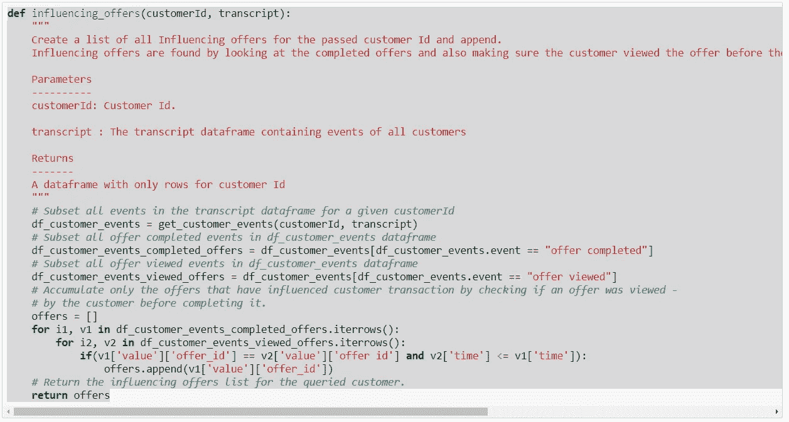

图 10:impacting _ offers 函数

然后，我们将应用一个 lambda 函数将“impacting _ offers”列添加到事务处理用户数据框架的配置文件中。

```
profile_of_transacted_users_valid["influencing_offers"] = profile_of_transacted_users_valid.apply(lambda x:influencing_offers(x.id, transcript),axis=1)
```

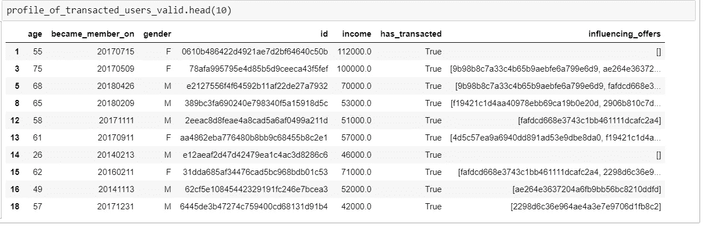

图 11:impacting _ offers 列显示了影响每个客户的报价列表。

请注意，在上面的数据框架中，influencing_offers 列对于某些客户资料有空的报价。我们也将从档案中删除这些客户，以便进一步分析。

```
profile_of_transacted_users_valid_with_influencing_offers = profile_of_transacted_users_valid[profile_of_transacted_users_valid.influencing_offers.str.len()!=0]
```

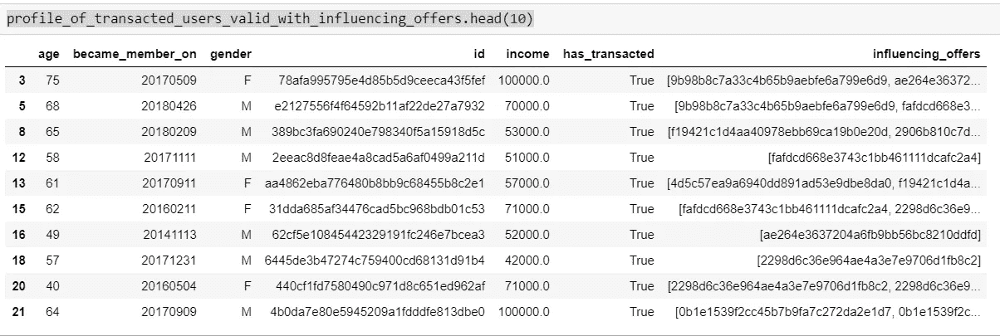

图 12:仅显示具有影响报价列表的客户的资料数据框架。

## 将 influencing_offers 列展开为要约 id 指示符变量的单独列，如果客户受到要约的影响，则用 1 表示，否则用 0 表示

我们将再次利用另一个 lambda 函数为 profile 数据帧中的每个客户条目创建指示变量。

```
def offer_in_influencing_offers(offerId, influencing_offers):
 “””
 Find if a passed offerId is in the influencing_offers list

 Parameters
 — — — — — 
 offerId: Offer Id from portfolio dataframe.

 influencing_offers : List of offers found for a customer

 Returns
 — — — -
 1 if offer is found 0 if not found
 “””
 if (offerId in influencing_offers):
 return 1
 else:
 return 0# Apply the offer_in_influencing_offers as a lambda function to all customers rows in the profile dataframe
for offerId in portfolio.id:
 profile_to_investigate[offerId] = profile_to_investigate.apply(lambda x:offer_in_influencing_offers(offerId, x.influencing_offers), axis=1)
```

## 从配置文件数据框架中删除不需要的列，如“has _ transacted”、“impacting _ offers”和“id”

此时，如果需要，我们可以通过丢弃不需要的中间结果列(如 has _ transacted、impacting _ offers 和 id)来减小概要数据帧的大小。如果我们想从分析中删除不需要的条目，最好使用中间概要数据框架(比如 profile_to_investigate)。通过这种方式，我们仍然可以保持原始数据帧和所有创建的中间列不变。

## 通过将性别变量分成如下三列，对其进行一次性编码，

1.  性别 _F
2.  性别 _M
3.  性别 _O

这可以使用 pandas get_dummies(…)函数来完成。

```
profile_to_investigate = pd.get_dummies(profile_to_investigate, prefix=[‘gender’])
```

# 最后，我们现在可以建立一个机器学习模型来预测我们训练记录中一个看不见的客户的报价

在这里，我们可以进一步从投资组合数据中删除信息性报价字段，这样我们就可以只关注 bogo 和 discount 报价类型。

```
complete_offer_ids = []
for offerId in portfolio.id:
 complete_offer_ids.append(offerId)
all_offer_ids = []
all_offer_types = []
portfolio_no_informational_offer = portfolio[portfolio.offer_type != “informational”]
for offerId in portfolio_no_informational_offer.id:
 all_offer_ids.append(offerId)
for offer_type in portfolio_no_informational_offer.offer_type:
 all_offer_types.append(offer_type)
print(all_offer_ids)
print(all_offer_types)
```

## 创建特征和响应列(X 和 y)

```
X = profile_to_investigate.drop(complete_offer_ids, axis=1)
```

然后，我们可以只“瞄准”一个报价 id，比如“AE 264 e 3637204 a 6 FB 9 bb 56 BC 8210 ddfd”，这是一个“bogo”类型。请注意，最后我们将为每种优惠类型创建单独的模型。

## 使用所有默认超参数构建最简单的随机森林分类模型，并总结结果

```
# Split records to train and test train = 80% test = 20%
X_train, X_test, y_train, y_test = train_test_split(X, y, test_size=0.33, random_state=45)# Create a RandomForest Classifier
basic_rf_model = RandomForestClassifier()
basic_rf_model.fit(X_train,y_train)# Predict on test data
basic_rf_model_predictions = basic_rf_model.predict(X_test)
```

## 基本射频模型综述

1.  该模型的精度为 0.68
2.  召回率为 0.76
3.  AUC 为 0.53
4.  从混淆矩阵来看，在受此报价影响的 754 个受影响客户中，我们的模型似乎只返回了 57 个案例的正确预测。这不是很好的召回率。

```
print(classification_report(y_test, basic_rf_model_predictions))print(“Mean AUC Score of Basic Random Forest: “, basic_rf_model_cv_score.mean())confusion_matrix(y_test, basic_rf_model_predictions) precision    recall  f1-score   support

          0       0.80      0.94      0.86      2876
          1       0.25      0.08      0.12       754

avg / total       0.68      0.76      0.71      3630Mean AUC Score of Basic Random Forest:  0.531061253253array([[2705,  171],
       [ 697,   57]])
```

## 我们希望通过调整随机森林模型的超参数来改进我们的基本模型，

1.  随机森林树木的数量
2.  寻找最佳分割时要考虑的特征数量
3.  已建树木的深度

## 然后，我们可以使用调整后的参数，尝试为每种报价类型构建新的 RandomForest 模型。

在这种情况下，调谐的超参数是，

```
# Based on the above Random Search set the hyper-parameters 
n_estimators1 = 200
max_features1 = ‘sqrt’
max_depth1 = 100
```

最后，我们将把它们放在一个函数中，为特定的优惠类型构建随机森林模型。

```
def Build_OfferModels_Summarize_TestPredictions():
 X = profile_to_investigate.drop(complete_offer_ids, axis=1)
 cnt = 1
 RforestModels = []
 for i in all_offer_ids:
 # Choose the offer column we want to model from all_offer_ids, 
 # These are essentially now filterd to only bogo and discount offers
 y = profile_to_investigate[i]
 X_train, X_test, y_train, y_test = MakeTrainTestSplits(X,y)
 print(“\n_____________________________________________________________________________\n”)
 print(“({0}.) Model Summary for offer id — {1} : {2}”.format(cnt,i, all_offer_types[cnt-1]))
 print(“_____________________________________________________________________________\n”)
 RforestModels.append(RandomForestModel(X, y, X_train, X_test, y_train, y_test, cvsplit = 10, n_estimators=n_estimators1, max_depth=max_depth1, max_features=max_features1))
 print(“_____________________________________________________________________________\n”)
 cnt = cnt + 1
 return RforestModelsRforestModels = Build_OfferModels_Summarize_TestPredictions()____________________________________________________________________

(1.) Model Summary for offer id - ae264e3637204a6fb9bb56bc8210ddfd : bogo
____________________________________________________________________

--------------------------
    Confusion Matrix    
--------------------------
[[2749  127]
 [ 710   44]]

---------------------------------
    Classification Summary    
---------------------------------
             precision    recall  f1-score   support

          0       0.79      0.96      0.87      2876
          1       0.26      0.06      0.10       754

avg / total       0.68      0.77      0.71      3630

--------------
    AUC    
--------------
[ 0.52076252  0.55527963  0.58126514  0.55250332  0.50975362  0.55883595
  0.53042697  0.55361913  0.52867657  0.53250633]

-------------------
    Mean AUC    
-------------------
Mean AUC for Random Forest Model:  0.542362918241
____________________________________________________________________
```

## 在新客户记录上部署报价模型并预测报价

我们将为从未使用该应用进行交易的客户创建部署记录。这些是我们在准备数据时统计的 422 个客户。

#在测试数据上部署模型
RforestModels _ 0 _ predictions = RforestModels[0]。predict(profile _ to _ deploy)
RforestModels _ 1 _ predictions = RforestModels[1]。预测(profile _ to _ deploy)
RforestModels _ 2 _ predictions = RforestModels[2]。predict(profile _ to _ deploy)
RforestModels _ 3 _ predictions = RforestModels[3]。预测(profile _ to _ deploy)
RforestModels _ 4 _ predictions = RforestModels[4]。predict(profile _ to _ deploy)
RforestModels _ 5 _ predictions = RforestModels[5]。predict(profile _ to _ deploy)
RforestModels _ 6 _ predictions = RforestModels[6]。predict(profile _ to _ deploy)
RforestModels _ 7 _ predictions = RforestModels[7]。预测(配置文件到部署)

```
np.unique(RforestModels_0_predictions, return_counts=True)
(array([0, 1]), array([325,   8]))np.unique(RforestModels_1_predictions, return_counts=True)
(array([0, 1]), array([320,  13]))np.unique(RforestModels_3_predictions, return_counts=True)
(array([0, 1]), array([330,   3]))np.unique(RforestModels_4_predictions, return_counts=True)
(array([0, 1]), array([299,  34]))np.unique(RforestModels_5_predictions, return_counts=True)
(array([0, 1]), array([283,  50]))np.unique(RforestModels_6_predictions, return_counts=True)
(array([0, 1]), array([307,  26]))np.unique(RforestModels_7_predictions, return_counts=True)
(array([0, 1]), array([325,   8]))
```

> 从上面的部署结果中，我们看到，对于每个产品，我们得到的多数是 0，表示没有推荐的产品，只有很少的 1 供客户推荐。这可以归因于我们的随机森林模型仍处于早期阶段，需要更多的数据来提高其精度和召回率。
> 
> 在这种情况下，我们不应该完全依赖这一种模式。如果我们能够使用一种混合的方法，既使用这种模型，又根据人口统计信息执行有针对性的报价搜索，那就更好了。我们称之为启发式方法。此方法记录在 targeted_offers.py 文件中，此处为[推荐目标优惠的启发式方法](https://github.com/kart-projects/Starbucks-Capstone/blob/master/targeted_offers.py)

# 启发式方法

为了解决受影响客户召回率低的问题，并提供一种更强大的方法来向所有客户推荐产品，我们将重点关注另一种简单的启发式方法，该方法使用年龄、性别和收入等人口统计信息，仅针对用户简档的子集。

一旦我们对这些用户简档进行子集划分，我们将会像我们在上一节中所做的那样，为这些客户找到有影响力的报价。最后，我们将根据每种优惠类型统计所有受影响客户的影响优惠。一旦我们有了每个报价的计数，我们可以返回每个报价的前两个多数票。

我们现在有一个启发式模型，可以向同一人群中的其他样本推荐报价，这些样本要么没有受到影响，要么根本没有交易。

这种类型的分析有它自己的优点和缺点，

1.  好处是我们可以将大多数样本人群喜欢的产品推荐给同一人群中的其他人。这样，所有具有相同人口统计属性的客户都会得到推荐。
2.  问题是，这些建议只针对人群的一个子集，而不是移动应用的整个客户群。

## 我为三类客户提供了这种有针对性的服务

> *女顾客年龄> = 45 岁，年收入> = 64000 美元
> 男顾客年龄< 45 岁，年收入> = 64000 美元
> 男顾客年龄> = 45 岁，年收入> = 64000 美元*

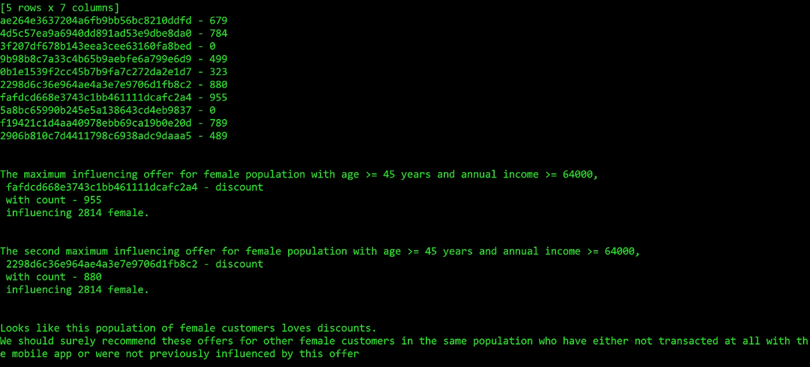

*图 13:年龄> = 45 岁、年收入> = 64000 美元的女性顾客受到折扣优惠*的影响

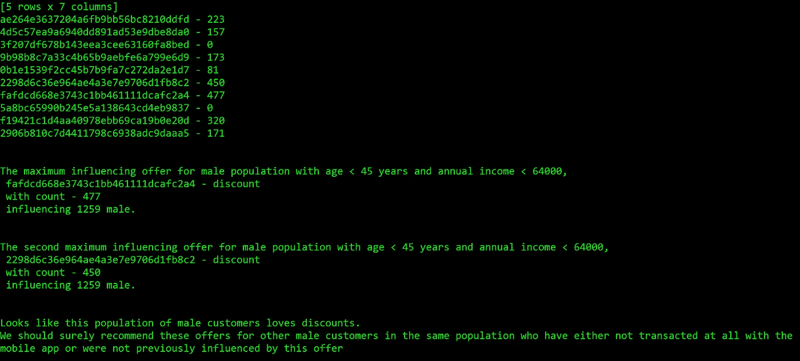

*图 14:年龄< 45 岁、年收入> = 64000 美元的男性顾客也受到折扣优惠的影响*

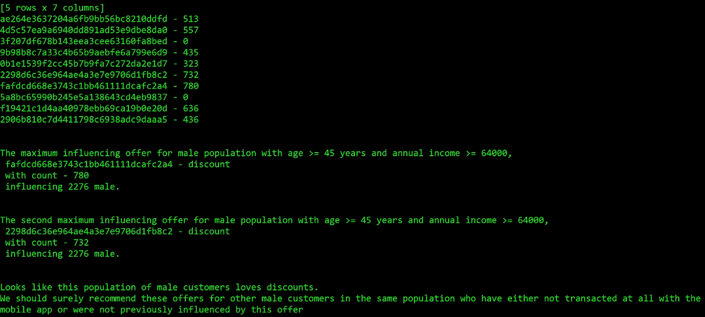

*图 15:年龄> = 45 岁、年收入> = 64000 美元的男性顾客再次受到折扣优惠的影响*

我们的分析表明，所有三个目标人群都受到了以下 id 的两个折扣优惠的影响，

1.  fafdcd 668 e 3743 C1 bb 461111 dcafc 2 a 4
2.  2298 d6c 36 e 964 AE 4a 3 e 7 e 9706 D1 fb8 c 2

# 结论

客户推荐是一个艰难的过程。考虑到来自外部世界的许多竞争，很难在业务上保持领先。在这个项目中，我们研究了两种不同的方法来解决要约推荐问题。

即使预测模型构建方法具有坚实的基础，但在我们需要为每个客户提供个性化推荐的情况下，这将是困难的。我们需要更多显示客户影响的数据，以建立能够在所有情况下预测报价的稳健模型。

第二种方法在向所有客户推荐我们的样本数据方面更好。这里的问题是，这是有针对性的推荐，可能不会影响使用移动应用程序的整个客户群。此外，我们在这里使用的唯一指标是受影响客户的数量(或者我们可以称之为要约影响投票)。如果人群中没有太多受影响的用户，并且我们最终仍然向客户推荐产品，这有时可能没有用。

# 改进

对于基于树的方法，我们发现我们的召回率不是很高，特别是当我们看受影响的客户时。在汇总表中可以看到一些报价类型的值，如 0.06 和 0.08。这是使用我们的 200 个最大深度为 100 的估算器。即使是我们之前建立的基本随机森林模型，对于受影响的用户也有相似的召回率。

我们当然需要关注这种召回率低的问题，因为它可能会阻碍我们的模型在部署期间的性能。

为了解决这个问题，

1.  我们可以尝试稍微改变我们的建模策略，专注于与人口统计相关的记录，用这些记录构建我们的随机森林模型，看看我们的模型精度和召回率是否会进一步提高。
2.  我们想使用的另一个策略是进一步调整我们的随机森林模型的超参数。我们可以尝试一种随机网格搜索机制来调整我们的超参数，如树估计器的数量、最大特征和树的最大深度，例如 500 次迭代。这将是一个非常漫长的过程，但最终我们会得到一些我们想要使用的最佳超参数集，这肯定会提高我们的模型性能。
3.  最后，我们应该研究我们的数据，看看每种优惠类型有多少受影响的客户。在指标变量中 0 比 1 多的情况下，我们可能最终得到 1 的不良召回率和 0 的较好召回率，从而将我们的召回率平均为 0.77(如我们的 basic_rf_model 的情况)。因此，最好收集一些可能涉及更多受影响客户记录的交易数据。如上文 1 所述，更好的数据采样也有助于更好的模型拟合这些样本。因此，我们还可以根据人口统计规则对数据集进行采样，并使用这些样本构建更好的模型。

# 结局

总的来说，在客户推荐的情况下，选择我们产品需要的营销类型总是更好的。如果需要，我们应该尝试多种建模方法，甚至不要害怕研究使用基于模型和启发式方法的协作建模方法，并向所有使用移动应用程序的客户推荐产品。

两种方法的综合分析，python 程序和 Jupyter 笔记本代码都在这里，[Starbucks-Capstone-Project-GitHub-Repo](https://github.com/kart-projects/Starbucks-Capstone)

> 你今天在星巴克积分移动应用上收到了哪些优惠？