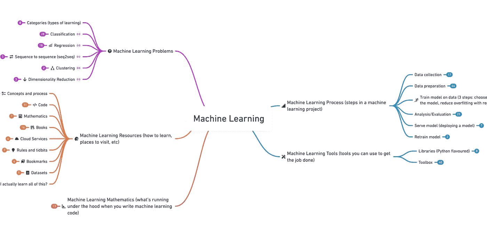
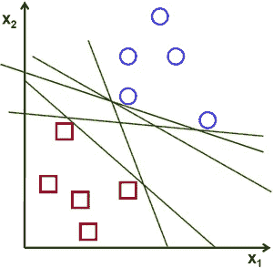
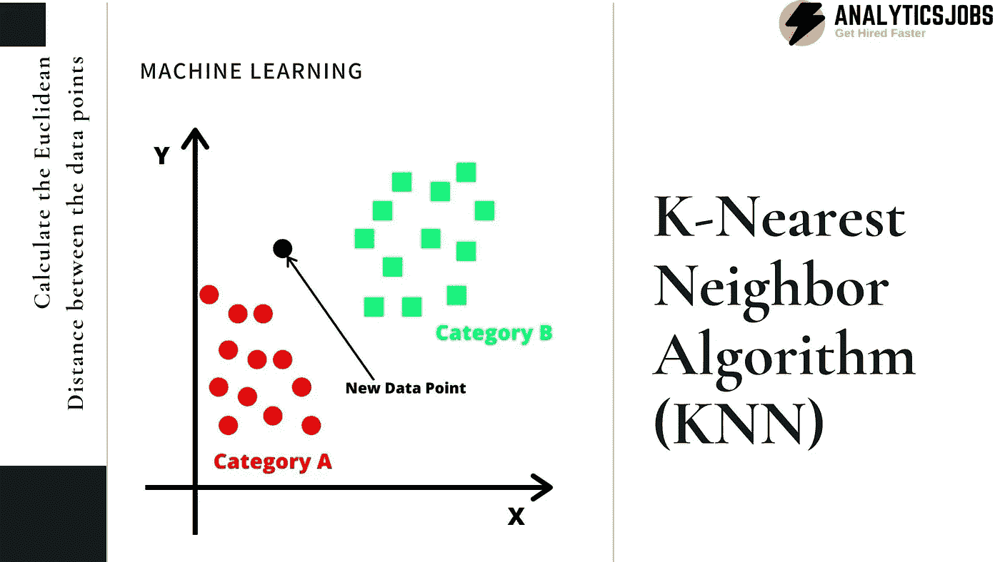
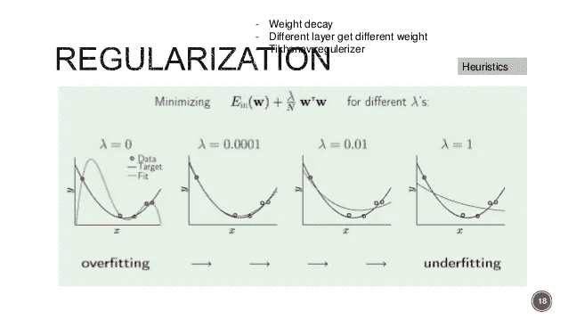
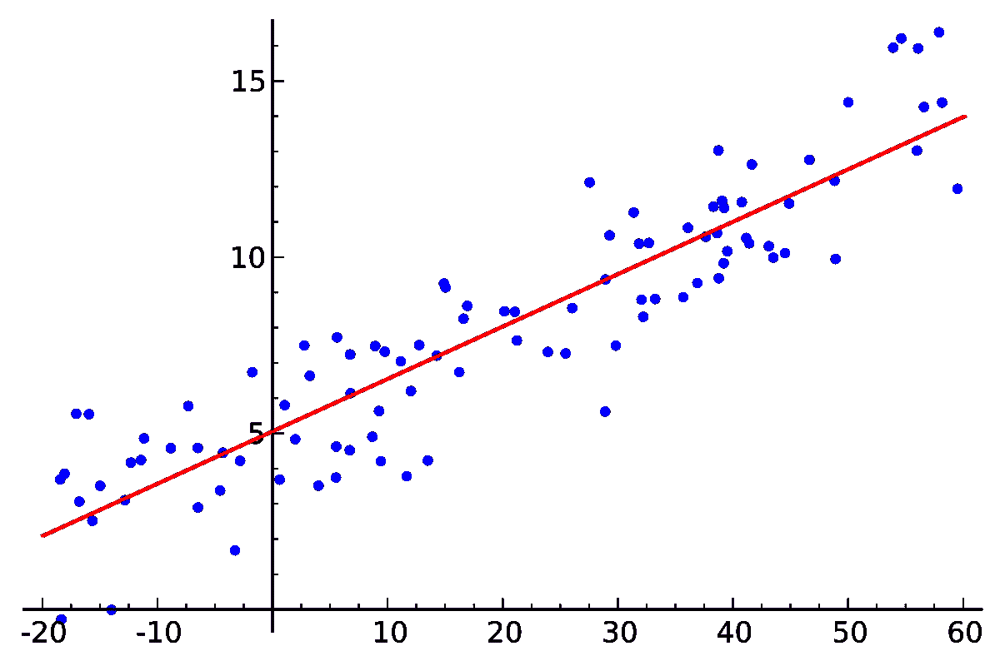

# 机器学习——魔法是如何运作的

> 原文：<https://medium.com/analytics-vidhya/machine-learning-how-the-magic-works-de6d7f56a0fe?source=collection_archive---------20----------------------->

现在是早上 8 点，你上班要迟到了。你打开谷歌地图，希望找到去办公室的最快方法。该应用程序显示，坐车会比骑你信赖的自行车更快地让你去上班，所以你称之为优步。在车里，您激活 Siri 开始播放您最喜欢的播放列表。在工作中，你开始通过电子邮件阅读。您只有 12 封未开封的电子邮件，但这要归功于垃圾邮件功能，该功能可筛选出 45 封垃圾邮件。辛苦工作一天后，你决定去看电影，买点圣诞礼物。你打开网飞，显然心里没有电影可看。谢天谢地，网飞推荐的电影能让你的兴趣达到顶峰，就像他们一直做的那样。你也可以打开亚马逊。你浏览的时间越长，内容越多，这些推荐就越符合你的喜好。

所有这些行为之间有什么相似之处？

**机器学习的介入**。

好吧，酷，机器学习。但是，这难道不仅仅是让事情听起来很酷的有趣的小发明技术吗？

在某种程度上是的。从最基本的意义上说，机器学习是一种**算法**，它可以在没有人工干预的情况下改善**。算法学习的精确方法各不相同。所有这些方法都基于大量的数据。**数据**是 ML 的关键组成部分，因此 ML 是数据挖掘的关键工具。机器学习也是人工智能或人工智能的一个子集，人工智能是任何能够执行类似人类智能的技术。ML 有许多子部分，如监督学习、无监督学习和深度学习。**

****

## ****监督学习****

**监督学习是一种机器学习方法。这种特定的方法**建立了一个基于证据进行预测的模型**。以分析人与狗的对比为例。你递给机器大量的数据，包括人或狗的图片。此处的数据将标记为图像类型(人与狗)。模型将使用该**训练数据**来训练算法。当程序员想知道计算机有多精确时，他们会使用一小部分数据，称为**评估数据**。评估数据与培训数据非常相似，但不是培训数据的精确副本。这就是为什么机器不能记住图像并给出错误的准确性报告，但它必须真正使用它的算法来测试它的准确性。**

**何时使用:您已经知道输出的数据，并且正在尝试预测和输出。**

## **无监督学习**

**无监督学习是对数据进行排序，并在数据中发现隐藏的模式或结构。这种方法主要用于**从还没有**标记为**的数据中做出推论**。举个例子，你是一家加油站公司的领导。您在一个地区只能建立一定数量的加油站，并且您希望找到加油站的最佳位置，以便每个加油站都能够满足当前的需求。使用无监督学习可以帮助找到匹配需求和加油站布局之间的隐藏模式。一个更简单的例子是使用无监督学习来排序立方体块。每块石头都有重量。如果我们让计算机排序成三组，计算机会根据相似的权重将块排序成三组。如果我们让计算机分成 7 组，计算机会把木块分成 7 组，每组木块有相似的重量。**

**何时使用:您有未标记的数据需要整理，或者您想在数据中找到隐藏的模式/结构。**

## ****深度学习****

**深度学习是机器学习的一个特殊子领域。深度学习专门处理神经网络，尽管有许多类型的神经网络。深度学习既有监督学习也有非监督学习，但它拥有自己独特的超能力。在典型的机器学习方法中，尤其是平面算法，数据必须经过一个称为预处理的过程。预处理就是简单地编辑/转换数据集，然后将其输入到算法中。幸运的是，深度学习不需要太多甚至不需要人工来执行/优化算法。标准 ML 和深度学习之间的另一个关键区别是运行它所需的数据量。深度学习需要非常大量的数据。**

# **监督学习的方法和算法类型**

**现在我们已经了解了 ML 的基本方法，接下来我们来看看每种类型的 ML 都有哪些具体的算法和方法。**

## ****分类****

**分类是一种监督学习的技术。分类预测离散的响应，例如:这个肿瘤是癌性的还是非癌性的，这个电子邮件是真实的还是非真实的，食物块是肉还是非肉。分类将数据归入不同的类别。这个工具对于医学成像和语音识别非常有用。如果数据可以被标记、分类或分成不同的类或组，则最好使用分类。**

*****算法:*****

****支持向量机。**支持向量机模型或 SVM 是最有用和最常用的分类算法之一。SVM 很大程度上是基于线性和逻辑回归。引用 [Rohith Gandhi](/@grohith327?source=post_page-----934a444fca47--------------------------------) 的一句话可以很好地解释 SVM 模特的发现。**

> **“我们的目标是[在 N 维空间(N-特征的数量)中找到一个超平面，该超平面可以清楚地对数据点进行分类”](https://towardsdatascience.com/support-vector-machine-introduction-to-machine-learning-algorithms-934a444fca47)**

**对于新手来说，这听起来像是胡言乱语。思考这个问题的最佳方式是用一个带有两个特征的随机绘制的数据点的图表。最佳超平面应该是能够最好地组织数据的线/平面。**

******

左:二维/特征的可能超平面右:最佳超平面** 

****助推打包决策树。**提升决策树和打包决策树是集成决策树的两种变体。让我们复习一下什么是决策树。决策树通常用于帮助计划/决定事情。在结果确定之前，这些树主要是决策的延续。一个决策会发生，手边的对象可能会发生或不会发生某种动作，然后会做出更多的决策。这个过程**一遍又一遍地继续**直到产生最终输出。这些树有两个问题。简单的树会产生偏差较大的结果，而复杂的树会产生差异太大的结果。为了解决这个问题，使用了集成方法。**集成** **方法**“[将几个决策树结合起来，比单个决策树产生更好的预测性能。”](https://towardsdatascience.com/decision-tree-ensembles-bagging-and-boosting-266a8ba60fd9)两种集成方法包括 boosting 和 bagging。
**装袋**用于减少决策树输出的方差。这是通过聚集许多结果并找到平均值来完成的。从单个训练数据集中，创建几个子集，对每个子集应用决策树。每个决策树输出一个结果后，所有输出的平均值就是整个数据集的输出。 **Boosting** 用于将弱学习模型增强为强学习模型。决策树将应用于数据集。根据生成的弱预测规则，权重或变换将被应用于模型，希望创建更准确的模型。这将一次又一次地发生，直到创建出一个强大的模型。**

****K-最近邻。**当已知数据点彼此非常接近时，使用 K-最近邻或 KNN。因此有了“邻居”与许多其他模型不同，KNN 的整个模型是整个训练数据集。**

> **[通过在整个训练集中搜索 K 个最相似的实例(邻居)并总结这 K 个实例的输出变量，对新实例(x)进行预测。对于回归，这可能是平均输出变量，在分类中，这可能是众数(或最常见的)类值。](https://machinelearningmastery.com/k-nearest-neighbors-for-machine-learning/)**

**对于某些输入，使用距离方程。常见的包括欧几里德距离、汉明距离、曼哈顿距离等等。**

****

## **回归**

**把回归想象成分类的模拟兄弟。分类在离散的类别之间决定，而回归预测连续的响应。举个例子，你想找到一辆全新赛车的最高速度。你不知道最高速度，但你知道帮助确定最高速度的汽车部件的信息。除了最高速度之外，你还有关于引擎效率、变速箱数据、排气状况、扩散器和前分离器阻力数据以及其他车的更多信息。使用对最高速度的部分信息数据的回归模型，可以产生一个模型来估计这种新赛车的最高速度。**

*****算法:*****

****正规化。**正则化用于避免过拟合。过度拟合是指模型与数据集*拟合得太好。*回归的目标通常是找到发现关系的模型。过度拟合将发现输入和输出之间的真实关系，但它也将说明数据集中额外的松散相关数据或“噪声”。这种过度拟合将对其他数据集/应用产生负面影响。正则化作为一种技术[“不鼓励学习更复杂或更灵活的模型，以避免过度拟合的风险。”](https://towardsdatascience.com/regularization-in-machine-learning-76441ddcf99a)这是通过将模型的系数缩小到更接近 0 来实现的。为了缩小这个系数，使用了损失函数。系数的缩小涉及到相当多的数学问题。**

****

****线性回归。**线性回归是机器学习中最简单和最常用的部分之一。线性回归是发现一条最适合自变量和因变量之间关系的直线。可以给出一个 y=b + b1x 的线性方程。线性回归模型的目的是找出 b 和 b1 应该是什么。使用了两个关键函数。第一个是成本函数。成本函数将确定 b 和 b1 的最佳值。另一个函数是梯度下降。该函数改变 b 和 b1 的值，同时降低成本函数。梯度下降几乎根据达到最小值来更新值。b 和 b1 的值缓慢变化，直到达到最低可能的成本函数输出。**

****

**机器学习是广泛的，强大的，很多时候是非常复杂的。这种对 ML 到底是什么的探索有助于澄清它可以准确地应用在哪里。然而，探索各种算法揭示了机器学习的真正辉煌。**

> ****感谢阅读**。我是 Aryan Saha，一个 15 岁的孩子，致力于使用技术来帮助解决气候变化问题。如果你想联系我，请联系 aryannsaha@gmail.com。如果你想联系，请访问我的 LinkedIn:【https://www.linkedin.com/in/aryan-saha-0190541a0/】T4。**

**有用的资源:**

** [## 支持向量机——机器学习算法简介

### 从零开始的 SVM 模式

towardsdatascience.com](https://towardsdatascience.com/support-vector-machine-introduction-to-machine-learning-algorithms-934a444fca47)  [## 决策树集成——打包和提升

### 随机森林和梯度增强

towardsdatascience.com](https://towardsdatascience.com/decision-tree-ensembles-bagging-and-boosting-266a8ba60fd9)  [## 什么是机器学习？|工作原理、技术和应用

### 办公楼、医院和其他大型建筑中的供暖、通风和空调(HVAC)系统

www.mathworks.com](https://www.mathworks.com/discovery/machine-learning.html)  [## 什么是机器学习？定义专家系统

### 机器学习是人工智能(AI)的一种应用，它为系统提供了自动…

www.expert.ai](https://www.expert.ai/blog/machine-learning-definition/)  [## 机器学习中的 Boosting 算法快速介绍

### 引言许多分析师误解了数据科学中使用的术语“提升”。让我提供一个有趣的…

www.analyticsvidhya.com](https://www.analyticsvidhya.com/blog/2015/11/quick-introduction-boosting-algorithms-machine-learning/)  [## 机器学习的 k-最近邻-机器学习掌握

### 在本帖中，你将发现用于分类和回归的 k 近邻(KNN)算法。看完之后…

machinelearningmastery.com](https://machinelearningmastery.com/k-nearest-neighbors-for-machine-learning/)  [## 基于 K-最近邻算法的机器学习基础

### k-最近邻(KNN)算法是一个简单，易于实现的监督机器学习算法，可以…

towardsdatascience.com](https://towardsdatascience.com/machine-learning-basics-with-the-k-nearest-neighbors-algorithm-6a6e71d01761)  [## 机器学习中的回归:它是什么以及不同模型的例子

### 回归分析是机器学习领域的一个基本概念。它属于监督学习…

builtin.com](https://builtin.com/data-science/regression-machine-learning)  [## 机器学习中的正则化

### 训练机器学习模型的一个主要方面是避免过度拟合。该模型将有一个低…

towardsdatascience.com](https://towardsdatascience.com/regularization-in-machine-learning-76441ddcf99a)  [## 机器学习的线性回归-机器学习掌握

### 线性回归也许是统计学和机器中最著名和最容易理解的算法之一

machinelearningmastery.com](https://machinelearningmastery.com/linear-regression-for-machine-learning/)**