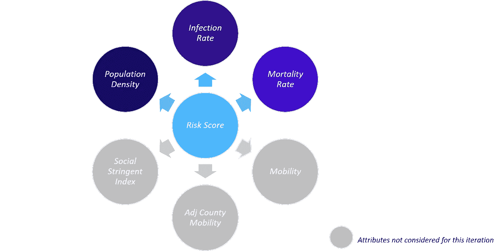
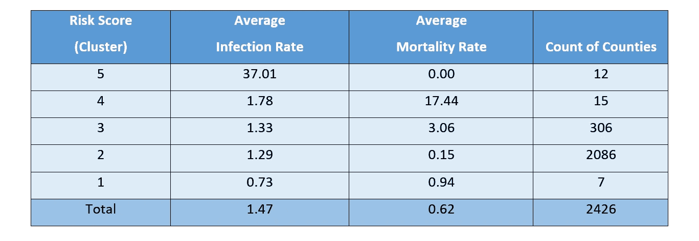
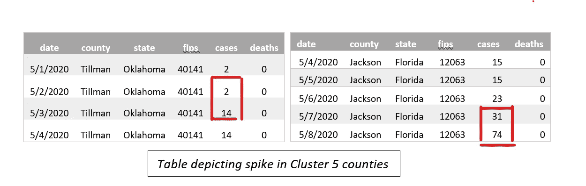
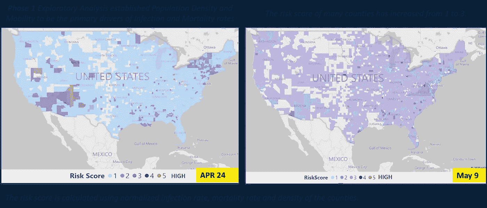
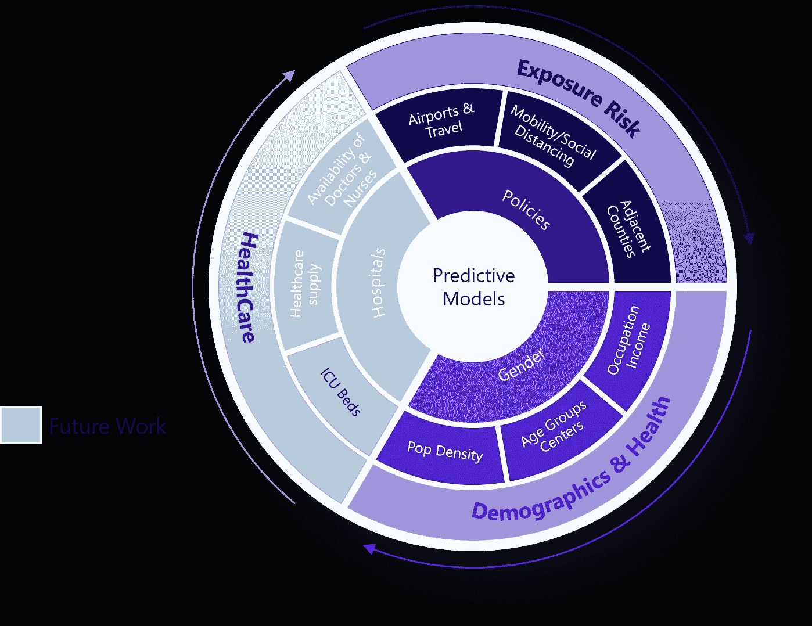
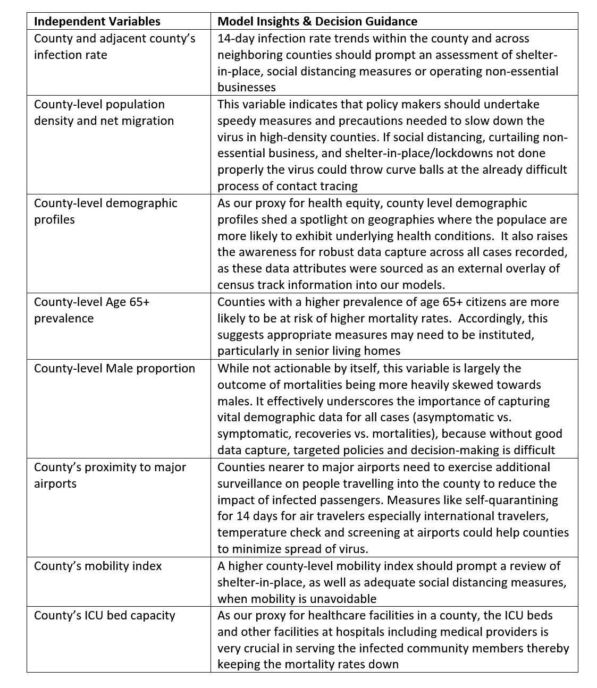
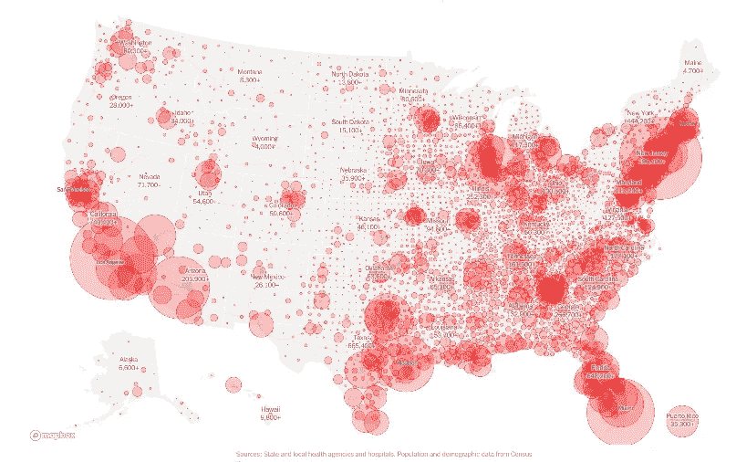
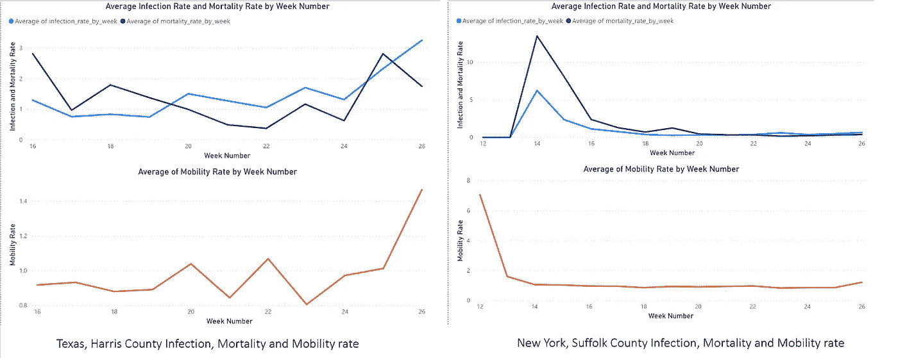
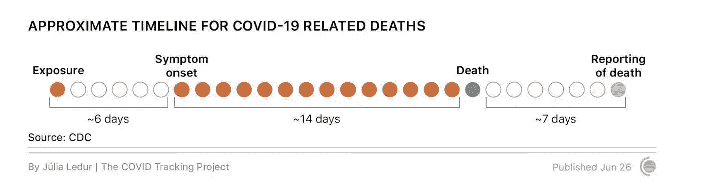

# 机器学习+人类智能 vs 新冠肺炎:第二部分

> 原文：<https://medium.com/analytics-vidhya/machine-learning-human-intelligence-vs-covid-19-part2-31cd6df54353?source=collection_archive---------23----------------------->

# **简介:**

全球化以前所未有的方式将各国联系在一起。无论是消费者、企业还是政府，现在都可以不受限制地获得创新、市场、产品和服务。虽然全球化带来了许多好处，但它也带来了相关的风险，正如我们在最近的 SARS-COV2 病毒中所看到的那样。传染病专家已经发出警报，需要对这些威胁做出有效和统一的反应，因为传染病可能会因我们的全球连通性而快速传播。

新冠肺炎(由 SARS-COV2 病毒引起的疾病)已经完全占据了我们的生活，对无数全球公民的生活产生了实质性的影响。每个人脑海中最先想到的问题是:“我们如何适应这种新常态？”

具体来说，当我们分析像新冠肺炎这样的传染病如何传播并评估其传播对行业的影响时，我们可以从模式和预防中学到什么？这一认识有助于为旨在控制疾病传播的公共卫生指令提供信息，同时减轻由此带来的经济压力。

# **学习目标:**

为了更好地理解这些模式，我们在 Inspired intellectual 和 WorldLink 的数据科学团队启动了一个 R&D 项目，假设高级分析可以揭示解决上述问题的见解。我们也在寻找实用的应用程序来部署我们的发现，以帮助我们的客户了解他们的企业需要如何适应快速发展的新常态。

我们将研究工作集中在 4 个不同的领域:

1.**创建信息的数据湖**作为我们研究的基础支柱

2.**将实验性治疗、疗法和疫苗研究整理和分类成语义搜索驱动的知识库**，以支持一线医护人员和医疗从业者跟上这些领域的趋势研究([此处为](https://www.linkedin.com/pulse/unveiling-covid-19-research-development-insights-analytics-thayer/))

3.**社交倾听和相关的非结构化文本**分析，以识别和揭示人们谈论的热门话题和关注点

4.**机器学习和洞察生成**识别影响病毒传播的因素，预测病毒中心随时间的消长。

本文是 2 部分博客系列的第 2 部分，重点是上面的第 4 个途径:**机器学习和洞察力生成。**本博客系列旨在回答以下问题:

为什么某些县/市比其他县/市受影响更大？

*为什么在感染最严重的县之间死亡率会有差异？*

*病毒传播和死亡的潜在模式和因素是什么？*

在第 1 部分中，我们基于我们使用县级数据和机器学习技术的工作，提供了关于如何减缓传染病传播的建议。在第 2 部分中，我们将探索模型数据、特性和见解。

我们认为，数据驱动的科学方法有助于回答这些问题，更重要的是，为一系列利益相关者的决策提供信息:

决策者:是否采取了足够的措施来确保传染病的传播得到控制？如果没有，我们如何降低风险？

***企业主:我的企业是病毒传播的潜在媒介吗？对于以对员工和客户安全的方式运营业务，我们应该考虑实施哪些措施？***

个人:作为个人，我们可以采取什么措施来帮助阻止病毒的传播？

***编者按:*** *撰写这篇博客文章是为了强调数据驱动的观点，即最新的高级分析技术如何检查新冠肺炎疫情背后的驱动因素，并获得建议，以告知官员们他们的政策反应。为此，我与我的同事* [***达雷尔·席尔瓦***](https://www.linkedin.com/in/darrell-silva/)*合著了这篇博客，他是我们姐妹组织的数据科学家* [***灵感才学***](http://inspiredintellect-us.com/) *。还有其他几个人跨越* [***世界链接***](https://worldlink-us.com/)**和灵感智慧，参与数据来源和模型开发，提供这些与疫情有关的见解和减轻其影响的潜在行动**

***我们如何探索数据:***

*我们从一项数据探索实践开始研究工作，该实践以定量风险评分为指导，在县一级进行设计。我们的风险评分设计包括县级报告的统计数据，例如:*

*连续 14 天感染率*

*死亡率*

*人口密度(人口密度是根据可居住的平方英里来定义的)。*

**

*其他相关属性，如特定县的流动性、相邻县的流动性和社会严格性也可以包括在风险评分设计中。然而，我们决定保持我们的初始设计简单，以帮助我们更好地理解我们遇到的见解。这些属性通过聚类算法进行分类，以得出在感染率、死亡率和人口密度方面表现出相似性的县的类别。*

*5 月 9 日这一周的风险得分如下所示。表现出最高风险(即高感染率、高死亡率和高人口密度)的县被归入第 5 类。相比之下，风险最低的县被归入第 1 类。为了保持设计简单，并且由于对 COVID19 的病理学缺乏深入了解，我们在聚类时没有对感染率或死亡率变量进行不同的加权。因此，如果一个县有高感染率或高死亡率，我们就可以把它标为危险县。*

**

*我们检查了第 5 类中的几个县，以了解为什么它们被归类为高风险。说明我们论点的前 14 天(4 月 25 日-5 月 8 日)相关部分的数据如下所示。我们可以看到，5 月 2 日至 5 月 3 日期间，俄克拉荷马州蒂尔曼县的感染病例从 2 例激增至 14 例，5 月 7 日至 8 日期间，佛罗里达州杰克逊县的感染病例从 31 例增至 74 例。*

**

*这些县的感染率明显突然上升，表明出现了病毒热点，并表明需要分配资源。我们将这两个县作为热点升级的早期信号的主要例子，通过使用适用于所有县(无论大小)的变量。请注意，在我们为期 14 天的评估期间，许多高密度县已经执行了强制就地安置令，因此在我们的研究中，感染率正在下降。*

*接下来，我们通过与 4 月 24 日那一周的风险得分进行比较，检查风险得分在各县之间的迁移。4 月 24 日这一周被选为我们的基线，因为有传闻证据表明该病毒有长达 14 天的潜伏期。如左侧彩色编码地图所示，主要关注区域(截至 4 月 24 日)集中在该国的西南部和东北部，以及格鲁吉亚周围南部地区的一些高风险区域。在接下来的 14 天里，从 4 月 25 日到 5 月 8 日，病毒已经席卷了整个国家。同样值得注意的是，以前风险最高的县似乎已经在一定程度上控制了病毒的传播。虽然这些措施基本上是反应性的，但从这些高风险国家为应对其情况而实施的措施的成功中可以学到很多东西。*

**

*总之，我们看到风险评分可以成为指导公共卫生政策决策的有用工具。不利的一面是，它反映了已经发生的事情，公共卫生政策制定者能够希望做的最好的事情就是进行干预，以防止情况恶化。数据分析的最大附加值在于揭示哪些因素会影响风险得分，以便决策者能够更加积极主动地控制病毒的传播(例如，在机场及其周围实施全面的安全程序，因为人们在各县之间的流动性很高)。*

***特色工程:***

*我们通过制定要研究的假设来开始我们的预测建模练习。在美国记录第一例新冠肺炎病例之前，全球医学研究人员已经通过可信的医学渠道提供了有价值的轶事证据。在通过文本分析对这些进行解析的过程中，这些对指导我们的假设设计非常有用。*

*我们的研究主要关注以下数据:*

*年龄*

*性别*

*健康公平*

*旅行曝光*

*社会流动性*

*医疗保健供应/可用性*

*遵守公共卫生政策指令*

*当然，一些属性，如健康公平，提出了数据采集的挑战，需要创造性的数据工程。因此，我们不得不降低我们的预期，或者根据一些特定领域中可行的数据代理来重新表述假设。作为后者的一个例子，我们通过县级人口统计数据属性的视角重新表述了与健康公平性相关的假设。同样，由于关于遵守公共卫生政策指令的数据报告不一致，我们将其从考虑范围中排除。*

*由此产生的假设清单影响了数据收集和相关的数据丰富工作。通过分层的特性列表，在随附的图形中简洁地说明了这些特性。*

**

***特征重要性:***

*作为机器学习算法的分析挑战的表示，以及为算法提供的丰富功能，与从模型中收集的见解有直接关系。因此，我们现在检查我们选择的机器学习算法构造，以及支配我们的模型的特征:*

*1. ***目标变量:*** 目标变量描述要追求的分析目标。在这种情况下，可行的替代方法是估计感染或死亡率(即回归)或预测感染率或死亡率的增加/减少结果(即分类)。为了简单起见，我们决定采用分类方法，并预测在接下来的两周内费率是否会上升/下降。开发了两个独立的模型，一个预测感染率的增加/减少结果，另一个预测死亡率的增加/减少结果。*

*2. ***自变量(或特征):*** 自变量解释目标变量中的方差及其占方差的程度。对独立变量的研究提供了从模型中获得的洞察力，这反过来指导决策者。下表按照自变量在模型中的重要性顺序排列了它们。*

**

*监测所有这些因素可以帮助决策者制定和评估遏制新冠肺炎病毒传播的战略，并为那些风险最大的县制定预防措施*

***模型验证:***

*虽然有一些异常因素导致了感染的传播，但上述特征共同为新冠肺炎在美国的传播提供了一个整体的解释。*

**

**来源:*[*https://www . nytimes . com/interactive/2020/us/coronavirus-us-cases . html*](https://www.nytimes.com/interactive/2020/us/coronavirus-us-cases.html)*

*作为一个外围因素的例子，如果不进行监控，它会严重影响感染的传播，并可能导致模型的不一致性，俄亥俄州两个县(马里恩县和皮克威县)的惩教机构导致这两个县成为热点。纽约时报([此处为](https://www.nytimes.com/interactive/2020/us/coronavirus-us-cases.html#hotspots))从 5 月 11 日这一周提供的可视化数据为我们的模型中的几个关键特征提供了视觉确认(人口密度、与主要机场的接近程度、老年人的患病率、由于各种社会经济或人口因素导致的高度流动性或潜在健康状况倾向所主导的区域)*

*"***……虽然个人是一个无法解决的谜，但总的来说，他成了一个数学上的确定性*** "*

**――阿瑟·柯南·道尔，四个的标志**

*总的来说，一周又一周，我们的预测模型很好地证实了县级新冠肺炎的趋势。为了证明模型的相对准确性，根据紧急数据进行验证，我们现在从不同的州选择两个县来分析我们的模型认为重要的特征的影响。并不是所有这些州的县都曾经或现在是一个新兴的震中。*

*1.得克萨斯州哈里斯县(左):哈里斯县在疫情之初的感染率和死亡率都相当低。有限制留在家里的命令，因为我们看到在接下来的几周病毒在该县的传播增加。*

*2.纽约萨福克县(右):萨福克县在三月和四月是病毒中心。国家采取了严格的措施，要求遮盖面部，我们可以通过感染率和死亡率的大幅下降看到由此产生的影响。*

**

*我们可以看到，在这两个县，流动性的增加伴随着感染率和死亡率的增加。在萨福克郡，流动性降低之后是感染的减少，而在哈里斯郡，流动性的每次增加之后是病毒传播的增加。这两个图表之间的滞后可以用病毒 14 天的潜伏期来解释。*

**

***结论:***

*了解影响感染率和死亡率的驱动因素是关键的见解，可以导致预防性和规范性的行动。在本文中，我们注意到由以下因素产生的结果影响:*

*年龄*

*性别*

*健康公平*

*旅行曝光*

*社会流动性*

*医疗保健供应/可用性*

*遵守公共卫生政策指令*

*利用先进的分析技术，我们的目标是为政策制定者、企业和公民个人提供洞察力，以最大限度地减少传染病的传播，并创建数据驱动的可操作指南，帮助我们走出疫情的另一面。*

*[灵感智慧](https://www.linkedin.com/company/inspired-intellect/)是一家端到端的数据管理、分析和应用开发服务提供商。从战略咨询和设计，到开发和部署，再到持续运营和托管服务，我们通过一系列产品参与其中。*

*Avalon Consulting，LLC 和 WorldLink Consulting 于 2020 年由两家成熟的服务公司合并而成，我们致力于加速企业客户的数字化转型之旅，帮助他们快速将其数据资产转化为可盈利的数据产品和见解。*

*Inspired Intellect 对组织心理学方法的独特使用使我们在加速客户采用技术解决方案并降低其风险方面与众不同。我们认识到转型过程中人的方面对于实现卓越的业务成果至关重要。*

*多个行业的十多家财富 100 强公司选择灵感智力来推动其数字化实现。*

***鸣谢:***

*本文反映了 Prashanth Nayak、Darrell Silva 和 Felix Simon 的工作，他们在新冠肺炎数据的来源、相关机器学习模型的开发以及本文中讨论的模型的部署方面进行了合作。*

*由 Brian Monteiro 领导的更广泛的团队(包括 Babu Mathew、Kishan Matam、Will Thayer 和 Felix Simon)解决了本文开头介绍的一系列分析挑战。*

*一篇描述威尔·塞耶对 R&D 研究目标的贡献的文章可以在[这里](https://www.linkedin.com/pulse/unveiling-covid-19-research-development-insights-analytics-thayer/?trackingId=6SjwlpnpOiIhaIV%2Fw7ucsA%3D%3D)找到。*