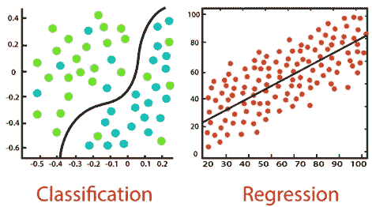
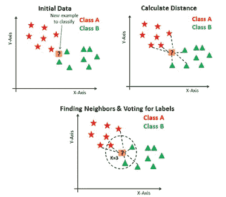
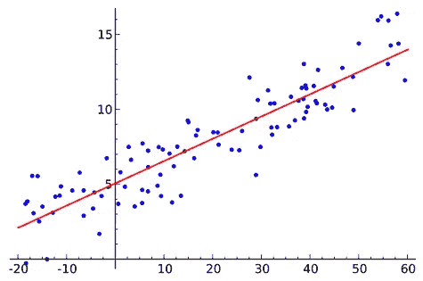
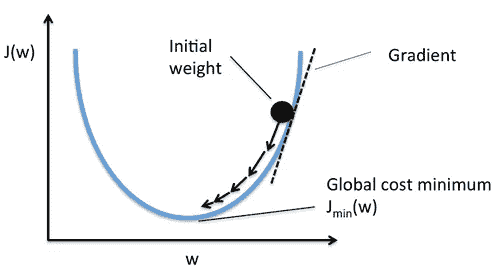
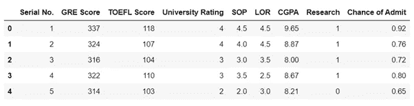
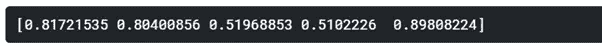
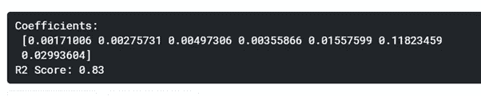

# 机器学习介绍和深入线性回归

> 原文：<https://medium.com/analytics-vidhya/machine-learning-i-introduction-linear-regression-explained-bc5bfee25832?source=collection_archive---------12----------------------->

# 内容

在本帖中，我们将了解:

1.机器学习导论

2.不同类型的机器学习问题

3.线性回归的成本函数

4.梯度下降算法

5.动手解决 Kaggle 数据集上的多元线性回归问题。

## 什么是机器学习？

还记得你在电脑上写的第一个代码吗？我们大多数人都是从“你好，世界”节目开始的，但想想你写了一些让你感到自豪的东西的时候。对于大多数计算机科学爱好者来说，这些可能是独自解决整个编程作业，或者解决竞争性编程问题。我们不要忘记，对于我们大多数人来说，这些都是帮助我们深入计算机科学世界的最初步骤。

由于计算机执行确定性操作，所有这些程序都有相同的模板。我们为程序提供逻辑(规则)和输入(数据)，程序给我们想要的输出。但是对于机器学习来说，事情就不一样了。机器学习是计算机科学的一个领域，我们提供输入(数据)和输出，并将其留给机器学习算法来生成输入-输出映射的规则。一旦生成了这些规则，我们就可以使用它们来预测与该上下文相关的任何给定输入数据。

在这一系列的博客中，我们将通过查看所有的概念来深入探索机器学习，一些背后的数学来深入了解机器学习算法的工作，在每篇帖子的结尾，我们将使用提到的概念解决一个现实生活中的问题(最好来自 Kaggle)。

有两种方法可以让计算机学习我们想要它学习的东西，要么填鸭式学习(监督学习)要么让它去探索(非监督学习)。

## 监督学习

人类如何通过例子学习类似于监督学习。在监督学习中，我们为我们的机器提供一个带标签的数据集，即我们提供输入和输出，并且通过应用各种监督机器学习算法(模型)中的一种，我们期望我们的机器学习模型学习输入和输出之间的映射。监督学习算法分为两大类:

**(一)分类算法**

**(二)回归算法**

在分类问题中，输出被分成固定数量的类，分类算法的工作是预测最有可能与输入算法的数据相匹配的类的概率。

在回归问题中，输出可以是任何数字(在数字输出的情况下),回归算法的工作是预测提供给它的数据的最接近的数值。



图片来源:[https://www . Java point . com/regression-vs-class ification-in-machine-learning](https://www.javatpoint.com/regression-vs-classification-in-machine-learning)

监督学习已经在医疗保健、自然语言处理、股票价格预测系统等方面得到了应用。

## 无监督学习

在无监督学习中，我们向算法提供未标记的数据，并让算法在数据中寻找模式。由于没有简单的方法来评估他们的表现，无监督学习的问题很难解决。无监督学习算法分为两大类:

**(一)聚类算法**

**(二)关联算法**

聚类处理在一组未标记的数据中寻找一种结构或模式。聚类算法处理数据，并找到数据中存在的自然聚类(组)。我们可以告诉我们的算法对一定数量的聚类进行分类。



图片来源:[https://www . data camp . com/community/tutorials/k-nearest-neighbor-class ification-scikit-learn](https://www.datacamp.com/community/tutorials/k-nearest-neighbor-classification-scikit-learn)

关联涉及在大型数据库中的数据对象之间建立关联。一个例子是亚马逊的推荐系统，在购买某个商品后，它会建议用户购买其他产品。

在这篇文章和接下来的文章中，我们将深入研究监督机器学习算法和问题。在很好地研究了监督学习问题之后，我们还将研究非监督学习问题。

最简单的监督机器学习技术之一是线性回归。在 pandas 和 numpy 的协助下，使用 sci-kit learn 库可以很容易地在 python 中实现线性回归，但首先让我们了解一下这个算法是如何工作的。

# 线性回归

考虑一条直线 y=Wx+b，在坐标几何术语中，x 和 y 是变量，W 是这条直线的斜率，b 是 y 轴上的截距。我们向该方程提供各种 x 值，在给定 W 和 b 值的情况下，图上相应的 y 值会产生一条直线。在机器学习术语中，“x”是“输入数据”，y 是“输出”，W 和 b 是我们希望线性回归算法学习给出“规则”的参数，以便它可以推广到新的输入数据。

## 训练和测试集的划分

我们的训练算法需要大量数据来学习 x -> y 映射(规则)，以便获得 W 和 b 的最佳值。对于记录少于 10，000 条的数据集，最好采用 80–20 的训练-测试分割，即只有 80%的数据用于训练模型，其余 20%用于评估其性能。此外，我们还可以使用 development set 来调整模型的参数，但是我们将在本文后面解决的问题是一个小数据集，所以我们现在不使用 dev set。

## 学习是如何发生的？

对于一个好的线性回归模型，我们希望 W 和 b 值是最佳值，即它们从输入数据中学习并获得这样的值，以便它们可以将结果推广到新数据。因此，出现的主要问题是如何获得这些参数的最佳值。为此，让我们看看成本函数。

## 线性回归的成本函数

让我们用 y_hat 来表示线性回归模型的预测值。成本函数背后的主要思想是获得 W 和 b，使得对于由(x，y)对表示的训练示例，y_hat 接近 y。换句话说，我们将解决 W 和 b 上的最小化问题，我们的成本函数将使我们能够这样做。让我们用 j 来表示成本函数。成本函数将帮助我们选择 W 和 b 的最佳值。成本函数有很多，但我们将用于线性回归的成本函数非常直观。



图片来源:en.wikipedia.org

上图是线性回归(有一个变量，即 y=Wx+b)的示例，其中蓝点是训练示例，红线是线性回归模型的输出。这条线大致从所有蓝色点之间穿过。换句话说，这条线与该 2D 平面中存在的所有可能的线的总距离最小，这导致我们使用“欧几里德距离”作为损失函数。对于训练示例(x_i，y_i)和相应的预测(x_i，y_hat _i)，欧几里德距离被定义为:

L = (y_hat_i — y_i)

注意，在不失一般性的情况下，我们去掉了平方根。现在，我们需要找到使这个损失函数最小的 W 和 b 的值。这里，我们将利用导数。



考虑到我们有“m”个训练例子，成本函数被定义为:

j = sum _ over _ all _ training _ examples((y _ hat _ I—y _ I))

记住我们随机初始化 W 和 b，所以，因为我们有一个二次方程，这些随机值会给我们这个抛物线图中某点的值。我们的目标是达到图的最小值。通过对成本函数 J wrt W 和 b 求导，我们得到了图形的斜率，我们希望继续这个过程，直到我们的斜率理想地变为零(实际上非常接近零)。

让我们思考一下实现这一目标所需的参数。我们要确保我们向最小值爬行，不要太慢，也不要太快。缓慢地向极小点爬行包括小步前进，快速地向极小点移动包括大步前进，有时这些大步会导致跳过极小点而无法回头。显然，我们需要定义一个控制这个过程的参数。在机器学习中，我们把这个参数称为‘学习率’，用‘α’表示。帮助我们向最小值移动的算法叫做梯度下降。

## 梯度下降

梯度下降是一个不言自明的术语，整个算法就在于这个术语的含义。梯度只是我们之前讨论过的斜率/导数的另一个名称，下降就是下降的意思。因此，梯度下降的工作是在成本函数曲线上取一个起点，然后在每一步都下降，直到它达到最小值，并报告参数的最佳值(这里是 W 和 b)。让我们定义变量“delta_W”和“delta_b ”,帮助我们在收敛时终止算法。如果 W 的两次连续更新之间的变化小于“delta_W”并且 b 的变化是“delta_b”，我们可以终止梯度下降算法。梯度下降的伪码如下:

```
temp_W = temp_b = random_values
flag_W = flag_b = False
do
if ((abs(W — temp_W) > delta_W) and flag_W = False)
    temp_W = W — alpha * partial_derivate_wrt_W(J)
if ((abs(b — temp_b) > delta_b) and flag_b = False)
    temp_b = b — alpha * partial_derivative_wrt_b(J)
if(temp_W == W)
    flag_W = True
if(temp_b == b)
    flag_b = True
W = temp_W
b = temp_bwhile True
```

梯度下降在 python 的机器学习库中实现了很多优化。我们在这里的主要目的是了解梯度下降是如何工作的。

成本函数的偏导数公式(这里是欧几里德距离)可以在[这里](https://math.stackexchange.com/questions/2297660/derivative-of-vector-consisting-of-euclidean-distances)找到。

至此，我们已经到了讨论单变量(x)线性回归的这一节的末尾。在不止一个变量的情况下，我们的直线方程稍微修改如下:

Y = W1x1 + W2x2 + W3x3 + ……… + Wnxn + b ……(1)

其中总共有 n 个输入特征。用 y_hat 表示预测值，我们的多元线性回归成本函数变为:

j = sum _ over _ all _ training _ examples((y _ hat _ I—y _ I))

这里，我们将 y_hat_i 作为等式(1 ), y _ I 作为训练示例 I 的原始值。

在梯度下降算法中，我们将计算所有参数(W1，W2，…)的成本函数的偏导数。Wn，b ),然后更新这些参数直到收敛。

既然我们已经了解了线性回归是如何工作的，为了珍惜这一成就，让我们深入 Kaggle 的**问题。**

## 问题陈述

点击[此处](https://www.kaggle.com/mohansacharya/graduate-admissions?select=Admission_Predict_Ver1.1.csv)获取数据集。该数据集有 8 个要素和一个输出变量。由于输出值是实数，这是一个回归问题。这个问题可以表述为多元线性回归问题:

y = w1x 1+w2x 2+w3x 3+w4x 4+w5x 5+w6x 6+w7x 7+w8x 8+b

让我们看看 python 包如何帮助我们解决这个线性回归问题。

```
import numpy as np
import pandas as pd
from sklearn import datasets, linear_model
from sklearn.model_selection import train_test_split
from sklearn.metrics import mean_squared_error, r2_score
```

我们为线性代数和其他数学运算导入了 numpy，为数据预处理导入了 pandas，为应用线性回归和评估模型性能导入了 sklearn。

```
df = pd.read_csv(‘/kaggle/input/graduate-admissions/Admission_Predict_Ver1.1.csv’)
df.head()
```



我们通过 pandas 读取输入的 csv 文件，并显示前 5 行来研究数据的属性。这里，所有的值要么是整数，要么是浮点数。如果我们有字符串或其他数据类型，我们将不得不解析它们并将其转换为数字形式，以将其提供给我们的线性回归模型。给定的数据有 500 条记录，这相当小。

```
X = df.iloc[:, 1:-1].values
y = df.iloc[:, -1].values
X_train, X_test, y_train, y_test = train_test_split(X, y, test_size = 0.15)
```

首先，我们将输入值和输出值分开。请注意，我们忽略了序列号列，因为序列号对录取机会没有影响。此外，我们将数据分成相应的训练集和测试集。我们将 85%的数据用于训练，15%的数据用于测试。

```
regressor = linear_model.LinearRegression()
regressor.fit(X_train, y_train)
y_pred = regressor.predict(X_test)
```

现在，我们从 scikit-learn 库中初始化 LinearRegression 对象，并为线性回归算法提供我们的训练数据，以拟合最佳的直线。默认情况下，均方误差成本函数用于训练模型，因此我们无需在此明确提及。

让我们看看前 5 个预测的输出值。

```
print(y_pred[:5])
```



最后，让我们来看看权重参数和 r 值

```
print(‘Coefficients: \n’, regressor.coef_)
print(‘R2 Score: %.2f’ % r2_score(y_test, y_pred))
```



0.83 的 r 值告诉我们，我们正在以 83%的置信度进行预测，这是一个用于评估回归问题的指标。更多关于 r 评分可以在[这里](https://en.wikipedia.org/wiki/Coefficient_of_determination)找到。对于像这样的小数据集来说，这是很好的结果。我们可以应用特征选择技术，使我们的模型更加精确。但由于这是一个非常小的数据集，这可能会导致过度拟合。我们将在以后的文章中讨论这些问题和技术。

这个帖子的代码可以在[这里](https://www.kaggle.com/vardaanbajaj/kernel440c3f9443/)找到。

这个帖子到此为止。在下一篇文章中，我们将详细讨论逻辑回归。我很想听到你对这篇文章的反馈，所以请在下面留下你宝贵的建议。