# 机器学习:实现各种回归算法来预测波士顿房价

> 原文：<https://medium.com/analytics-vidhya/machine-learning-implementing-various-regression-algorithms-to-predict-boston-house-prices-c87f961de981?source=collection_archive---------13----------------------->

# **简介**

在这篇文章中，我们使用了各种回归算法来预测波士顿的房价。[波士顿住房数据集](http://lib.stat.cmu.edu/datasets/boston)包括由美国共识服务收集的关于影响波士顿地区业主自用房屋价格的各种因素的数据。这些因素包括人均犯罪率、离查尔斯河的远近、一氧化氮浓度、每所房子的房间数量、高速公路的可达性、税收、下层社会人口的比例等。被视为描述价格，这些价格以 1000 美元表示。房屋的价格将被预测，因此，我们的目标或因变量是房屋的价格，相关特征或自变量将从影响价格的所有因素中选择，而数据探索过程。很明显，这是一个回归问题，因为需要预测连续值，所以实现了各种回归算法来达到同样的目的。

# **数据探索**

数据集的来源是卡内基梅隆大学的 StatLib。数据集由 506 个实例和 14 列组成，其中 13 列是要素，1 列是目标。图 1 是 Python 中 data.describe()命令获得的数据集的描述，图 2 是 source 提供的列的描述:

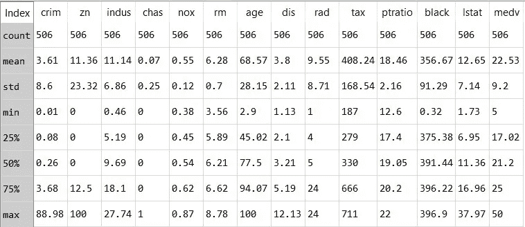

图 1:数据描述

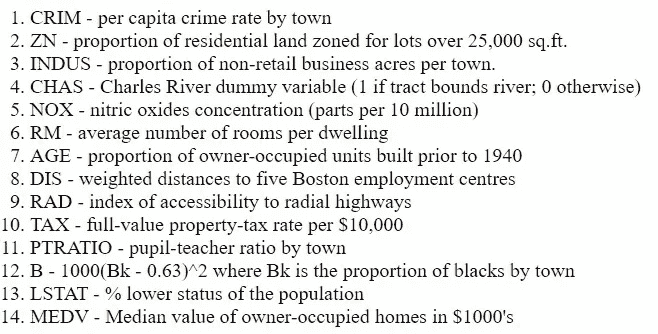

图 2:列描述

图 1 提供了所有列中数据分布的信息。该表用于了解所选功能和目标列的统计信息，以便在数据预处理中采取必要的步骤。下一步是寻找可以使用 data.isnull()获得的 nan/null 值。Python 中的 sum()。

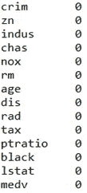

图 3 总空值

从图 3 中可以清楚地看到，数据集中没有空值，因此现在可以对其进行处理以供进一步研究。必须检查目标值中的异常值，因此，为了达到同样的目的，数据的直方图绘制在图 4 中。可以注意到，在该图中，medv 列数据呈正态分布，很少有异常值，即 medv 列数据值为 50 的点。这些异常值可以通过计算 medv 的所有数据点的 Z 分数来去除。z 得分定义为:

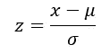

这里，x 是数据点，μ是平均值，σ是标准差。离群值将给出最大的 Z 分数，因此，可以通过设置某个阈值来消除它。在 Python scipy.stats.zscore()中，命令用于找出 Z 得分，阈值 2.7 用于移除这些异常值。

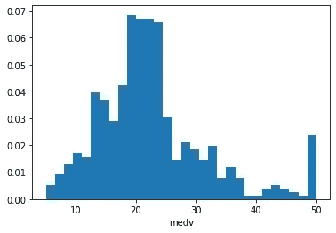

图 4 medv 的分布

下一步是选择实施回归分析的独立变量。为了选择要素，将使用 Python 中的 data.corr()命令计算协方差矩阵，该矩阵将包含每个列相对于所有其他列的协方差。可以使用所有的特征，但是这可能导致过拟合问题，此外，相对于彼此具有相同协方差的特征将产生冗余问题。

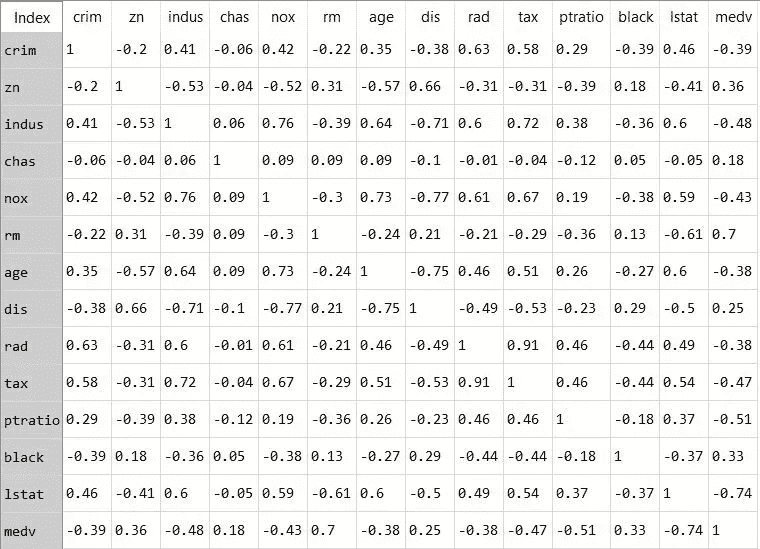

图 5 协方差矩阵

从图 5 中可以看出，indus、rm、tax、ptratio 和 lstat 的协方差接近 0.5 或大于 0.5，因此我们可以绘制一个散点图来进行更详细的研究。

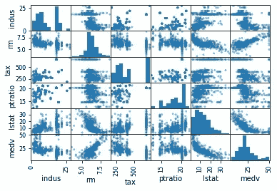

图 6 协方差> 4.8 的要素散点图

图 6 中散点图的最后一行提供了自变量“rm”、“lstat”和“ptratio”与因变量“medv”高度相关的证据。此外，这些特征的协方差大于 0.5，如图 5 所示。因此，特征“每个住宅的平均房间数”、“低地位人口百分比”和“学生教师比率”用于预测波士顿自有住房的中值价格。

# **所选算法的简要概述**

**线性回归**

简单线性回归模型通过一条最佳拟合直线来估计自变量和因变量之间的关系。通过数据拟合该线，使得残差的平方和最小。一条直线的方程式如下:

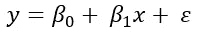

这里，y 是目标值，x 是特征，β0 是线的 y 截距，β1 是斜率，ε是误差。下面的示例图解释了如何使用线性线来实现线性回归。

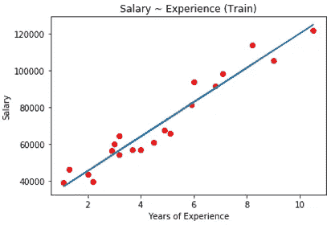

**代价函数:**线性回归的代价函数由残差平方和给出。

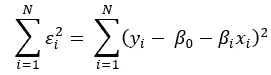

**多项式回归**

当因变量和自变量之间的关系是非线性的时，使用多项式回归，这是解释数据方差的非线性线，因此使用 n 次多项式方程来估计该关系。多项式回归方程由下式给出:

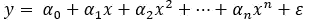

这里，y 代表因变量，α0，α1，α2，…，αn 是权重或参数，x 是自变量，ε是残差。随着阶数 n 的增加，误差减小。但是，阶数应该仔细选择，因为非常高的阶数可能会导致过拟合。下面的示例图解释了如何使用 4 次多项式方程来实现多项式回归。

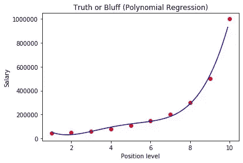

**成本函数:**多项式回归的成本函数由残差平方和给出:

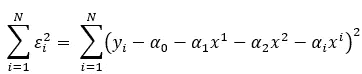

**回归树**

回归树基于决策树的概念。在这种情况下，通过具有节点和叶子的二叉树进行预测，并且在每个节点处，二元条件决定树中的流向，并且一旦到达叶子就进行预测。节点的值代表独立变量的不同区域/组，节点的叶的值是特定区域的平均输出。节点和叶子的那些值被认为降低了成本函数。使用以下虚拟数据可以更好地解释该算法:

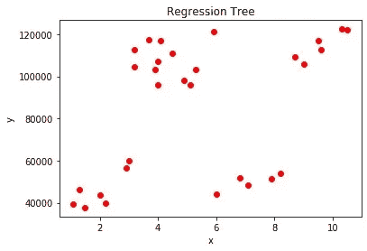

从散点图可以清楚地看出，这里不能使用线性或多项式回归，因为残差会非常高。因此，实现了回归树算法:

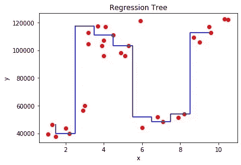

从二叉树和 x 区域的输出中获得输出<4.5 can be explained using the following tree:

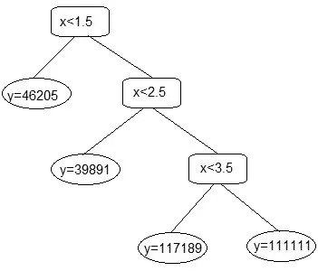

Figure 7 Decision tree

In Figure 7, nodes viz x<1.5, x<2.5 are regions and circled values are leaves which are mean of values in the particular region. If x value is less than 1.5 than output is y=46205 otherwise, x will be checked in every node until it reaches a leaf value.

**成本函数:**成本函数是在所有区域中计算的成本函数的总和，是第 k 区域中的平均响应，并且是目标值，则成本函数定义为:

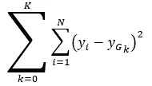

**支持向量回归**

支持向量回归是解决线性和非线性回归问题的一种非常强大的算法。在支持向量回归中，决策边界形成在作为阈值的超参数ε的范围内，并且 SVR 试图在该决策边界内包括尽可能多的数据点。SVR 确保误差在某个阈值内。最接近边界线的向量称为支持向量。SVR 中的核函数有助于处理非线性可分数据，而无需特别将数据转换到新的 z 空间。决策边界内的超平面或线做出新的预测，并且超平面的方程给出为:

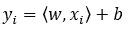

其中 y 是目标，x 是训练样本，w 垂直于超平面。决策边界试图最小化:

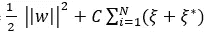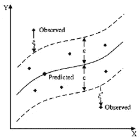

图 8 支持向量回归

**神经网络回归**

神经网络由神经元组成，并且神经网络的最简单形式是感知器，其具有输入，与每个输入、偏差和网络输入相关联的权重被给出为:

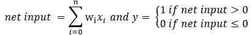

净输入被传递到激活函数，该函数根据阈值给出输出。更复杂的神经网络有许多神经元，形成输入层、隐藏层和输出层。在训练神经网络时，执行前馈操作以获得输出。然后，计算输出误差，并进一步反向传播该误差。这些等式是:

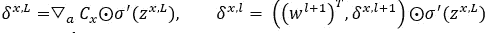

z 是输出，σ是****激活函数。最后，执行梯度下降以达到成本函数的最小值，并更新权重和偏差。新的权重和偏差由下式给出:****

****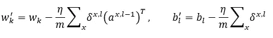****

****w，b 分别是更新权重和偏差，C 是代价函数，是学习率。在神经网络回归中，输入层和隐藏层中可以有多个神经元，但输出层中只有一个神经元。****

****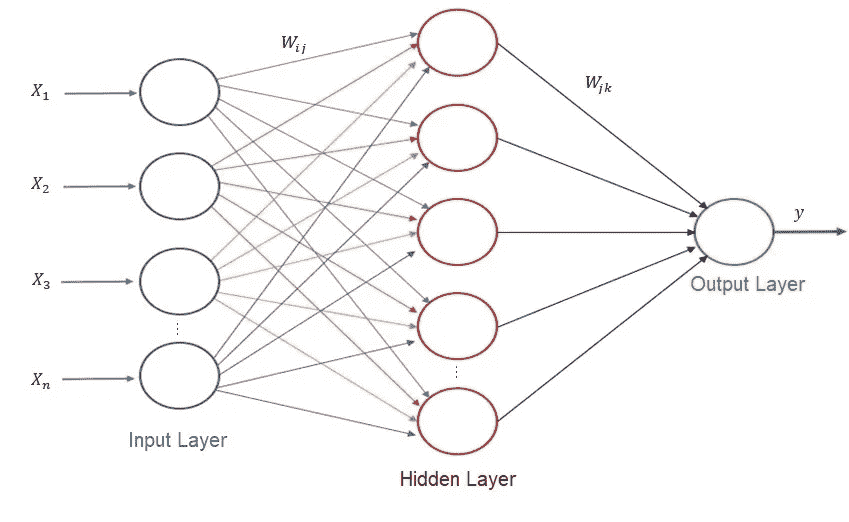****

******代价函数:**神经网络回归的代价函数由均方误差给出:****

****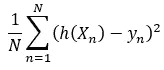****

# ******应用回归算法******

******线性回归******

******数据预处理:**从图 5 中的协方差矩阵可以看出，每套住宅的房间数(rm)和低人口比例(lstat)与我们的目标值高度相关。rm 的协方差值为 0.70，因此它显示出正趋势，lstat 的协方差值为-0.74，因此它与目标 medv 负相关。在下面的散点图中也很明显。****

****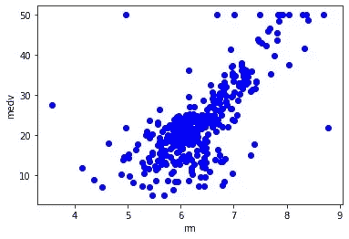********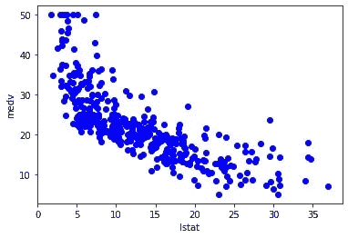****

****可以选择任何一个要素来执行线性回归，因为这两个要素都与目标高度相关，但是 lstat 稍好一些，因此选择 lstat 要素。****

******应用模型:**数据预处理后，下一步是将数据分成训练集和测试集，最后训练模型。sklearn.linear_model。LinearRegression 类帮助执行线性回归。应用了 10 重交叉验证，图 9 描述了在该过程中获得的误差。下面的图是通过线性回归得到的。****

****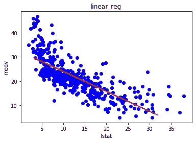****

******多项式回归******

******数据预处理:**为了实现多项式回归，需要对输入数据进行转换，以获得特征的高阶项，例如，对于 4 次多项式，项是必需的。因此，测试和训练数据集的特征向量都使用 sk learn . preprocessing . Polynomial features 进行转换。多项式回归也在特征 lsat 上实现。然而，该模型可以通过曲线实现非线性关系。****

******应用模型:**多项式回归也是用 sklearn.linear_model 实现的。线性回归类和误差如图 10 所示。在应用该模型之后，获得了下面的图。****

****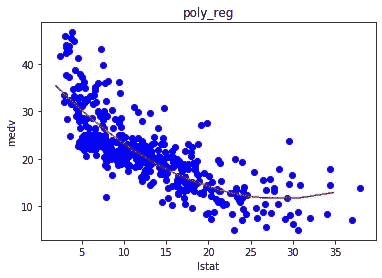****

****从上面的图中可以看出，与直线相比，多项式函数形成的曲线是更好的数据估计。****

******回归树******

******数据预处理:**在回归树中，可以使用三个选择的特征来进行预测。然而，我们需要检查一些特性的差异，以确定是否有任何特性压倒了其他特性。rm 特征的方差为 0.49，lstat 的方差为 50.8。因此，lsat 特征的方差很容易超过 rm，如下面的散点图所示:****

****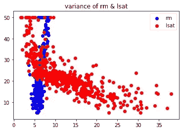********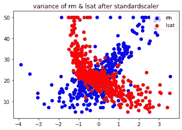****

****为了解决这个问题，在特征数据上实现了 sk learn . preprocessing . standard scaler，以将平均值降低到零，将标准偏差降低到一。****

******应用模型:**使用 sk learn . tree . decision tree regressor 实现回归树模型。下面的图是从测试数据集获得的，该散点图中的点表示测试数据集中的 medv 值和回归树预测的 medv 值:****

****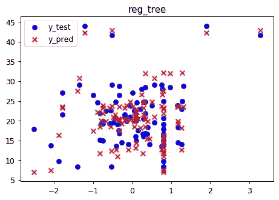****

****从这个散点图可以看出，许多预测输出值与实际值重叠。然而，一些预测的输出不重叠并且远离目标值，并且这些值会导致残留误差。****

******支持向量回归******

******数据预处理:**SVR 的数据预处理类似于回归树的数据预处理。****

******应用模型:**使用 sklearn.svm.SVR 实现 SVR 模型，该模型采用参数，即 kernel、gamma 和 c。此处使用的内核是径向基函数(rbf ),由下式给出:****

****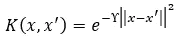****

****这里γ是 0.10。以下图从测试数据集获得，散点图中的点表示测试数据集值中的输出 medv 和 SVR 预测的 medv 值:****

****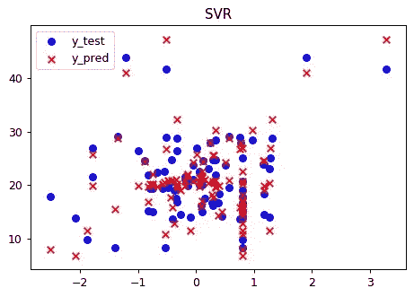****

****在上面的散点图中，可以看到大部分预测输出与实际输出值重叠，或者预测值非常接近实际值，这证明该模型优于回归树。图 12 显示了在交叉验证过程中获得的错误。****

******神经网络回归:******

******数据预处理:**支持向量回归的数据预处理类似于回归树。****

******应用模型:**使用 neural_network 实现神经网络模型。MLPRegressor 采用参数 viz hidden_layer_sizes、activation 和 max_iter。两个隐藏层使用 64 和 32 个神经元，这里使用的激活函数是一个校正线性单元(relu ),最大迭代集是 1000。relu 激活函数的公式为:****

****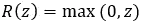********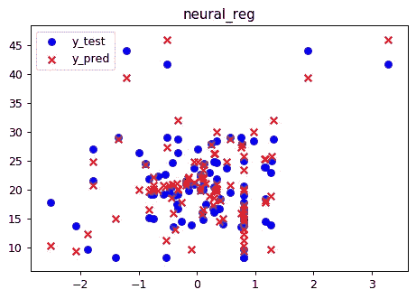****

****神经网络产生的散点图非常类似于 SVR，并且同样好，这就是这两种模型产生的误差非常相似的原因。****

# ******精度对比******

****对于下面提到的所有性能指标，假设 y，h 分别是输入的实际和预测输出值，图 14 中给出了每个模型在 10 倍交叉验证中获得的 RMSE 和 MAPE 误差的平均值****

****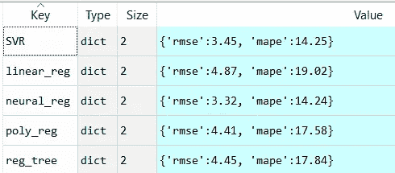****

****图 14 各种模型的误差均值****

******均方根误差(RMSE):** 取残差平方和，然后取总和的平方根计算。RMSE 越小，模型越好。除此之外，RMSE 还描述了最佳拟合线的误差标准偏差，即最佳拟合线的残余误差值的分布。该公式由下式给出:****

****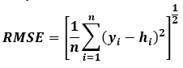****

****线性模型具有最大 RMSE，因此，与该数据集的其他模型相比，它是最差的模型，因为它具有最大的残差。多项式回归模型表现良好，因为数据是非线性的，所以由多项式模型形成的曲线降低了残差，回归树也同样良好。SVR 模型具有非常低的 RMSE，因为 rbf 核在解释自变量和因变量之间的非线性关系方面做得非常好。与产生最小残差的其他模型相比，神经网络模型具有最小的 RMSE，并且由该模型做出的大多数预测非常接近实际输出值。****

******平均绝对百分比误差(MAPE):** 是预测输出相对于实际输入的百分比误差的平均值。它需要绝对值，所以正误差不会抵消负误差。MAPE 不仅比较不同的模型，而且有助于轻松了解特定模型的表现如何。该公式由下式给出:****

****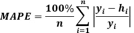****

****线性模型具有最大 MAPE，这意味着它具有最大数量的错误预测值。神经网络模型的预测误差仅为 14.24%，这使其成为该数据集的最佳预测模型。****

# ******代号:******

****代码请参考下面的 GitHub 链接。****

**** [## khushwant 18/回归分析

### 此时您不能执行该操作。您已使用另一个标签页或窗口登录。您已在另一个选项卡中注销，或者…

github.com](https://github.com/khushwant18/Regression-analysis) 

# **参考文献**

Harrison d .和 Rubin feld d . l .，《享乐价格和对清洁空气的需求》，J. Environ。经济学与管理学，第 5 卷，81–102 页，1978 年。可用:[http://lib.stat.cmu.edu/datasets/boston](http://lib.stat.cmu.edu/datasets/boston)

房屋图片:[https://news . northeast . edu/2019/07/30/greater-Boston-housing-report-card-下划线-housing-challenges-in-the-greater-Boston-area/](https://news.northeastern.edu/2019/07/30/greater-boston-housing-report-card-underscores-housing-challenges-in-the-greater-boston-area/)****