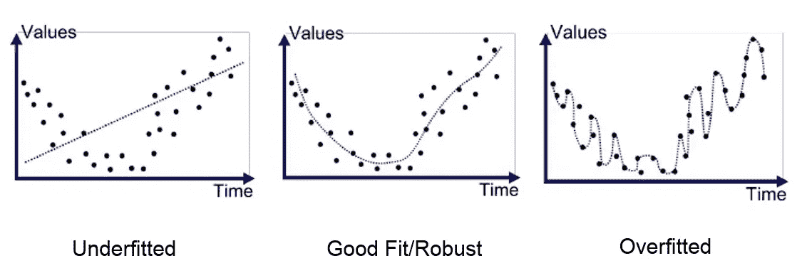

# 15 个问题中的机器学习

> 原文：<https://medium.com/analytics-vidhya/machine-learning-in-15-questions-e0c47afd9157?source=collection_archive---------18----------------------->

不，这不是关于终结者…

关于 ***机器学习*** 说了很多。一些人认为它是一个将人类引向灭亡的怪物。其他人认为它是解决他们所有疾病的魔术师。实际上要比这简单得多(也没那么可怕)。

# 什么是机器学习？

机器学习是一种允许使用数据进行自动系统改进的技术。

数据爆炸的数量以及处理和存储技术的进步，已经帮助机器学习在许多领域建立起来。

# 机器学习是如何工作的？

这个神秘的名字背后隐藏着一个非常简单的概念。为了便于学习，该系统受到数据库中现有样本的启发。这有助于它理解要求它执行的任务。

先说清楚。

并不是因为我们在讨论机器学习，就要想象机器人在教室里上课:-)。

# 机器学习、深度学习和人工智能有什么联系？

像许多其他有争议的领域一样，人工智能和机器学习是许多辩论的主题。这样做的后果之一，是许多流行语的爆发。我们最终有点迷失了。

实际上，深度学习只是机器学习的一个子集。这是人工智能的一个子集。这是它看起来的样子。

# 机器学习有哪些应用？

机器学习建立在非常多的领域中。机器学习模型所能实现的并没有真正的限制。只要有数据，就可以用机器学习。

例如，在金融领域，股市波动似乎没有预测的余地。然而，机器学习提供了一个解决方案。它可以让你对股票市场份额的变化给出精确的预测。

机器学习也正在成为医疗保健的一个主要工具。现在医生经常用它。......的药未来经常与 3 P 联系在一起:预防、预测和个性化。这些都是 ML 系统可以帮助完成的任务。

尤其是在医学成像领域，今天的 ML 系统脱颖而出。近年来，计算机视觉方面的进展令人印象深刻。今天的人工智能在检测癌症肿瘤或计算骨龄等任务上至少和医生一样强大。

更普遍地说，人工智能代表着公司的巨大发展机遇。它允许通过决策支持工具建立长期战略。

机器学习使得回答以下问题成为可能:我应该继续这个建筑项目吗？该候选人的个人资料是否与该职位相对应？从现在到 2025 年，电动汽车市场将如何演变？以及数以百万计的其他特定于每个活动的问题。

# 有监督学习和无监督学习有什么区别？

ML 本质上分为两种学习模式。监督学习和非监督学习。

在监督学习中，可用数据被标记。模型的输出是已知的。例如，当我们训练神经网络时，就是这种情况。

反过来，我们做无监督学习的时候，让模型自己训练，不标注数据。最广泛使用的无监督聚类算法之一是 k-means。我们给算法我们数据集的所有点。该模型的目标是找到这些相同点的输出，并将其分成几个类别。

# 机器学习模型的可解释性是什么？

我们今天使用的许多模型是我们所谓的*黑盒*。这意味着它们是不透明的，它们的内部功能没有被完全了解。

性能-可解释性困境在数据科学中是众所周知的。通常最有效的模型是黑盒，其功能是最难解释的。

# 机器学习项目的步骤是什么？

当我开始从事数据科学项目时，我惊讶地发现构建模型只是漫长过程中的一小步。

项目通常以这种方式划分:

1.  数据收集和存储
2.  预处理(数据清理和首次分析)
3.  模型构建
4.  性能研究和最佳模型的选择
5.  模型部署

# 什么是预处理？

与普遍的看法相反，数据清理是机器学习项目的主要任务。这是一个遗憾(至少在我看来🙂)，因为比设计模型好玩多了！我们在上游做的所有这些工作就是我们所说的预处理。

预处理技术取决于项目和您正在处理的数据类型。通常，以下步骤如下:

1.  缺失值的处理
2.  寻找相关性或差异
3.  粉碎
4.  特征编码
5.  在训练/测试中切割数据

# 我们如何衡量一个模特的表现？

在将模型投入生产之前，会有一个完整的验证阶段开始。你必须非常细致。否则你会以这种模式结束:

https://www.youtube.com/watch?v=HjJmO9NvKL8

首先，在训练模型之前，我们确保将可用数据分成许多部分。训练数据集和测试数据集。这被称为交叉验证。

这使得测试模型成为可能，一旦模型被训练，这一步是必不可少的。它确保了模型的可靠性，同时也允许我们比较几种方法，以确定哪一种是最有趣的。

# 什么是过度拟合，如何避免？

过度拟合是数据科学家最大的敌人。当模型试图过多地依赖数据时，就会出现这种情况。因此，它不再具有普遍性。

在我们知道如何避免过度拟合之前，我们必须学会如何检测它。

在这条曲线上(你总是要画出这条曲线来检查模型性能),我们可以看到，从某一点开始，我们对测试数据的准确性下降了。这意味着模型开始变得越来越低效。我们过度适应了。

有几种方法可以避免过度拟合:

1.  交互效度分析
2.  为训练添加更多数据
3.  提前停止(在训练结束前停止)
4.  正则化(例如神经网络的退出)

# 机器学习用的工具有哪些？

在构建机器学习项目时，许多工具都非常有用。对于模型开发，我们使用强大的对象编程语言，如 Python 或 c。

Python 仍然是参考语言。它有一个非常活跃的开源社区，允许拥有非常强大的模块，如 Pandas、Tensorflow 或 Scikit-learn。它们使得机器学习模型更容易实现。如果要列出机器学习中使用的所有工具，那就太长了。如果我必须只保留 3 个(用于模型构建部分)，我会选择这些。

# 机器学习的主要算法有哪些？

有很多机器学习模型。今天最流行的是深度学习算法，它们可靠，易于训练，大多数时候都能给出相当好的结果。

有大量的方法取决于你想做什么。

*进行聚类:*

1.  k 个最近邻
2.  k 均值
3.  DBScan
4.  逻辑回归
5.  支持向量机(SVM)

*神经网络:*

1.  长短期记忆(LSTM)
2.  卷积神经网络(CNN)
3.  生成逆向串行网络
4.  自动编码器
5.  感知器

*决策树:*

1.  随机森林
2.  极端梯度增强(XGBoost)
3.  adaboost 算法
4.  光梯度推进机(LightGBM)
5.  CatBoost

对于所有这些算法，人们可能会想选择哪一个。下一个问题的过渡是完美的🙂

# 我们如何选择一种方法？

机器学习是一个选择的问题。从数据到要使用的算法，数据科学家需要做出许多决策。要使用的算法的选择可能是最关键的。

选择型号时，需要考虑几个标准:

1.  你想执行什么任务？预测？回归？聚类？
2.  数据有标签吗？
3.  您使用的是什么类型的数据？是图像吗？是短信吗？是 audios 吗？
4.  你的数据集有多大？

# 机器学习的极限是什么？

人工智能通常被视为一种神奇的工具，能够做任何事情。事实上，事情没有这么简单。模型通常需要大量数据才能给出好的结果。

我经常喜欢回忆营销是如何让人工智能比实际情况更令人印象深刻的。今天的模型非常有限，它们需要大量的训练，并且不太通用。

# 一个机器学习科学家应该具备哪些知识？

今天，数据科学家很受欢迎。一个机器学习工程师必须既有理论技能又有实践技能。他或她必须是一个非常优秀的统计学家，这对于正确理解不同的算法及其微妙之处是必不可少的。从更实际的角度来看，他必须熟悉 Python 等编程工具。

如果您有任何其他问题，请在评论部分提出:)

别忘了鼓掌(或者两下，或者三下……四下？)并订阅！