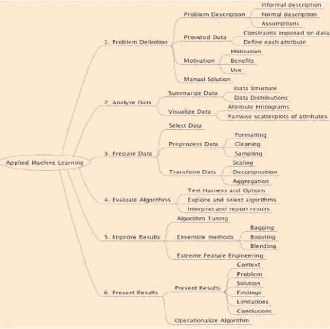

# 机器学习在行动

> 原文：<https://medium.com/analytics-vidhya/machine-learning-in-action-49d64d645647?source=collection_archive---------26----------------------->

机器学习是对算法和统计模型的科学研究，计算机系统使用这些算法和统计模型来有效地执行特定任务，而不使用显式指令，而是依靠模式和推理。当机器的性能随着经验的增加而提高时，我们称之为学习。学习需要捕捉数据并找出有趣或有用模式的算法和程序。

我们可以通过以下六个步骤来应用机器学习模型

1.问题定义

2.分析数据

3.准备数据

4.评估算法

5.改善结果

6.呈现结果

## 问题定义

在这个过程中，我们以正式和非正式的方式定义了我们的问题，同时我们也考虑了与我们的问题相关的假设。数据的每个属性及其关系、益处和用途都必须明确定义，因为正确理解数据非常重要。我们还为我们的问题准备了一个手动解决方案

## 分析数据

分析数据有两个步骤。我们做的第一件事是使用数据结构总结我们的数据，并进行数据分发。当组织分类数据的分布时，每个组中个体的数量或百分比。当组织数字数据的分布时，它们通常从最小到最大排序，分成合理大小的组。第二步是观想。在这里，我们用图表而不是数字来展示我们的数据。当数据可视化时，更容易看到新兴趋势，这也是交流发现的有力方式，因为快速直觉可能支持更容易的协作和更快的创新。

## 准备数据

数据准备是解决任何问题的重要步骤。在这个过程中，我们对数据进行预处理和转换。数据预处理是一种数据挖掘技术，涉及将原始数据转换成可理解的格式。真实世界的数据通常是不完整的、不一致的或缺少某些行为或趋势，并且很可能包含许多错误。数据预处理是解决这类问题的一种行之有效的方法。预处理可以通过格式化、清洗和采样来完成。预处理之后，我们将数据或信息从一种格式转换成另一种格式，通常是从源系统的格式转换成新的目标系统所需的格式。这是通过缩放、分解和聚合完成的

## **评估算法**

算法评估包括以下三个步骤

1.  试验用接线
2.  探索和选择算法
3.  解释和报告结果

**测试线束**

Test harness 是用于在开发过程中测试模型的软件和测试数据的集合。providessaconsistentwaytoevaluateamachineinlearningalgorithmsonadataset .它必须允许 differentmachinelingalgorithms 进行评估，而数据集、重采样方法和性能度量保持不变。

**探索和选择算法**

在这一步中，我们将探索我们的问题，无论是分类、回归还是聚类，并为该问题选择最佳算法。参数化、内存大小和过拟合倾向是帮助我们选择正确算法的重要因素

**口译和报告撰写**

在数据采集和处理过程之后，有必要对这些数据进行一些解释，以便提供更具可读性的信息，并强调值得特别注意的方面。我们的报告和解释服务包括试验结果的总结报告和口头解释

## **提高成绩**

我们总是试图获得更高的精度和最小的误差，为此我们做特征工程和集成方法。特征工程是使用数据的领域知识来创建使机器学习算法工作的特征的过程。特征工程是机器学习应用的基础。集成方法是一种机器学习技术，它结合了几个基本模型，以便产生一个最佳预测模型。可以通过装袋、助推和混合来实现

## 呈现结果

最后一个阶段是展示我们的结果，其中应包含以下内容

1.  语境
2.  问题
3.  解决办法
4.  调查的结果
5.  限制
6.  结论