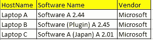
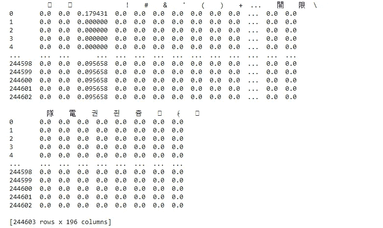

# 网络安全中的机器学习——恶意软件安装

> 原文：<https://medium.com/analytics-vidhya/machine-learning-in-cyber-security-malicious-software-installation-5dbbf742af36?source=collection_archive---------14----------------------->

## 通过在字符提取上应用 TF-IDF 进行本地管理活动监控的真实用例


# 介绍

> 对 SOC 分析师和安全专业人员来说，由本地管理员监控用户活动始终是一项挑战。大多数安全框架会建议实现白名单机制。
> 
> *然而，现实世界往往并不理想。总是会有不同的开发人员或用户拥有本地管理员权限来绕过指定的控件。有办法监控本地管理员的活动吗？*

# 先说数据来源



数据集外观的示例—上面列出的 3 个条目指的是同一个软件

数据集的外观示例—上面列出的 3 个条目指的是同一个软件

我们有一个定期的批处理作业来检索安装在位于不同地区的每个工作站上的软件。大多数安装的软件都以当地语言显示。(是的，你能说出它的名字——它可能是日本的、法国的、荷兰的…..)因此，您会遇到这样的情况:安装的软件显示为 7 个不同的名称，而它指的是白名单中的同一软件。更不用说，我们有成千上万的设备。

# 数据集的属性

*   **主机名** —设备的主机名
*   **发布者名称** —软件发布者
*   **软件名称** —当地语言的软件名称和不同版本号

# 我们有办法识别非标准安装吗？

我的想法是，公司使用的合法软件应该有不止一个安装，并且软件名称应该不同。在这种情况下，我相信使用机器学习来帮助用户对软件进行分类并突出任何异常值将是有效的。

**使用词频的字符处理—逆文档频率(**[**TF-IDF**](https://www.analyticsvidhya.com/blog/2020/02/quick-introduction-bag-of-words-bow-tf-idf/)**)**

自然语言处理(NLP)是人工智能的一个子领域，处理理解和处理人类语言。鉴于机器学习的新进展，许多组织已经开始将自然语言处理应用于翻译、聊天机器人和候选人筛选。

TF-IDF 是一种统计度量，用于评估单词与文档集合中的文档的相关程度。这是通过将两个度量相乘来实现的:一个单词在一个文档中出现的次数，以及该单词在一组文档中的逆文档频率。

TF-IDF 通常用于单词提取。然而，我在想它是否也适用于炭的提取。我们的想法是通过导出软件名称中每个字符的重要性来探索如何应用 TF-IDF 来提取与软件名称中每个字符相关的特征。下面的脚本示例演示了我如何将 TF-IDF 应用于我的数据集中的软件名称字段。

```
import pandas as pd
from sklearn.feature_extraction.text import TfidfVectorizer# Import the dataset 
df=pd.read_csv("your dataset")# Extract the Manufacturer into List 
field_extracted = df['softwarename']# initialize the TF-IDF 
vectorizer = TfidfVectorizer(analyzer='char')
vectors = vectorizer.fit_transform(field_extracted)
feature_names = vectorizer.get_feature_names()
dense = vectors.todense()
denselist = dense.tolist()
result = pd.DataFrame(denselist, columns=feature_names)
```

结果片段:



**上述 TF-IDF 脚本的结果(混合了不同语言，如韩语、中文)**

在上图中，您可以看到执行了一个计算来评估每个字符对软件名称的“重要性”。这也可以解释为每个软件名称上有“多少”指定的字符可用。通过这种方式，您可以统计地呈现每个“软件名称”的特征，我们可以将这些特征放入您选择的机器学习模型中。

我提取的其他特征相信对模型也有意义:

```
import math
from collections import Counter# Function of calculating Entropy 
def eta(data, unit='natural'):
    base = {
        'shannon' : 2.,
        'natural' : math.exp(1),
        'hartley' : 10.
    }if len(data) <= 1:
        return 0counts = Counter()for d in data:
        counts[d] += 1ent = 0probs = [float(c) / len(data) for c in counts.values()]
    for p in probs:
        if p > 0.:
            ent -= p * math.log(p, base[unit])return ententropy  = [eta(x) for x in field_extracted]
```

*   空间比率—软件名称有多少个空格
*   元音比率—软件名称有多少个元音(aeiou)

最后，我用标签列出了上面列出的这些特征，并与 **randomtreeforest 分类器**进行了比较。你可以选择任何你喜欢的分类器，只要它能给你一个满意的结果。

感谢阅读！

*原载于 2020 年 9 月 16 日*[](https://www.analyticsvidhya.com/blog/2020/09/machine-learning-in-cyber-security-malicious-software-installation/)**。**