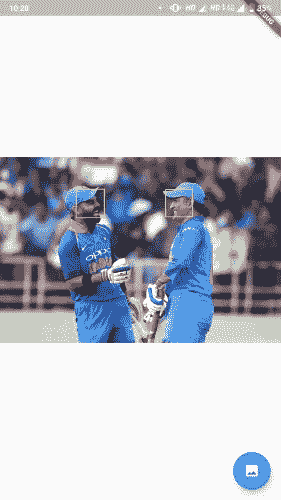

# 颤振中的机器学习

> 原文：<https://medium.com/analytics-vidhya/machine-learning-in-flutter-315870669f1f?source=collection_archive---------13----------------------->


机器学习和颤振是我最喜欢的两个话题，我越来越喜欢探索它们！在这篇文章中，我将解释如何使用 flutter 中插件的力量将机器学习整合到你的 flutter 应用程序中。所以让我们开始吧！

我将解释如何在 firebase_ml_vision、tflite 和我构建的 API 的帮助下制作一个具有多个 ML 特性的应用程序！

**我们将制作的特性**:

*   光学字符识别以及将识别的文本转换成语音。
*   人脸检测。
*   物体检测。
*   图像标记以及将图像标记转换成语音。
*   用我在我的项目中开发的 API， [Genderify](https://github.com/mayanktolani19/Genderify) 将名字分类为男性或女性。


主页

**入门:**

*   依赖关系:


*   将 Firebase 添加到您的项目中:

使用 [Firebase 控制台](https://console.firebase.google.com/)向您的项目添加一个 Android 应用程序:跟随助手，下载生成的`google-services.json`文件并将其放入`android/app`中。接下来，修改`android/build.gradle`文件和`android/app/build.gradle`文件，按照 Firebase assistant 的描述添加 Google 服务插件。

为了更清楚，你可以参考视频。[https://www.youtube.com/watch?v=DqJ_KjFzL9I](https://www.youtube.com/watch?v=DqJ_KjFzL9I&t=0s)

*   确保在`android/app/build.gradle`文件中`android`块下的`defaultConfig`块中 minimumSdkVersion 至少为 21。如果没有，那就换一个。

## **1。光学字符识别**

*   使用图像拾取器拾取图像

图像的来源可以更改为相机。

图像被解码，因为这是 OCR 读取文本的要求。

*   从图像中读取文本并将识别的文本馈送到文本到语音(TTS)库。


OCR 演示。请忽略悬浮动作按钮和小字号隐藏的“明天”。

## 2.人脸识别

*   如前所示选择图像。
*   创建一个人脸检测器实例，并使用 visionImage 调用 processImage。
*   将面的坐标添加到<rect>类型列表中。</rect>
*   自定义画师将使用这些坐标在图像上绘制边界框。

调用自定义 Painter 类，并向其传递<rect>列表和图像(我将在本文末尾链接我的 github repo，这样您可以看到我是如何实现所有内容的)。</rect>



人脸检测演示。两个我最喜欢的球员在一个画面里。

## 3.图像标注

将以下内容添加到您的`android/app/build.gradle`文件中。

```
android {
    dependencies {
        // ...

        api 'com.google.firebase:firebase-ml-vision-image-label-model:17.0.2'
    }
}
```

走到这一步，你知道第一步总是选择图像。

*   使用 Image Labeler 类检测选定图像中的所有标签。
*   将标签文本输入 TTS 对象，以便将其转换为语音。


图像贴标机演示。这些是我的一些大学朋友。

## 4.目标检测

这部分是我的项目中最不稳定的部分，但我正在努力。对象检测库很难检测到对象，并且大多数时候会给出不好的结果。我不会在这篇文章中附上 github gists，因为这会使这一部分有点冗长，所以你可以参考我在本文末尾附上的源代码。

现在，为此你需要在你的项目中预装一个 tflite 和 yolo 模型。创建一个新的资产文件夹，并将模型存储在其中。您可以参考我的存储库中的 assets 文件夹，从那里下载模型。

此外，您需要在`android`块的`android/app/build.gradle` 中添加以下内容。

```
aaptOptions {
        noCompress 'tflite'
        noCompress 'lite'
    }
```

现在每个人都知道如何选择图像，所以让我们跳过它。

*   在`initState()`里面加载 tflite 模型。
*   对所选图像应用预测。
*   渲染这些框，使它们与标签和可信度一起在图像上可见。


物体探测演示。

# **奖励部分:**

## 5.性别化:根据性别将名字分为男性和女性。

这并没有使用 flutter 插件，而是我在我的项目中构建的 API:

[](https://github.com/mayanktolani19/Genderify) [## mayanktolani19/Genderify

### Genderify 是一个基于名字的性别分类，建立在 Flask 的基础上，利用逻辑回归。…

github.com](https://github.com/mayanktolani19/Genderify) 

> 它由 heroku 主办。下面是访问 API 的方法。

该模型是根据外国名字训练的，因此它对印度名字的准确性较低。


将 url 中的最后一个参数更改为您想要的名称。


性别化示范。

这是我的完整项目的源代码。请留下一颗星星。如果你想的话，我欢迎你的 UI 贡献！

[](https://github.com/mayanktolani19/flutter_mlkit) [## mayanktolani19/flutter_mlkit

### 新的颤振应用。光学字符识别以及将识别的文本转换成语音。脸…

github.com](https://github.com/mayanktolani19/flutter_mlkit) 

这是我的第一篇媒体文章，为此我很努力，所以如果你喜欢我的作品，请留下一些掌声。这将鼓励我在未来写更多！