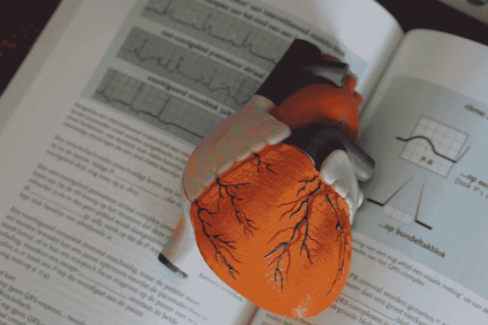

# 在卫生技术行业使用机器学习

> 原文：<https://medium.com/analytics-vidhya/machine-learning-in-health-technology-industry-63860d6571c4?source=collection_archive---------15----------------------->

## 心电图心跳信号分类

Robina Weermeijer 在 [Unsplash](https://unsplash.com?utm_source=medium&utm_medium=referral) 上的照片

给定一组 [ECG](https://en.wikipedia.org/wiki/Electrocardiography) 条带图像，受过训练的人眼可以在每幅图像中找到 [V-beat](https://github.com/JNYH/ecg_vbeat/blob/master/v-beats-features.pdf) 的位置。心电图记录了心跳中[室性早搏](https://en.wikipedia.org/wiki/Premature_ventricular_contraction)期间的 V-beat。