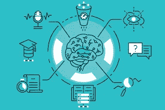
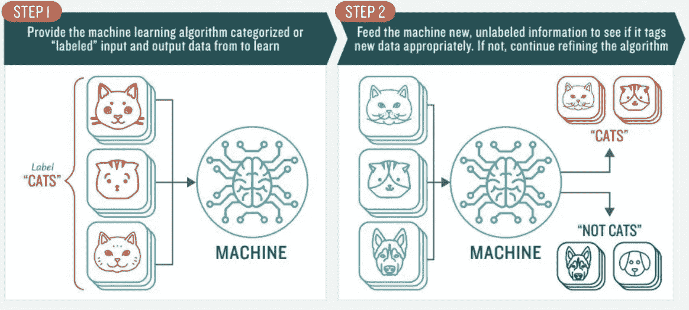
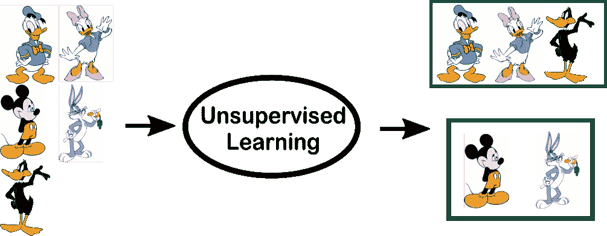
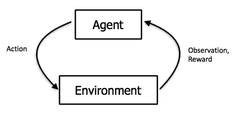
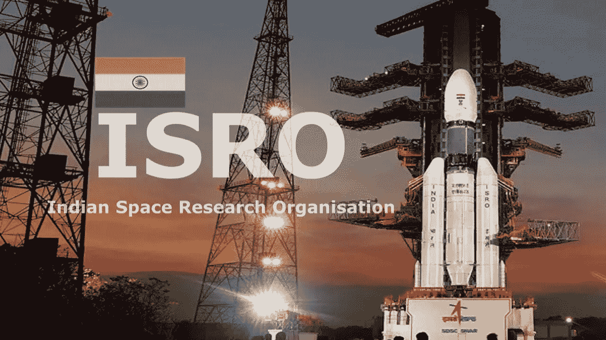
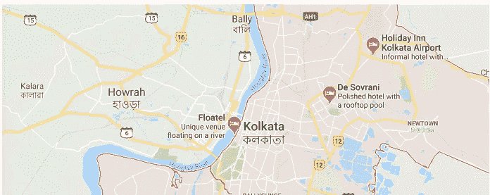
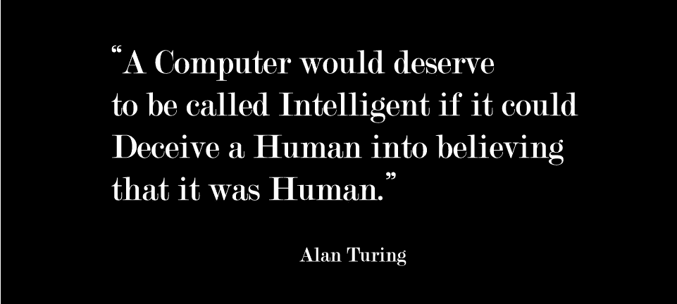

# 机器学习:通俗地说！

> 原文：<https://medium.com/analytics-vidhya/machine-learning-in-laymans-terms-f328c9a97112?source=collection_archive---------2----------------------->

> 能够深入浅出地向任何人、任何人解释热门话题，是不是很神奇？

我和一个来自完全不同领域的朋友交谈，第一个问题是，“什么是机器学习，它对我们这一代有什么影响？”

向计算机科学领域的学生解释这一点会很容易，因为我们可以简单地说，“机器学习是人工智能的应用，它赋予计算机无需显式编程即可学习的能力，或计算机学习执行特定任务的能力。”但是向完全不同领域的人解释机器学习和向一个 5 岁的孩子解释是一样的。

## 那么你会如何向一个外行解释机器学习呢？

机器学习(ML)和婴儿学走路是一样的。每次跌倒，他们都在不知不觉中学习&意识到下一次尝试的更好位置。下一次他们摔倒时，他们学会了“不要再那样站着”。为了避免再次摔倒，他们会从门、墙或附近的任何东西上寻找支撑，这有助于他们站稳，从而学习。同样，一台机器是这样工作和发展的。

就像人类一样，计算机可以从三个来源学习。

*   首先是**监督学习**或者观察其他人在类似情况下做了什么。*举个例子:你得到一堆关于哪些是猫的信息，然后训练一个模型来回答新数据是否也是猫的。*

监督学习

**进一步的监督学习可以分为:**

1.  **分类**:一个分类问题是当输出变量是一个类别时，比如*“猫”*或者*“其他”*或者*“疾病”* - *“无疾病”或者“公司 logos”“图片”*。
2.  **回归**:回归问题是当输出变量是一个实值时，比如“时间”或*“身高”*或*“体重”*。

*   第二种是**无监督学习**，它精确地观察一种情况，并试图当场提出最佳算法来获得答案。*例如:你有一堆 6 个人的照片，但是没有关于谁在哪个人身上的信息，你想把这个数据集分成 6 堆，每堆有一个人的照片。*

甚至无监督学习也被分为两类:

1.  **聚类**:聚类是您想要发现数据中的内在分组，比如根据客户过去的购买情况对他们进行分组。
2.  **关联**:关联是你想要发现描述大部分数据的规则的地方，比如购买 X 的人也倾向于购买 y。

强化学习

*   第三是**强化学习**或从以前的错误/成功中学习。*举个例子:假设你是一个棋手，和同一个对手对弈。你预测了一些移动，但是注意到玩家玩了另一个特殊的开局。那你会怎么做？你将预测 3 到 4 次，第 5 次你将了解对手的开局。如果计算机做到这一点，它被称为机器学习。通过一个称为训练集的集合，你将训练机器根据输入进行自我修正。*

# 机器学习对我们这一代人的影响:

机器学习正在逐步发展，是计算历史上潜在的游戏改变者。

我们可以看到机器学习在任何地方被用于各种目的，并帮助技术发展。我们最常发现使用 ML 的地方是:

## ***社交媒体:-***

***1。面部检测和识别(标记朋友):*** 由于机器学习的进步，现在相机可以比以前更准确地检测到某人何时微笑。同样，由于机器学习，个人的照片可以通过计算机程序进行识别。以脸书为例，当你上传一张图片时，它会询问你是否想在图片中给你的朋友添加标签。这是由脸书的人脸检测和识别算法完成的。

*2* 。 ***好友建议*** *:* 脸书利用聚类算法，根据兴趣等，分析查找你所在城市附近、来自你所在学校/学院的好友。

***3。社交媒体的新闻提要*** *:* 你会注意到，你通常会看到你之前看过的类似图片或视频，如果你与任何人有过互动，你会开始在你的新闻提要中看到他们的帖子比其他人的帖子更靠前。

## 印度空间研究组织(ISRO)

***ISRO****在很多地方使用机器学习，但主要应用是遥感中的模式识别和分类。印度在这一领域领先。所有主要的分类算法都使用 Mahalanobis 距离来分离不同的类。*

## *谷歌:-*

**

*加尔各答的谷歌地图*

1.  **谷歌地图- 当我们想要搜索一个地点，并开始在搜索框中键入时，它会自动猜测您可能正在寻找的地点，并提供建议的搜索词。这些建议可以基于过去的搜索，现在流行什么，或者你当时在哪里。**
2.  *****谷歌助手-*** 它是在 Android 上用人工智能备份的机器学习，帮助我们处理日常工作。它帮助我们通过打电话或发短信来设置提醒。**

## **广泛使用 ML 的其他领域有:-**

*   ***宝莱坞行业:*分析剧本、票价等。**
*   ***医疗保健部门:*检测疾病，搜索以前的报告，分析药物摄入等。**
*   ***银行部门:*侦查欺诈，检查以前的交易等*。***
*   ***网上购物网站:检查是否提前购买，解码位置以便于发货等。***

# **结论:**

> **简而言之，机器学习就像一个数学学生，他被给予大量的练习题，并被指示通过找到这些问题中的信息和它们的相关答案之间的模式来找到解决这些问题的方法。能够找到最有效的数据以产生最佳性能非常重要。机器学习行业将在未来几年内增长，并给我们的生活和世界带来重大变化，因此也将是一个有趣的研究和贡献领域。机器学习的一个突破将价值十个微软！**

****