# 机器学习在医学领域能有用吗？预测心脏病！！

> 原文：<https://medium.com/analytics-vidhya/machine-learning-in-medical-field-ec8e530af6b3?source=collection_archive---------17----------------------->

图片来自这个[网站](https://associationsnow.com/2018/03/heart-association-duke-partner-using-ai-cardiovascular-disease-research/)

在这篇文章中，我将测试机器学习在医疗领域的有效性，尤其是在对一个人是否患有心脏病进行分类方面。

同样，我将指导您从 scikit-learn 库中构建一些分类器，然后我们将突出显示最佳准确性。

> **请注意，这个帖子是给任何人的:**
> 
> -希望了解医学领域中 ML 优势的非技术人员。
> 
> -希望回顾数据探索和分类器构建的基本技术并需要完整实现代码的技术人员。

# ***问题陈述***

[据世界卫生组织](https://www.who.int/health-topics/cardiovascular-diseases/#tab=tab_1)统计，每年有 1790 万人死于心血管疾病。

我们的目标是帮助医生更快地诊断心脏病，并告知高危患者。

通过这篇文章，我们将试图解决这些重要的问题:
1-谁更容易患心脏病？女性还是男性？
2-什么年龄最容易患心脏病？
3-胸痛可能会使人患心脏病吗？暴露最多的胸痛类型有哪些？
4-糖尿病和心脏病有关系吗？

最后，预测一个人是否患有或可能患有心脏病。

# **数据集**

通过此链接从 Kaggle 加载心脏病数据集。
该数据集包含 1025 个患者数据，每个数据有 14 个属性。
后的**为有/无心脏病患者的百分比。**

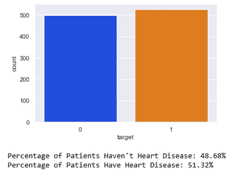

# **数据调查**

缺失值和处理分类变量给用 sklearn 拟合机器学习模型带来了一些复杂性。

因此，首先，我们将检查缺失值和变量的数据类型。

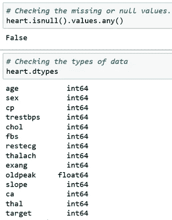

没有缺失值，所有特征都是数字的。

**探索性数据分析(EDA)**

如果有人对每个属性的确切含义感兴趣，请查看下方的截图**。**

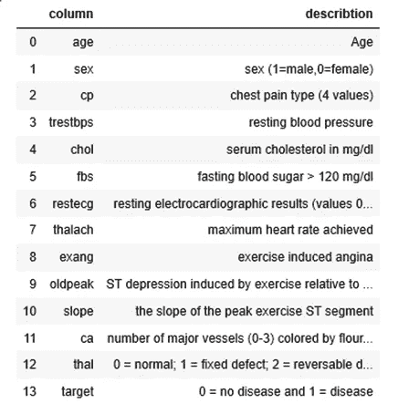

正如我们在上面看到的，所有的变量都有数值。
因此，我们使用直方图来定义分类变量。

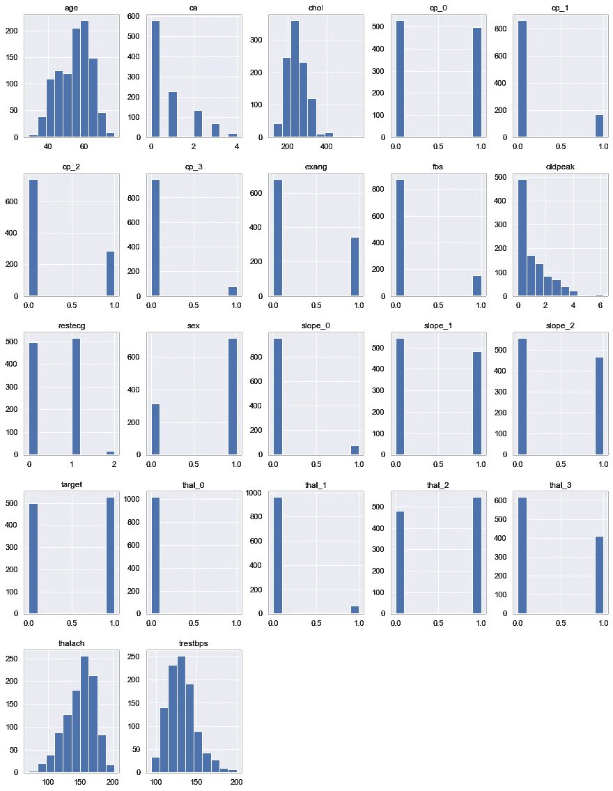

通过直方图我们可以看到以下变量是分类的:
**ca、cp、exang、fbs、restecg、性别、slop、target、thal。**

> ***1-哪些人更容易患心脏病？女性还是男性？***

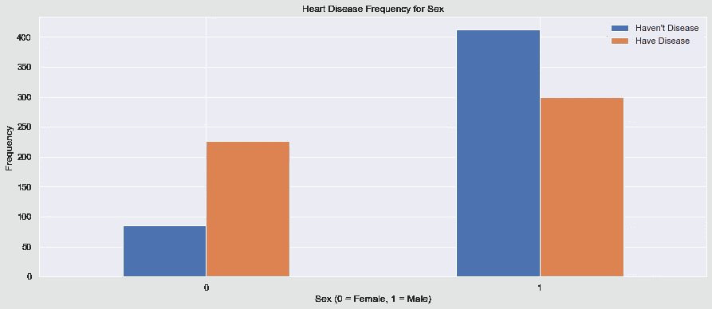

我们可以看到男性比女性更容易被感染，但我们无法完全确定，因为数据库中的男女人数不平衡。

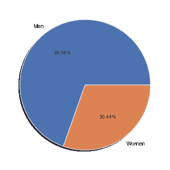

> ***2-什么年龄最容易患心脏病？***

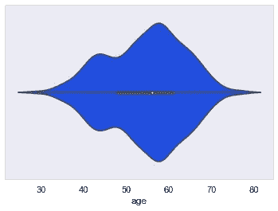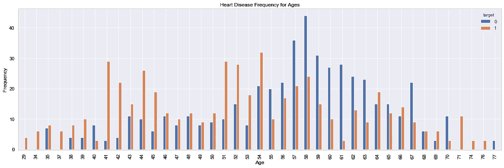

经过前面的情节，我们可以说，五十岁这个年龄段是最容易被感染的。

> ***3-胸痛可能会使人患心脏病吗？暴露最多的胸痛类型有哪些？***

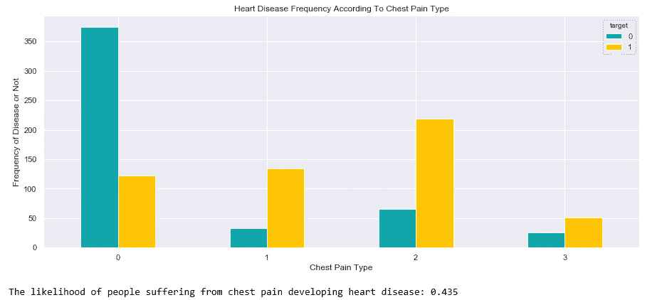

是的，胸痛可能会导致心脏病，当它与年龄等其他因素有关时，它的影响可能会增加。

> ***4-糖尿病和心脏病有关系吗？***

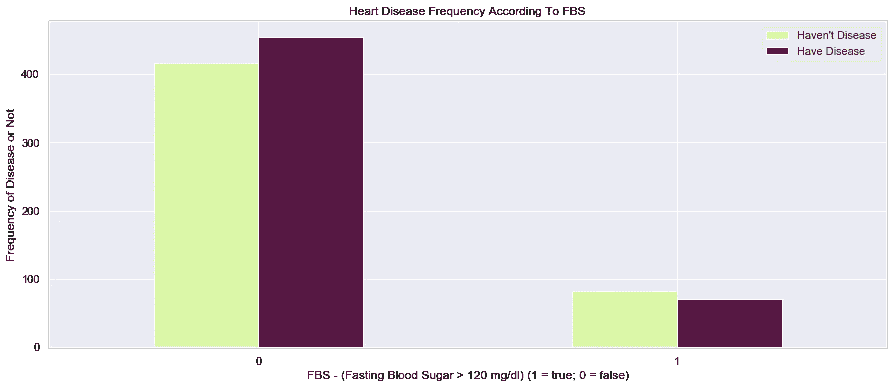

我们可以看到糖尿病和心脏病之间有明显的关系。

**与目标关系密切的变量有:**

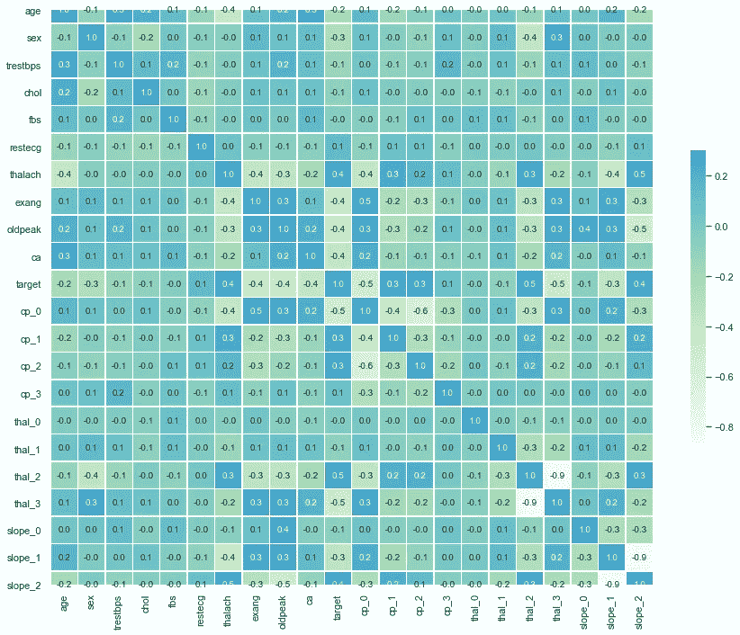

(thal，thalach，cp，slop)这些变量与目标有很强的关系。

> ***模型精度:***

在执行超参数调整以提高 ML 分类器的性能之后，我得到的最佳精度是:

这意味着上述数据在心脏病分类中非常有用。

## GitHub 代码

要获取这篇文章的代码，请[点击这里](https://github.com/aljawharah-20/Heart-Diseases-Prediction)。

# **最后的话**

这是一个简单的数据探索，绘图和建立分类器的会议，
我希望在不久的将来创造更多的进步。如果发现任何错误，请发邮件到 aljawharah.aldukhayni@gmail.com 给我