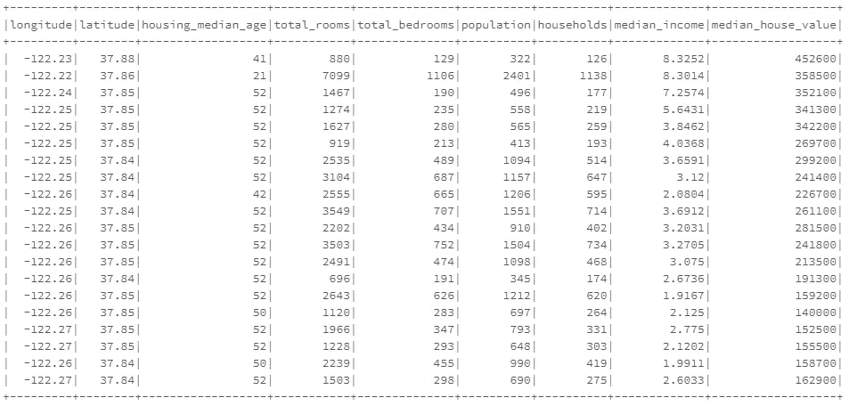
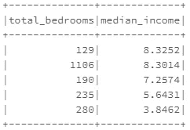
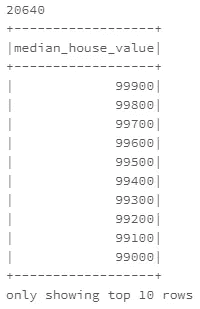
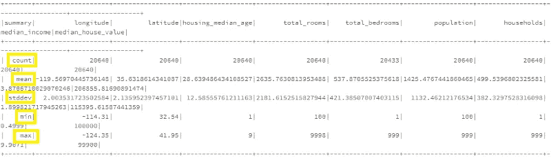
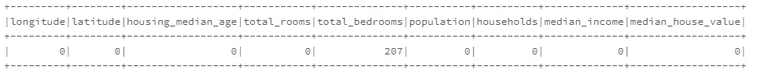
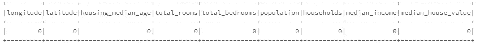
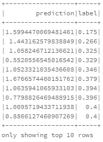

# PySpark 中的机器学习—第 4 部分

> 原文：<https://medium.com/analytics-vidhya/machine-learning-in-pyspark-part-4-5813e831922f?source=collection_archive---------11----------------------->


当我们步入大数据时代，每天都要处理大量的数据时，世界正在同时走向机器学习和人工智能。近年来，随着每天产生的数据量的增加，机器学习在几乎每个领域的重要性和流行程度都有了巨大的提升。特别是在当今，大多数商业企业都需要处理大量的数据，以便通过分析将数据转化为业务，从而更好地理解业务，从而找到有意义的见解来应对风险和机遇，从而使业务具有竞争优势。机器学习在这个过程中起着举足轻重的作用。

行业通过创建统一的机器学习管道，使用部署在大型集群上的 Apache Spark 进行大规模数据分析。Spark 的 MLlib 库有助于 Spark 上的机器学习，这是可能的。PySpark MLlib 是 Spark 的机器学习库，充当 PySpark 核心的包装器，为机器学习提供一组统一的 API，使用各种机器学习算法(如分类、回归、聚类等)的分布式实现来执行数据分析。

在这篇博客中，我们不会涉及理论概念。取而代之的是，我们会有一个实践环节，你可以通过编码来学习。我假设你有足够的机器学习知识作为先决条件，以获得最好的结果。让我们从 Spark 中的机器学习开始，使用它的 MLlib 库，通过创建一个简单的线性回归模型来使用房价数据集预测房价。虽然使用的数据集足够小，可以很好地使用 Pandas 来代替 Spark，但为了简单演示机器学习如何在 PySpark 中完成，我们使用了这个数据集。数据集可以从[这里](https://github.com/Anveshrithaa/housing-price-prediction-pyspark/blob/master/housing.csv)下载。

我们准备好了。我们开始吧！

## **创建 SparkContext**

```
from pyspark.sql import SparkSessionspark = SparkSession.builder.master(“local”)\
.appName(“Housing Price Prediction”)\
.config(“spark.executor.memory”, “1gb”)\
.getOrCreate()sc = spark.sparkContext
```

## 数据探索和预处理

第一个也是最重要的一个步骤是数据预处理，将数据转换为干净可用的数据，以便对模型进行分析和训练。所使用的数据极大地决定了机器学习模型的性能。因此，数据探索、清理、预处理和特征工程有助于提高模型性能。

数据集包含 9 个属性的 20，640 个实例

*   ***经度***
*   ***纬度***
*   ***房屋中位年龄*** —一个街区内房屋的中位年龄。较低的数字意味着较新的建筑
*   *—一个街区内的总房间数*
*   ****卧室总数*** —一个街区内的卧室总数*
*   ****人口*** —居住在一个街区内的总人数*
*   ****户*** —一个街区的总户数*
*   ****收入中位数*** —一个街区内家庭的收入中位数*
*   ****房屋价值中位数*** (因变量)——街区内住户的房屋价值中位数*
*   ****海洋邻近度*** —房子的位置 w.r.t ocean*

***加载数据***

*首先，让我们将数据加载到 Spark 环境中。我们可以通过使用 *spark.read.csv()* 方法从 CSV 读取数据来直接创建 PySpark 数据帧(就像 Pandas 数据帧一样)。设置 *header = True* 将 CSV 的第一行作为标题。*

****注:*** *DataFrame 支持多种可以应用机器学习的数据类型。**

```
*myDF = spark.read.csv(‘C:/Users/a/pyspark/housing.csv’, header=True)*
```

*作为第一步，让我们研究一下已经加载的数据。我们将花一些时间来检查它，以便理解数据集和数据的特征，这样它将有助于确定要执行的预处理步骤。*

*既然已经加载了数据，我们可以使用 *printSchema()* 方法来理解 dataframe 的模式。您也可以使用返回列名的 *df.columns* 来获取标题。*

```
*myDF.printSchema()myDF.columns*
```

****输出:****

```
*root
 |-- longitude: string (nullable = true)
 |-- latitude: string (nullable = true)
 |-- housing_median_age: string (nullable = true)
 |-- total_rooms: string (nullable = true)
 |-- total_bedrooms: string (nullable = true)
 |-- population: string (nullable = true)
 |-- households: string (nullable = true)
 |-- median_income: string (nullable = true)
 |-- median_house_value: string (nullable = true)[‘longitude’, ‘latitude’, ‘housing_median_age’, ‘total_rooms’, ‘total_bedrooms’, ‘population’, ‘households’, ‘median_income’, ‘median_house_value’]*
```

*在这里，您可以看到所有的列都是字符串类型。但是为了更有效的分析，我们需要将列转换成浮点数据类型。为此，我们将创建一个函数，将 dataframe 中每一列的数据类型转换为 float。 *withColumn()* 函数用于操作(重命名、更改值、转换数据类型)数据帧中的现有列或创建新列。*

```
*from pyspark.sql.types import *def convertColDatatype(df, colNames, newDatatype):
      for colName in colNames:
           df= df.withColumn(colName, df[colName].cast(newDatatype))
      return dfcolumns= myDF.columns
myDF= convertColDatatype(myDF, columns, FloatType())
myDF.printSchema()*
```

****输出:****

```
*root
 | — longitude: float (nullable = true)
 | — latitude: float (nullable = true)
 | — housing_median_age: float (nullable = true)
 | — total_rooms: float (nullable = true)
 | — total_bedrooms: float (nullable = true)
 | — population: float (nullable = true)
 | — households: float (nullable = true)
 | — median_income: float (nullable = true)
 | — median_house_value: float (nullable = true)*
```

*现在，dataframe 中的所有列都被转换为 float 数据类型。*

*此外，使用 *show()* 方法以表格格式显示数据帧(默认显示前 20 行),使用 *select()* 方法选择特定的列。您还可以尝试使用其他方法，如 *take()、top()、head()* 和 *first()* 来获取 dataframe 的行。*

```
*myDF.show()*
```

****输出:****

**

```
*#Select and display first 5 rows of data from the selected columns
myDF.select(‘total_bedrooms’, ‘median_income’).show(5)*
```

****输出:****

**

*在 dataframe 上使用 *count()* 方法获得 dataframe 中的总行数。您可以随时使用 *groupBy()、sort()、count()、distinct()* 等。去探索更多。比方说，你想知道这些街区的 10 个最高的不同的中值房价。*

```
*print(myDF.count())myDF.sort(“median_house_value”,ascending=False)\
.select(“median_house_value”).distinct().show(10)*
```

****输出:****

**

*现在让我们使用 *describe()* 方法获得数据的摘要。这给出了每列的计数、平均值、标准偏差、最小值和最大值。这有助于我们深入了解数据的范围和分布等细节，这将有助于决定如何预处理数据。*

```
*myDF.describe().show()*
```

**

*从最小值和最大值中，我们可以看到几列中的数据分布在很大的值范围内。要解决这个问题，我们必须对数据进行规范化，这将在后面进行。*

***处理缺失值和空值***

*为了检查数据中是否有空值，让我们使用 *isnull()* 统计每一列中空值的数量并显示出来。*

```
*from pyspark.sql.functions import *myDF.select([count(when(isnull(c), c))\
.alias(c) for c in myDF.columns]).show()*
```

**

*在这里，我们可以看到在“total _ thumbers”列中有 200 多个空值。为了解决这个问题，我们将用该列中可用值的平均值替换该列中的所有空值。从 describe()函数的输出结果来看，列“total _ hydrokets”的平均值约为 537。*

```
*#replace null values in the column with the mean valuemyDF= myDF.fillna({‘total_bedrooms’: 537})myDF.select([count(when(isnull(c), c))\
.alias(c) for c in myDF.columns]).show()*
```

**

*现在，您可以看到我们的数据帧中没有任何空值。*

*接下来，您会注意到目标变量' *median_house_value* '包含了相当大的值。为了修正这一点，我们用 10 万为单位来表示。*

****注意:*** *虽然这是绝对没有必要做的，但这只是为了展示我们可以预处理数据的不同方式。即使你跳过这一步，它仍然是好的。**

```
*from pyspark.sql.functions import *#Divide all the values in the ‘median_house_value’ column by 100,000myDF = myDF.withColumn(“median_house_value”, col(“median_house_value”)/100000)#myDF.take(2)*
```

*此外，您还可以尝试通过从可用数据创建新要素并将它们添加到现有数据来进行要素工程。这里，我们有像 *total_rooms* 、 *total_bedroom* s 和 *population* 这样的变量，它们表示整个街区的累积值。从这些特征中，我们可以通过将可用特征的值(分别为人口、总卧室数和总房间数)除以该街区的总家庭数，得出每个街区的附加属性，如*人口 _ 每户*、*卧室 _ 每户*或*房间 _ 每户*。这将给出该街区每个家庭的平均卧室/房间/人数。为此，使用 *select()、col()* 和 *withColumn()* 方法来处理列。*

***输出:***

> *['经度'，'纬度'，'住房 _ 中值 _ 年龄'，'总房间'，'总卧室'，'人口'，'家庭'，'中值 _ 收入'，'中值 _ 住房 _ 价值'，'人口 _ 每个家庭'，'每个家庭房间'，'每个家庭卧室']*

*您可以看到新列被添加到数据帧中。虽然我们添加了一些新特性，但是我们也可以删除一些对于分析来说可能不必要或不有用的特性。我们将删除类似于*纬度、经度、总房间数和总卧室数*的属性。您可以使用 *df.drop()* 方法来丢弃您不需要的列。这里，我们将使用 *select()* 方法来选择并重新排列 dataframe 中所需的列。*

```
*myDF= myDF.select(‘median_house_value’, ‘housing_median_age’, ‘median_income’, ‘population’, ‘households’, ‘population_per_household’, ‘rooms_per_household’)*
```

*既然我们已经对数据帧中的列进行了重新排序，现在是时候将数据帧中第一列的目标变量( *median_house_value* )与独立变量(目标变量以外的列)分开了。为此，我们将使用 *map()* 和 *DenseVector()* 将数据帧转换为包含目标变量和所有自变量的 DenseVector 的 RDD。完成后，使用 *createDataFrame()* 将它转换回 dataframe，它将数据作为第一个参数，将列名作为第二个参数。DenseVector 存储值的数组。*

```
*from pyspark.ml.linalg import DenseVector#x[0] is the target variable (label) and x[1:] are the featuresdata = myDF.rdd.map(lambda x: (x[0], DenseVector(x[1:])))#creating a dataframe with columns ‘label’ (target variable) and #‘features’(dense vector of independent variables)myDF = spark.createDataFrame(data, [“label”, “features”])
myDF.printSchema()*
```

****输出:****

```
*root
 |-- label: double (nullable = true)
 |-- features: vector (nullable = true)*
```

*这里，*特征*列包含所有独立变量的密集向量(独立变量的值的数组)，而*标签*列包含目标变量。*

*一旦完成，在继续构建模型之前，我们还有一个预处理步骤要执行。正如我们已经看到的，少数几列中的值的范围很大，我们必须使用 *StandardScalar* 转换数据，使平均值为 0，标准偏差为 1，从而使数据标准化。这里，输入列是要缩放的要素，输出列是缩放后的要素，将作为第三列包含在数据框中。*

```
*from pyspark.ml.feature import StandardScalerss= StandardScaler(inputCol=”features”, outputCol=”scaled_features”)scaler = ss.fit(myDF)myDF = scaler.transform(myDF)myDF.printSchema()myDF.take(1)*
```

****输出:****

```
*root
 | — label: double (nullable = true)
 | — features: vector (nullable = true)
 | — scaled_features: vector (nullable = true)[Row(label=4.526, features=DenseVector([41.0, 8.3252, 322.0, 126.0, 2.5556, 6.9841]), scaled_features=DenseVector([3.2577, 4.3821, 0.2843, 0.3296, 0.2461, 2.8228]))]*
```

*现在，数据预处理已经完成，我们终于可以开始构建机器学习模型了。到目前为止，您应该已经理解了探索性数据分析如何帮助我们收集有关数据的信息，以便进行进一步的预处理。对数据的简单探索性分析让我们对数据的结构有了一个简单的了解，这有助于我们决定预处理步骤，使数据更清晰，更适合模型。*

## *构建机器学习模型*

*现在是我们开始构建机器学习模型的时候了。由于这是一个回归问题，我们将使用一个简单的线性回归模型。在我们开始创建模型之前，让我们使用 *randomSplit()* 将预处理的数据分成训练集和测试集。您可以遵循 80:20 或 75:25 的训练/测试分流比率。*

```
*train, test = myDF.randomSplit([.8,.2],seed=1)*
```

*为了初始化线性回归模型，让我们使用默认参数。*

```
*from pyspark.ml.regression import LinearRegressionlinearReg= LinearRegression(featuresCol= “scaled_features”, labelCol=”label”)#fit the model to the the training data
model=linearReg.fit(train)#make predictions on the test set
predictions= model.transform(test)# show the predicted values and the actual values
predictions.select(“prediction” ,“label”).show(10)*
```

****输出:****

**

## *评估模型*

*我们可以通过查看一些性能指标来了解该模型的效率。为了评估线性回归模型的性能，我们将使用 *RMSE* (均方根误差)和 *R2* 分数(R 平方)，前者给出实际值和预测值之间误差的绝对度量，后者给出模型拟合优度的信息。*

```
*#R2 score on test set
r2_test= model.evaluate(test).r2
print(“R2 score on test set: “, r2_test)from pyspark.ml.evaluation import RegressionEvaluator#RMSE on test set
evaluator = RegressionEvaluator(predictionCol=”prediction”, labelCol=”label”,metricName=”rmse”)rmse_test = evaluator.evaluate(predictions)print(“RMSE on test set: “, rmse_test)*
```

****输出:****

```
*R2 score on test set:  0.5687396999670697
RMSE on test set:  0.7590445544382896*
```

*这个模型的性能不是很好。但是，我们可以通过进一步预处理数据来提高模型性能，如去除异常值、转换倾斜特征、通过主成分分析提取特征等。我们还可以调整模型的超参数，以获得更好的性能。*

*希望这能让你在 PySpark 的机器学习中有一个好的开始。虽然这只是一个简单的回归问题，但你也可以使用 Spark 的机器学习库提供的各种不同的监督和非监督机器学习算法来执行聚类和分类。现在您已经知道了这是如何工作的，您可以使用 pandas 和 sklearn 尝试一些机器学习任务的 PySpark 实现，这样您会有更好的理解。为您选择的数据集构建简单的机器学习模型，并尝试提高它们的性能。*

*另外，PySpark 中有一个简单的电影推荐系统，它使用交替最小二乘法进行协同过滤，这是一种非常流行的推荐算法。为此，我们将使用 Spark 的机器学习库和 movielens 100k 数据集(我们已经在之前的 PySpark RDD 博客中使用过)来训练模型，为给定的用户 ID 推荐 10 部电影。PySpark 实现和数据集可以在[这里](https://github.com/Anveshrithaa/Apache-Spark-Projects/tree/master/movies-recommendation)找到。*

*在本系列的下一篇博客中，我们将建立一个端到端的机器学习管道，不是在我们的本地机器上，而是在基于云的统一分析平台——data bricks 上，以获得使用 Apache Spark 进行大规模数据处理、分析和机器学习的真实感受。您还将了解 AWS 和更多内容，了解数据科学家和工程师如何在现实世界中处理大量数据。准备好学习新的令人兴奋的东西。不要错过！点击查看下一篇博客[。](/@anveshrithaas/end-to-end-machine-learning-pipeline-on-databricks-part-5-c10273e2cd88)*

*查看本系列中的其他博客*

*[***第 1 部分 Apache Spark 入门***](/@anveshrithaas/getting-started-with-apache-spark-part-1-91b379204ae0)*

*[***第二部分 PySpark 简介***](/@anveshrithaas/introduction-to-pyspark-part-2-6d6113e31592)*

*[***第三部分——了解星火 RDDs***](/@anveshrithaas/understanding-spark-rdds-part-3-3b1b9331652a)*

*[***第五部分——数据块上的端到端机器学习流水线***](/@anveshrithaas/end-to-end-machine-learning-pipeline-on-databricks-part-5-c10273e2cd88)*