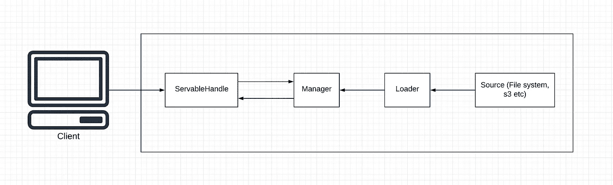
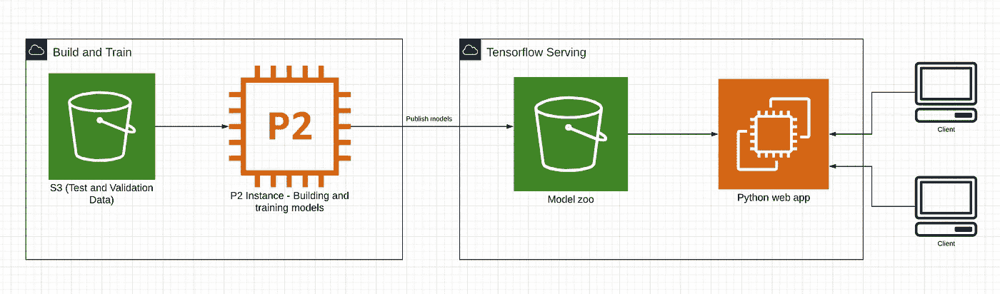

# 机器学习基础设施

> 原文：<https://medium.com/analytics-vidhya/machine-learning-infrastructure-baf074869ef?source=collection_archive---------24----------------------->

所以，你有一个很棒的 AI 应用想法，但是现在呢？你如何训练它，建造它，让世界使用你的奇妙创造？

在本文中，我们将讨论这一点。

机器学习生态系统中最受欢迎和谈论最多的工具之一是谷歌的 Tensorflow。

# **什么是张量流？**

> “TensorFlow 是机器学习的端到端开源平台。它拥有一个由工具、库和社区资源组成的全面、灵活的生态系统，使研究人员能够推动 ML 的发展，开发人员能够轻松构建和部署 ML 驱动的应用。”

**翻译**:张量流有各种不同的用途。目前，最受欢迎的用途之一是建立深度学习模型。虽然这是一个最初为大型数值计算创建的库，但谷歌开源了它，将其用作深度学习库。
它为几种不同的语言提供了 API，其中 python 是使用和支持最广泛的一种。

作为 Tensorflow 生态系统的一部分，Google 还引入了 Tensorflow 服务，它允许您以 protobuf 格式导出模型，并创建 grpc 或 rest API。

# **积木**

让我们首先深入了解 Tensorflow 服务的架构。以下是您应该很好理解的基础知识:

**Servables**
Servables 是 TF 服务生态系统中最小的单元。它们是用于执行不同计算的对象。这些物体有不同的大小、复杂程度和类型。出于本文的目的，我们将讨论 servables 是 SavedModel 格式的模型。

Servables 也有不同的版本，这很好，因为我们可以进行 A/B 测试，尝试不同的神经架构和不同的算法。本质上，版本化的能力为我们打开了一个世界，在这个世界中，我们可以更有条理地构建、测试和微调我们的模型。

在 TF 服务的世界里，模型其实只是服务对象。它通常包含算法、学习到的权重和查找表。

**加载器**
顾名思义，加载器帮助加载和卸载你的 servables。也就是说，它们管理一个服务的整个生命周期。加载器独立于算法、数据和用例。

**Sources**
Sources 用于查找 servables。它们与加载器密切合作，sources 为每个服务流提供一个加载器实例，以允许这些服务被加载器处理。

# **TF 服务的技术架构**

概括地说，会发生以下步骤:

源为模型或 servable 的特定版本创建一个加载器。来源提醒版本的管理者。
管理器确定它是否安全(例如，有足够的资源)并给予加载器所需的资源，并允许加载器加载特定版本。
然后，客户端可以向管理器请求特定版本的 servable，或者请求默认的最新版本

# **机器学习管道**

作为一种技术，机器学习有两个主要要求:数据和建模。
可扩展的服务和产品需要能够自动化、可重复和可调试。本质上，在构建集成人工智能的产品的每个阶段都有不同的关注点。

为了结合这些原则和关注点，我决定将管道分成两个主要管道:构建模型和服务模型。

数据被收集并存储在 S3 桶中，或您选择的任何其他数据存储中。然后，数据科学家和其他模型构建者能够使用所需的或多或少的计算资源(例如使用 P2 实例)手动构建和训练模型，该模型被发布到另一个 S3 存储桶。

这种方法的好处是双重的。首先，在构建模型的阶段，我们不需要担心基础设施。我们专注于构建模型。围绕存储和计算资源的决策被抽象化了。也就是说，我们可以假装我们只是在自己的本地机器上工作。

其次，将模型发布到 bucket 意味着，我们能够发布和更新我们想要的模型的任意多个版本，而不必担心下游的客户端。也就是说，我们成为生产者，让服务管道去担心提醒客户关于变化的问题，或者根据需要提供模型的新版本。

下一个管道是模型的实际服务和使用。这里我们使用 tensorflow 架构，它管理模型的加载、卸载和服务。我们只需指定源代码(S3 桶)并将生成的 api 包装在 python web 应用程序中。然后，客户端能够向这个新应用程序发出请求。

你可能会问，为什么要把 api 封装在另一个应用中？嗯，我对这个特殊设置的关注点一直围绕着计算机视觉和图像处理。在处理图像时，我们必须采取一些步骤来预处理图像，并对结果进行后处理。通过将它包装在一个 python 应用程序中，我们获得了所有适用于图像和数据科学的 python 工具，同时还确保了使用我们模型的应用程序不会与 python 捆绑在一起。也就是说，我们的客户端可以是 Node 应用程序、Go 应用程序或您选择的任何其他技术。

这是对我设计和实现的一个简单架构的高度解释。随着我继续构建，我目前正在添加几个主要内容:

1.运行在 Kubernetes(二手 Kubeflow)上
2。监控(工作进行中)
3。模型的自动重新训练