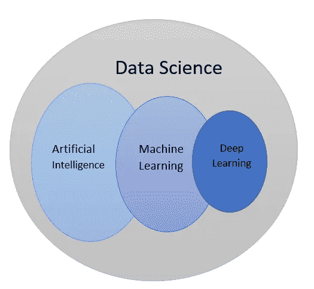
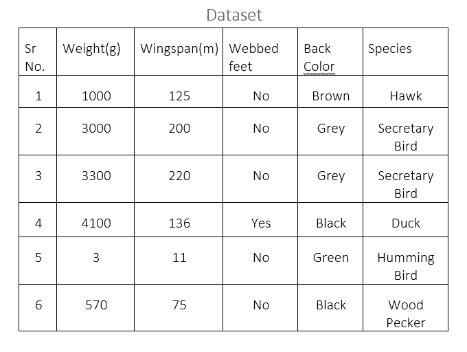
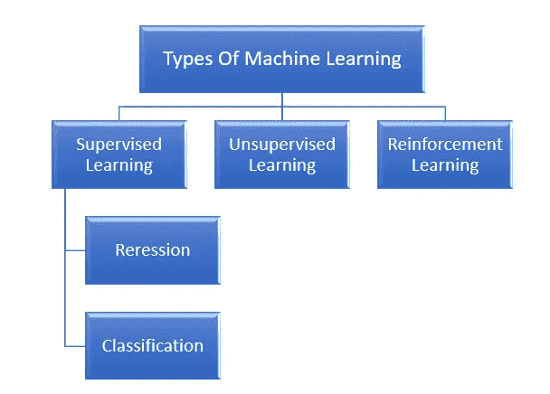
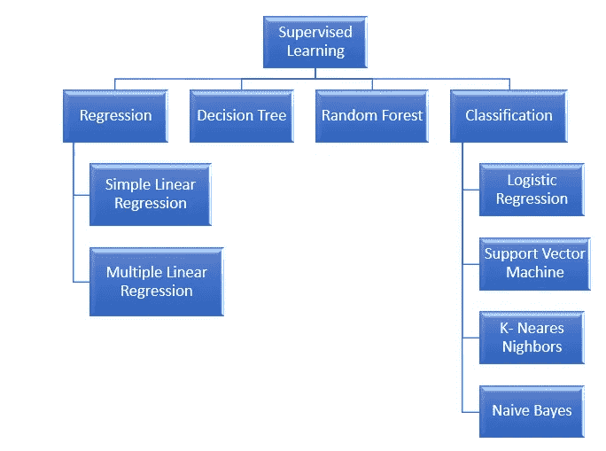
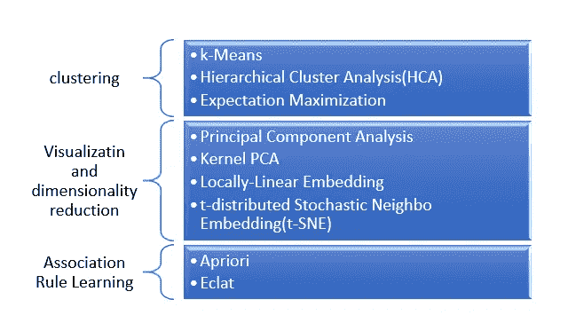

# 机器学习简介

> 原文：<https://medium.com/analytics-vidhya/machine-learning-introduction-2f442bc34855?source=collection_archive---------36----------------------->

> **什么是机器学习？**

机器学习正在将数据转化为信息。

机器学习是使用示例数据或过去的经验对计算机进行编程，以优化性能标准。

例
**1)超级市场链:**
系统预警一个算法，预测哪个客户有可能购买哪个产品，实现销售额和利润的最大化。同样，每位顾客都希望找到最符合其需求的产品组合。如果先有面包后有黄油，反之亦然。

**2)电子邮件(垃圾邮件):**
在检测垃圾邮件时，我们需要寻找某些关键字的相互结合。像电子邮件的长度、电子邮件的频率这样的因素来决定该电子邮件是否是垃圾邮件。

# **关键术语:**

1.  **特性:**
    它们也被称为属性。在给定的数据集中，我们使用了四个属性。它们是体重，翼展，蹼足，背色。体重和翼展是数字，蹼足是布尔型，背部颜色是字母数字。
2.  **目标变量:**
    是给定数据集的输出。在给定的训练中，我们把物种作为目标变量。
3.  **训练集:**
    它是一组训练，我们用来训练我们的机器学习算法。在给定的例子中，我们有六个训练集。
4.  **分类:**
    这是一种技术，我们要结合所有的特征，在算法的帮助下决定物种。
5.  **测试集:**
    用于比较预测值和可用值，以感知算法的准确性。

> **机器学习的类型:**

1.  **监督学习:**
    在监督学习中，你馈送给算法的训练数据包含了想要的解，称为标签。典型的监督学习任务是分类。垃圾邮件过滤器就是一个很好的例子:它用许多示例电子邮件以及它们的类别(垃圾邮件或业余爱好者邮件)来训练，它必须学会如何对新电子邮件进行分类。
    另一个典型的任务是预测目标数值，例如给定一组特征(里程、年龄、品牌等)的汽车价格。)称为预测者。这种任务被称为回归。为了训练这个系统，你需要给它许多汽车的例子，包括它们的预测器和标签。注意，一些回归算法也可以用于分类，反之亦然。例如，逻辑回归通常用于分类，因为它可以输出与属于给定类别的概率相对应的值。
    以下是一些最重要的监督学习算法:

**2)无监督学习:**
在这种学习类型中，我们没有任何监督人，只有原始数据。目的是找到输入模式的规律性。将会有一种模式会更频繁地出现。使用的这种方法称为聚类，目的是找到输入的聚类或分组。在文档聚类中，目标是对相似的文档新闻进行分组，报告可以细分为与政治、体育、时尚等相关的内容。其他例子有客户细分、图像压缩等。
以下是一些重要的无监督学习算法:

例如，你有很多关于你的博客访问者的数据。您可能希望运行聚类算法来尝试检测相似访问者的分组。在任何时候，你都不需要告诉算法访问者属于哪个组:它不需要你的帮助就能找到这些联系。例如，它可能会注意到 40%的访问者是喜欢漫画书的男性，通常是在赚钱的时候阅读你的博客，而 20%是年轻的科幻爱好者，他们在周末访问，等等。如果使用分层聚类算法，它还可以将每个组细分为更小的组。这可能有助于您针对每个组发布帖子。

**3)强化学习:**
系统的输出是动作的序列在这种情况下，单个动作并不重要，重要的是达到目标的正确动作的策略。如果一项行动是好政策的一部分，它就是好的。
是非常不同的野兽。学习系统，在这种情况下称为代理，可以被环境观察，选择和执行行动，并获得回报。策略定义了代理在给定情况下应该选择的操作。

在游戏系统中，一步棋并不重要的国际象棋。正确动作的顺序很重要。

> **机器学习的优势:**

1.  它有助于系统根据训练数据做出决策。
2.  它可以处理多维数据。
3.  它提取大量数据中隐含的关系。
4.  它允许减少时间周期。
5.  它提高了资源利用率。
6.  它提供了质量改进的工具。
7.  它提高了分类性能。

> **机器学习的应用:**

1.  银行和金融服务:
    机器学习广泛用于预测可能拖欠信用卡账单或偿还贷款的客户。这也有助于银行确定哪些客户可以获得信用卡和贷款。
2.  医疗保健:
    用于根据患者症状诊断各种致命疾病，如癌症，并告知患者同类患者的既往数据。
3.  零售:
    它用于识别出售脂肪的产品和不出售脂肪的产品。它有助于零售商决定策略。沃尔玛、亚马逊、bigbazaar 或此类零售单位广泛使用机器学习。
4.  出版和社交媒体:
    有不同的出版公司，如 McGraw Hills，他们使用机器学习来运行查询并获取用户在线所需的文档。谷歌和 facebook 也使用机器学习来对他们的搜索输出新闻进行排名。facebook 中的好友建议使用了机器学习。
5.  机器人移动:
    它基本上是一个集合术语，用于描述机器人将自己从一个地方运送到另一个地方的不同方法。这个领域的一个挑战是开发机器人决定何时何地如何移动的能力。

我希望你们理解机器学习的基本概念。
如果你喜欢我的作品，想了解最新的出版物，或者想与我取得联系，我可以在媒体[沙子牙 Memon](/@machine.learning) 和推特 [**@Smemon**](https://twitter.com/Smemon79402105) **上找到——谢谢**

快乐学习！！