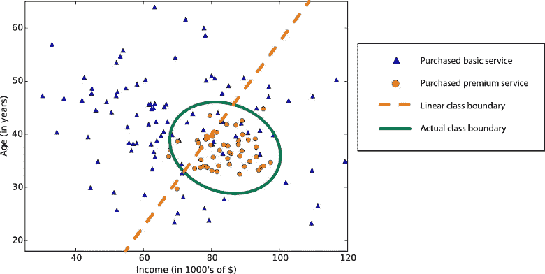

# 机器学习:简介

> 原文：<https://medium.com/analytics-vidhya/machine-learning-introduction-50f55ef693e8?source=collection_archive---------18----------------------->

在一个涉及模拟 NBA 比赛结果的项目中，我写了一个算法，可以根据球员在那个赛季的表现为他们生成一个真实的盒子得分结果(你可以在这里阅读更多信息)。虽然算法产生了真实的结果，但我一直在想是否有办法可以改进这个程序，也许*可以从它运行的无数次模拟中学习*。这让我掉进了机器学习的兔子洞。

***机器学习*** 这个术语是由计算机科学和人工智能领域的先驱亚瑟·李·塞缪尔(Arthur Lee Samuel)在 1959 年推广的。他将其定义为:

> *"* 【该】研究领域赋予计算机无需明确编程就能学习的能力。

*在 IBM 担任工程师期间，塞缪尔开发了一个学习玩跳棋的程序。随着程序玩的跳棋游戏越来越多，它不断改进，最终在一局中打败了他。Samuel 设计的程序可以在每一局游戏中学习，识别最有可能获胜的棋盘位置。*

*最近，塞缪尔提出的定义被认为有点模糊，卡内基梅隆大学教授汤姆·米切尔提出了一个更现代的定义:*

> *“如果由 **P** 测量的计算机程序在 **T** 上的性能随着经验 **E** 而提高，则称该计算机程序从关于某些任务 **T** 和某些性能测量 **P** 的经验 **E** 中学习。”*

*这相当复杂，所以让我们以玩跳棋的程序为例来分解它。关于米切尔的定义:经验( **E** )将是玩跳棋游戏的经验，任务( **T** )将是玩跳棋的任务，性能( **P** )将是程序赢得下一局游戏的概率。该程序通过玩跳棋游戏并从中学习来提高其玩跳棋的性能。*

*所有的机器学习问题都可以归为两种不同的学习方法:**监督学习**和**非监督学习**。*

# *监督学习*

*在监督学习中，给程序一组数据，每个例子的“正确答案”都是已知的。作为程序员，根据输入和输出之间的关系(如果有的话)，我们知道正确的输出应该是什么。监督学习被进一步分成不同的类别，其中两个最常见的是**和 ***分类*** 问题。***

***对于回归问题，输出是在连续输出中得到的。在数学术语中，输入变量将被映射到一个连续函数，基于该函数，可以计算出输出/答案。回归问题的一个例子是，在给定一天的时间内，我们试图预测去餐馆的人数。***

******

***在分类中，输出被分为离散类型。这方面的一个例子是给定一个击中的棒球的退出速度，预测这一击是否是本垒打。在这个例子中，击中的结果被分成两个离散的结果:本垒打或非本垒打。***

******

# ***无监督学习***

***顾名思义，无监督学习在我们几乎不知道输出会是什么样子或者应该是什么样子的时候非常有用。结构由程序从数据中导出，输出将基于该结果。最常见的无监督学习技术之一是**聚类**。将具有相似特征的数据组放在一起，并从结果中得出结果。使用这种方法有可能发现隐藏的模式。这种做法通常用于市场细分，允许公司优化其营销工作，以及社交网络分析。***

******

***机器学习实践正在应用于所有不同的领域和行业。在这个信息时代，从所有数据中收集见解的能力变得非常宝贵。下一次，我们将看看它们是如何实现的，以及如何应用线性回归。***