# 机器学习直觉:

> 原文：<https://medium.com/analytics-vidhya/machine-learning-intuition-b4b49a671f65?source=collection_archive---------6----------------------->

在概念和数学之间架起一座桥梁

艾莉娜·格鲁布尼亚克在 [Unsplash](https://unsplash.com?utm_source=medium&utm_medium=referral) 上的照片

# **简介**

机器学习是数据科学中令人兴奋的一部分，我们大多数人都在努力学习。所有这些在线课程、文章、博客和视频为我们提供了无数可供选择的资源。当涉及到学习机器学习时，对该领域有一个关键的了解是必不可少的。对于一个普通人来说，机器学习、神经网络、深度学习、人工智能这些术语可能都是相同或相似的。但是理解它们之间的区别是至关重要的。对于所有那些寻求机器学习的概念和数学之间的核心理解和相互关系的人来说，找到一个与机器学习的观点相关的良好知识来源可能是困难的，无论是数学、概念还是一般的实现，以便很好地理解该主题。一个人可能不得不参考多个来源来正确地获得 ML 的核心知识和理解，这可能使用不同的术语和命名法。

这篇文章是为了帮助那些面临类似问题的人。在本文中，您可以找到获得机器学习基本理解的理想来源。我们将涵盖从定义到构成基本机器学习基础的所有重要算法的数学。我会尽量让语言简单，这样你就可以更多地关注直觉而不是语言。

在这篇文章中，我们将专门研究线性回归。这是一种监督学习算法。这也允许我们理解在 ML，AI，NN，DL 领域使用的基本算法。

# 机器学习:*一般直觉*

我们应该先问一个问题:

> *“机器学习与传统的解题方式有何不同？*

为了回答这个问题，让我们来谈谈我们如何解决一个典型的编程问题语句，具体来说，我们来谈谈两个数相加。这很简单，我们取任意两个数字作为输入，然后用一种算法将它们相加，得出总和。如果你仔细观察，你会发现我们遵循了一个模式:

> **我们为 2 个输入制作了 2 个变量**
> 
> **我们实现了一个算法(规则),它将两个变量作为输入，并产生两个变量的和**
> 
> **我们将总和存储在第三个变量中，或者只显示总和。**

这是一个简单的例子，因为我们知道规则(即如何将两个数字相加)，我们可以将现有的任意两个实数相加。因此，我们所要做的只是用几行代码将我们的数字加法能力转换成一个函数，我们就完成了(这很容易，即 x + y)。因此，我们不需要任何样本数据来教我们两个数相加的规则。

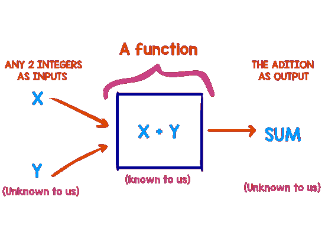

**图 1** :传统的解题方式，(图片作者提供)

但是想象一下一个问题陈述，我要求你写一个算法，它可以根据一些信息，比如房子的大小，卧室的数量等等，告诉你任何房子的价格。

好吧，无论一个人如何努力，都不可能想出一些具体的规则或者一个通用的算法，可以简单地实现，可以预测现有的任何已知房屋的价格(不像 2 个数相加)。

在这样的场景中，我们可以获得大量的数据，然后利用这些数据来学习如何使用给定的特征来预测房子的价格(即找到帮助我们预测任何房子价格的规则)。然后我们可以实现那个函数来解决我们的问题。

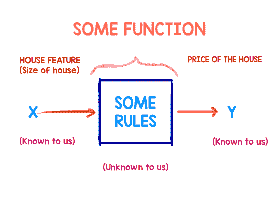

**图二**:利用 ML 解决问题。(图片由作者提供)

这是机器学习与众不同的根本原因，因为它有能力看到一种模式，并“学习”创建一组“规则”，然后我们可以用这些规则来预测任何新输入的输出。

> **所以简单地说:以传统的解决问题的方式给出规则和输入，并使用它们，我们产生一个输出。然而，在 ML 中，输入和输出是给定的，使用它们我们可以找出将它们联系起来的规则*。***

## 机器正在学习:

先来一个直觉。要了解一台机器是如何“学习”的？让我们考虑一下我们之前讨论过的预测房价的同一个例子。

并且为了完成这个任务，我们被提供了一些样本数据，这些样本数据由一组房子组成，它们的大小作为输入特征(x)和它们的售价(y)(毕竟这是一个监督学习的例子)。例子的总数用“m”表示。

现在，让我们分解一下，了解机器学习如何帮助解决这类问题，同时也了解机器是如何“学习”的。

***“请注意，在这个例子中，由于我们被提供了一个带标签的数据集(即给出了每个输入的正确输出)，这是一个监督机器学习算法的经典例子。我们通过观察算法所犯的错误来监督算法在每一步中的表现，然后利用这些错误来改进算法***

正如我们之前讨论的，既然我们已经提供了一个数据集，我们需要找出中间的函数。但是我们从哪里开始呢？而给我们的数据又如何定义根据房子大小计算房价的函数呢？

让我们从给我们的数据开始。房子的大小(X)影响房子的成本(Y)。这似乎是一个简单的关系，也就是说，房子越大，价格就越高。事实也的确如此。

在这里，我们已经找到了输入“X”和输出“Y”之间的非数学关系“hθ(x)”(这似乎是一种线性关系)。现在，如果我们能用数学方法表达函数 hθ(x ),我们的问题就解决了。

让我们首先将数据可视化为一个图表，其中我们在 X 轴上绘制房屋的大小(X ),在 Y 轴上绘制房屋的价格(Y ),它可能看起来像这样:

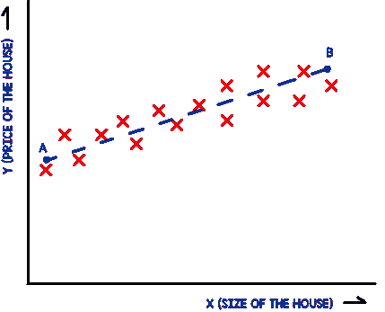

**图 3:** 我们的假设函数。(图片由作者提供)

当实现机器学习时，这总是一个好的起点。可视化的数据可以帮助我们选择我们应该使用什么类型的'*'*函数* (hθ(x))，' ***代价*** *'函数* (J(θ))来训练算法(后面会详细介绍)。*

*如图所示，图表似乎给了我们房子的大小和房子的价格之间的线性关系(正如我们之前预测的那样)。所以如果我们能找到一个可以代表我们训练样本的广义直线方程，那么我们就可以用它来预测任何房子的房价，只要房子的大小是我们已知的。让我们称那条直线为“AB”。*

# *训练最大似然算法*

*那么我们如何找到 AB 的方程呢？嗯，我们可以使用给我们的数据来“训练”一个机器学习算法，为我们找到 hθ(x)。当 hθ(x)被充分训练后，我们就可以用它来预测任何房子的价格。*

## **激活功能:**

*我们正在寻找的这个“等式”被称为“**激活函数**或“**假设函数**”。*

*那么，激活功能到底是什么？让我们从定义它开始，然后我们会用一些直觉更深入一点。*

> *“机器学习假设是一种候选模型，它近似于将输入映射到输出的目标函数。”*

*简而言之，正是这个“未知”函数非常类似于训练数据，因此我们可以使用该函数来预测训练集中给定输出之外的输出。从我们的数据集来看，hθ(x)似乎具有线性关系，因此我们的方程可能看起来像这样:*

*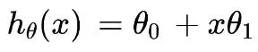*

*这类似于线的一般方程，即 Y = mx+c
(Y = c + mx)。hθ(x)的输出称为预测。这里θ₀和θ₁被称为参数或权重，x1 是输入特征，在我们的例子中是房子的大小。所以假设函数是基于其权重(θ₀和θ₁)和输入对输出应该是什么的预测。*

*找到 AB 线。我们需要找到θ₀a 和θ₁的这些值，这将为我们提供最接近所有 m 个示例的实际输出“y”的计算预测:*

*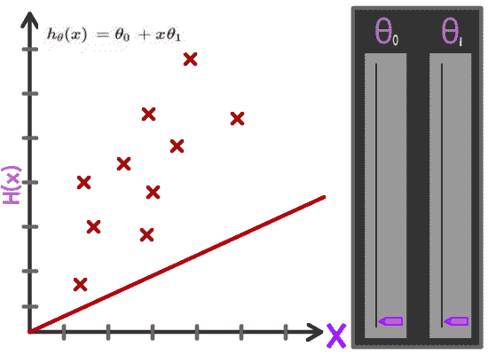*

***图 4:** 参数的变化如何影响假设函数。(图片由作者提供)*

*而一旦我们找到了那些参数值，我们就可以说我们的算法已经训练好了，我们已经找到了中间那个‘未知’的函数。但是我们如何找到这些参数值呢？我们会用到一个叫做滚动函数的东西。*

## **成本函数:**

*为了找到参数θ₀和θ₁.的值我们使用一种叫做成本函数的东西。但这是什么呢？让我们从定义它开始:*

> ***“这是一个衡量机器学习模型对于给定数据的性能的函数。成本函数将预测值和期望值之间的误差量化，并以单个实数的形式呈现出来。”***

*成本函数是一种计算我们的预测与实际值相差多少的方法。通俗地说，就是整个训练例子的 hθ(x)和 y 的平均误差。因此，这一误差项可以形式化为预测输出 hθ(x)与实际输出 y 之差:*

*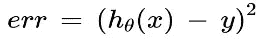*

*在我们的例子中，我们使用平方误差函数。现在，如果我们代入 hθ(x)的值:*

*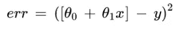*

*正如你可能知道的，为了最小化我们机器学习模型的错误或“成本”,我们需要找到θ₀和θ₁的最佳可能组合，这样，第一项的预测输出就尽可能接近实际输出 y*

*具体来说，我们试图解决一个最小化问题，我们需要找到这样的θ₀和θ₁的值，这可以最小化误差。这就是为什么我们总是试图最小化我们的成本函数。*

*因此，成本函数被形式化为:*

*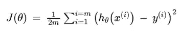*

*我们可以说，成本函数是所有“m”个例子的预测和实际输出之间的误差总和的粗略平均值。x(i)和 y(i)表示来自训练示例的 iᵗʰ输入和输出。*

## **对成本函数的更好的直觉**

*理解成本函数的另一种方式是将其可视化。我们绘制的成本函数主要是θ的函数，它是整个训练示例的平均误差。为了更好地理解它，考虑我们的假设只有一个参数θ₀.那么，我们的假设函数将是:*

*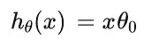**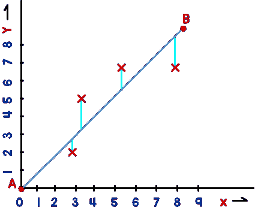*

***图 5** :单参数θ的假设。(图片由作者提供)*

*如你所见，AB 线穿过原点。我们试图得到的最佳可能的线 AB 将是这样的，即分散的点离该线的平均垂直距离平方(用青色表示)将是最小的。假设θ₀ = 1 是我们假设的最佳值。现在，我们的成本函数是:*

*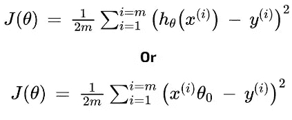*

*如你所见，成本函数是θ₀.的函数由于它是平方函数，我们可以绘制θ₀与 J(θ)的关系，如下所示:*

*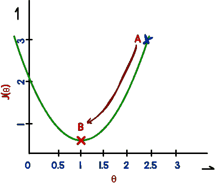*

***图 5:** 成本函数。(图片由作者提供)*

*成本函数做出抛物线。所以当我们开始训练时，假设我们从θ₀a 值开始。对于点‘A’，J(θ)值较大。因此，我们需要降低 J(θ)，这可以通过降低误差来实现。*

*一旦正确完成，我们应该看到θ值沿着曲线向下滚动，停在一个稳定点“B ”,这是最小值。这是一个很好的形象化的展示，说明了为什么我们要尽量降低成本函数。*

*好了，现在我们明白了为什么我们需要最小化 J(θ)，让我们看看我们是如何做到的？或者更好的是，我们如何有效地滚下那条曲线？*

*我们可以用一个球滚下山来做类比。但是为了使它有效地到达底部，它应该满足以下条件:*

> ***i)它不应超过最小值，即 b 点。***
> 
> ***ii)到达 b 点需要最少的步数***

*这意味着我们需要实现某种迭代方法，最终将我们自己降落到成本函数的最小值。事实证明，我们可以使用一个' ***优化算法*** '比如"**梯度下降"来做同样的事情***

# *梯度下降:一种优化算法*

*现在我们知道了需要拟合什么函数，即 hθ(x)，我们还可以使用成本函数 J(θ)来检查它的拟合程度。我们现在需要的是一个函数，它能以最少的步数有效地帮助我们着陆到θ的最佳值。这就是梯度下降的由来。像往常一样，让我们从定义它开始:*

> ***“梯度下降是一种优化算法，用于通过沿梯度负值定义的最陡下降方向迭代移动来最小化某个函数**。”*

*你可能注意到术语“最速下降”在定义中有一个问题:*

> *"*抛物线下降最陡的方式是什么？**

*为了回答这个问题，我们将在后面举一个例子，假设有多个参数θ。*

*但在此之前，让我们将梯度下降函数形式化:*

*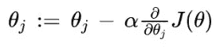*

*这里，α被称为学习率，j 表示特征指数，即θ₀，θ₁，θ₂，… θₙ.起初，这可能看起来有点复杂，但是不要担心，我们会分解它。*

*请注意等式中使用的“:=”。这表明，通过使用相同的 J(θ)，我们应该同时计算参数值θ₀、θ₁、… θₙ，然后在计算出θ的变化，即每个θ的∂/∂θⱼ之后，我们应该再次同时替换θ₀、θ₁、… θₙ.*

*从更广泛的角度来看，等式的第二项告诉我们需要多快，以及在哪个方向下降才能达到曲线的最小值。然后，我们用θj 减去球的新估计位置，以计算曲线中的新位置，迭代地这样做将最终使球落在曲线的最小值。*

## **对梯度下降有更好的直觉**

*术语 **∂/∂θⱼ *(J(θ))** 被称为θ的导数，它表示在梯度下降的一次迭代中需要进行的θ的变化。它表示曲线中球的当前位置处切线的斜率。通俗地说，导数项不仅告诉我们曲线在数字上有多陡，还告诉我们球应该滚向哪个方向，给定它在曲线上的当前点。*

*明白了这一点，让我们看看梯度下降如何帮助我们以满足上述有效最小化 J(θ)的条件的方式达到最小值。*

1.  ****了解哪种方式最少:****

*   ***案例一:***

*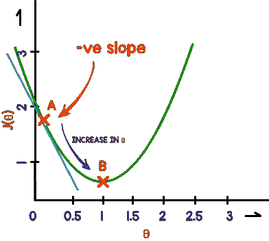*

***图 6(a):**-梯度下降中的 ve 斜率。(图片由作者提供)*

*所以对于图 6(a)中的负斜率，我们得到一个负值的 **∂/∂θⱼ * J(θj)** ，因此 **-(-∂/∂θⱼ * J(θ))** 为正。正因为如此，我们最终要加上θ的变化。这使我们移动到 x 轴的右边，这是我们达到最小值的正确方向。*

*   ***案例二:***

*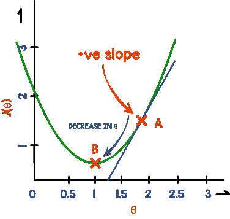*

***图 6(b):** +ve 坡度梯度下降。(图片由作者提供)*

*对于正斜率，我们最终得到一个正值的 **∂/∂θⱼ *J(θⱼ)** ，当与 **-(∂/∂θⱼ *J(θ))** 结合时，最终减少θⱼ，使其向 x 轴的左侧滚动，这是我们需要达到最小值的正确方向。*

*这告诉我们函数的一个迷人属性，即斜率梯度项表示我们需要在哪个“方向”滚动才能达到最小值。*

***2。*了解一次迭代要移动多少:****

*所以导数项告诉我们需要向哪个方向移动，但是我们也需要确定每次迭代需要移动多少。事实证明，如果我们保持不变，那么导数项也告诉我们每次迭代需要移动多少。*

*正如我们所知，导数或者被加上，或者从参数θ的当前值中减去。因此，如果我们保持不变，比如说 1，那么导数项的大小也与斜率的“陡度”成正比。如下所示。蓝线是斜率，它的长度代表它的大小。*

*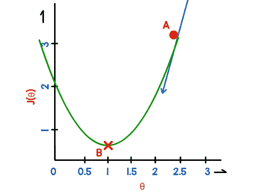*

***图 7:** 斜率对步长的影响。(图片由作者提供)*

*   ***案例一:***

*如图所示，对于曲线中较高的点，斜率自然会较高。因此我们得到了一个很大的梯度项。反过来，这意味着我们最终会增加或减少更大的θ值，这意味着我们每次迭代的步长越来越大。*

*   ***案例二:***

*然而，与此相反，对于更接近最小值的点，斜率也将开始变平，这意味着我们将自动采取越来越短的步骤，最终达到最小值。在最小值时，斜率为 0，因此我们不会超过最小值。*

# *结论*

*综上所述，构建 ML 算法包括使用基于您的训练数据大致如何可视化的假设函数，然后使用与您的假设中的参数数量配合良好的成本函数，最后使用梯度下降等优化算法来最小化成本函数。*

*请注意本文是如何直观地解释每种算法背后的数学原理，然后在训练 ML 算法时按照使用顺序将这些算法相互联系起来的。你或许可以凭个人直觉判断每种算法都是好的，但理解这些算法之间的关系确实描绘了机器学习的全貌以及该领域可以做什么。*

*神经网络和深度学习是这些基本算法的大规模实现。神经网络使用我们学到的这些功能和假设，将复杂的问题陈述分成更小和更简单的部分。*

*也就是说，我希望这篇文章对这些算法有一个清晰的直觉，并帮助弥合这些广泛用于机器学习的基本算法背后的数学和概念背景。*

# *文献学*

*[1]机器学习基础:[*https://www.coursera.org/learn/machine-learning?*](https://www.coursera.org/learn/machine-learning?)*

*[2]梯度下降初始化:*

*【https://www.youtube.com/watch?v=IHZwWFHWa-w】T5[T6](https://www.youtube.com/watch?v=IHZwWFHWa-w)*