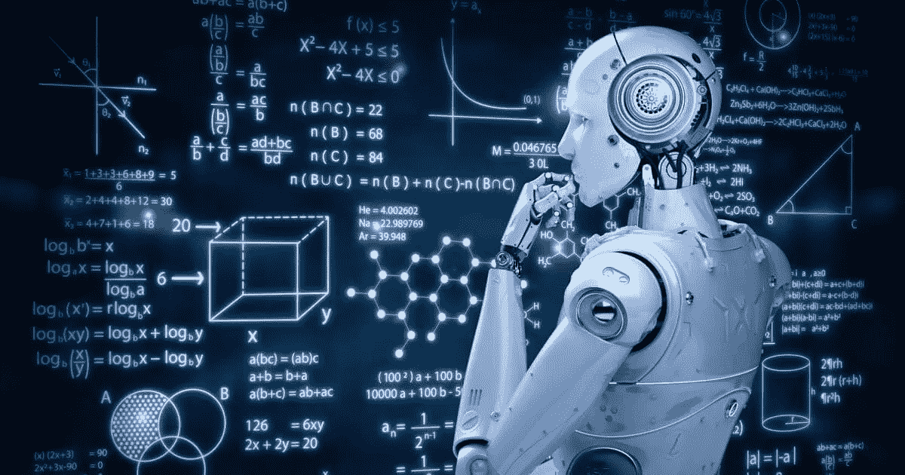
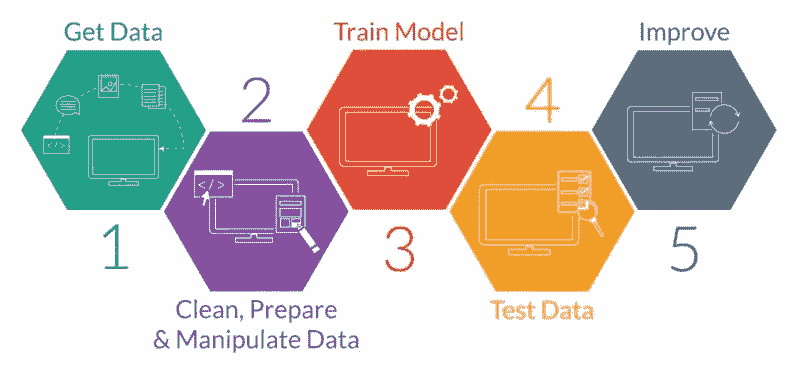
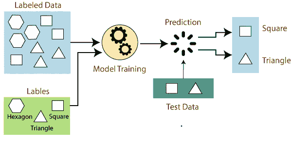
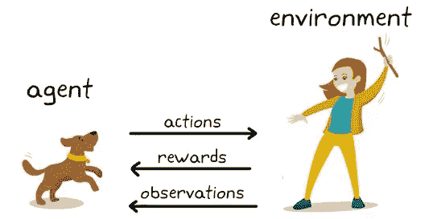

# 迄今为止的机器学习之旅…

> 原文：<https://medium.com/analytics-vidhya/machine-learning-journey-so-far-908f0e14574c?source=collection_archive---------27----------------------->

*“机器可以学习吗？”*我在听到这两个字后，对自己提出了质疑。因为对这个概念有很高的好奇心，我阅读了关于机器学习的文章和视频。OMG！！！做了一点研究后，我明白这是一个广泛的话题，是数学公式、不同算法和许多复杂因素的混合。但是我从这里学到的一个好东西是使用机器学习概念完成的真实世界的应用。我知道世界上几乎每个领域都使用这些概念，这些概念有助于更灵活地完成不同的任务。这是吸引我探索更多机器学习的一个关键因素。

不，不，我还不是机器学习专家，而是一个对机器学习背后的概念充满热情的学习者。在这篇文章中，我想尽可能简单地与你们分享我的知识。让我们开始吧。

# **什么是机器学习？**

简单地说，这就是从经验中学习。**机器学习**是人工智能(AI)的一种应用，它为系统提供了自动学习和根据经验进行改进的能力，而无需显式编程。

# **机器学习过程**

***1。数据采集***

我们数据的数量和质量决定了我们模型的准确性。您可以通过调查或使用预先收集的数据来收集您的数据，例如来自卡格尔、UCI 等地的数据集。,

***2。数据准备***

数据预处理方法在此步骤下进行。(查看我的数据预处理文章)

*   清理可能需要它的内容(删除重复、纠正错误、处理缺失值、规范化、数据类型转换等)。)
*   随机化数据，这消除了我们收集和/或准备数据的特定顺序的影响
*   可视化数据有助于检测变量或类别不平衡之间的相关关系(偏差警报！)，或者执行其他探索性分析
*   分为训练集和评估集

***3。选择一个型号***

不同的任务有不同的算法。要么是有监督的，要么是无监督的，根据问题的规格选择你的模型。(我将在以后的文章中解释不同的算法)

***4。列车&测试车型*测试车型**

在你的训练数据上训练你的机器学习模型。训练的目标是尽可能多地正确回答一个问题或做出一个预测。然后在模型没见过的测试数据上测试你的机器学习模型。

***5。评估模型***

这意味着机器学习模型对新的、以前看不见的数据的概括程度。有许多方法可以评估您的模型，例如:

*   交叉验证
*   混淆矩阵
*   分类准确度
*   曲线下面积

***6。*改进型号**

我们有两种类型的参数。我们有在训练期间从模型中学习的参数，我们还有一些保持固定的其他参数，这些参数被称为超参数。在这一步中，我们将调整超参数以提高模型性能。

**第七期*。做出预测***

使用测试数据集，我们进行预测，然后将我们的预测与实际值进行比较。“进行预测”更好地模拟了模型在现实世界中的表现。

# **机器学习算法**

机器学习中有 3 种主要算法。他们是，

1.  监督学习
2.  无监督学习
3.  强化学习

让我们来看看那些算法是什么，它们是如何一个一个地工作的。

# **监督学习**

***什么事？***

监督学习是一种机器学习算法。在监督学习中，你监督学习过程。该算法背后的基本思想是，我们已经标记了数据，并试图基于已知特征来预测标签。

***它是如何工作的？***

学习算法接收一组输入以及相应的正确输出。该算法通过将其实际输出与预测输出进行比较来发现误差，然后相应地修改模型。

***监督学习的方法***

通过**‘分类’，‘回归’，‘预测’和‘梯度推进’**等方法，监督学习使用模式来预测未标记数据上的标签值。

***常用算法列表***

*   线性回归
*   支持向量机
*   k 最近的邻居
*   朴素贝叶斯
*   决策树和随机森林

***例题***

常用的监督学习算法，应用历史数据预测未来可能发生的事件。

*   预测何时信用卡交易可能是欺诈性的。
*   哪个保险客户可能会提出索赔。
*   尝试根据我们有历史价格数据的房屋的不同特征来预测房屋的价格。

# **无监督学习**

***什么事？***

无监督学习是一种机器学习技术，其中你不需要监督模型。相反，您需要允许模型自己工作来发现信息。它主要处理未标记的数据。

***它是如何工作的？***

算法没有被告知正确的答案，它必须找出问题中显示的内容。在这里，该算法具有未标记的数据，并试图基于特征将相似的数据点分组在一起，并提供对隐藏模式的有意义的见解。

***监督学习的方法***

流行的技术包括'**、' K 均值聚类'和'奇异值分解'**就是其中的一些。

***例题***

*   消费者细分
*   分段文本主题
*   推荐商品
*   识别数据异常值

# **强化学习**

强化学习是机器学习的一个领域。它是关于在特定的情况下采取适当的行动来获得最大的回报。强化算法通过反复试验发现哪些行为产生了最大的回报。这种学习算法有三个主要部分。

1.  代理人(学习者或决策者)
2.  环境(代理与之交互的一切)
3.  操作(代理可以做什么)

*   目标—代理选择在给定时间内最大化预期回报的行动。

例子；用于机器人、游戏和导航。

下次见。

在那之前享受“机器学习！！!"