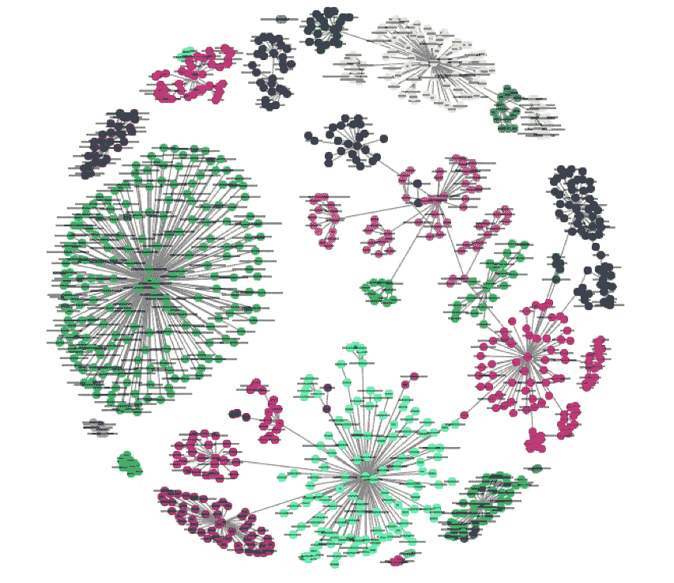
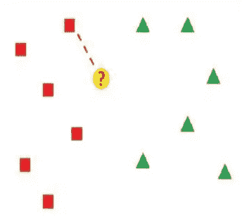
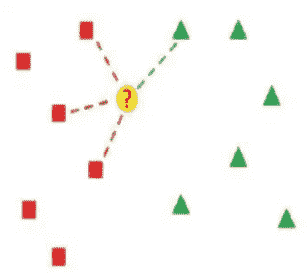
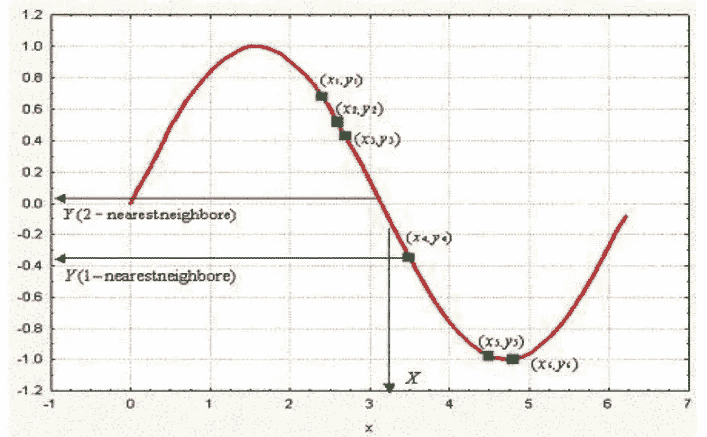
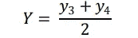

# 机器学习:k-NN 算法

> 原文：<https://medium.com/analytics-vidhya/machine-learning-knn-algorithm-4130f799d697?source=collection_archive---------16----------------------->

**k-最近邻居。来源:谷歌图片。**

k-最近邻(k-NN)算法简单且易于实现。它是一种监督学习技术，可以解决分类和回归问题。所以，出现的第一个问题是

***什么是监督学习？***

*监督学习说—* ***【教我】*** *。这意味着学习通过标记的数据集。*

> 把模特想象成家庭中的孩子。这个孩子被教导猫、狗等的区别。之后儿童能够区分他/她看到的动物。类似地，用标记数据来教导模型，这有助于学习可用数据类别的特征之间的差异，并预测新观察的结果。

***【k-近邻】***

> k-最近邻算法(k-NN)一种用于分类和回归的非参数方法。在这两种情况下，输入由特征空间中 k 个最接近的训练数据组成。输出取决于 *k* -NN 是用于分类还是回归:
> 
> **分类:**在 k-NN 分类中，输出是一个类成员。一个对象通过其邻居的多个投票被分类，该对象被分配到其 k 个最近邻居中最常见的类别(k 是正整数)，如果 k= 1，则该对象被简单地分配到该单个最近邻居的类别。
> 
> **回归:**在 *k-NN 回归*中，输出为对象的值。该值是 *k 个*最近邻居值的平均值。
> 
> 在我们学习机器学习技术的过程中，我们一定都听说过“**CART”**这个词。CART(分类和回归树)决策树算法可用于构建分类树(对分类响应变量进行分类)和回归树(预测连续响应变量)。k-最近邻方法也可以创建分类和回归模型。

***k-最近邻(k-NN)分类:***

> 在模式识别中，k-NN 算法是一种基于特征空间中最接近的训练样本对对象进行分类的方法。k-NN 是一种基于实例的学习，或称懒惰学习。当很少或没有关于数据分布的先验知识时，k-NN 是基本和最简单的分类技术。该规则简单地在学习期间保留整个训练集，并向每个查询分配一个由训练集中其 k 个最近邻的多数标签表示的类。在这种方法中，每个样品都应与其周围的样品进行类似的分类。因此，如果样本的分类未知，则可以通过考虑其最近邻样本的分类来预测。

1-NN 决策规则:要点？被分配给左边的类。

***举例:-***

*“对于分成 2 类的一组样本，K=1 时的 k-NN 判决规则。最近邻规则(NN)是 K= 1 时 k-NN 的最简单形式。”-仅使用一个已知样本对未知样本进行分类。这在图中清晰可见。*

**K-NN 规则判定规则，其中 K= 4: the point？也被分配到左边的类**

***举例:-***

*“对于分成两类的一组样本，K=4 时的 k-NN 判决规则。”-通过使用空间中一个以上的已知样本对未知样本进行分类。* K *设置为 4，以便考虑最接近的四个样本对未知样本进行分类。他们中的三个属于同一个阶层，而只有一个属于另一个阶层。这在图中清晰可见。*

> k-NN 分类器的性能主要取决于 K 的选择以及所应用的距离度量。该估计受到邻域大小 K 的选择的敏感性的影响，因为局部区域的半径由第 K 个最近邻到查询的距离来确定，并且不同的 K 产生不同的条件类概率。如果 K 很小，由于数据稀疏和噪声、模糊或错误标记的点，局部估计往往很差。为了进一步平滑估计，我们可以增加 K 并考虑查询周围的大区域。不幸的是，K 的大值容易使估计过度平滑，并且分类性能随着来自其他类的离群值的引入而降低。

***k-近邻回归:***

> 上述方法可用于回归，只需将对象的值指定为其 K 个最近邻居值的平均值。对邻居的贡献进行加权是有用的，这样较近的邻居比较远的邻居对平均值的贡献更大。回归问题涉及在给定一组自变量的情况下预测因变量的结果。

**回归的 k-NN 决策规则。来源:谷歌图片。**

> **举例-**
> 
> 让我们考虑上图，从 1-最近邻开始。在这种情况下，我们搜索示例集(绿色方块)并定位最接近新观察值 x 的一个。对于这种特殊情况，这恰好是 x4。于是，x4 的结果(即 y4)被认为是 X 的结果(即 Y)的答案。因此，对于 1-最近邻，我们可以写成:Y = y4。
> 
> 现在考虑 2-最近邻法。在这种情况下，我们定位最接近 X 的前两个点，这两个点恰好是 y3 和 y4。取其结果的平均值，则 Y 的解为:

> 类似地，如果 K 的值增加，则预测值是所有最近邻的平均值。

> **结论:**在了解了 k-NN 算法之后，让我们来讨论一下它的优缺点。

> 优点: k-NN 有几个主要优点:简单、有效、直观，在很多领域都有很好的分类性能。它对有噪声的训练数据是鲁棒的，并且如果训练数据很大，它是有效的。
> 
> **缺点:**尽管有上述优点，k-N 还是有一些局限性。当训练集很大时，KNN 的运行时性能会很差。它对不相关或冗余的特征非常敏感，因为所有特征都有助于相似性，从而有助于分类。通过仔细的特征选择或特征加权，这是可以避免的。该方法的另外两个缺点是:
> 
> 1.基于距离的学习不清楚使用哪种类型的距离和使用哪种属性来产生最佳结果。
> 
> 2.计算成本相当高，因为我们需要计算每个查询实例到所有训练样本的距离。

> "感谢您抽出宝贵的时间来阅读这篇关于机器学习算法的博客."