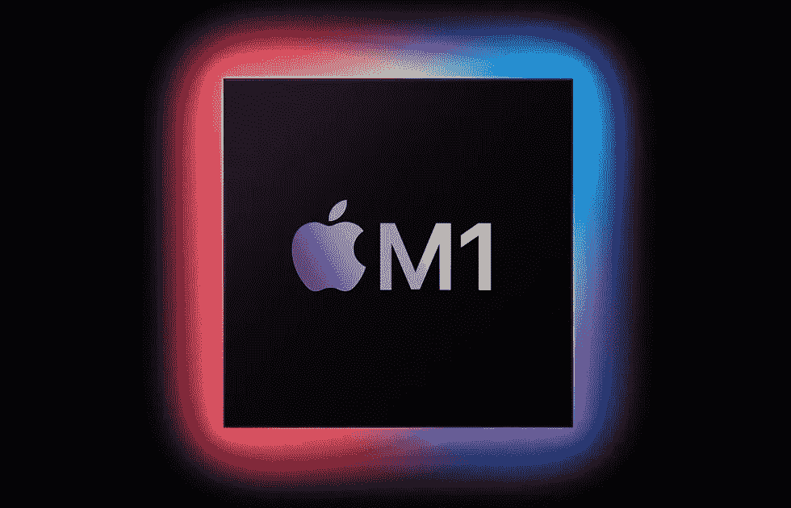
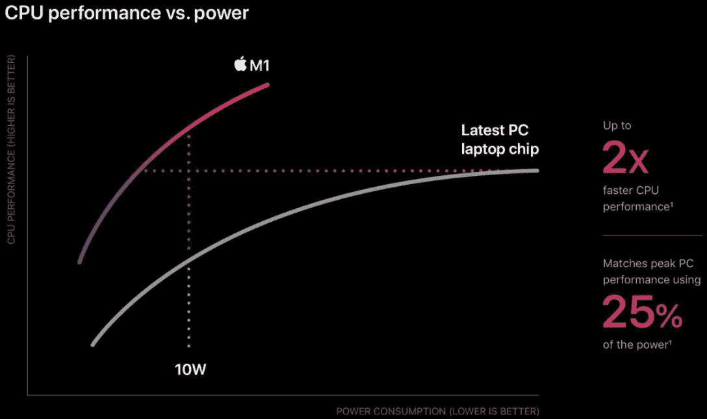
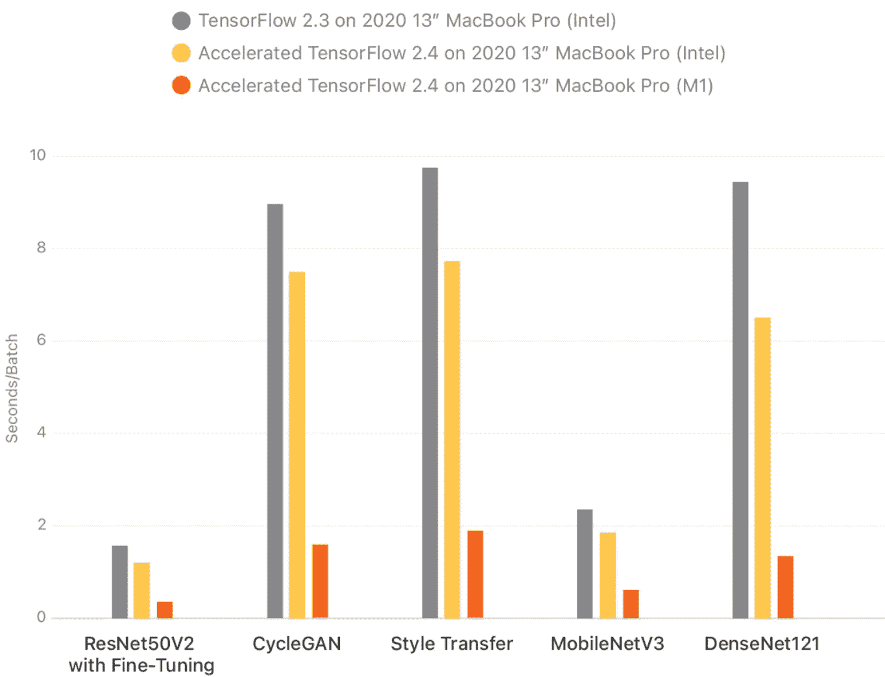
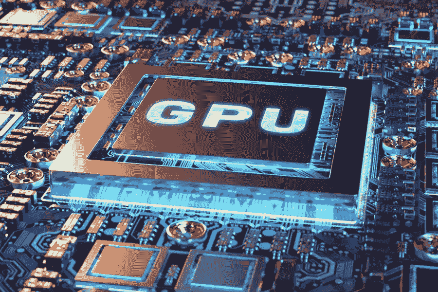

# 机器学习借助苹果 M1 CPU 芯片实现飞跃

> 原文：<https://medium.com/analytics-vidhya/machine-learning-leaps-with-apples-m1-cpu-chip-980be592484f?source=collection_archive---------5----------------------->

对微处理器霸主地位的争夺随着装备了 ARM 的 M1 芯片进入了高级阶段。这足以颠覆大玩家英特尔的市场份额吗？新的神经引擎在处理消费者和商业 ML 任务方面有多好？

M1 芯片:苹果

苹果公司的硅芯片意味着 macOS、iOS 和 padOS 应用程序都可以跨平台无缝运行。虽然移植特定的应用会有特定的限制，但硅片下的生态系统将呈指数级增长。

> 先说一点:这一单独行动背后的驱动力是 MacBooks 中英特尔芯片的成本，它占预组装硬件费用的 35%，约为 100 美元。因此，随着硅芯片的出现，降低整体硬件成本最终是人们所期望的。

这些芯片代表了苹果基于 ARM 的片上系统设计的起跑线，这是一种基于移动的 CPU 架构。将多个芯片集成到一个单元中，有效地减少了系统通信期间发生的延迟。旧 CPU 架构中的总线带宽和速度限制依赖于非常精确的时钟和专用通信通道。M1 已经消除了这些隐患。在热量管理方面，拥有一个“万能”的单芯片意味着减少散热装置和风扇的占用空间。例如，最新的 2020 年 MacBook Air 运行无风扇设计，但积累了巨大的 CPU 和 GPU 马力。

***“苹果声称，它拥有世界上最快的*** [***中央处理器***](https://en.wikipedia.org/wiki/Central_processing_unit)***【CPU】核心“在低功耗硅中”以及世界上最好的 CPU*** [***性能功耗比***](https://en.wikipedia.org/wiki/Performance_per_watt) ***。”***

M1 性能:苹果

当它在苹果公园的一个特别的“还有一件事”活动中宣布新的 M1 处理器时，苹果公司吹嘘它是“第一个专门为 Mac 设计的芯片”它使用 5 纳米技术和 160 亿个晶体管构建而成，苹果公司表示，它是为“小尺寸和高能效至关重要的 Mac 系统”而设计的。

因此，M1 具有行业领先的性能功耗比。这就是为什么第一代[苹果硅 MacBook Air](https://9to5mac.com/2020/11/10/new-macbook-air-apple-silicon/) 和 [MacBook Pro 型号](https://9to5mac.com/2020/11/10/apple-announces-13-inch-macbook-pro-with-faster-performance-thanks-to-m1-chip/)与它们的英特尔前辈相比，能够在电池寿命方面提供如此显著的改进。

根据 TensorFlow 的官方博客，M1 芯片可以在 Mac 优化版本的 TensorFlow 和新的 ML 计算框架中利用加速训练。增加了更好的 ML 处理引擎

TensoFlow Logo:【https://www.tensorflow.org/ 

有了 TensorFlow 2，在各种不同平台、设备和硬件上的一流培训性能使开发人员、工程师和研究人员能够在他们首选的平台上工作。使用英特尔 Mac 或苹果新 M1 芯片的 Mac 的 TensorFlow 用户现在可以利用苹果的 [Mac 优化版 TensorFlow 2.4](https://github.com/apple/tensorflow_macos) 和新的 ML 计算框架进行加速训练。这些改进，加上苹果开发者能够通过 [TensorFlow Lite](https://www.tensorflow.org/lite) 在 iOS 上执行 TensorFlow 的能力，继续展示了 TensorFlow 在苹果硬件上支持高性能 ML 执行的广度和深度。

下面是基于两个英特尔和一个 M1 芯片的性能实验。很明显，M1 在所有的测试中获胜。因此，苹果声称已经开发出每瓦特输出最高 CPU 性能的说法是正确的。

张量流性能:[tensorflow.org](https://blog.tensorflow.org/2020/11/accelerating-tensorflow-performance-on-mac.html)

**M1 上的 GPU 性能**

不是为了游戏，而是为了深度学习期间的额外处理，特别是对于巨大而快速的数据流。这一部分将探讨 GPU 性能的两个方面:游戏能力和机器学习。

> 认为一个 mac 用户有一个严肃的游戏玩家是可笑的，因为大多数开发者都避免将游戏移植到 macOS 上，而且 MAC OS 的硬件并不像 Windows 那样多样化/强大。这留下了一个非常小的 macOS 生态系统的控制台级别的游戏，因此得到一台 mac 不是为了游戏。在很大程度上，这相当于把普锐斯带到一场地狱猫的拉力赛。

苹果在 M1 的专用 GPU 能够使用 Rosetta II 仿真运行《星际争霸 2》等游戏。然而，这伴随着警告，因为超过 60fps 的帧速率在这个 ARM CPU 上挣扎。运行下一代游戏，如《使命召唤:冷战》或《战争机器 5 》,由于优化缺陷，它们的运行速度更快，延迟了 120fps。Mac 真的没有准备好接管游戏领域。

不用说，AMD 的大 Navi、RX 6000、Navi 2x、RDNA 2 都比苹果的产品领先好几光年。AMD 的下一代 GPU 有望大幅提高性能和效率，在光线跟踪支持方面与 Nvidia 的功能相当。假设这些专用 GPU 中的一个很容易花费新 Mac 的价格，因此这种比较是沉闷和不公平的。

M1 芯片首次将苹果行业领先的神经引擎引入 Mac 电脑。M1 神经引擎采用 16 核设计，每秒可执行 11 万亿次运算。自 2017 年推出 A11 处理器以来，苹果一直在 iPhone 和 iPad 中使用神经引擎。

你认为神经引擎会有什么样的改进？把神经引擎想象成专门为机器学习任务设计的东西。这包括视频分析、语音识别、人工智能等等。

**在收盘时……**

虽然苹果公司创建自己的芯片受到了技术界的欢迎，但他们声称比英特尔或 AMD 的芯片更好还为时过早。这是他们有史以来第一次单独制造处理器，英特尔和 AMD 已经在这方面做了三十多年。苹果只是利用了 OEM 芯片研发领导者的飞跃，实现了技术进步。至于将 M1 芯片与英特尔强大的[英特尔酷睿 i9–10885h 处理器](https://ark.intel.com/content/www/us/en/ark/products/203682/intel-core-i9-10885h-processor-16m-cache-up-to-5-30-ghz.html)进行比较，如果可以的话，这不是苹果与苹果之间的比较，请原谅这个双关语。

> macOS 和 Windows 平台的资源分配是完全不同的。macOS 一直吹嘘自己是比 Windows 更轻的操作系统。从好的一面来看，Windows 用户总是感觉更能控制他们的操作系统，能够获得超级用户访问是一种特权。

总而言之，苹果的 M1 芯片值得等待，因为新一代硬件试图将潘多拉魔盒装进一个高度集成的芯片中。

和苹果的所有事情一样，成为早期采用者是有风险的。Techradar 提出了与 [M1 芯片组](https://www.techradar.com/sg/news/apples-m1-chipset-could-have-some-major-compatibility-issues)的潜在兼容性问题。新硬件需要时间来理解长期固件/硬件限制。用 M1 mark II 芯片迭代更多的 RnD 将为更好的以 ML 为中心的 CPU 奠定基础，所有这些都掌握在普通买家手中，特别是世界各地的人工智能专家。

***5 纳米 M1 芯片对正在努力摆脱 10 纳米半导体技术的英特尔提出了挑战。苹果廉价提供了一个快速处理器，这是一个巨大的进步。***