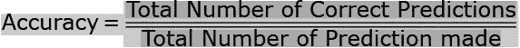
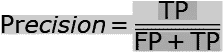

# 用于分类的机器学习度量；

> 原文：<https://medium.com/analytics-vidhya/machine-learning-metrics-for-classfication-b6d787b06dee?source=collection_archive---------14----------------------->


金光淋浴

度量对于测量任何系统程序的性能或效率的具体特征是很重要的。在机器学习生命周期中，我们执行许多活动，如探索性数据分析、特征选择、特征工程、模型实现。但是要评估程序的正确性，必须有一些参数/度量来验证。

这些指标基于分类、回归、神经网络等进行分类。：


度量分类

在本文中，将讨论用于解决分类问题的度量标准，接下来的两篇文章将讨论回归和神经网络。

# 分类准确度:



这是正确预测总数与输入样本总数的比率。

何时使用:当类中的目标变量达到平衡时，精确度是一个很好的预测指标。

**例如，**在第一天，一个渔民发现我们的鱼中 92%的种类是**卡特拉**(拉贝奥**卡特拉**)，而剩下的 8%是**罗虎**(拉贝奥罗希塔)。在训练后模型上，发现 92%的准确度属于 **Catla。**


第二天，渔夫把这张网放到水里，发现 72%是**Catla**(Labeo**Catla**)，而剩下的 28%是 **Rohu** (Labeo rohita)。在训练后的模型上，发现测试准确率下降到 72%。

第三天，渔夫将这张网放入水中，发现 97%是 Catla，而剩下的 3%是 T21。在训练后的模型上，测试准确率提高到了 97%。

**发现:**我们发现每天的渔获量是变化的，数据集是不平衡的。因此，当目标变量类不平衡或偏斜时，准确性不是一个好的度量。

**实施:**

```
import numpy as np
accuracy_score(np.array([[0, 1], [1, 1]]), np.ones((2, 2)))0.5
```

[](https://scikit-learn.org/stable/modules/generated/sklearn.metrics.accuracy_score.html) [## sk learn . metrics . accuracy _ score-sci kit-learn 0 . 21 . 3 文档

### 上一个 sklearn.metri...sklearn.metrics.make_scorer

scikit-learn.org](https://scikit-learn.org/stable/modules/generated/sklearn.metrics.accuracy_score.html) 

# 混淆矩阵:

让我们看看混淆矩阵是如何解决问题的。这是一个输出矩阵，给出了模型的完整性能。下面是混淆矩阵的一个可能输出:

*   **真阳性:**我们预测为是，实际输出也为是的情况。这位病人被诊断患有癌症，并被查出患有同样的疾病。关于鱼的例子，99%的鱼被检测到类型为**Catla**(Labeo**Catla**)，考虑到二进制分类而不是多类分类。
*   **真阴性:**我们预测为 NO 而实际输出为 NO 的病例例:患者未被诊断为癌症，也未被发现为同。关于鱼的例子，考虑到二进制而非多类的分类，1%的鱼被检测到属于其他类型。
*   **假阳性:**我们预测为是，实际输出为否的病例，例如:患者被诊断为癌症，**不是**发现相同。这也称为类型 1 错误。关于鱼，可能有类型的错误分类，或者它可能是鱼群中的其他鱼。
*   **假阴性:**我们预测为否而实际输出为是的情况。患者**未被**诊断为癌症，被发现也是如此。这也称为类型 2 错误。


准确度度量可以从混淆矩阵中导出:


**实施:**

[](https://scikit-learn.org/stable/modules/generated/sklearn.metrics.confusion_matrix.html) [## sk learn . metrics . confusion _ matrix-sci kit-learn 0 . 21 . 3 文档

### 上一个 sklearn.metri...sk learn . metrics . Cohen _ kappa _ score

scikit-learn.org](https://scikit-learn.org/stable/modules/generated/sklearn.metrics.confusion_matrix.html) 

```
from sklearn.metrics import confusion_matrix
actual = [1, 1, 0, 1, 0, 0, 1, 0, 0, 0]
predicted = [1, 0, 0, 1, 0, 0, 1, 1, 1, 0]
results = confusion_matrix(actual, predicted)
print(results)[[4 2][1 3]]
```

**参考文献:**

[](https://www.geeksforgeeks.org/confusion-matrix-machine-learning/) [## 机器学习中的混淆矩阵

### 在机器学习领域，特别是统计分类问题，混淆矩阵，也…

www.geeksforgeeks.org](https://www.geeksforgeeks.org/confusion-matrix-machine-learning/) 

# 精度:

精度是在所有被识别为阳性的项目中被正确识别为阳性的项目数。TP 实际上是患有癌症的人，而 FP 是被预测患有癌症但没有任何癌症的人。关于鱼的例子，TP 指的是鱼的正确分类，而 FP 指的是对任何一天捕获的鱼的错误预测(纯粹是假设的情况，这不能是一个单一的数字。)



# 曲线下面积(AUC) —受试者操作曲线(ROC):

AUC-ROC 以及 Log-loss 和 F1 可以是基于情景的良好预测指标。

AUC-ROC 曲线是分类问题的性能度量。ROC 是概率曲线，而 AUC 是可分离性的量度(区分 1 为 1 和 0 为 0)。它告诉我们模型在多大程度上能够区分不同的类。因此，较高的 AUC 给出了正确的预测。

在进一步探索 AUC-ROC 之前，让我们讨论一下相关的指标:

TPR/Recall/Sensitivity: Recall 是一种测量方法，它告诉我们实际患有癌症的患者中有多少比例被算法诊断为患有癌症。

实际阳性(患有癌症的人是 TP 和 FN)和通过模型诊断患有癌症的人是 TP。

关于鱼的例子，从一群鱼中正确分类 Rohu 和 Catla。


特异性:特异性告诉我们未患癌症的人的百分比。关于鱼的例子，从一群鱼中正确分类的其他鱼。


假阳性率:1-特异性


上述指标将负责


AUC-ROC 在 youtube 的以下链接中有解释。这个视频也解释了如何设置阈值，从 AUC-ROC 曲线中找到结论。

**发现:** ROC(受试者操作者特征曲线)可以帮助决定最佳阈值。它是通过绘制真阳性率(y 轴)对假阳性率(x 轴)而产生的。

AUC 给出了通过逻辑模型成功分类的比率。AUC 使得比较一个模型与另一个模型的 ROC 曲线变得容易。

关于鱼的例子，AUC-ROC 给出了阈值的更好的预测和设置。

**实施:**

[](https://scikit-learn.org/stable/auto_examples/model_selection/plot_roc.html#sphx-glr-auto-examples-model-selection-plot-roc-py) [## 接收器工作特性(ROC)-sci kit-学习 0.21.3 文档

### 评估分类器输出质量的接收器操作特性(ROC)度量示例。ROC 曲线通常…

scikit-learn.org](https://scikit-learn.org/stable/auto_examples/model_selection/plot_roc.html#sphx-glr-auto-examples-model-selection-plot-roc-py) 

# F1 分数:

F1 分数是精确度和召回率之间的调和平均值，取值范围从 0 到 1。F1 分数是测试准确性的衡量标准。F1 表示模型的精度和稳健性。


**发现:**高精度低召回，给你一个极其准确的，但它然后错过了大量难以分类的实例。F1 分数越大，我们模型的性能越好。数学上，它可以表示为:

**实现:**

```
**>>> from** **sklearn.metrics** **import** f1_score
**>>>** y_true = [0, 1, 2, 0, 1, 2]
**>>>** y_pred = [0, 2, 1, 0, 0, 1]
**>>>** f1_score(y_true, y_pred, average='macro')  
0.26...
**>>>** f1_score(y_true, y_pred, average='micro')  
0.33...
**>>>** f1_score(y_true, y_pred, average='weighted')  
0.26...
**>>>** f1_score(y_true, y_pred, average=**None**)
array([0.8, 0\. , 0\. ])
```

[](https://scikit-learn.org/stable/modules/generated/sklearn.metrics.f1_score.html) [## sk learn . metrics . f1 _ score-sci kit-learn 0 . 21 . 3 文档

### 计算 F1 得分，也称为平衡 F 得分或 F 衡量，F1 得分可以解释为加权平均值…

scikit-learn.org](https://scikit-learn.org/stable/modules/generated/sklearn.metrics.f1_score.html) 

# 对数损耗:

Log loss 衡量分类模型的性能，其中预测是从 0 到 1 的概率值。随着概率偏离实际标签，对数损失增加。机器学习的目标是最小化损失。因此，对数损失越小越好，理想值应为 0。

Log Loss 通过惩罚错误分类来量化分类器的准确性。最小化日志损失基本上相当于最大化分类器的准确度。

为了计算测井损失，分类器必须给每个类别分配一个概率，而不是简单地产生最可能的类别。数学上，测井损失定义为


其中 N 是样本或实例的数量，M 是可能标签的数量，

yij 是标签 j 是否是正确分类的二进制指示符，例如，I

pij 是将标签 j 分配给实例 I 的模型概率

如果只有两个类，则表达式变为


**实现:**

```
from sklearn.metrics import log_loss
log_loss(["spam", "ham", "ham", "spam"],  
...          [[.1, .9], [.9, .1], [.8, .2], [.35, .65]])0.21616
```

[](https://scikit-learn.org/stable/modules/generated/sklearn.metrics.log_loss.html) [## sk learn . metrics . log _ loss-sci kit-learn 0 . 21 . 3 文档

### 对数损失，又名逻辑损失或交叉熵损失。这是(多项式)逻辑回归中使用的损失函数…

scikit-learn.org](https://scikit-learn.org/stable/modules/generated/sklearn.metrics.log_loss.html) 

# 对数损失与 ROC 和 F1 的比较:

在决定要考虑的所有指标时，基于需求、数据等，应该进行适当的评估。

下面的文章根据具体情况明确定义了应该使用哪些指标

[](/usf-msds/choosing-the-right-metric-for-evaluating-machine-learning-models-part-2-86d5649a5428) [## 为评估机器学习模型选择正确的度量标准—第 2 部分

### 本系列的第二部分关注分类标准

medium.com](/usf-msds/choosing-the-right-metric-for-evaluating-machine-learning-models-part-2-86d5649a5428) 

参考资料:

[](https://scikit-learn.org/stable/) [## sci kit-学习

### 编辑描述

scikit-learn.org](https://scikit-learn.org/stable/) [](https://towardsdatascience.com/metrics-to-evaluate-your-machine-learning-algorithm-f10ba6e38234) [## 评估您的机器学习算法的指标

### 评估你的机器学习算法是任何项目的重要组成部分。你的模型可能会让你满意…

towardsdatascience.com](https://towardsdatascience.com/metrics-to-evaluate-your-machine-learning-algorithm-f10ba6e38234)