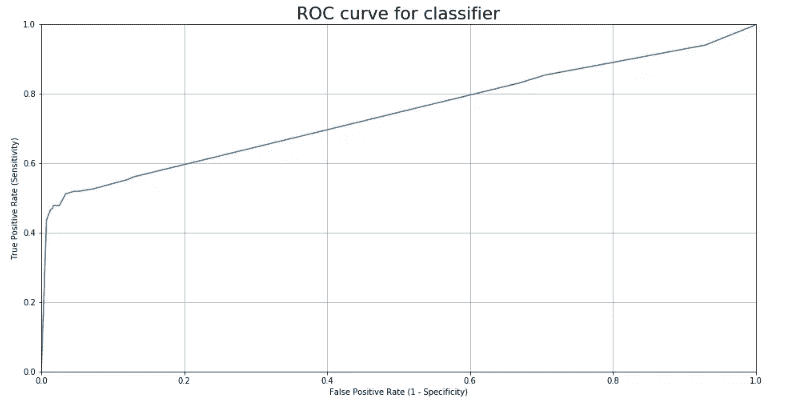

# 预测个人贷款潜在客户的机器学习模型

> 原文：<https://medium.com/analytics-vidhya/machine-learning-model-to-predict-prospective-customers-for-personal-loan-e4f7a60a2739?source=collection_archive---------4----------------------->

本文是为我构建的一个机器学习模型编写的报告，该模型根据个人以前的行为数据预测银行将接受个人贷款的潜在客户。使用这种模式，银行将能够锁定潜在客户，从而增加个人贷款的数量。

用于建立这个模型的数据是从互联网上下载的。我没有做任何类型的数据抓取/网页抓取。你可以在这里找到数据和代码 [**。**](https://github.com/Anjali-Kadiyala/Personal_load_prediction)

您可能知道，预测模型要么是回归模型(连续输出)，要么是分类模型(分类输出)。在这种情况下，输出显然是绝对的。客户可以选择是否承担个人负载，因此，**该模型是一个分类模型**。输出可以是类别输出，也可以是概率输出。类输出本质上是二进制的，即 0 或 1，而概率输出给出输出为 1 的概率。通过给定概率的阈值，可以很容易地将概率输出转换为类输出。通常阈值为 0.5%或 50%。

还有，在建立任何机器学习模型之前，非常有必要注意每一类的误分类代价。选择合适的指标(分类模型:准确度、灵敏度、精确度)来评估模型的性能也是非常重要的。为了在准确度或灵敏度和精确度之间做出选择，应该知道每个类别的错误分类成本。我所说的每门课的成本是指一门课被预测错了所浪费的钱。为了更好地理解这一点，让我们看看我们的案例。这里的 2 类是- 0:客户不接受个人贷款提议，1:客户接受个人贷款提议。让我们考虑两种情况。

案例 1:假设个人贷款平均为 10，000，000，如果一个潜在客户被错误地预测为非潜在客户，银行将损失 10，000，000 的利息，并损失一个潜在客户(假设损失为 50，000)。

案例 2:另一方面，比方说，一个非预期客户被预测为预期客户，银行的唯一损失将是与客户联系贷款事宜的雇员的几分钟工资(假设损失为 1000 英镑)。

可以清楚地看到，在情况 1 中，银行的错误分类成本更大。这表明准确性不能作为评估模型性能的正确指标。正确的方法必须是灵敏和精确的，因此，我使用了混淆矩阵。

# **工作流程:**

如上所述，数据是从互联网上下载的。

**第一步** : **准备数据建立模型**。我做的第一件事是进口熊猫。然后，我把输入的数据。在确保没有空值之后，我进一步将属性(列)分为 x 和 y，其中 y 是响应类。然后，使用 scikit learn 的 model_selection 中的 train_test_split，我将 x 和 y 拆分为训练和测试数据，即 x_train、y_train、x_test 和 y_test。只有训练数据(x_train 和 y_train)用于模型训练，测试数据(x_test 和 y_test)用于评估模型性能。

**第二步:建立模型。**我建立了一个树模型。从 sklearn 导入树后，我用 x_train 和 y_train 建立模型。然后，对测试数据 x_test 进行预测，并用灵敏度和精度分析模型性能。

**第三步:模型超参数调整。找到我们不相关的属性在建模中非常重要。现在基本模型已经建立，我使用树内置方法“model.feature_importances_”找出了每个属性的重要性。在使用 GridSearchCV 去掉可能导致模型分析错误模式的不相关属性后，我进行了超参数调优。在调整了“标准”、“最大特征”、“拆分器”、“最小样本拆分”、“最大深度”和“类别权重”等参数后，我构建了最终的模型，将交叉验证 cv 设为 5。**

**第四步:**当使用倾向/概率/可能性建立模型时，总有一个阈值将概率输出转换为类别/二进制输出，如上所述。这个阈值一般是 0.5/ 50%。但是这并不总是最佳阈值。使用 ROC 曲线，我们可以确定在灵敏度和特异性之间平衡的最佳阈值，因为它们都是彼此间接成比例的(随着灵敏度增加，特异性降低)，这不是理想的情况。因此，确定两者的平衡点是很重要的。ROC 曲线有助于做到这一点。我就是这么做的。

根据测试数据，按照以下方式进行最终预测。

这里“pred_class”是直接类预测。“prob_1”是客户成为预期贷款接受者的概率,“pred_class_new”是基于预测的类输出。

这就是我如何建立一个机器学习模型来识别银行的潜在个人贷款客户。如有任何更正或疑问，请通过 anjali.kadiyala1999@gmail.com 联系我，您也可以通过 LinkedIn[找到我。](https://www.linkedin.com/in/anjali-sreeja-kadiyala-1307b8177/)