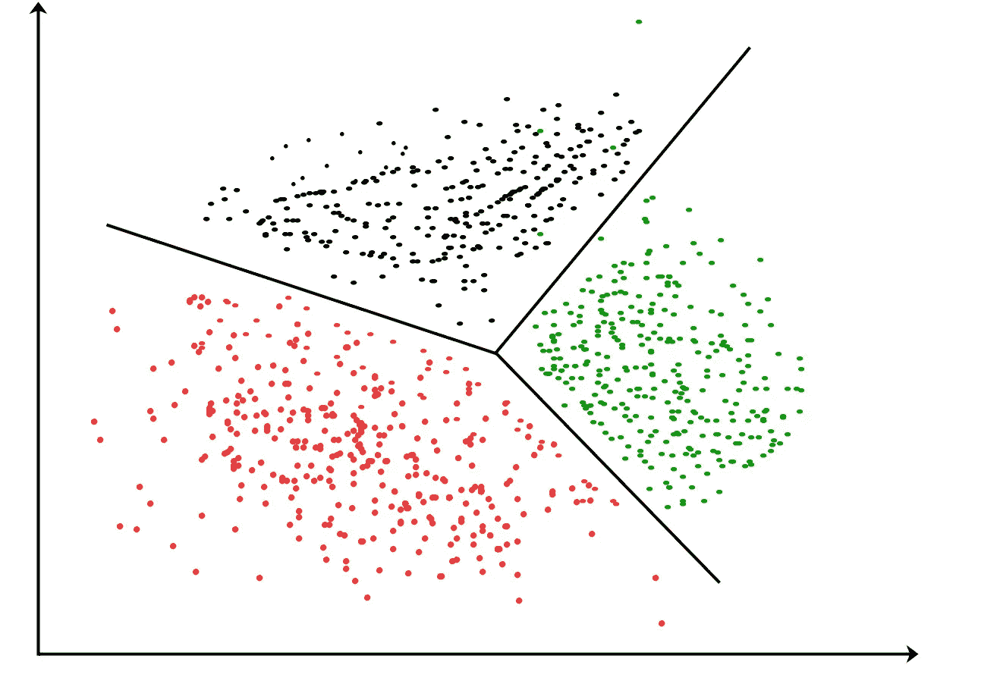
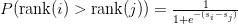

# 机器学习模型的备忘单

> 原文：<https://medium.com/analytics-vidhya/machine-learning-models-cheatsheet-7885b33ca44f?source=collection_archive---------3----------------------->

了解如何针对不同的用例利用从随机森林到文本排序的各种算法

近年来，机器学习因其在识别模式和预测结果方面的可扩展性和准确性而得到普及。它已经被广泛应用于各种行业，从检测欺诈交易到预测客户流失。

有这么多现成的机器学习模型，学习起来可能会非常困难，特别是对于那些相对来说对数据科学比较陌生的人来说。随着我通过我的课程和工作经验对机器学习了解得越来越多，我决定写我的第一篇中型文章，在一个非常高的水平上涵盖一些最流行的 ML 算法。

本指南并不意味着是所有重要观点的详尽清单。相反，它概述了如何将 ML 算法用于不同的目的。我将通过用例来介绍模型，例如预测数值、二进制分类、聚类等。我将着重于简化每个模型的工作方式，使用度量标准分析模型性能，以及其他一些相关的概念。

# 预测数值

例如，根据广告支出预测销售额。

## 多元线性回归

多元线性回归模型

*   通过最小二乘法估计特征权重(系数):最小化残差平方和，其中残差=实际 y 值-预测 y 值。
*   通过相关的 p 值评估每个特征(系数)，其中零假设是特定特征(x)和目标(y)之间没有相关性。
*   通过 F 统计评估整体模型效用(如果它很大，那么我们拒绝零假设，并得出结论，在特征和目标之间存在某种关系)。
*   我们可以使用指标 R 的平方来评估模型的准确性，R 的平方是可以用我们的回归模型中的特征来解释的目标中可变性的比例(理想情况下，我们希望 R 的平方很高，即接近 1)。请记住，添加更多预测器(特征)将始终改善模型与训练数据的拟合，从而增加 R 平方值(小心过度拟合:当模型与训练数据拟合得太好，以至于失去了识别测试集模式的一些能力时)。

## 决策树回归

决策树可以用于回归和分类。这里我们着重于使用决策树来预测一些数值。

*   决策树使用标准差缩减在特定节点将数据集分成子集。具有相似值(同质)的数据点样本应该具有非常小的标准偏差。
*   然后使用平均值和标准偏差来计算变异系数(CV):

平均值公式

标准偏差公式

CV 用于决定何时停止分支

当我们使用决策树进行回归时，我们关心的是找到返回最大标准差减少的属性。

我们选择具有最大 SDR 的属性作为分裂节点。反复重复该过程，直到某个停止标准:CV 小于某个阈值(即，当某个分支的 CV 变得小于 8%的阈值时，停止分裂该节点，因为该分支“足够同质”)。

## 示例:为回归构建决策树

假设我们使用 3 个预测值:

*   天气(雨天、晴天或阴天)，
*   温度(热、温和或冷)，以及
*   湿度(高或正常)

来预测户外活动的时间。

1.  计算目标的标准偏差(户外花费的小时数)。
2.  分割 3 个不同属性(天气、温度、湿度)的数据，并计算分割后每个分支的标准偏差。分割前，从标准偏差中减去该结果。
3.  计算标准差减少量(SDDR)，其中 SDR(T，X) = S(T)-S(T，X) = S(室外小时数)-S(室外小时数，特征 X)
4.  具有最大标准差减少的属性被用作分裂节点(在我们的例子中，天气被选作根节点)。
5.  根据所选属性(天气)的值划分数据，直到达到某个停止标准(即当分支的 CV 小于 8%的阈值时):

a)如果特定节点处的 CV 大于阈值，则该分支不够同质，我们通过选择具有最大 SDR 的特征来进一步分割它。

b)如果特定节点处的 CV 小于阈值，则它成为叶节点，因为该分支“足够同质”。

## 提高决策树模型的准确性

通过创建一组不同的决策树，我们可以构建一个随机森林，提高模型的准确性，并有助于防止过度拟合。随机森林的细节将在下面详细讨论。

请注意，如果我们使用决策树进行分类，我们几乎可以复制与上面相同的过程。我们不使用 SDR，而是使用 Gini 杂质分数(如果使用类的分布对观察值进行随机分类，我们希望杂质分数较低，因为它可以衡量错误分类的可能性)作为分割节点的度量。

## 注意

还有许多其他技术可以用于回归问题，如神经网络和多项式回归。

# 二元分类

例如，对电子邮件是否是垃圾邮件进行分类。

## 逻辑回归

逻辑回归旨在预测某个观察值是否属于某个类别的概率(值介于 0 和 1 之间)。

逻辑回归背后的主要思想是下面指定的 logit 函数:

输入的线性组合(右)被映射到优势对数(成功和失败概率的比率)

我们取上式的右边= z = B0 + B1X(这意味着中间输入)。

然后，我们将 z 传递给一个 sigmoid 函数，它将返回一个介于 0 和 1 之间的概率值。

*   通过最大似然估计来估计回归系数:选择预测概率尽可能接近观察值的一组系数。
*   我们可以使用偏差来评估模型性能。有两种类型—

1.  零偏差:响应由只有截距项的模型预测；
2.  剩余偏差:通过一个带有截距项和附加预测因子的模型来预测反应。

如果剩余偏差比零偏差小得多，我们可以得出结论，包括附加参数显著提高了模型精度。

## 朴素贝叶斯分类器

该模型基于贝叶斯定理，主要假设如下:

1.  每个特征有条件地独立于其他特征；
2.  每个特征具有相同的权重。

贝叶斯定理。来源:https://www.saedsayad.com/naive_bayesian.htm

如果我们想将电子邮件分类为垃圾邮件(1)或不分类为垃圾邮件(0):

*   P(c|x) = P(y=1 |电子邮件 x)
*   P(x|c) * P(c) = P(电子邮件 x | y=1) * P(y=1)
*   P(x) = P(邮件 x | y=1) * P(y=1) + P(邮件 x | y=0) * P(y=0)

## 评估二元分类器的性能

困惑矩阵(来源:MathWorks)

示例:预测客户是否会返回(正)或不返回(负)？

我们可以使用从混淆矩阵中得出的指标，例如:

*   准确度= (TP + TN) / (TP + FN + FP + TN)。在所有可能的数据点中，我们的模型正确分类的比例是多少？
*   特异性= TN / (FP + TN)。在所有没有回访(负面)的客户中，我们的模型正确分类的比例是多少？(预测负面的模型准确性)
*   敏感度或召回率= TP / (TP + FN)。在所有返回(肯定)的客户中，我们的模型正确分类的比例是多少？(预测阳性的模型准确性)
*   精度= TP / (TP + FP)。在所有预测会再次光顾的客户中(肯定)，实际会再次光顾的比例是多少？

在我们的示例中，我们会优先考虑我们的模型在正确分类客户是否会再次光顾方面的准确性。因此，优化精确度和召回分数对我们来说是有意义的，但是在这两个指标之间有一个折衷。

精确度和召回率的权衡

## 受试者工作特征曲线

基于上面提到的一些度量，我们可以导出接收器操作特性(ROC)曲线作为评估度量。

ROC 曲线可视化了二元分类器在两个类别之间的区分程度。AUC 简单地表示 ROC 曲线下的面积:AUC 越高(接近 1)，我们的模型的诊断能力越好。

以下是得出 ROC 曲线的三个关键指标:

*   真实阳性率/召回率/敏感度:在阳性类别的所有数据点中，有多少比例被正确预测？

*   真阴性率/特异性:在阴性类别的所有数据点中，有多少比例被正确预测？

*   假阳性率= 1-真阴性率

ROC 曲线。资料来源:researchgate.net

# 多类分类

例如，预测图像是松饼、吉娃娃还是猫。

## 支持向量机(SVM)

*   SVM 的目标是通过最大化裕度来用超平面分离不同的类，裕度是观察值和阈值(分类的分隔线)之间的最短距离。
*   简单来说，这就是 SVM 的工作方式:

1.  我们从相对低维度的数据集开始。
2.  将数据转换到更高维度。
3.  核函数用于寻找将高维数据分成不同类的分类器(通过系统地计算每对观察值之间的关系)。

*   支持向量分类器与软边界一起使用，这意味着允许一些错误分类(引入一些偏差以使阈值对异常值不太敏感)以获得更好的模型预测(更低的方差)。这也被称为偏差-方差权衡。
*   SVM 有几个关键参数:

1.  c(正则化参数)指定您希望在多大程度上避免对每个示例进行错误分类。C 的高值意味着如果模型具有较高的训练精度，则将使用较小的余量。较低的 C 值鼓励更大的余量，同时牺牲一些训练精度。
2.  伽玛定义了观察的影响范围。高 gamma 值意味着只考虑附近的点，而低 gamma 值意味着也考虑远点。
3.  边距:到最近类点的分隔线。一个好的边界意味着分离超平面对于所有的类来说都是尽可能大致等距的。

## 随机森林

随机森林在集成学习的基础上运行，这意味着使用具有不同特征子集的多个决策树，以提高模型准确性并帮助防止过度拟合。集成学习中有两个重要的概念与此相关:

*   Bagging (bootstrap aggregation):通过重复从数据集中随机抽取样本来减少方差。对所有引导数据集进行训练，获取每个数据集的预测，并对预测进行平均。
*   提升:使用来自先前树的信息顺序地生长树。从弱的早期学习者(适合简单模型)开始，分析错误:当输入被错误分类时，增加其权重以提高分类性能。

可以通过以下步骤构建随机林:

1.  创建一个引导数据集(使用替换随机抽样来估计抽样分布)。
2.  在引导数据集中选择 m (m
3.  重复第 1 步和第 2 步，得到各种各样的决策树。
4.  因为每个决策树都有一个投票来对输入进行分类，所以我们从每个树中获取投票，并将拥有最多投票的类分配给输入变量。

# 无监督学习—聚类

例如，根据每月经常性收入和公司规模的每月增长率对企业客户进行细分。

## k 均值聚类

在 K-Means 中，我们试图最大化 Dunn 指数，该指数被定义为 min(类间距离)/ max(类内距离)。

*   分子值越大，表示聚类之间的距离越远。
*   较小的分母值意味着每个聚类相对紧凑。换句话说，聚类内的点靠近聚类质心。

我们可以通过使用以下步骤来构建 K 均值聚类模型:

1.  使用肘形法选择聚类数(k ):绘制 k (x 轴)的各种值与每个数据点到其聚类质心(y 轴)的距离平方平均值的关系图。在距离显著下降的地方选择 k 值。然后，我们随机初始化所有 k 个簇的质心。
2.  然后，该算法在以下各项之间迭代:

*   数据分配步骤:通过最小化每个点到质心的平方距离，将每个点分配到最近的质心。换句话说，我们将一个观察分类到质心最接近它的聚类中。
*   质心更新步骤:通过取该聚类中所有观察值的平均值来重新计算聚类质心。

…直到达到某种停止标准(即达到最大迭代次数)。

*   关键优势:计算观测值和质心之间的距离具有线性时间复杂度， *O* ( *n* )。
*   主要缺点:结果可能缺乏一致性，因为模型是从随机初始化的聚类中心数开始的。

## k 最近邻(kNN)

kNN 可用于分类和回归。

1.  选择对观测值进行分类时要考虑的最近邻数(k )(即 k = 11。在离未知点 P 最近的 11 个点中，8 个是绿色的，3 个是红色的= x 被分类为绿色)。
2.  计算点 P(测试数据)和每行训练数据之间的距离。
3.  按升序对距离进行排序，并挑选前 k 个最小的条目。
4.  获取所选 k 个条目的标签:

*   如果分类:返回 k 个标签的模式。
*   If 回归:返回 k 个标签的平均值。

## 分层聚类

*   最常见的类型称为聚集聚类，它是以自下而上的分层方法构建的。

1.  该算法将每个数据点视为单个聚类。然后，选择测量聚类之间距离的相异度度量。例如，我们可以使用平均关联，它是第一个聚类中的数据点与第二个聚类中的数据点之间的平均距离(计算聚类 1 中的观察值与聚类 2 中的观察值之间的所有成对距离，然后对差异进行平均)。
2.  在每次迭代中合并最相似的一对聚类(选择平均关联最小的 2 个聚类)。
3.  重复步骤 2，直到所有东西都变成包含所有数据点的单个聚类(我们也可以选择任意停止标准，即当总共有 2 个聚类时停止组合聚类)。

资料来源:kdnuggets.com

*   主要优势:

1.  不需要人工输入来初始指定聚类的数量。
2.  对不同的距离度量不敏感。
3.  对于具有层次结构的数据集非常有用。

*   缺点:效率较低 *O(n)，*不像 K-Means 聚类那样具有线性复杂度。

# 无监督学习——降维

## 主成分分析

*   如果有太多的特征需要分析，PCA 可以降低特征空间的维数，这样主成分 1 (PC1)可以解释我们数据集中的最大变化，PC2 可以解释第二大变化，等等。
*   简单来说，PCA 是如何工作的:

1.  找到一条“最佳拟合线”:将数据点投影到最佳拟合线上后，选择原始数据点残差平方和最低的一条。这相当于选择从投影数据点到原点的最大距离平方和(SS )(投影现在位于最佳拟合线上)。
2.  从投影点到原始点产生最大 SS 的最佳拟合线被称为主成分 1。对其他主成分重复这一过程(如果您想要 2D PCA 图，只需让 PC2 垂直于 PC1)。
3.  转换原始数据以与这些方向(主成分)保持一致，这压缩了特征空间(丢弃了不能解释数据集中大量变化的变量)，同时保留了我们的原始变量。

## 线性判别分析(LDA)

LDA 既可以用于分类，也可以用于降维。

*   LDA 通过最大化类别之间的可分性从数据集创建新的轴。
*   LDA 通过以下方式生成这个新轴:

1.  (各种类别的)手段之间的距离最大化；
2.  最小化每个类别中的变化。

*   如果我们有一个 2D 数据集(基因 1 和基因 2)，LDA 简单地使用这两个基因来创建一个新轴，并将原始数据投影到这个新轴上，以最大化这两个类别的分离(我们的数据现在在 1D)。

## PCA 与 LDA

*   这两个模型都试图降低维度，并按照重要性对新轴进行排序。
*   PCA 创建了 PC1，它解释了我们数据中最大的变化，而 LDA 创建了 LD1，它解释了类别之间最大的变化。
*   LDA 适用于小数据集，可用于预测 3 个或更多类别，而 PCA 适用于可视化更高维度的数据或删除数据中不占太多变化的变量。

# 处理文本数据

比如总结一篇文章的要点。

## 词汇袋

单词包(BoW)是文本的表示，它指定了单词在文档中的频率。BoW 背后的主要思想非常直观:拥有一个单词的词汇表，并计算已知单词在给定文档中的存在。

这个单词“包”忽略了文档中单词的位置、结构或顺序；该模型仅考虑文档中已知单词的出现。

## TF-IDF(术语频率-逆文档频率)

该模型用于反映单词对文档的重要性。

*   术语频率=该词在给定文档中的频率/该文档中的总字数
*   逆文档频率= log(文档总数/包含该单词的文档数)
*   等式= TF * IDF

我们可以通过以下步骤使用 TF-IDF 来查找文档的含义:

1.  数据清理:删除特殊字符，将所有单词改为小写词根。
2.  分裂成单独的单词和频率。
3.  计算每个单词的术语频率*逆文档频率。

## 文本排名

TextRank 是一个强大的文本摘要工具。

*   数据清理:删除特殊字符(和标点符号)，去掉停用词(is，am，the，of 等)。).
*   向量表示:可以使用导入的单词嵌入、单词包或 TF-IDF 来表示句子。
*   利用余弦相似度构造相似度矩阵。计算两个向量之间的角度的余弦值，以确定它们是否指向相似的方向(如果是，那么角度应该是窄的，两个句子是相似的)。
*   将相似度矩阵转换成图，其中节点代表句子，边代表句子之间的相似度得分。
*   最后，根据排名提取前 n 个句子。

# 排名算法

例如，根据相关性对用户的产品进行排名。

## 学习分级

*   LTR 通过训练模型来预测特定项目排名高于另一个项目的概率，从而对项目进行排名(“给每个项目分配一个分数，使得排名较高的项目也具有较高的分数)

Sigmoid 函数，其中 s =项目得分

*   使用 Sigmoid 函数，排序分数的大差异将导致更大的概率(项目 I 的排序高于项目 j)。另外，分数相等导致概率= 0.5。

来源:[https://ml explained . com/2019/05/27/learning-to-rank-explained-with-code/](https://mlexplained.com/2019/05/27/learning-to-rank-explained-with-code/)

*   定义一个损失函数 J(将事件映射到一个实数上，作为其关联的“成本”)，使用梯度下降进行优化(如果您试图从一座几乎看不见的山下来，分析当前位置的坡度，然后以最陡下降的方向前进，即下坡)

I 排名高于 j 的概率的负对数似然

来源:[https://ml explained . com/2019/05/27/learning-to-rank-explained-with-code/](https://mlexplained.com/2019/05/27/learning-to-rank-explained-with-code/)

希望这篇文章可以作为一个实用的介绍，介绍各种各样的、强大的机器学习工具，您可以为完全不同的用例部署这些工具。

# 参考

*   [https://towards data science . com/the-complete-hands-on-machine-learning-crash-course-59e 43 c8 CEE 52 # 270d](https://towardsdatascience.com/the-complete-hands-on-machine-learning-crash-course-59e43c8cee52#270d)
*   [https://medium . com/data-science-group-iitr/logistic-regression-simplified-9b4efe 801389](/data-science-group-iitr/logistic-regression-simplified-9b4efe801389)
*   [https://www . datascience central . com/profiles/blogs/why-logistic-regression-should-be-the last-thing-you-learn-when-b](https://www.datasciencecentral.com/profiles/blogs/why-logistic-regression-should-be-the-last-thing-you-learn-when-b)
*   [https://medium . com/datadriveninvestor/regression-in-machine-learning-296 caae 933 EC](/datadriveninvestor/regression-in-machine-learning-296caae933ec)
*   [https://medium . com/datadriveninvestor/class ification-in-machine-learning-db 33514 c 77 ad](/datadriveninvestor/classification-in-machine-learning-db33514c77ad)
*   [https://medium . com/learning-machine-learning-by-GC-nit/binary-class ification-35590076 ca69](/learning-machine-learning-by-gc-nit/binary-classification-35590076ca69)
*   [https://ml explained . com/2019/05/27/learning-to-rank-explained-with-code/](https://mlexplained.com/2019/05/27/learning-to-rank-explained-with-code/)
*   [https://medium . com/analytics-vid hya/an-introduction-to-text-summary-using-the-text rank-algorithm-with-python-implementation-2370 c 39 d0c 60](/analytics-vidhya/an-introduction-to-text-summarization-using-the-textrank-algorithm-with-python-implementation-2370c39d0c60)
*   [https://medium . com/analytics-vid hya/TF-IDF-term-frequency-technique-easy-explain-text-class ification-in-NLP-with-code-8ca 3912 e58 c 3](/analytics-vidhya/tf-idf-term-frequency-technique-easiest-explanation-for-text-classification-in-nlp-with-code-8ca3912e58c3)
*   [https://www.saedsayad.com/decision_tree_reg.htm](https://www.saedsayad.com/decision_tree_reg.htm)
*   [https://machine learning mastery . com/gentle-introduction-bag-words-model/](https://machinelearningmastery.com/gentle-introduction-bag-words-model/)