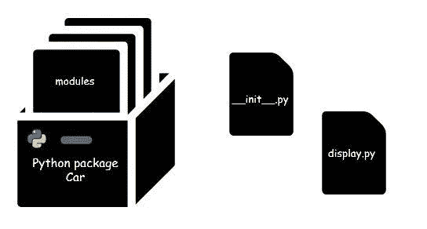
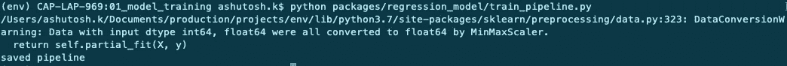
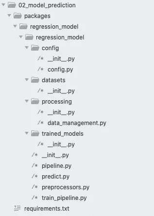
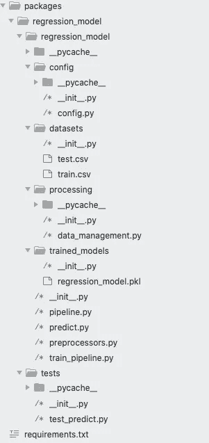
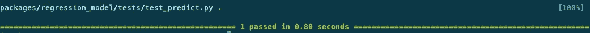
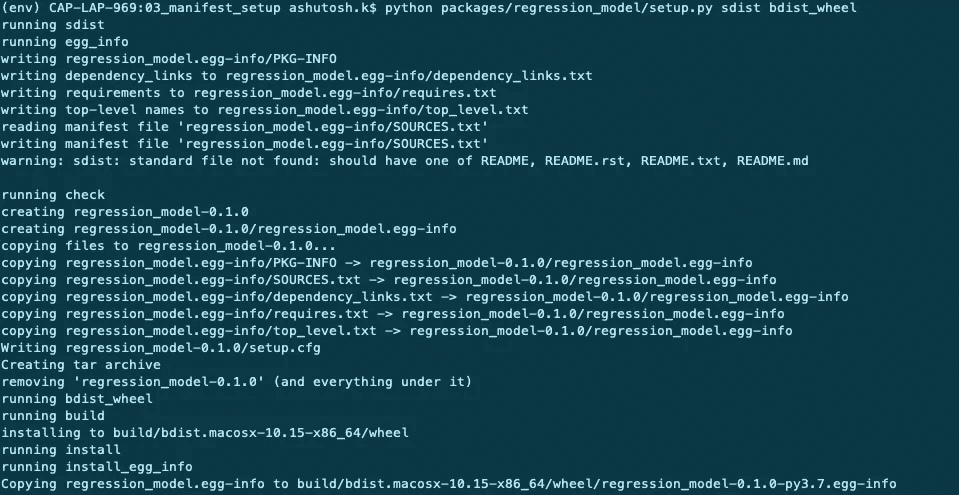
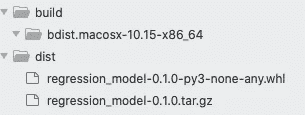
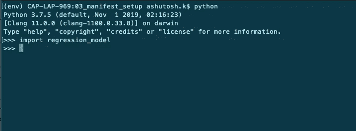

# 机器学习:从模型到生产

> 原文：<https://medium.com/analytics-vidhya/machine-learning-models-to-production-72280c3cb479?source=collection_archive---------2----------------------->

## 第 2 部分:从 ML 模型构建 Python 包

这是关于如何构建和部署机器学习模型的系列文章的第二部分— **在 python 中使用预测模型构建和安装 Python 包**

## 关于建造管道的第一部分可以在[这里阅读](/analytics-vidhya/machine-learning-models-to-production-part-1-build-your-own-sklearn-pipeline-e7aa7c06152a)



第一部分介绍了如何将模型代码重写为 sklearn 管道的形式，以便于理解、管理和编辑。可以在没有管道结构的情况下部署模型，但是最好的做法是制作管道并分离代码的不同部分(配置、预处理、特性工程、数据和测试)。

这篇文章建立在构建管道的早期代码的基础上。如果你在阅读前一篇文章时有困难，你可以在网上阅读如何构建 sklearn-pipelines，然后查看每个包构建阶段的 GitHub repos

# **第 1 部分:在管道中组织代码，训练模型**

目录的结构如下图所示


这只是使用三个主要文件的代码的一部分:pipeline.py、preprocessors.py 和 train_pipeline.py。除此之外，train.csv 和 test.csv 存储在文件夹/packages/regression _ model/datasets 中

每个文件夹都必须有一个 __init__。py 文件(它们不存在于 GitHub repo 中)

***GitHub repo for Part 1 是*** [***这里的***](https://github.com/ashukumar27/Python_ML_Package/tree/master/01_model_training)

目录的详细信息:

**包**:包含包的根文件夹
回归 _ 模型:包的名称

**数据集** : Test.csv 和 train.csv —从[https://www . ka ggle . com/c/house-prices-advanced-regression-techniques/data 下载的房价预测数据集](https://www.kaggle.com/c/house-prices-advanced-regression-techniques/data)

**Trained_model** :保存模型的地方。pkl 文件

**文件** :
Pipeline.py:构建一个包含所有操作
预处理程序的管道. py:管道中使用的所有拟合和转换函数
Train_pipeline.py:运行模型并保存模型
Requirements.txt:需要安装的所有必需的包及其版本

## **运行模型和训练前的先决条件**

**创建新环境**

出于各种原因，建议构建一个新环境。在这里阅读[这里](https://www.geeksforgeeks.org/python-virtual-environment/)

**将你的目录添加到 PYTHONPATH**

下面是如何在 mac 上实现的[谷歌在其他操作系统上，这很简单]

```
 1\. Open Terminal.app 
2\. Open the file ~/.bash_profile in your text editor — e.g. atom ~/.bash_profile 
3\. Add the following line to the end: export **PYTHONPATH**=”{{Full Path to packages\regression_model}}”
4\. Close terminal
5\. Open and test $ echo PYTHONPATH
```

**安装包:**需要使用 requirements.txt 文件的正确位置运行以下命令

```
$ pip install -r requirements.txt
```

**运行模型(训练):**

```
$ python packages/regression_model/train_pipeline.py
```



**输出**:在 packages/regression _ model/trained _ models 文件夹中生成一个新文件 regression_model.pkl

# **第 2 部分:重构项目，做出预测和编写测试**

该项目需要重新构建(将在构建包时解释)，以便我们有一个单独的包目录和它自己的 requirements.txt 文件，以及一个单独的测试模块，用于在部署之前测试模型

***GitHub repo for part 2 是*** [***这里的***](https://github.com/ashukumar27/Python_ML_Package/tree/master/02_make_predicitons)

**文件夹结构**



注意新的结构——在包内的 regression_model 中有一个 regression_model 文件夹

Github repo 不包括 __init__。py 文件，请在运行前添加它们(空白文件，无内容)

添加测试文件夹将会在这个程序块之后被覆盖，需要为此安装 PyTest

**主要变化**

包/回归模型/回归模型/配置/配置. py:

包含所有固定变量名称、特征、训练和测试数据名称、目标变量的配置文件。这样做是为了清理代码，使其更具可读性。此外，如果需要更改某些内容(比如文件名或删除某个特性)，可以只在一个地方完成，而不用遍历代码

使用配置文件:

```
from regression_model.config import config
```

packages/regression _ model/regression _ model/processing/data _ management . py
这包含加载数据集、保存管道和加载管道的函数。这将清除 train_pipeline.py 代码

使用 data_management.py

```
from regression_model.processing.data_management import ( load_dataset, save_pipeline)
```

**训练模型(确保如前所述将 PYTHONPATH 添加到环境变量中)**

```
$ python packages/regression_model/regression_model/train_pipeline.py
```

**做出预测**

```
$ python packages/regression_model/regression_model/predict.py
```

这不会打印任何东西。为了测试模块是否工作正常，必须添加测试模块

**测试**



测试包/回归模型/测试的新目录

test_predict.py 包含测试模型的代码

```
Requirements.txt: Add
# testing
pytest>=4.6.6,<5.0.0
```

编写测试是可选的，但总是推荐这样做。这将确保您的模型在您进行任何主要或次要的更改后都不会中断。

点击阅读更多关于测试[的信息](https://realpython.com/python-testing/)

test_predict.py 的内容:只需检查第一个预测是否正确

运行测试:

$ py test packages/regression _ model/tests-W ignore::deprecation warnings



# 第 3 部分:构建包

在这个阶段，您的代码已经完成，并且通过了所有的测试。下一步是构建一个包。

***GitHub repo for Part 3 是*** [***这里是***](https://github.com/ashukumar27/Python_ML_Package/tree/master/03_build_package)

这些东西需要添加到当前目录中:

**MANIFEST.in** :提供了在包中保存什么文件的细节

**Setup.py** :关于模型、元数据、需求、许可信息和其他细节的其他细节

packages/regression _ model/regression _ model/**requirements.txt**:这是包内的另一个 requirements . txt 文件。这是需要提供的。需要安装两个额外的包来打包，所以请确保运行

```
$pip install -r packages/regression_model/regression_model/requirements.txt
```

**运行**:建立源分配(sdist)和轮分配(bdist_wheel)命令

```
$ python packages/regression_model/setup.py sdist bdist_wheel
```



如果一切顺利，您的目录中将会有以下新文件



这将取决于您的操作系统。这是基于 MacOS 10.15 构建的

您的包现在可以安装和使用了——就像普通的 Python 包一样

**安装包**

```
$ pip install -e packages/regression_model/
```

使用包



下一篇文章将会介绍一些最佳实践(我知道有很多)——版本控制和日志记录，以及如何在任何人都可以安装的网站上托管这个包。未来的文章将涵盖作为 API 的部署—在 Heroku 和 AWS 上

在这些门户网站上阅读有关虚拟环境和测试的更多信息:

[](https://www.geeksforgeeks.org/python-virtual-environment/) [## Python 虚拟环境|简介- GeeksforGeeks

### 虚拟环境是一种工具，有助于保持不同项目所需的依赖性分开，通过创建…

www.geeksforgeeks.org](https://www.geeksforgeeks.org/python-virtual-environment/) [](https://realpython.com/python-testing/) [## Python 测试入门——真正的 Python

### 在这篇深入的教程中，您将看到如何创建 Python 单元测试，执行它们，并在您…

realpython.com](https://realpython.com/python-testing/)