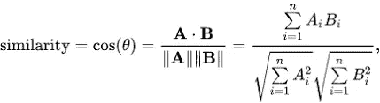
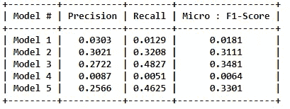

# 机器学习:多标签分类:MPST:带标签的电影情节概要:标签预测

> 原文：<https://medium.com/analytics-vidhya/machine-learning-multi-label-classification-mpst-movie-plot-synopses-with-tags-tags-8314e6841e17?source=collection_archive---------5----------------------->

—带有故事相关标签的电影情节概要数据集。


来源:谷歌

# 业务问题:

摘要电影的社会标签揭示了电影的各种各样的异质信息，如类型、情节结构、原声音乐、元数据、视觉和情感体验。这些信息对于构建自动系统来为电影创建标签是很有价值的。自动标记系统可以帮助推荐引擎改进相似电影的检索，以及帮助观众预先知道从电影中可以期待什么。在本文中，我们着手收集电影情节概要和标签的语料库。我们描述了一种方法，该方法使我们能够建立一个大约 70 个标签的细粒度集合，暴露电影情节的异构特征以及这些标签与一些 14K 电影情节概要的多标签关联。我们研究了这些标签如何与电影以及不同类型电影中的情感流动相关联。最后，我们使用这个语料库来探索从情节概要中推断标签的可行性。我们希望该语料库在其他与叙事分析相关的任务中有用。

# 问题陈述:

根据电影标题和简介中的内容建议标签。

# 有用的链接:

*来源:*[*https://www . ka ggle . com/cryptexcode/mpst-movie-plot-synopses-with-tags*](https://www.kaggle.com/cryptexcode/mpst-movie-plot-synopses-with-tags)

*研究论文:*[*https://www.aclweb.org/anthology/L18-1274/*](https://www.aclweb.org/anthology/L18-1274/)

*附加信息:*[*http://ritual.uh.edu/mpst-2018/*](http://ritual.uh.edu/mpst-2018/)

# 现实世界/业务目标和约束:

1.  以高精度和召回率预测尽可能多的标签。
2.  不正确的标签可能会影响客户体验。
3.  没有严格的延迟限制。

# 机器学习问题:

## 数据概述:

所有数据都在一个文件中:mpst_full_data.csv

数据分为 3 个部分，文件
中的 Train、Test 和 Val 数据占数据的 64%。
测试由 20%的数据组成。Val 由 16%的数据组成。
mpst _ full _ data . CSV 中的行数= 14828

**数据字段说明:**

数据集包含 14，828 行。表中的列是:

**imdb_id** —电影的 IMDB id

**片名** —电影名称

**剧情 _ 梗概** —电影剧情梗概

**标签** —分配给电影的标签，由“，”分隔

**split** —电影在标准数据分割中的位置，如 Train、Test 或 Val

**剧情简介 _ 来源** —从哪里收集的剧情简介

## 数据点示例:

**IMDB _ id**:TT 0113862
**标题**:荷兰先生的作品

> 1964 年 9 月一个明媚的早晨，格伦·霍兰德(Glenn Holland)被他的妻子艾瑞斯(Iris)叫醒。格伦在新更名的约翰·肯尼迪高中找到了一份音乐教师的工作。….
> 
> **标签**:励志、浪漫、愚蠢、感觉良好
> **分裂**:火车
> **剧情简介 _ 来源** : imdb

# 将现实世界的问题映射到机器学习问题:

## 机器学习问题的类型:

这是一个多标签分类问题
**多标签分类**:多标签分类给每个样本分配一组目标标签。这可以被认为是预测一个数据点的不相互排斥的属性，例如与一个文档相关的主题。一部电影可以是任何类型的，比如爱情片、动作片、惊悚片、恐怖片，或者都不是。
_ _ 信贷 _ _:[http://scikit-learn.org/stable/modules/multiclass.html](http://scikit-learn.org/stable/modules/multiclass.html)

## 绩效指标:

**微平均 F1 分数(平均 F 分数)**:F1 分数可以解释为精确度和召回率的加权平均值，其中 F1 分数在 1 时达到其最佳值，在 0 时达到其最差分数。精确度和召回率对 F1 分数的相对贡献是相等的。F1 分数的公式为:

*F1 = 2 *(精度*召回)/(精度+召回)*

在多类别和多标签的情况下，这是每个类别的 F1 分数的加权平均值。

**“微 f1 分数”:**
通过计算总的真阳性、假阴性和假阳性来计算全局指标。当我们有阶级不平衡时，这是一个更好的衡量标准。

**‘宏观 f1 得分’:**
计算每个标签的指标，并找出它们的未加权平均值。这没有考虑标签不平衡。

[https://www.kaggle.com/wiki/MeanFScore](https://www.kaggle.com/wiki/MeanFScore)T38[http://sci kit-learn . org/stable/modules/generated/sk learn . metrics . f1 _ score . html](http://scikit-learn.org/stable/modules/generated/sklearn.metrics.f1_score.html)

**汉明损失**:汉明损失是被错误预测的标签的分数。https://www.kaggle.com/wiki/HammingLoss
T3

# 数据分析:

让我们看看一些元数据，即关于数据集的数据。

总行数:14828

总列数:6

列: **imdb_id，** **标题，情节 _ 提要，标签，分割，提要 _ 源，标签 _ 计数**

tag_count 是一个新添加的列，指定我们的电影包含多少个标签。


原始数据的快照

重复的电影:^ 0

带有 0 个标签的电影:0

# 标签分析:


标签计数

我们可以看到，有 5516 部电影带有 1 个标签，同样有 2 部电影带有 3124 个标签，一直到我们有 1 部电影带有 25 个标签。这给出了电影中标签分布的大量信息。


我们的数据集中有 71 个独特的标签

正如我们可以看到的，在我们的数据集中有 71 个独特的标签，我们将使用这些标签来预测测试数据。


一些流行的标签


标签的单词云

我们可以看到“谋杀”、“暴力”、“浪漫”、“闪回”和“邪教”是数据集中的一些流行标签。

平均值。每部电影的标签数量:2.794578 ~ 3 个


前 10 个标签频率


关于标签分布的统计


标签的分位数分布

## 让我们通过分析得出我们的观察结果:

1.  总共有 20 个标签被使用超过 500 次。
2.  9 标签使用超过 1000 次。
3.  最频繁的标签(即谋杀)被使用了 5782 次。
4.  由于一些标签比其他标签出现得更频繁，因此微平均 F1 分数是解决此问题的合适指标。

# 数据预处理:

## 数据清理:

我们清理数据，因为我们有原始形式的文本数据，我们删除以下内容:

1.  标点
2.  额外空格
3.  停止言语
4.  我们把像“不会”这样的词改成“不会”，“不能”改成“不能”等等。
5.  我们把像“我有”这样的词改成“我有”，“我会”改成“我会”

清理数据后，它看起来像:


预处理后的数据。

# 机器学习模型:

## 为多标签问题转换标签:


我们将所有的 71 个标签转换成一个二进制的 bow，其中对于每部电影，我们将针对该电影中出现的那些标签放置 1。

在将所有标签转换成弓形特征之后，我们得到了(14828，71)数据集形式的标签。

## 将数据分为测试和训练:

我们以(80:20)分割的方式分割数据。分割后，我们有如下数据点:

训练数据中的数据点数 X : (11862，1)
训练数据中的数据点数 Y : (11862，71)
测试数据中的数据点数 X : (2966，1)
测试数据中的数据点数 Y : (2966，71)

# 特征化数据:任何模型中最重要的部分

让我们来谈谈任何机器学习模型中最具创造性和最困难的部分，即从原始数据中创建特征..

让我们来看看我在解决问题时想到的功能。

## 词汇特征:

1.  n 元语法:1，2，3
2.  字符 n 元语法:2，3
3.  k 跳 n 元语法

将逐一探究词汇特征:

**1。n-Gram : 1，2，3**

我们将通过一个例子来理解这一点:让我们考虑一下这句话“**敏捷的棕色狐狸跳过懒惰的狗**

现在，对于 1-gram 的特征，它将每个单词视为一个向量:

*那只，快，棕色，狐狸，跳跃，越过，那只，懒惰，狗*

现在，对于 2-gram 的特征，它将把 2 个单词的组合视为向量:

快速，快速的棕色，棕色狐狸…诸如此类。

类似地，对于 3 克，需要:

*敏捷的棕色，敏捷的棕色狐狸，…等等。*

它们基本上是给定窗口内的一组共现词。

**2。字符 n 元语法:2，3**

字符 n-gram 意味着与 n-Gram 相同的概念，唯一的区别是，它在字符级别上工作。

例如:

考虑“机器学习”这个词

char-2-Gram:“ma”、“ac”、“ch”、“hi”…等等

char-3-Gram:“MAC”、“ach”、“chi”…等等

**3。k-Skip-n-Gram :**

在 word2vec 的 [**skip gram**](https://www.geeksforgeeks.org/implement-your-own-word2vecskip-gram-model-in-python/) 架构中，输入是**中心词**，预测是上下文词。考虑单词 W 的数组，如果 W(i)是输入(中心单词)，那么 W(i-2)、W(i-1)、W(i+1)和 W(i+2)是上下文单词，如果*滑动窗口大小*是 2。


来源谷歌。

正如我们所说，图片比文字更能说明问题，这是绝对正确的。上面的图片让我免于许多解释。k-Skip-n-Gram 的工作原理很清楚。

## 概念包:词性标注

这是一个将句子转换成形式的过程——单词列表、元组列表(其中每个元组都有一个形式*(单词，标签)*)。的标记是词性标记，表示这个词是名词、形容词还是动词等等。


词类标注

基本上，词性标注是单词智能的，所以我们在使用它们之前必须非常小心，我们应该如何在我们的机器上使用它们，在我的例子中，我计算了我的句子中的词性的数量，并制作了一个弓形模型，更新了计数，这样我们的数据中就不会有维度不匹配。

## 情绪和情感:

我使用“SentimentIntensityAnalyzer”来找出特定句子的情感值，该函数返回给我们 4 个维度特征以及它们对于特定句子的值，这些值基本上是:

**neg，neu，pos，compound :** 这些是基于给定文本分析的得分。

## 单词嵌入:

我用了 4 个词嵌入，即:

1.  弓
2.  TF-IDF
3.  平均 W2V
4.  TFIDF 加权 AvgW2V

让我们逐一了解它们，并理解它们的意义:

## 鞠躬:

词袋模型是在用机器学习算法对文本建模时表示文本数据的一种方式。

机器学习算法不能直接处理原始文本；文本必须转换成数字。具体来说，数字的向量。

单词袋模型，简称 BoW，是一种从文本中提取特征用于建模的方法。

单词包是描述单词在文档中出现的文本表示。

例如:让我们考虑 2 个句子:

1.  “这是一个停留的好地方”
2.  “这是一个吃喝的好地方”

现在，我们需要两件东西来组成我们的弓模型，

已知单词的词汇。

二。已知单词存在的一种度量。

所以，让我们考虑一个叫做二进制 BoW 的东西，它指定了这个句子是否包含这个单词。

这里我们的弓矢会像[这，是，一，好，地方，到，停留，吃，喝]。因此，第一句和第二句的二进制弓形分别为:[1，1，1，1，1，1，0，0]和[1，1，1，1，1，1，1，1，0，1]。

## TF-IDF:

Tf-idf 代表*词频-逆文档频率*，tf-idf 权重是信息检索和文本挖掘中经常使用的一种权重。该权重是一种统计度量，用于评估一个单词对集合或语料库中的文档有多重要。重要性与单词在文档中出现的次数成比例增加，但是被单词在语料库中的频率抵消。

**TF** :词频，衡量一个词在文档中出现的频率。因为每个文档的长度不同，所以一个术语在长文档中出现的次数可能比短文档多得多。因此，术语频率通常除以文档长度(又名。文档中的术语总数)作为标准化的一种方式:

TF(t) =(术语 t 在文档中出现的次数)/(文档中的总术语数)。

**IDF** :逆文档频率，衡量一个术语的重要程度。在计算 TF 时，所有项都被认为是同等重要的。然而，众所周知，某些术语，如“是”、“的”和“那个”，可能会出现很多次，但并不重要。因此，我们需要通过计算以下各项来降低常用术语的权重，同时提高罕见术语的权重:

IDF(t) = log_e(文档总数/包含术语 t 的文档数)。

## 平均 W2V:

Word2vec 基本上以这样的方式将单词放置在特征空间中，即它们的位置由其含义决定，即具有相似含义的单词被聚集在一起，并且两个单词之间的距离也具有相同的含义。


让我们首先了解什么是余弦相似度，因为 word2vec 使用余弦相似度来找出最相似的单词。余弦相似性不仅可以判断两个向量之间的相似性，还可以检验向量的正交性。余弦相似度由公式表示:



如果角度接近于零，那么我们可以说向量彼此非常相似，如果θ为 90 度，那么我们可以说向量彼此正交(正交向量彼此不相关)，如果θ为 180 度，那么我们可以说两个向量彼此相反。

我们需要给出大型文本语料库，其中每个单词都有一个向量。它试图从原始文本中自动学习向量之间的关系。向量的维数越大，它的信息量就越大。

属性:

1.  如果字 w1 和 w2 相似，则向量 v1 和 v2 会更接近。
2.  自动学习单词/矢量之间的关系。


我们正在观察男女关系图，我们观察到男人和女人之间的距离与国王(男人)和王后(女人)之间的距离相同，不仅性别不同，而且如果我们观察同性，我们观察到王后和女人之间的距离与国王和男人之间的距离相同(国王和男人，王后和女人代表同性比较，因此它们必须是相等的距离)

如何把每个文档转换成矢量？

假设在一个文档(行)中有 w1，w2，…wn 单词。以便转换成矢量。


每个单词都有一个向量，我们将平均 word2vec 转换为除以文档中的单词数。

## TFIDF 加权 Word2Vec:

在这个方法中，我们首先计算每个单词的 tfidf 值。然后按照与上一节相同的方法，将 tfidf 值乘以相应的字，然后将总和除以 tfidf 值总和。

因此，这 4 种技术被用来作为我的模型训练的一个特征。

## 文本的数字特征:

1.  每个剧情梗概的长度:基本上，我把每个剧情梗概的长度作为一个附加特征。
2.  **剧情梗概中独一无二单词的镜头:**统计每一个剧情梗概中的每一个独一无二的单词，并将其作为一个特征。

## **结合所有手工制作特色:**

最后，在组合所有特征之后，我们总共有 12 个特征用于训练我的模型。

# 型号:

## 1.多标签分类:机器学习

## 1.1:1 对其余:逻辑回归:

**一对多** (OvR)多类/多标签策略。也称为一对一，这种策略包括为每个类安装一个分类器。对于每个分类器，该类与所有其他类相匹配。除了它的计算效率(只需要 n 类分类器)，这种方法的一个优点是它的可解释性。因为每个类仅由一个分类器表示，所以可以通过检查相应的分类器来获得关于该类的知识。这是多类分类最常用的策略，也是一个公平的默认选择。

该策略也可以用于多标签学习，其中分类器用于预测多个标签，例如，通过拟合 2-d 矩阵，其中如果样本 I 具有标签 j，则单元[i，j]为 1，否则为 0。

在多标签学习文献中，OvR 也被称为二进制相关方法。

要了解逻辑回归，请参考 [**这一部分...**](https://www.geeksforgeeks.org/understanding-logistic-regression/)

在使用 OVR : LR 和超调后，我们得到了以下结果:


```
**Test F1 Score with prob > 0.25 for each tags :  0.6533833574983932**
```

这里，所有的标签都给出了出现在剧情梗概中的概率，因此我只考虑了那些概率超过 0.25 的标签

## 1.2:一对其余:多项式 b

关于多项式的知识请参考 [**这…**](/syncedreview/applying-multinomial-naive-bayes-to-nlp-problems-a-practical-explanation-4f5271768ebf)

我用多项式朴素贝叶斯和 OVR 一起作为分类器，让我们把结果可视化:


超参数调谐。


```
**Test F1 Score with prob > 0.495000 for each tags : 0.076542**
```

非常少，不能考虑。

**让我们尝试一些不同于机器学习的东西，让我们尝试深度学习模型。**

## 2.多标签分类:深度学习

对于深度学习，我们需要考虑自定义指标和自定义单词嵌入。


自定义指标。

## 特色化:

我获取了全部原始文本数据，并对其进行了单词嵌入。

我们可以用 Tokenizer 和 with Max_No_Words，Max_Seq_Length 和 Embedding_Dim。

在单词嵌入中，每个单词都被表示为一个 n 维密集向量。相似的单词将具有相似的向量。诸如 GloVe 和 Word2Vec 之类的单词嵌入技术已经被证明对于将单词转换成相应的密集向量非常有效。向量很小，并且向量中的索引实际上都不是空的。

为了实现单词嵌入，Keras 库包含一个名为 Embedding()的层。嵌入层在 Keras 中以类的形式实现，通常用作 NLP 任务顺序模型中的第一层。

关于嵌入的细节可以在这里找到[。](https://stackabuse.com/python-for-nlp-word-embeddings-for-deep-learning-in-keras/)

## 分割训练和测试数据(80:20):

我将数据分成 DL 模型的训练和测试。

## 2.1:模型 1:嵌入+ Conv1D + Conv1D + LSTM

模型包括:[嵌入](https://stackabuse.com/python-for-nlp-word-embeddings-for-deep-learning-in-keras/)层、[脱落](https://machinelearningmastery.com/dropout-for-regularizing-deep-neural-networks/)、[凸起](http://cs231n.github.io/convolutional-networks/)、[脱落](https://machinelearningmastery.com/dropout-for-regularizing-deep-neural-networks/)、[凸起](http://cs231n.github.io/convolutional-networks/)、 [LSTM](https://colah.github.io/posts/2015-08-Understanding-LSTMs/) 、[乙状结肠](https://towardsdatascience.com/multi-layer-neural-networks-with-sigmoid-function-deep-learning-for-rookies-2-bf464f09eb7f)层..


```
**Test F1 Score with prob > 0.500000 for each tags : 0.018086**
```

分数实在不行，就只好试试别的了。

## 2.2:模型二:嵌入+ Conv1D + Conv1D + LSTM + LSTM

该模型由以下序列组成:

嵌入> Conv1D >退出> Conv1D > LSTM > [批次形状](https://towardsdatascience.com/batch-normalization-in-neural-networks-1ac91516821c) > LSTM >乙状结肠

模型 1 中已经提供了解释的参考链接，我在序列中提到了 BatchNorm 解释链接。


```
**Test F1 Score with prob > 0.250000 for each tags : 0.296534**
```

F1 的分数仍然不能被认为是好的..我们继续吧。

## 2.3:模型 3:嵌入+ Conv1D + BN + LSTM

在这里，嵌入意味着，我使用手套向量进行了自定义嵌入，并使用那些嵌入来训练和预测测试数据。

根据上面的解释，我们都知道模型的元素，让我们深入研究结果


所以 F1 的分数是 0.34，比上面的好，可以考虑，但是让我们看看我们能不能得到更多..

## 2.4:模型 4:嵌入+ Conv1D + Conv1D + LSTM


有史以来最差的模型，让我们再试试一个模型。

## 2.5:模型 5:嵌入+ Conv1D + BN + Conv1D + BN + LSTM


```
**Test F1 Score with prob > 0.150000 for each tags : 0.330111**
```

经过尝试，这么多的模型，似乎我们需要更多的微调模型，并拿出更多的功能。

让我们总结一下结果，给这个问题一个结论。

# 模型摘要:

## 机器学习:


## 深度学习:



# 结论:

1.  最大微观平均 F1 分数是 0.4015，最大召回值是 0.4827。

2.事实证明，字符 N 元语法特征比单词 N 元语法特征强大得多。跳过克也是有用的。

3.通过使用 bow、avg word2vec、tfidf word2vec 以及 TF-IDF 和 word2vec 特性的组合，我们的模型表现得比以前的实现好得多。

4.当今时代，我们更习惯看到 90%以上的分数。但是给定一个 14K 数据点的非常有限的数据大小样本，我们实际上已经设法得到一个体面的微观平均 f 1 分数。

# 进一步改进:

我们可以在深度学习模型中使用更多功能，一些更精细的架构，可以进行更多的超调。

当我们添加更多功能，并考虑更深层次的网络时，我们可以获得良好的 f1 分数..

# 参考资料:

> **研究论文:**【https://www.aclweb.org/anthology/L18-1274】T2
> 
> 【https://www.appliedaicourse.com/】代号参考: [代号](https://www.appliedaicourse.com/)
> 
> **思路:**https://en.wikipedia.org/wiki/Multi-label_classification
> 
> **二元关联:**[http://scikit.ml/api/skmultilearn.problem_transform.br.html](http://scikit.ml/api/skmultilearn.problem_transform.br.html)
> 
> **量词:**[https://scikit-learn.org/stable/](https://scikit-learn.org/stable/)
> 
> **攻略:**[https://www . analyticsvidhya . com/blog/2017/08/introduction-to-multi-label-class ification/](https://www.analyticsvidhya.com/blog/2017/08/introduction-to-multi-label-classification/)
> 
> **其他:**
> 
> [https://towardsdatascience.com](https://towardsdatascience.com)
> [https://www.analyticsvidhya.com](https://www.analyticsvidhya.com)
> [https://www.quora.com](https://www.quora.com)
> https://deep sense . ai
> [https://datascience.stackexchange.com/](https://datascience.stackexchange.com/)
> 
> **感谢阅读！**
> 
> 如果你想了解更多类似的话题或者看看我还能提供什么，一定要访问我的网站:[所有关于东西](https://digital.allaboutstuffs.com/)
> 
> 准备好让你的学习更上一层楼了吗？查看我提供的课程:[课程](https://digital.allaboutstuffs.com/courses/)
> 
> 生活工作压力大？花一点时间来放松和放松我的舒缓和放松的视频！现在就去我的频道，用"[灵魂镇定剂](https://www.youtube.com/c/TheSoulTranquilizer)"开始你的内心平和与宁静之旅