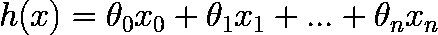

# 机器学习—多元线性回归

> 原文：<https://medium.com/analytics-vidhya/machine-learning-multivariate-linear-regression-8f9878c0f56f?source=collection_archive---------8----------------------->

线性回归是最常用的机器学习算法之一。一元线性回归是更简单的形式，而多元线性回归则适用于更复杂的问题。

> 这是我关于线性回归的第二篇论文，第一篇是关于[一元线性回归](/@aabiyev01/machine-learning-univariate-linear-regression-1acddb85aa0b)。您可以通过它来获得线性回归的背景知识、机器学习算法的基础知识以及对本文的更好理解。

## **本文包含以下主题:**

*   多元线性回归导论；
*   算法的假设；
*   数据集的操作和矩阵乘法；
*   成本函数；
*   梯度下降。

# 多元线性回归导论

在 ML 问题中，有各种各样的数据集，它们在维度(行数和列数)上互不相同。众所周知，列表示特征，行表示样本，更多的特征意味着更复杂的模型。在线性回归中，如果列数为 1，则称为一元线性回归，如果列数超过 1，则称为多元线性回归(MLR)。单变量和多变量 LR 算法的关键概念是相似的，但在方程中存在一些差异，这是由数据集的不同维度造成的。

# 算法的假设

在单变量 LR 中，直线的方程用于证明假设，多变量 LR 的假设与此类似，但它因参数的数量而不同。为了简单和更好的理解，让我们从数据集的例子开始，其中有三个特征(x₁，x₂，x₃).在这种情况下，假设如下:

对于每个单一特征(x)，都有一个 *θ* 值和额外的 *θ₀* 。方程的一般形式:

这里，

*   n —特征的数量。

每个 ML 算法的目标都是找到最合适的假设。在 MLR 假设中包含 *x-s* 和 *θ-s* 。 *x-s* 在数据集中给定，因此假设与它们的 *θ-s* 互不相同。 ***θ-s* 以随机值初始化，然后算法开始优化它们的值。**我们的目标是为给定的数据集计算最合适的 *θ-s* 。成本函数和梯度下降是这种方式的工具，这将在下一节中讨论。

# 矩阵乘法和数据集操作

如果特征的数量是一个很大的数字，如数百或数千，上面的等式将不适合使用，因为我们必须写出每个参数。这就是为什么，一个更合适的方法——矩阵乘法被应用。这听起来可能很复杂，但我们会一步一步地继续，你会发现这实际上比方程本身更简单。

1.  让我们复习一下矩阵乘法:

这是矩阵乘法的一个例子。关键是左矩阵的列数必须等于右矩阵的行数。

关于矩阵乘法的进一步阅读。

2.现在我们将用这些矩阵来表示 *x-s* 和 *θ-s* 。让我们看看下面的数据集和 theta:

*θ-s* 成为矢量(一列矩阵):

3.第三步是这些矩阵的乘法运算:

回头看矩阵，X 矩阵的列是 3，但是 *θ* 矩阵的行是 4。然而我们不能将这些矩阵相乘为 3 ≠ 4。这是因为假设等式中的额外参数——θ₀。为了能够使用矩阵乘法，一个额外的列 ***个*** 被添加到 x 矩阵。将一列相加后，x 的列数和 *θ* 的行数相等，我们可以做矩阵乘法:

由于 x 矩阵的变化，我们改写假设如下:

假设。

总而言之，我们对假设做了很小的改动——增加了 x *₀* 等于 1，并乘以 *θ₀* 。当 *θ₀* 乘以 **1** 时，等式**的结果不会改变**。如上所述，添加它是为了使θ和 x-s 的数量相等，以便能够进行**矩阵乘法**。

# 价值函数

在完成假设和数据集之后，我们可以开始算法的实现。成本函数用于确定假设与数据集的拟合程度。例如，我们有一对 x 矩阵和 y 值。x 和 y 在训练集中给定。我们先用 x 矩阵和 *θ* 矩阵计算 h(x)，然后比较 h(x)和 y，在理想情况下，h(x)等于 y，但大多数情况下不可能对数据集(x 矩阵)的每个样本都使 h(x)等于 y。这就是为什么我们需要为整个数据集选择最优的解决方案。

假设的适合度通过成本函数计算，其值越小，假设越好。

成本函数。

如前所述，成本函数的值应该是最小的，因此从这一点来看，我们的目的是通过优化 *θ-s* 来最小化其值。

# 梯度下降

梯度下降算法的目的是优化 *θ-s* ，使得代价函数值最小。正如微积分所知，函数的导数是它随时间的变化率。所以在梯度下降中，我们取成本函数对相关θ的导数，然后乘以α。获取的值由先前的 *θ* 值替代:

梯度下降。

这里，

*   α——学习率；
*   m——样本数量。

应用梯度下降，直到成本函数值非常小。

下一节将讨论线性回归在 ML 问题上的实现。

# 谢谢你。