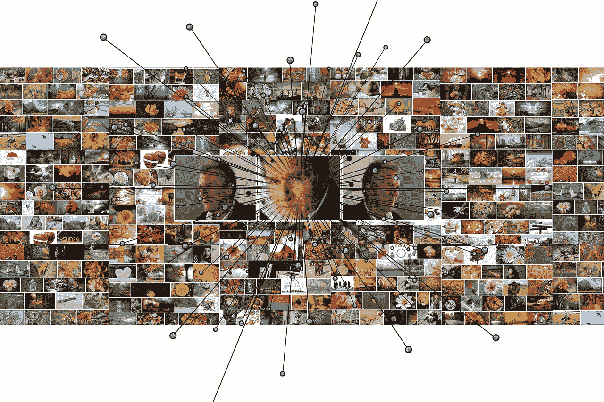

# 机器学习必备知识

> 原文：<https://medium.com/analytics-vidhya/machine-learning-must-know-c47c507e364c?source=collection_archive---------28----------------------->

机器学习是计算机在没有明确编程的情况下学习执行人类级别任务的能力。阿瑟·塞缪尔(1959)

**数据挖掘**是挖掘大型数据集以发现内在模式的行为。

# ML 很好的解决了以下问题；

1.  需要长规则(if-else 语句)来解决的问题。
2.  没有传统解决方案的复杂问题。
3.  需要快速和持续适应的问题。
4.  需要从大型数据集获得洞察力的问题。

# ML 系统的类型

机器学习系统按照以下标准进行分组:

1.  监管与否

*   监督
*   无人监督的
*   强化学习

1.  增量或动态

*   在线的
*   批量学习

1.  通过构建模型来比较新数据集或检测模式

*   基于实例的
*   基于模型的学习

# 监督学习

**监督学习**包括向算法提供数据和期望的结果(标签)。

# 监督学习算法的类型

## 分类

**分类**产生一个结果，该结果代表该值属于给定类别的概率(例如，一张图片 80%的概率是一只猫或一只狗)。

## 分类算法

1.  k-最近邻分类
2.  逻辑回归
3.  支持向量机
4.  朴素贝叶斯分类
5.  决策树分类
6.  随机森林分类(集合方法)

## 回归

**基于回归的**模型根据返回连续数值结果的数据输入进行训练。例子包括房屋和股票价格的预测。

## 回归算法

1.  k 近邻回归
2.  线性回归(简单和多元线性回归)
3.  多项式回归
4.  支持向量回归
5.  朴素贝叶斯回归
6.  决策树回归
7.  随机森林回归(集合方法)

# 无监督学习

**无监督学习**涉及在没有标签的数据中寻找内在洞察力，而不是从已知结果中预测值。简而言之，无监督学习不涉及标签。

# 无监督学习算法

1.  使聚集

*   k 均值
*   层次聚类分析
*   期望最大化

2.降维

*   主成分分析
*   核主成分分析
*   局部线性嵌入(LLE)
*   t 分布随机邻居嵌入(t-SNE)

3.异常检测

*   关联规则挖掘
*   推测的
*   喝彩

# ML 的挑战

1.  训练数据数量不足
2.  非代表性训练数据
3.  样本噪声(如果样本太小)和样本偏差(如果样本太大)
4.  过度拟合(模型在训练数据上概括得很好，但在看不见的数据上表现很差)
5.  无关的特征
6.  质量差的数据
7.  特征工程(特征工程中的难点)

## 参考

[https://www . Amazon . com/Practical-Machine-Learning-Python-Problem-solvents/DP/1484232062](https://www.amazon.com/Practical-Machine-Learning-Python-Problem-Solvers/dp/1484232062)

[https://machine learning mastery . com/introduction-to-tensors for-machine-learning](https://machinelearningmastery.com/introduction-to-tensors-for-machine-learning/)/

【https://en.wikipedia.org/wiki/Marginal_distribution 

[https://www . Amazon . com/Hands-Machine-Learning-Scikit-Learn-tensor flow-ebook/DP/b 06 xnk V5 ts](https://www.amazon.com/Hands-Machine-Learning-Scikit-Learn-TensorFlow-ebook/dp/B06XNKV5TS)