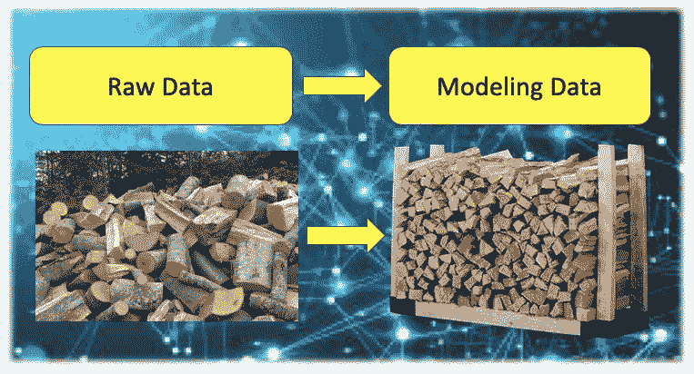

# 机器学习必须知道——从原始数据到训练数据

> 原文：<https://medium.com/analytics-vidhya/machine-learning-must-know-from-raw-to-training-data-8016cb647e0e?source=collection_archive---------6----------------------->

这个话题似乎太初级了，但是我发现大多数机器学习书籍都没有涉及到。大多数机器学习书籍涵盖了将建模数据随机分成训练、测试和验证数据集的技术，然后这些主题很快变成了 k-fold 交叉验证。但是等等，我们如何准备建模数据呢？一个信用卡公司的交易量可以是几十亿，但是…