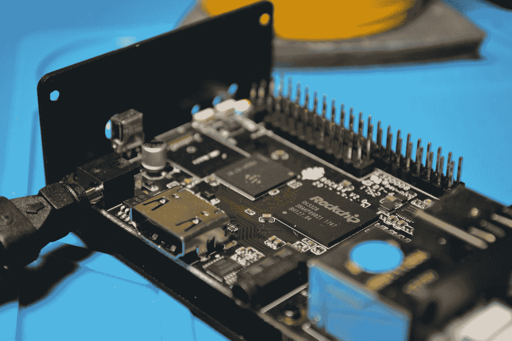

# 微控制器上的机器学习

> 原文：<https://medium.com/analytics-vidhya/machine-learning-on-micro-controllers-72f288c06355?source=collection_archive---------21----------------------->

托马斯·詹森在 [Unsplash](https://unsplash.com?utm_source=medium&utm_medium=referral) 上的照片

有很多 ML 从业者没有任何嵌入式平台的背景。另一方面，嵌入式开发人员也可能不熟悉 ML 算法。但是为什么你需要把 ML 带到像 Arduino Nano 时钟 64 MHz，Flash 1 MB，RAM 256 KB 这样的微控制器上。

# 为什么我们要在微控制器上运行 ML？？

通过在微控制器上运行机器学习推理，开发人员可以在不依赖网络连接的情况下将人工智能添加到大量硬件设备中，网络连接通常会受到带宽和功率的限制，并导致高延迟。在设备上运行推理还有助于保护隐私，因为没有数据必须离开设备。

这些是一些实际的原因:

*   **可访问性** —用户希望智能设备能够快速响应本地环境。此外，它还应该考虑所有的市场情况，如规模、互联网连接的可用性等等。
*   **成本** —设备应在满足所有要求的最低预算硬件范围内。
*   **效率** —电池寿命、功能、范围、耐用性以及最重要的设备尺寸。如果你跑在这个后面，Arduino Nano 会为你做好准备。
*   **隐私** — Arduino 关心您的数据，并采取预防措施确保您的数据在安全的人手中。

> *TensorFlow Lite Micro 现在可以与*[*Arduino Nano 33 BLE Sense*](https://store.arduino.cc/nano-33-ble-sense)*配合使用。这是所有微控制器爱好者期待已久的公告。*

它不需要操作系统支持，不需要任何标准的 C 或 C++库，也不需要动态内存分配。在 Arm Cortex M3 上，核心运行时适合 16 KB，并且有足够的操作符来运行语音关键词检测模型，总共占用 22 KB。

面向微控制器的 TensorFlow Lite 推理示例现已打包，可通过 Arduino 库管理器获得。我们现在可以轻松地在 Arduino 上运行它们，只需点击几下鼠标。在本节中，我们将向您展示如何运行它们。这些例子是:

*   micro_speech —使用板载麦克风进行语音识别
*   magic_wand —使用板载 IMU 进行手势识别
*   person_detection —使用外部 ArduCam 摄像机进行人员检测

有关示例的更多背景信息，您可以查看一下 [TensorFlow 存储库](https://github.com/tensorflow/tensorflow/tree/master/tensorflow/lite/experimental/micro)中的源代码。

用于微控制器的 TensorFlow Lite 针对微控制器开发的特定限制而设计。如果您在更强大的设备上工作(例如，像 Raspberry Pi 这样的嵌入式 Linux 设备)，标准 TensorFlow Lite 框架可能更容易集成，也更有用。

用于微控制器的 TensorFlow Lite 是 TensorFlow Lite 的一个实验端口，旨在微控制器和其他只有千字节内存的设备上运行机器学习模型。所以，

> *应考虑以下限制:*

*   支持张量流运算的[有限子集](https://www.tensorflow.org/lite/microcontrollers/build_convert#operation_support)(与标准框架相比)
*   支持一组有限的设备(在此之前，所有 Arduino 板都不被支持)
*   需要手动内存管理的低级 C++ API(如果您是 python 开发人员，那么这可能是最困难的任务)

在 Arduino 环境中使用用于微控制器的 TensorFlow Lite 是一件大事，随着更多预训练模型的出现，机器学习在新兴边缘计算市场的可访问性将发生巨大变化。我将尝试在 Arduino 上运行一些模型，并分享经验。

让我知道你的经验，如果你已经用这些工具工作。！