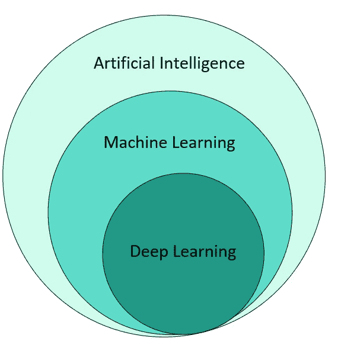
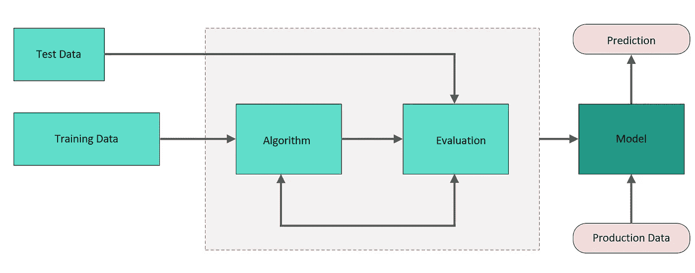
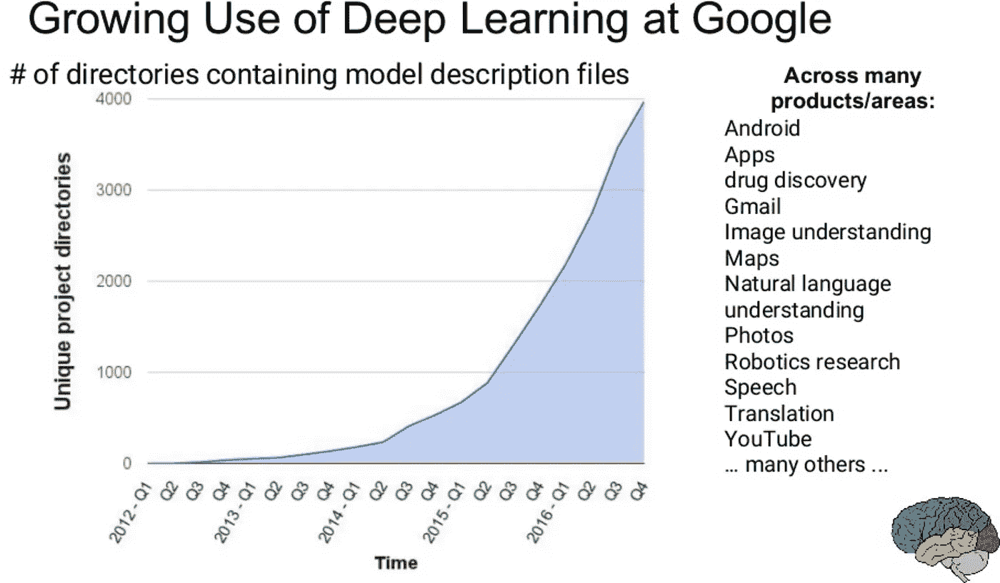
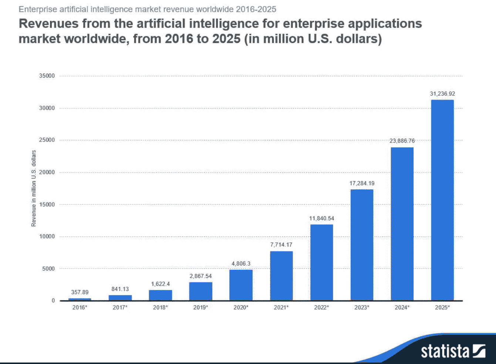

# 机器学习操作

> 原文：<https://medium.com/analytics-vidhya/machine-learning-operations-6d7c0dcc684c?source=collection_archive---------29----------------------->

[www.pexels.com](http://www.pexels.com)

所有行业(包括私营和公共行业)对人工智能的采用都在快速增长，MLOps 或机器学习操作是 2020 年的热门话题之一。

那么 MLOps 到底是什么，它将如何满足日益增长的人工智能采用需求？为了理解这一点，我们需要回顾一下什么是机器学习，什么是 IT 运营。

# **机器学习**

ML 没有单一的定义。我遇到过很多。只需要注意其中的几个:

“将信息转化为知识的工具”，

“使计算机能够处理迄今为止只能由人来完成的任务”，

“在数据中查找和应用模式的算法”

另一个定义，一张千言万语的图片来展示 ML 如何适合人工智能和深度学习。

人工智能、机器学习和深度学习的关系

我真的很喜欢这张照片，因为它显示了 ML 如何融入人工智能领域，以及它如何与 DL 相关联。从上面得出的正确结论是，ML 只是人工智能的一部分，你不能错过的真正重要的一点是，这两者之间没有等号。总的来说，人工智能可以分为两类:“强人工智能”和“弱人工智能”。强人工智能是指人类水平的智能，而弱人工智能是指为解决一个特定任务而设计的一切，如人脸识别、房价、文件翻译等。正如你可能认为的那样，在标有“弱人工智能”的桶中有大量的算法和方法，而标有“强人工智能”的桶仍然是空的。我不得不在这里对“弱人工智能”标签做一个评论，这个术语是很久以前创造的，如果你在阅读“弱”来指 ML 给现代世界带来的所有伟大成就时微笑，你绝对是对的，它不再那么弱了，但是如果你把它与强人工智能的定义相比较，它仍然没有接近它。

机器学习能够解决任务需要三样东西，1。数据，2。良好的算法和评估技术能够产生 3。准确的模型。在这个非常简单的描述和下图中，我提供了一个定义，这将有助于我们进一步讨论 MLOps。

机器学习模型生命周期

# 操作

让我们看看 it 运营的定义，以及 IT 公司是如何构建 IT 运营的。

IT 运营是一个团队，或者更广泛地用于“实体”的定义中，它确保公司拥有正确的流程和程序，以向客户交付产品、基础设施或服务，并持续进行控制和维护。IT 运营团队专注于在商定的服务级别内提供稳定的服务。要做到这一点，服务监控和控制需要到位。

举个例子，如果你提供任何类型的在线服务，无论是在线游戏、社交网站还是商店，根据你的服务规模，你需要一个允许用户报告产品问题的流程(服务台)，有人应该关注这个问题并决定如何处理它(事件管理)，然后你需要解决这个问题(支持团队)。在为客户解决问题后，理想情况下，应该有人审查这个问题，并确保这种情况不会再次发生(问题管理/服务改进)，当您已经有了解决方案时，实施它(变更管理)。这些都是反应性行为的例子，而 IT 运营也注重主动性，例如，可能是监控活动的改进、头脑风暴会议的结果等等。这是 IT 运营部门所关注的，还有更多。

# 为什么需要 MLOps

机器学习模型的应用数量正在快速增长。让我分享一些谷歌发布的关于他们采用深度学习的数据，这些数据说明了一切。从初创公司到大型企业，整个 IT 行业都在发生类似的事情。

google.com

更不用说根据福布斯，在未来五年内，人工智能市场将增长近 8 倍！

Forbes.com

# 机器学习+运营= ML 运营

上面两个定义的交集 IT 操作和机器学习就是我们所说的 MLOps。它适用于机器学习模型，即 It 运营为任何其他 IT 服务执行的事情。具体来说，它包含

1.  机器学习应用的生产生命周期管理
2.  管理生产模式
3.  机器学习的监控

微软将关键的 MLOps 阶段解释为:

a)建立和训练可再现的模型，其目的是实现模型生成的可再现管道

b)打包和部署模型——这是一种将模型封装到容器映像中并进行部署的技术。

c)自动化工作流程、监控和管理——使用 GitHub 向模型引入版本控制，并管理新的部署。

d)应用治理和控制——审核谁发布了模型，何时以及为什么要进行变更。

正如您现在所看到的，MLOps 只不过是将众所周知的 IT 运营技术应用于生产环境中部署和管理机器学习模型的新需求和不断增长的需求。不要误解我的意思，这不是一个无脑的过程，IT 操作仍然需要一些调整才能应用于机器学习，但是这是对过程的改进而不是革命。与过去运营管理适应大数据需求和其他需求的方式相同。MLOps 中需要比流程更多创新的部分是“工具部门”,该部门没有太多现成的解决方案来帮助推动 MLOps。

我希望这篇文章能让你对什么是 ML Ops 有所了解，并且它与相当长一段时间以来众所周知的 it 运营没有什么不同。

请随时通过 Linkedin 联系我或询问任何问题

 [## Piotr Janusz，PMP -高级服务交付经理- Parexel | LinkedIn

### 查看世界上最大的职业社区 LinkedIn 上 PMP 的个人资料。Piotr 列出了 6 项工作…

www.linkedin.com](https://www.linkedin.com/in/piotr-janusz-pmp-3848963/)