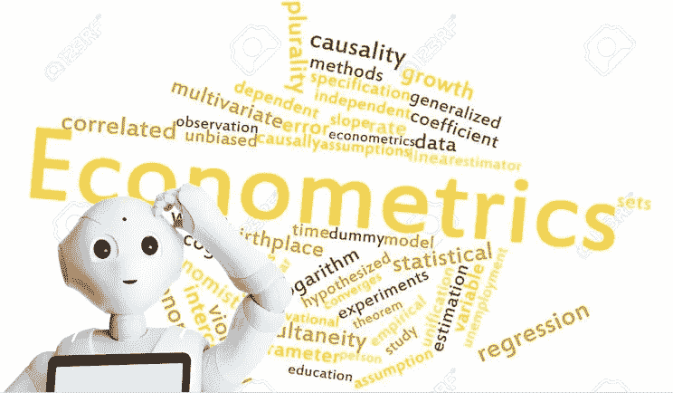

# 机器学习还是计量经济学？

> 原文：<https://medium.com/analytics-vidhya/machine-learning-or-econometrics-5127c1c2dc53?source=collection_archive---------3----------------------->

## **去“解释”还是“预测”？**

数据科学就像一个巨大的真空机器，将统计、数学、计算机科学和物理等相关领域的人才吸引到自己身边。计量经济学也不例外。很多人可能听说过计量经济学。如果这是你第一次听到它，它的名字是“经济学+计量学”,你可能会认为它是关于…