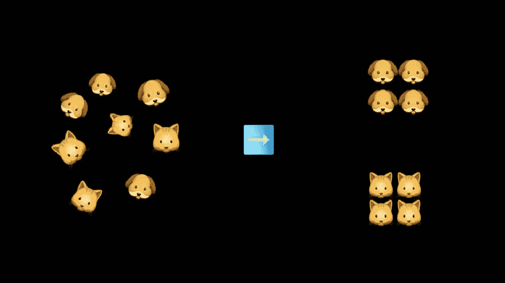
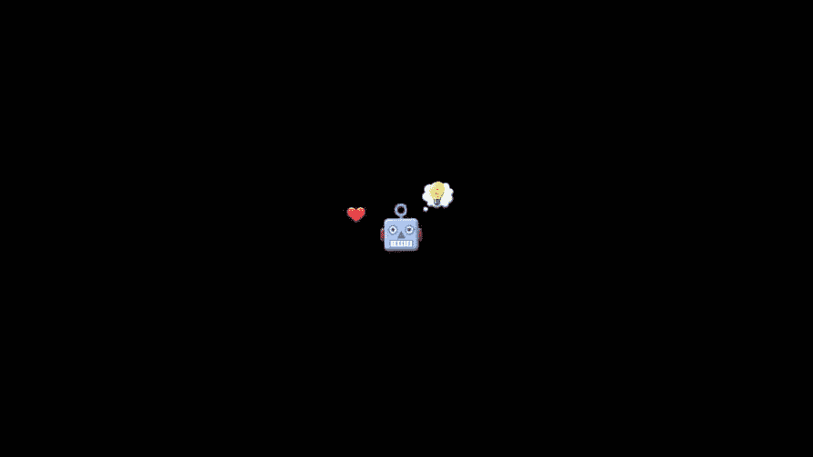

# 机器学习范例

> 原文：<https://medium.com/analytics-vidhya/machine-learning-paradigms-4152d896e081?source=collection_archive---------15----------------------->

简单地说，机器学习就是一个学习的程序，就像我们人类一样。问题是，它是怎么学到东西的？

会思考的机器(或机器人)——这是一个机器学习的例子

我们对插图感到非常抱歉，但它解释了什么是机器学习——一台会思考的机器——它可以通过自己的经验学习和改进自己。机器学习有很多用途:预测销量，击败游戏，甚至理解人类语言。

从现在开始我们将叫他**鲍勃**(是的，他是一个男性机器人)。在本文中，我们将讨论 Bob 的四种学习范式:

1.  监督学习
2.  无监督学习
3.  半监督学习
4.  强化学习

如果你想在一篇文章中更多地了解鲍勃是如何变得更聪明的，请继续阅读这篇文章。祝你好运，鲍勃！

第一个是**监督学习**。就像‘监督’这个词一样，我们在计算机学习的同时监督它。我们给它一组**标记的数据例子——**有正确答案的例子——然后它学习理解模式，最后，它可以回答类似例子的问题。

举个例子:我们给鲍勃一组狗和猫的图片，告诉他哪些是猫的图片，哪些是狗的图片。从例子中学习后，我们给他一张猫的图片，让鲍勃猜，他就会知道这是一只猫。

监督学习插图—鲍勃知道那是一只猫

使用这种范例的**问题类型**是**回归**和**分类**。在回归分析中，计算机会预测一些连续的东西，而在分类中，它会根据以前学到的东西将一些东西归类。

使用监督学习的一些流行的**算法**:线性回归、逻辑回归、SVM(支持向量机)、k-NN(k-最近邻)、ANN(人工神经网络)、决策树、随机森林和朴素贝叶斯。

第二个是**无监督学习**。这个范例有点类似于前一个范例。我们也给计算机一组例子，但是这次我们没有“监督”它，我们没有给计算机答案。我们给它一组**未标记的数据**，它必须自己搜索和识别模式。例如，计算机可以通过查看一些相似的特征来对数据集进行聚类。

无监督学习的例子是:我们给了同一套猫图片和狗图片，但是这次我们没有告诉 Bob 哪个是猫哪个是狗。然后，鲍勃会识别出猫很小，有胡须，而狗比猫大，鼻子比猫尖。最后，鲍勃可以把猫和猫分类，把狗和狗分类。与监督学习不同，他不知道每个组的名称，因为我们没有给他任何带标签的数据。

无监督学习插图— Bob 将猫与猫、狗与狗分组

使用这种范式的**问题**的类型是**聚类**和**关联**问题。在聚类问题中，计算机可以根据它们发现的模式对对象进行分组，它认为这些模式具有相似的特征。而在关联问题中，它会搜索描述大部分数据的规则。它还将从数据中学习潜在的模式。

使用这种范式的一些流行的算法有 K-means、C-means 和 Apriori。

在监督和非监督学习之间，我们有**半监督学习**。这种范式是这两种范式的混合。计算机将通过例子来学习，但这次我们给出一组例子，混合给出答案和不给出答案。

我们使用和以前一样的例子，但是这次是标签和未标签数据的混合。鲍勃会把猫和猫、狗和狗分在一组，通过一些带标签的图片，他会识别出哪组是猫，哪组是狗。

半监督学习插图— Bob 对猫和狗进行分组和标记

最适合使用这种范式的一个**问题**是**面部识别**，其中大量图片根据其相似性进行聚类，然后这些聚类可以通过少量带标签的图片进行识别。

一些使用半监督学习的**算法**是生成式对抗网络和自我训练的朴素贝叶斯分类器。

最后一个是**强化学习**。这种范式不同于以前的任何范式。我们给了代理一系列的强化——**奖惩**。这就像把计算机放在一个陌生的环境中，要求计算机找到一条通向目标的路。

想象一个游戏场景，我们给鲍勃奖励和惩罚什么是对的，什么是错的。然后，他会通过一系列的决策来寻找达到目标的最佳途径。

我们没有给鲍勃任何数据，他必须明白自己前进的方式，并为他所走的每一步接受奖励和惩罚。基本上是**试错**的情况。这个范例的输出是学习一系列的**动作**来解决问题。

强化学习插图—鲍勃解决了一个迷宫

这种范式主要用于**游戏、机器人、工业自动化**，甚至可以从用户交互中学习并改进的引擎，如**对话代理**。

使用这种范式的一些**算法**有 Q 学习、DQN(深度 Q 网络)、DDPG(深度确定性策略梯度)和 SARSA(状态-行动-奖励-状态-行动)。

这些是机器学习如何“学习”的一些方式或范式。

一览表

简而言之，**监督学习**是通过**标记的例子**学习并找到正确的答案，**非监督学习**是根据**未标记的数据集**观察模式和潜在的规则，**半监督**是监督和非监督学习的的**组合，**强化学习**是一种类似游戏的情况，其中代理被放置在一个不熟悉的环境中，它会找到**

现在鲍勃变得更聪明了。最后，我们也要感谢 Bob 的学习和变得更聪明。我们爱你，鲍勃。每个人都说“谢谢你，鲍勃”。

鲍勃变得更聪明、更快乐:)

## 来源:

拉塞尔，诺维格。2010.人工智能——现代方法，第三版。

[https://youtu.be/xtOg44r6dsE](https://youtu.be/xtOg44r6dsE)

 [## 各种强化学习算法介绍。第一部分(Q-Learning，SARSA，DQN，DDPG)

### 强化学习(RL)是指一种机器学习方法，在这种方法中，智能体在学习过程中获得延迟奖励

towardsdatascience.com](https://towardsdatascience.com/introduction-to-various-reinforcement-learning-algorithms-i-q-learning-sarsa-dqn-ddpg-72a5e0cb6287)  [## 机器学习:监督学习与非监督学习

### 这个博客是关于监督和非监督学习技术的简短讨论

medium.com](/@gowthamy/machine-learning-supervised-learning-vs-unsupervised-learning-f1658e12a780)  [## 监督和非监督机器学习算法-机器学习掌握

### 什么是监督机器学习，它与无监督机器学习有什么关系？在这篇文章中，你将…

machinelearningmastery.com](https://machinelearningmastery.com/supervised-and-unsupervised-machine-learning-algorithms/#:~:text=Unsupervised%20learning%20problems%20can%20be,grouping%20customers%20by%20purchasing%20behavior.)  [## 什么是监督学习？

### 监督学习是一种创造人工智能的方法，在这种方法中，程序被给予标记的输入数据…

searchenterpriseai.techtarget.com](https://searchenterpriseai.techtarget.com/definition/supervised-learning)