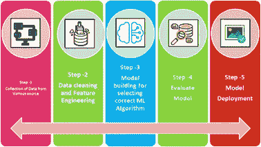
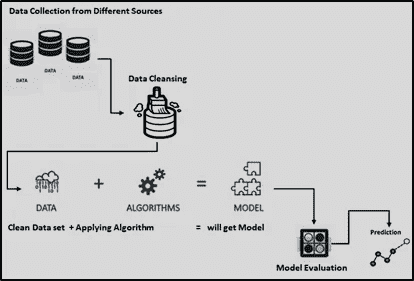
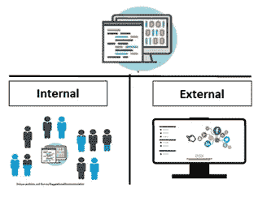
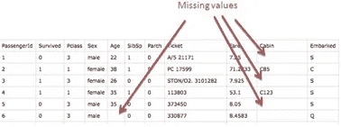
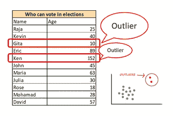
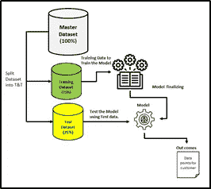

# 机器学习过程—概述

> 原文：<https://medium.com/analytics-vidhya/machine-learning-process-overview-1daa05c30150?source=collection_archive---------7----------------------->

简单点…尝试理解原始数据已经为数据科学和机器学习过程做好准备并暴露于机器学习算法的简单步骤。

过程总是！一个接一个的步骤，成功完成并满足当前步骤，然后继续下一步。即使在 ML 过程中也没有明显的例外。让我们对此进行简短的讨论。

下图将帮助您以简单的方式理解这些步骤。

图表 1。机器学习过程

有 5 个步骤在那里，
1。从各种数据源收集数据
2。数据清洗和特征工程
3。ML 算法的建模与选择
4。车型评价
5。模型部署

下图将帮助您理解 ML 流程的工作流程。

图表 2。机器学习过程工作流

1.  **从各种数据源收集数据:**通常，数据收集是 ML 空间中的关键流程，根据业务问题，我们必须从不同的来源获取数据，根据市场中客户的预测，这些来源可以是内部的，也可以是外部的。实际上，一些数据将来自社交媒体和公共选择，比如说基于反馈的产品成功或失败调查，我们必须利用这个机会进行下一级营销或推荐。有些情况是纯粹的内部调查，比如说在员工中进行的调查。当然，ML 总是与统计和概率密切相关(将在我接下来的博客中解释)。

图表 3。来自各种数据源的数据

**2。数据清洗与特征工程:**数据清洗是 ML 空间中的关键过程。在开始分析给定数据集的合适算法之前，我们必须了解给定数据集，并采取清理/清理活动来净化数据集，以获得优化的结果，否则我们将无法获得数据的真正洞察力，您的数据也不会说太多话(是的，如果您愿意倾听，数据会与您交谈😊或者如果你折磨☹)

图表 4。数据会说话吗

数据清理过程让你更好地理解特征和它们之间的关系每个实体/特征/属性。

在这个步骤中，我们必须提取必要的变量，留下/去除不必要的变量是一个很大的挑战，也是一个关键的挑战。

处理给定数据集中的缺失值或人为错误将更好地增强过程，并提高建模性能，数据质量也将大大提高。

图表 5。缺失数据

在某些情况下，必须识别给定数据集中的异常值。因为这会导致不切实际的结果。因此，我们要么截断阈值以上的数据，要么使用对数变换来变换数据。在 ML 空间中有许多方法来处理这些情况。

图表 6。数据集中的异常值

将分类列转换成数字列是大多数 ML 模型开发中的主要和关键方法之一，因为大多数算法需要数字特征。数字总是很重要的！

特征工程是昂贵且耗时的过程，但却是使数据整洁的必要过程。大多数情况下，特征工程可以是手动过程，也可以是自动化过程。因此，模型开发可以被更好地加速，工作可以被引导到其他活动中，并且其他增值的东西可以被引入到项目和客户利益的视角中。

3.**ML 算法的模型建立和选择:**这一步是主要步骤，几乎是我们结束流程的步骤，因此我们在模型选择过程中必须非常小心，因为选择一个模型作为最终模型来解决给定的业务问题。它涉及/取决于以下因素

a.输入数据类型
b .输出数据类型

除此之外，其他一些因素也会影响模型，如准确性，复杂性，可伸缩性和可解释性。在此步骤中，我们必须训练模型以理解结果，并用相同的算法集进行测试，并比较训练和测试结果(实际结果与预测结果)

**训练和测试**

图表 7。培训和测试架构

图表 8。训练和测试分割

> (我将向大家详细介绍训练和测试，因为它需要更好解释和有趣的话题。)

**4。** **模型评估:**模型评估是一个过程，类似于用一些标准化的数学公式或方法来验证你的模型。当我们在学校/大学做数学时，A=B 或 B=A (2x+5y=20)已经被证明。模型评估用于评估模型和数据的更好拟合性，从正确选择模型的角度比较不同的模型，并预测预期值的准确性。假设**带有均方根误差(R2)的线性回归**模型和**带有**混淆矩阵的逻辑回归**模型**…****

****

**图表 9。**模型评估****

**5.**模型部署:**像其他应用程序一样，机器学习模型被部署到生产环境中，在最近的文化中，这显然发生在云空间中，且在所有先决条件成功完成之后，可以从内部或外部源馈送数据。大多数实时数据不断输入到模型中，并通过使用工具生成报告和良好的可视化来监控模型的性能。因此，客户可以了解业务绩效和需要改进的地方，以及他们可以采取的关键业务决策。等等！**

**我会带着更多关于数据科学和 ML 的话题回来，带着漂亮的示例代码和理解概念的简单方法。**

**由...所写**

****

***Shanthababu Pandian，数据&分析技术交付经理:数据科学家:机器学习实践者:Azure Data Engg*[https://www.linkedin.com/in/shanthababu-pandian-b2a9259/](https://www.linkedin.com/in/shanthababu-pandian-b2a9259/)**