# 基于 SVC 和 KNN 的乳腺癌检测

> 原文：<https://medium.com/analytics-vidhya/machine-learning-project-1-breast-cancer-detection-with-svc-and-knn-2238ced776fc?source=collection_archive---------7----------------------->

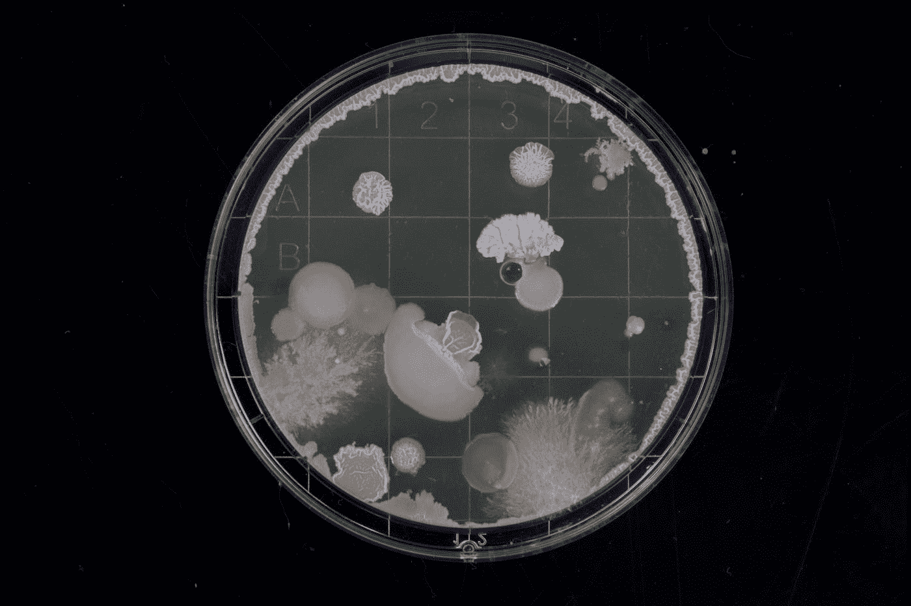

[迈克尔·希弗](https://unsplash.com/@michael_schiffer_design?utm_source=medium&utm_medium=referral)在 [Unsplash](https://unsplash.com?utm_source=medium&utm_medium=referral) 上拍照

这个机器学习项目是关于预测肿瘤的类型——恶性还是良性。数据集来自 UIC 机器学习数据库。这里可以下载。下载的数据集是。数据文件。文件扩展名可以更改为。csv 文件。这些列被命名为“id”、“团块厚度”、“细胞大小的均匀性”、“细胞形状的均匀性”、“边缘粘附”、“单个上皮细胞大小”、“裸核”、“空白染色质”、“正常核仁”、“有丝分裂”和“类别”

导入必要的包。

```
**import numpy as np
import pandas as pd
import matplotlib.pyplot as plt
import sklearn
from sklearn import preprocessing
from sklearn.svm import SVC
from sklearn import model_selection
from sklearn.neighbors import KNeighborsClassifier
from sklearn.metrics import classification_report,accuracy_score
from pandas.plotting import scatter_matrix
import seaborn as sns**
```

# **数据加载**

数据集被加载到数据帧“df”中。

```
**df = pd.read_csv(‘Breast cancer.csv’)** #The data set ‘Breast cancer.csv’ is loaded into ‘df’ dataframe.**df.head()**# Displays the first five rows of ‘df’.
```

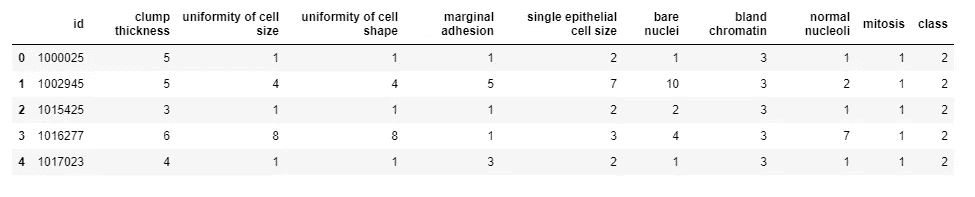

“id”、“团块厚度”、“细胞大小的均匀性”、“细胞形状的均匀性”、“边缘粘附”、“单个上皮细胞大小”、“裸核”、“空白染色质”、“正常核仁”、“有丝分裂”是用于预测输出“类别”的变量。

```
**df.shape**
```

数据帧的形状为(699，11)，表明有 699 个训练案例。

# 数据预处理

```
**df.drop(‘id’,axis = 1,inplace = True)** # 'axis = 1' denotes column and 'inplace = True' denotes changes are saved in 'df'.
```

“id”列被删除，因为它不影响输出“class”。

```
**df.shape**
```

现在，数据帧的形状为(699，10)

**检查缺失值**

```
**col_names = ['clump thickness’,’uniformity of cell size’,’uniformity of cell shape’,’marginal adhesion’,’single epithelial cell size’,’bare nuclei’,’bland chromatin’,’normal nucleoli’,’mitosis’,’class’]** # ‘col_names’ is a list of column names in‘Breast cancer.csv’# Prints count of each column
**for x in col_names: 
 print(df[x].count())**
```

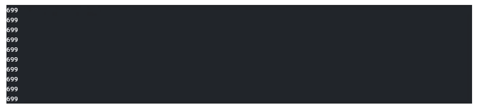

每列的计数是 699，这表明没有丢失值。

为了仔细检查，我们绘制了一张热图。

```
**sns.heatmap(df.isnull())** # df.isnull() is True (value =1)if null value and False (value = 0) otherwise.
```

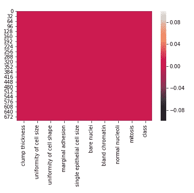

该值始终为 0。热图还显示没有缺失值。

**检查分类变量**

```
# Prints total number of unique elements in each column
**for x in col_names: 
 print(df[x].nunique())**
```

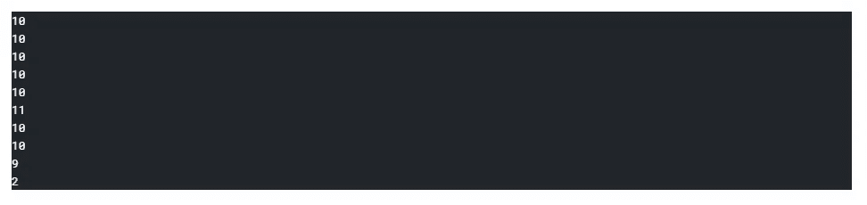

所有的变量都是分类变量。

```
**df.drop(‘bare nuclei’,axis = 1,inplace = True)**
```

由于格式问题，删除了“裸核”一栏。

**了解数据**

```
**df.describe()**
```

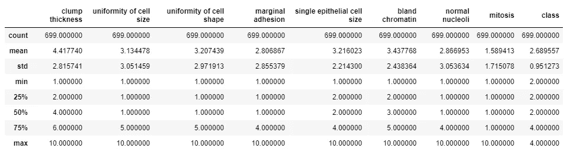

输出变量“class”是离散的，有两个值:- 2(良性)和 4(恶性)。“类别”的平均值更接近 2，表明良性病例更多。所有输入变量的最小值和最大值分别为 1 和 10。

> 注意:-因为没有缺失值，并且所有分类变量都有数值，所以数据预处理是容易和舒适的。

# 数据可视化

```
**df.hist(figsize = (10,8))
plt.show()**
```

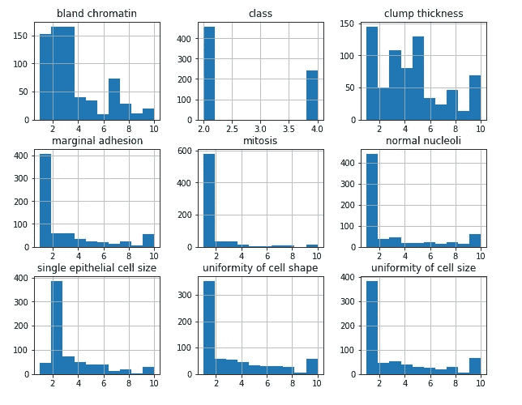

“团块厚度”在某种程度上是均匀分布的。所有其他变量都向右倾斜。

```
**plt.figure(figsize = (10,10))
sns.pairplot(df)**
```

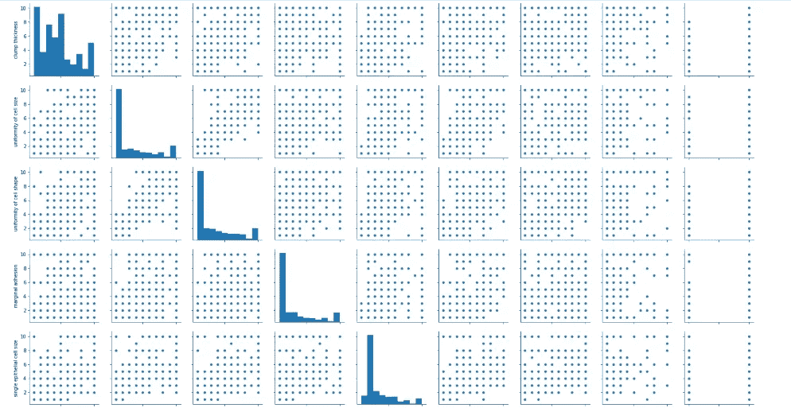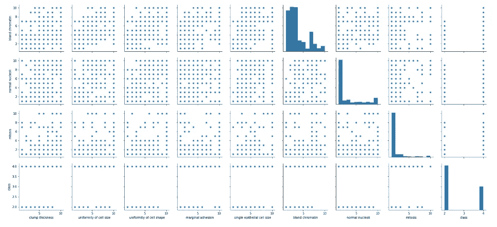

“泡孔尺寸的均匀性”似乎与“泡孔形状的均匀性”有很强的线性关系。最后一行“类”是针对每个输入变量绘制的，这表明绘制决策边界将是困难的。(决策边界是一个超曲面，它将基础向量空间划分为两个集合，每个集合对应一个类)。

# 模特培训

数据集已经过预处理，可以进行训练了。在两种模型之间进行比较:- SVC(支持向量分类器)和 KNN(K-最近邻)。

**SVC 和 KNN 的比较**

基于交叉验证分数进行比较。给定的训练集被分成 2 个集:“训练集”和“测试集”。使用“训练集”的一部分来训练该模型。交叉验证分数是根据“Train_set”的其他部分中已训练模型的性能计算的。

有各种各样的交叉验证技术，我们将在后面讨论。这里使用了 K 重交叉验证技术。

训练集被分成“训练集”和“测试集”。

```
**X = df.drop(‘class’,1)** # X is input
**y = df[‘class’]** # y is output
**X_train,X_test,y_train,y_test = model_selection.train_test_split(X,y,test_size=0.2)** # Spitting into 'Train_set' and 'Test_set'.
```

计算两个模型的交叉验证分数。

```
**validation_type = model_selection.KFold(n_splits = 10)** # K-Fold cross validation technique is used.
**cross_validation_result1 = model_selection.cross_val_score(SVC(),X_train,y_train,cv = validation_type,scoring = ‘accuracy’)** # Cross validation score of SVC model.
**cross_validation_result2 = model_selection.cross_val_score(KNeighborsClassifier(n_neighbors = 5),X_train,y_train,cv = validation_type,scoring = ‘accuracy’)** # Cross validation score of KNN model.
**print(cross_validation_result1.mean(),cross_validation_result2.mean())**
```

SVC 模型的交叉验证分数= 0.9605

KNN 模型的交叉验证得分= 0.9534

SVC 模型在给定数据集上的性能预期优于 KNN 模型。让我们通过使用“训练集”训练模型并使用“测试集”计算“准确度分数”和“分类报告”来验证这一点。

**SVC 模型性能**

```
**a = SVC().fit(X_train,y_train)** # Fitting the model. **predictions = a.predict(X_test)** # Test set is predicted. **print(accuracy_score(y_test,predictions))** # Accuracy score is calculated. **print(classification_report(y_test,predictions))** # Classification report is generated.
```

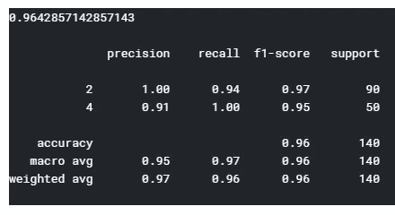

准确度分数和分类报告

**KNN 车型的性能**

```
**b = KNeighborsClassifier(n_neighbors = 5).fit(X_train,y_train)** # Fitting the model.
**predictions = b.predict(X_test)** # Test set is predicted.
**print(accuracy_score(y_test,predictions))** # Accuracy score is calculated.
**print(classification_report(y_test,predictions))** # Classification report is generated.
```

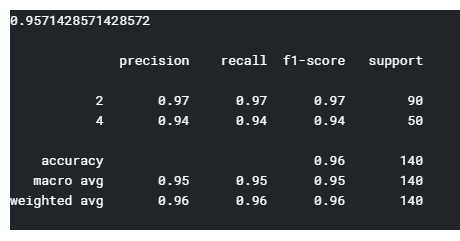

准确度分数和分类报告

SVC 模型的准确度得分= 0.964

KNN 模型的准确度得分= 0.957

正如预期的那样，对于给定的数据集，SVC 模型的精度和 F1 值优于 KNN 模型。

**使用训练模型进行预测**

训练的 SVC 模型用于预测特定的情况:-'团块厚度' = 1，'细胞大小的均匀性' = 2，'细胞形状的均匀性' = 2，'边缘粘附' = 5，'单个上皮细胞大小' = 3，'空白染色质' = 6，'正常核仁' = 4，'有丝分裂' = 8。

```
**prediction = a.predict(np.array([[1,2,2,5,3,6,4,8]]))
print(prediction)**
```

“类”的预测值是 4，这表明它是恶性肿瘤。

快乐阅读！