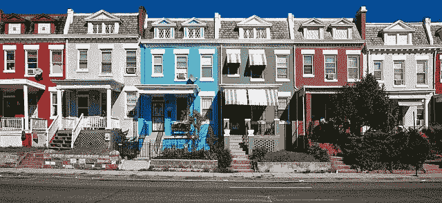

# 机器学习项目 11——谁是我的邻居？— k 最近邻

> 原文：<https://medium.com/analytics-vidhya/machine-learning-project-11-whose-my-neighbor-k-nearest-neighbor-3e9184ce5f89?source=collection_archive---------2----------------------->

谁是我最近的邻居？—来源 pixabay.com

今天我们将了解 k-最近邻(kNN)分类算法。这是最简单的算法之一。

**# 100 daysofml code # 100 projects inml**

*   假设我们已经在数据集中确定了 2 个类别，比如“红色类别 1”和“绿色类别 2”，如下所示。